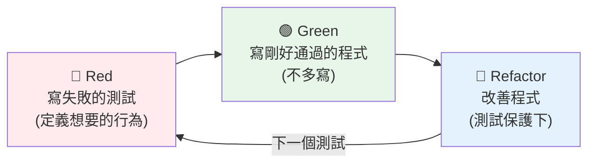

# TDD 測試驅動開發

> TDD 是「先寫測試、再寫程式」的開發節奏——紅（寫失敗的測試）、綠（寫剛好通過的程式）、重構（改善程式）。它不只是測試技術，更是一種設計方法，逼你先想清楚「要什麼」。

## Why（為什麼）

一般人「先寫程式、再補測試」——結果常是測試難寫（程式沒為可測性設計）、或根本不補。**TDD（Test-Driven Development，測試驅動開發）** 反過來：**先寫測試、再寫程式**。這個順序的翻轉帶來意外的好處：逼你先想清楚「這東西該做什麼」（需求）、自然寫出可測試（即鬆耦合）的設計、且永遠有測試保護。TDD 是資深工程師的核心技能，也是本 Part 各章（測試、fixture、mock）的實踐方法論。

## Theory（理論：紅-綠-重構）

TDD 的核心是一個短循環——**Red-Green-Refactor（紅-綠-重構）**：

1. **🔴 Red（紅）**：先寫一個**失敗的測試**——描述「你想要的行為」。此時還沒有實作，測試當然失敗（紅燈）。
2. **🟢 Green（綠）**：寫**剛好讓測試通過**的最少程式——不多寫、不優化，只求綠燈。
3. **🔵 Refactor（重構）**：在測試保護下**改善程式**（去重複、改命名、優化結構）——測試確保重構沒弄壞行為。

然後回到第 1 步，寫下一個測試。每個循環很短（幾分鐘）——小步前進、隨時綠燈。

**關鍵**：**先寫測試逼你先定義「要什麼」**（而非埋頭寫程式）；**只寫剛好通過的程式避免過度設計**；**重構在測試保護下安全進行**。

## Specification（規範：TDD 循環）

```text
┌─────────────────────────────────────┐
│  1. 🔴 Red：寫一個失敗的測試          │
│     - 描述想要的行為                   │
│     - 執行 → 失敗（因為還沒實作）      │
├─────────────────────────────────────┤
│  2. 🟢 Green：寫最少的程式讓它通過     │
│     - 只求綠燈，不優化                 │
│     - 執行 → 通過                      │
├─────────────────────────────────────┤
│  3. 🔵 Refactor：改善程式             │
│     - 去重複、改命名、優化結構         │
│     - 執行 → 仍通過（測試保護）        │
└──────────────┬──────────────────────┘
               ↓ 回到 1，下一個測試
```

## Implementation（一個完整 TDD 循環、好處、迷思）

### 一個完整的 TDD 循環：實作 `FizzBuzz`

以 FizzBuzz（3 的倍數印 Fizz、5 的倍數印 Buzz、都是印 FizzBuzz、其餘印數字）示範：

**循環 1 — 🔴 Red**：先寫測試（還沒有 `fizzbuzz` 函式，會失敗）：

```python
def test_returns_number_as_string():
    assert fizzbuzz(1) == "1"      # 🔴 失敗：fizzbuzz 還不存在
```

**🟢 Green**：寫最少程式通過：

```python
def fizzbuzz(n):
    return str(n)                  # 🟢 剛好讓 test 通過（不多寫）
```

**循環 2 — 🔴 Red**：加一個測試：

```python
def test_multiple_of_three_returns_fizz():
    assert fizzbuzz(3) == "Fizz"   # 🔴 失敗：目前回 "3"
```

**🟢 Green**：擴充：

```python
def fizzbuzz(n):
    if n % 3 == 0:
        return "Fizz"
    return str(n)                  # 🟢 通過
```

**循環 3、4…** 繼續加測試（5→Buzz、15→FizzBuzz），每次寫剛好通過的程式：

```python
def fizzbuzz(n):
    if n % 15 == 0:
        return "FizzBuzz"
    if n % 3 == 0:
        return "Fizz"
    if n % 5 == 0:
        return "Buzz"
    return str(n)
```

**🔵 Refactor**：功能完整後，在測試保護下改善（如果有重複可抽出）。每一步都有測試綠燈——**你永遠知道程式是對的**。

### TDD 的好處

1. **需求先行**：寫測試逼你先想「這東西該怎麼用、預期什麼」——避免埋頭寫錯方向。
2. **可測試的設計**：先寫測試自然導向鬆耦合、可注入依賴的設計（難測 = 設計不良）。
3. **恰好的程式**：只寫「讓測試通過」的程式，避免過度設計（YAGNI）。
4. **完整的測試**：測試不是事後補的，是開發的一部分——永遠有保護網。
5. **信心與節奏**：小步綠燈，隨時可停、可重構。

### TDD 的迷思與務實

TDD 不是宗教——務實地看：

- **不是所有東西都適合嚴格 TDD**：探索性程式（不確定要什麼）、UI、一次性腳本可能不適合先寫測試。
- **測試先行 ≠ 一次寫所有測試**：一次一個小測試、一個小循環。
- **重構步驟很重要**：只做紅-綠不重構，程式會越來越亂。
- **「測試驅動」的精神比「嚴格照做」重要**：核心是「用測試引導設計、保持隨時可驗證」。

即使不嚴格 TDD，**「修 bug 先寫重現它的測試」**（見 [為什麼測試](01-why-testing.md)）是每個人都該做的 TDD 精神——先寫失敗測試（重現 bug）、再修（讓它綠）、測試防它重現。

## Code Example（可執行的 Python 範例）

```python
# tdd_demo.py
# 展示 TDD 產出的結果：完整的實作 + 對應的測試
from __future__ import annotations

import pytest


# --- 實作（透過 TDD 逐步長出來）---
def fizzbuzz(n: int) -> str:
    if n % 15 == 0:
        return "FizzBuzz"
    if n % 3 == 0:
        return "Fizz"
    if n % 5 == 0:
        return "Buzz"
    return str(n)


# --- 測試（TDD 中先於實作寫）---
@pytest.mark.parametrize(
    ("n", "expected"),
    [
        (1, "1"),  # 循環1：一般數字
        (2, "2"),
        (3, "Fizz"),  # 循環2：3 的倍數
        (5, "Buzz"),  # 循環3：5 的倍數
        (15, "FizzBuzz"),  # 循環4：15 的倍數
        (9, "Fizz"),
        (10, "Buzz"),
        (30, "FizzBuzz"),
    ],
)
def test_fizzbuzz(n: int, expected: str) -> None:
    assert fizzbuzz(n) == expected


def demo() -> None:
    print("TDD 節奏：🔴 寫失敗測試 → 🟢 寫剛好通過的程式 → 🔵 重構")
    print("\nFizzBuzz 1-15:")
    print(" ".join(fizzbuzz(i) for i in range(1, 16)))


if __name__ == "__main__":
    demo()
```

**執行**：

```pycon
$ python tdd_demo.py
TDD 節奏：🔴 寫失敗測試 → 🟢 寫剛好通過的程式 → 🔵 重構

FizzBuzz 1-15:
1 2 Fizz 4 Buzz Fizz 7 8 Fizz Buzz 11 Fizz 13 14 FizzBuzz

$ pytest tdd_demo.py -v
test_fizzbuzz[1-1] PASSED
test_fizzbuzz[3-Fizz] PASSED
test_fizzbuzz[15-FizzBuzz] PASSED
...（共 8 組）
===== 8 passed =====
```

## Diagram（圖解：紅-綠-重構循環）



## Best Practice（最佳實踐）

- **遵循紅-綠-重構的小循環**：一次一個小測試，小步前進、隨時綠燈。
- **Red 階段先想清楚「要什麼」**：測試描述行為，逼你先定義需求與介面。
- **Green 階段只寫剛好通過的程式**：避免過度設計（YAGNI）。
- **別跳過 Refactor**：在測試保護下持續改善，否則程式越來越亂。
- **至少對「修 bug」用 TDD 精神**：先寫重現 bug 的失敗測試，再修——測試防它重現。
- **務實看待 TDD**：探索性/UI/一次性腳本不必嚴格 TDD；精神（測試引導設計）比形式重要。
- **配合本 Part 工具**：pytest（跑測試）、fixture（準備）、mock（隔離）、參數化（多案例）。

## Common Mistakes（常見誤解）

- **跳過 Red 直接寫程式再補測試**：失去 TDD 的設計引導好處，測試也可能難寫。
- **Green 階段就過度設計**：寫了測試不需要的功能（YAGNI 違反）；只寫剛好通過的。
- **只做紅-綠、跳過重構**：程式累積技術債、越來越亂。
- **一次寫所有測試**：TDD 是一次一個小循環，不是先寫完所有測試。
- **對不適合的東西硬套嚴格 TDD**：探索性程式、UI 可能不適合先寫測試。
- **把 TDD 當宗教**：務實地用其精神（測試引導、隨時可驗證），別為形式而形式。
- **修 bug 不先寫重現測試**：直接改可能沒真的修好、且會重現。

## Interview Notes（面試重點）

- **能說出 TDD 的循環：Red（寫失敗測試）→ Green（寫剛好通過的程式）→ Refactor（測試保護下改善）**，一次一個小循環。
- **知道 TDD 是設計方法不只是測試**：先寫測試**逼你定義需求、導向可測試（鬆耦合）的設計、避免過度設計、永遠有保護網**。
- 知道 **Green 只寫剛好通過的程式（YAGNI）**、**別跳過 Refactor**。
- 知道**「修 bug 先寫重現它的失敗測試」** 是每個人都該用的 TDD 精神。
- 能務實看待：不是所有東西都適合嚴格 TDD，精神比形式重要。

---

➡️ 下一章：[doctest](09-doctest.md)

[⬆️ 回 Part 12 索引](README.md)
