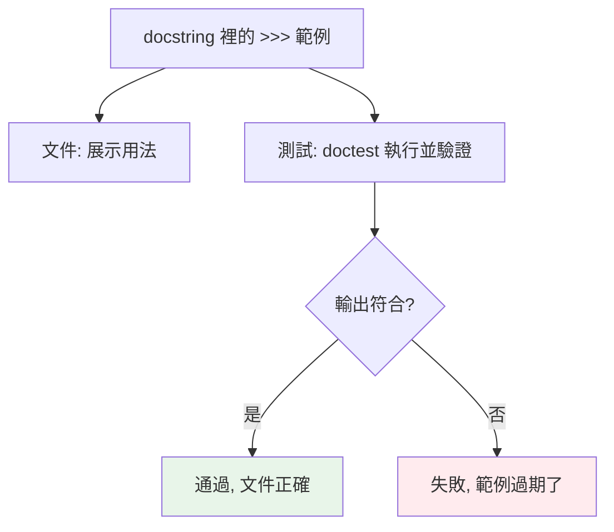

# doctest

> doctest 讓 docstring 裡的範例「既是文件、又是測試」——把 REPL 互動範例寫進 docstring，doctest 執行並驗證輸出。它確保文件範例永遠正確，但不適合當主要的測試框架。

## 💡 白話導讀（建議先讀）

文件最大的宿命：**過期**。docstring 裡的範例,三次改版後早就跑不出那個結果——但沒人發現,因為**沒人執行過它**。

`doctest` 的點子聰明又簡單：**說明書裡的範例,拿去真的跑一遍**：

```python
def add(a, b):
    """兩數相加。

    >>> add(2, 3)
    5
    >>> add(-1, 1)
    0
    """
    return a + b
```

`python -m doctest myfile.py` 會:掃出 docstring 裡的 `>>>` 範例 → **真的執行** → 比對輸出和寫的一不一樣 → 不一樣就紅燈。

於是範例有了雙重身分：

> **是文件（教人怎麼用）,也是測試（保證教的是對的）**——文件過期,自動報警。

定位要擺正:doctest 適合**簡潔的用法示範**（純函式、REPL 一兩行能展示的）——它讓文件保鮮。
**不適合**當主測試框架:複雜情境、fixture、mock 還是 pytest 的地盤（pytest 也能順便跑 doctest:`--doctest-modules`,一魚兩吃）。

一句定位:**pytest 管測試,doctest 管「範例不說謊」。**

## Why（為什麼）

docstring 裡常放使用範例（`>>> func(2)` → `4`）。問題是——這些範例會**過期**（程式改了、範例沒改），變成錯誤的文件。**doctest** 解決這個：它把 docstring 裡的 `>>>` 範例當測試執行，驗證實際輸出符合寫的輸出。這讓「文件範例永遠正確」（過期就測試失敗），一舉兩得。但 doctest 有其定位——適合「文件範例驗證」，不適合當主要測試框架（那用 pytest）。這章講清楚 doctest 的用法與定位。

## Theory（理論：可執行的文件）

**doctest** 的核心想法：**docstring 裡的 REPL 範例既是文件也是測試**（範例不說謊）。它：

- 掃描 docstring 裡的 `>>>`（REPL 提示符）範例。
- **執行**每個 `>>>` 的程式。
- **比對**實際輸出與 docstring 裡寫的預期輸出。
- 不符就報錯（測試失敗）。

好處：**文件與測試合一**——範例展示用法（文件），又被驗證（測試），過期會自動失敗報警。這體現「可執行的文件」理念。

## Specification（規範：doctest 語法）

```python
def add(a: int, b: int) -> int:
    """把兩數相加。

    >>> add(2, 3)
    5
    >>> add(-1, 1)
    0
    >>> add(0, 0)
    0
    """
    return a + b


# 執行 doctest
# python -m doctest mymodule.py           # 執行檔案的 doctest
# python -m doctest mymodule.py -v        # 詳細輸出
# pytest --doctest-modules                # 用 pytest 執行 doctest

# 在程式裡執行
if __name__ == "__main__":
    import doctest
    doctest.testmod()                       # 測試本模組的所有 doctest
```

## Implementation（基本、例外、陷阱、定位）

### 基本 doctest

```python
def factorial(n: int) -> int:
    """計算階乘。

    >>> factorial(5)
    120
    >>> factorial(0)
    1
    >>> factorial(1)
    1
    """
    if n <= 1:
        return 1
    return n * factorial(n - 1)
```

`>>>` 後是「要執行的程式」、下一行是「預期輸出」。doctest 執行 `factorial(5)`，確認輸出是 `120`。範例既展示用法、又驗證正確——若哪天 factorial 壞了，doctest 會失敗。

### 測試例外

doctest 也能驗證例外——用 `Traceback` 格式：

```python
def divide(a: float, b: float) -> float:
    """除法。

    >>> divide(10, 2)
    5.0
    >>> divide(1, 0)
    Traceback (most recent call last):
        ...
    ZeroDivisionError: division by zero
    """
    return a / b
```

`Traceback (most recent call last):` + `...`（省略中間）+ 最後的例外行——doctest 驗證拋出對的例外。

### 常見陷阱：輸出格式必須完全一致

doctest **逐字比對**輸出——這帶來幾個陷阱：

```python
def get_dict() -> dict:
    """
    >>> get_dict()
    {'a': 1, 'b': 2}
    """
    return {"a": 1, "b": 2}
    # ⚠️ dict 順序、空白、浮點表示都要完全一致
```

- **dict/set 順序**：雖然 3.7+ dict 保序，但仍要小心。
- **浮點表示**：`0.1 + 0.2` 顯示 `0.30000000000000004`（見 [浮點誤差](../02-fundamentals/15-float-precision-decimal.md)）——doctest 要寫這個醜值，或用 `# doctest: +ELLIPSIS`。
- **物件的 repr**：`<object at 0x...>` 的位址每次不同——用 `...` + ELLIPSIS。
- **空白與換行**：要完全一致。

用**指令（directives）** 放寬比對：

```python
def make_obj():
    """
    >>> make_obj()  # doctest: +ELLIPSIS
    <MyObj object at 0x...>
    """
```

`+ELLIPSIS` 讓 `...` 匹配任意內容、`+NORMALIZE_WHITESPACE` 放寬空白。

### doctest 的定位：文件範例，不是主要測試

**doctest 適合什麼、不適合什麼**很重要：

- **適合**：**驗證文件範例**——簡單、易懂的使用範例，確保文件不過期。函式庫的 API 範例尤其適合。
- **不適合當主要測試框架**：複雜的測試（多案例、fixture、mock、邊界）用 doctest 會讓 docstring 塞滿、難維護；那些用 **pytest**（見 [pytest 基礎](03-pytest-basics.md)）。

**準則**：**doctest 放「示範用法的簡單範例」（兼顧文件與基本驗證）；完整的測試套件用 pytest**。兩者互補——doctest 保文件正確、pytest 做嚴謹測試。

### 用 pytest 執行 doctest

pytest 能執行 doctest（`--doctest-modules`）——讓 doctest 和一般測試一起跑：

```bash
pytest --doctest-modules              # 執行所有模組的 doctest
```

在 `pyproject.toml`（見 [pyproject.toml](../13-tooling-packaging/04-pyproject-toml.md)）：

```toml
[tool.pytest.ini_options]
addopts = "--doctest-modules"
```

這樣 CI 會同時驗證 doctest（文件範例）與 pytest 測試。

## Code Example（可執行的 Python 範例）

```python
# doctest_demo.py
from __future__ import annotations


def celsius_to_fahrenheit(celsius: float) -> float:
    """攝氏轉華氏。

    >>> celsius_to_fahrenheit(0)
    32.0
    >>> celsius_to_fahrenheit(100)
    212.0
    >>> celsius_to_fahrenheit(-40)
    -40.0
    """
    return celsius * 9 / 5 + 32


def parse_int(text: str) -> int:
    """解析整數，失敗拋 ValueError。

    >>> parse_int("42")
    42
    >>> parse_int("abc")
    Traceback (most recent call last):
        ...
    ValueError: invalid literal for int() with base 10: 'abc'
    """
    return int(text)


def word_count(text: str) -> int:
    """計算單字數。

    >>> word_count("hello world")
    2
    >>> word_count("")
    0
    >>> word_count("  多個   空白  ")
    2
    """
    return len(text.split())


if __name__ == "__main__":
    import doctest

    results = doctest.testmod(verbose=False)
    print(f"doctest 執行完成：{results.attempted} 個範例，{results.failed} 個失敗")
    print(f"\n示範：0°C = {celsius_to_fahrenheit(0)}°F")
```

**執行**：

```pycon
$ python doctest_demo.py
doctest 執行完成：8 個範例，0 個失敗

示範：0°C = 32.0°F

$ python -m doctest doctest_demo.py -v   # 詳細模式看每個範例
```

## Diagram（圖解：doctest 兼顧文件與測試）



## Best Practice（最佳實踐）

- **用 doctest 驗證文件範例**：確保 docstring 的使用範例不過期（過期就失敗）——文件與測試合一。
- **doctest 放簡單、示範性的範例**：展示 API 怎麼用；複雜測試用 pytest。
- **完整測試套件用 pytest**（多案例、fixture、mock、邊界）；doctest 是輔助不是主力。
- **輸出格式要完全一致**：注意 dict 順序、浮點表示、空白；不確定用 `# doctest: +ELLIPSIS`/`+NORMALIZE_WHITESPACE`。
- **用 `pytest --doctest-modules` 一起跑**：CI 同時驗證 doctest 與測試。
- **例外用 `Traceback ... ExcType: msg` 格式**驗證。
- **函式庫的公開 API 尤其適合 doctest**：使用範例即文件即測試。

## Common Mistakes（常見誤解）

- **把 doctest 當主要測試框架**：複雜測試塞進 docstring 難維護；用 pytest。
- **輸出格式不一致**：dict 順序、浮點醜值、物件位址、空白——doctest 逐字比對，差一點就失敗；用指令放寬。
- **浮點直接寫預期值**：`0.1+0.2` 顯示 `0.30000000000000004`；要寫這個或用 ELLIPSIS。
- **doctest 範例有副作用/依賴外部**：doctest 應是純、可重複的範例。
- **忘了執行 doctest**：寫了但沒跑（`python -m doctest` 或 `pytest --doctest-modules`），範例還是會過期。
- **範例太複雜**：doctest 範例該簡單易懂（既是文件）；複雜的用 pytest。

## Interview Notes（面試重點）

- **知道 doctest 讓 docstring 範例「既是文件又是測試」**：掃 `>>>` 範例、執行、驗證輸出——確保文件範例不過期。
- 知道**基本語法（`>>>` + 預期輸出）、例外（Traceback 格式）、指令（`+ELLIPSIS`/`+NORMALIZE_WHITESPACE` 放寬比對）**。
- **知道 doctest 的定位**：**適合文件範例驗證，不適合當主要測試框架**（複雜測試用 pytest）——兩者互補。
- 知道**輸出格式要完全一致**的陷阱（dict 順序、浮點、位址、空白）。
- 知道用 **`pytest --doctest-modules`** 一起跑 doctest 與測試。

---

➡️ 下一章：[除錯技巧與工具](10-debugging.md)

[⬆️ 回 Part 12 索引](README.md)
