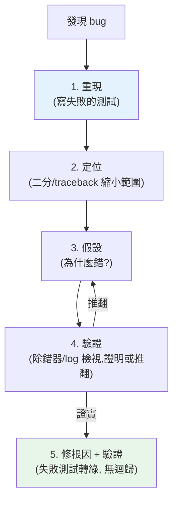

# 除錯技巧與工具

> 程式出錯時，與其瞎猜、亂加 `print`，不如**有系統地**找出真相。這章講 Python 的除錯工具——`pdb`/`breakpoint()` 互動除錯、post-mortem 事後檢驗、`traceback` 讀懂錯誤、以及「用科學方法除錯」的心法。除錯是把「猜」變成「查」的能力。

## 💡 白話導讀（建議先讀）

程式出錯,最糟的反應是「改改看」——像醫生不診斷就亂開藥。

**除錯的本質是偵探辦案**,五步流程：

1. **重現案發**——找到穩定重現 bug 的最小步驟。重現不了就修不了（修好了也無法證明）。最好的重現手法:**寫一個會失敗的測試**——bug 被釘住,修好即轉綠,永不復發。
2. **縮小現場（二分法）**——bug 在這一千行的哪裡?中間點查一次狀態:對的→問題在後半;錯的→前半。**反覆折半**,十次內逼近案發點。
3. **提出假設**——「我認為是 X 造成的」,要具體。
4. **驗證假設**——用工具**證明或推翻**,不是憑感覺改。
5. **修根因 + 確認**——修「為什麼會錯」而非「把症狀蓋掉」;失敗的測試轉綠,結案。

兩件主要辦案工具,各有主場：

- **`breakpoint()`（互動除錯器 pdb）**——在案發現場**停格**:逐行走、即時看變數、甚至現場改值。適合**能在本機重現**的複雜邏輯 bug。（在程式裡放一行 `breakpoint()` 就進入;`n` 下一行、`p 變數` 看值、`c` 繼續。）
- **logging**——[行車記錄器](../11-stdlib/08-logging.md):正式環境、多執行緒、偶發問題——停格辦不到的場合,靠事後調閱記錄。

口訣:**先重現,再二分,假設要驗證,修的是根因。**

## Why（為什麼）

寫程式有一半時間在除錯。新手除錯的方式往往是：到處灑 `print`、憑直覺改改看、改到不報錯就當修好了。這既慢又不可靠——你可能只是**掩蓋了症狀而非根治病因**，甚至引入新 bug。

有系統的除錯是一項**可學習的技能**，也是資深工程師與新手的分水嶺。它包含：**讀懂錯誤訊息（traceback）** 找到出錯的確切位置、用**除錯器（debugger）** 暫停程式、逐行執行、檢視當下的變數狀態，用**科學方法**（假設 → 驗證 → 縮小範圍）定位根因，而非亂槍打鳥。

Python 內建強大的除錯工具，卻常被忽略：`pdb`（互動除錯器）、`breakpoint()`（一行設中斷點）、post-mortem（例外發生後檢驗現場）、`traceback`（程式化處理錯誤）、`faulthandler`（抓當機）。學會它們，你就能**快速、可靠地**定位問題，而非在 `print` 海裡撈針。這章講這些工具與除錯心法。它與[系統化除錯](../06-error-handling/README.md)、[測試](01-why-testing.md)（測試幫你重現 bug）互補——好的測試讓 bug 可重現，好的除錯讓你找到它。

## Theory（理論：科學方法除錯）

**除錯的本質是科學方法**——偵探辦案，不是猜，是查：

1. **重現（reproduce）**：找到「穩定重現」的最小步驟/輸入。無法重現就無法可靠地修。**寫一個會失敗的測試**是最佳重現手法（見[測試](01-why-testing.md)）。
2. **定位（localize）**：用**二分法（bisection）**縮小範圍——中間點檢查狀態，確認 bug 在前半還是後半，反覆折半逼近。
3. **假設（hypothesize）**：對「為什麼錯」提出具體假設。
4. **驗證（verify）**：用除錯器/log **證明或推翻**假設——不是「改改看」。
5. **修正 + 驗證**：修根因（非症狀），讓失敗的測試通過、且沒引入迴歸。

**兩種手段的取捨**：

- **互動除錯器（pdb/`breakpoint()`/IDE）**：停格看現場——逐行走、即時檢視/修改變數。適合**能在本機重現**的複雜邏輯 bug。
- **log / print**：行車記錄器——正式環境、時序相關、多執行緒/非同步、偶發問題等「無法停格」的場合，事後調閱。

## Specification（規範：pdb 與工具）

**設中斷點——`breakpoint()`（Python 3.7+，首選）**：

```python
def buggy(data):
    result = process(data)
    breakpoint()          # 執行到這裡會進入 pdb 互動除錯（一行搞定）
    return result
```

`breakpoint()` 等同 `import pdb; pdb.set_trace()`，但更簡潔、且可用環境變數 `PYTHONBREAKPOINT=0` 全域停用（正式環境保險）。

**pdb 常用指令**（進入除錯器後）：

| 指令 | 作用 |
|------|------|
| `n`（next） | 執行下一行（不進入函式） |
| `s`（step） | 步入函式 |
| `c`（continue） | 繼續執行到下個中斷點 |
| `l`（list） | 顯示當前程式碼 |
| `p expr` / `pp expr` | 印出運算式的值 |
| `w`（where）/ `bt` | 顯示呼叫堆疊 |
| `u` / `d`（up/down） | 在堆疊frame間移動 |
| `b lineno` | 設中斷點 |
| `q`（quit） | 離開 |

**post-mortem（事後檢驗）**——例外炸了之後，檢視**當時的現場**（變數、堆疊）：

```python
python -m pdb myscript.py    # 崩潰時自動進入 post-mortem
# 或程式中：
import pdb; pdb.post_mortem()   # 在 except 區塊裡檢視例外現場
```

**其他工具**：

- **`traceback` 模組**：程式化地格式化/記錄例外（`traceback.format_exc()`）——把完整錯誤存進 log。
- **`faulthandler`**：抓「硬當機」（段錯誤、C 擴充崩潰、卡死）——`faulthandler.enable()`，當機時印出 Python 堆疊。
- **`python -X dev`**：開發模式，開啟額外檢查與警告。
- **IDE 除錯器**（VS Code/PyCharm）：圖形化中斷點、變數檢視、條件中斷——比 pdb 直覺。

## Implementation（底層：讀 traceback、二分定位、除錯器如何暫停）

**讀懂 traceback 是除錯的第一步**：Python 的 traceback **由外而內、由上而下**——最上面是最外層的呼叫，**最底下是實際出錯的那一行 + 例外類型與訊息**。讀 traceback 的正確順序：**先看最底下**（什麼錯、哪一行），再往上看**呼叫鏈**（怎麼走到這裡的）。例如 `ZeroDivisionError: division by zero` 在 `myapp/calc.py line 42, in average` —— 你立刻知道「calc.py 第 42 行的除法，分母是 0」。很多人被長長的 traceback 嚇到而不看，其實**答案幾乎都在最底下那兩行**。

**二分定位（bisection）為何高效**：假設一個 100 行的流程算出錯誤結果，你不知道哪裡壞。與其逐行檢查，不如在**第 50 行**印出/檢視中間狀態——若這裡已經錯了，bug 在前 50 行；若還對，bug 在後 50 行。每次折半，log₂(100) ≈ 7 次就能定位。這比從頭逐行快得多。`git bisect` 是同一原理用在「哪個 commit 引入 bug」——二分找出第一個壞掉的 commit。

**除錯器如何「暫停」程式**：`pdb` 利用 Python 的**追蹤機制（`sys.settrace`）**——它註冊一個追蹤函式，直譯器每執行一行就回呼它，`pdb` 藉此在中斷點暫停、把控制權交給你，讓你檢視當下的 frame（區域變數、呼叫堆疊）。因為它掛在直譯器的行事件上，所以能逐行走、看到每一步的完整狀態——這是 `print` 做不到的（print 只能看你預先想到要印的東西，除錯器讓你**互動地探索**任何變數）。下面的可執行範例示範非互動的除錯技巧（traceback 捕捉、二分定位邏輯 bug、post-mortem 概念），互動的 pdb 指令則如上表參考。

## Code Example（可執行的 Python 範例）

```python
# debugging_demo.py — 非互動除錯技巧：traceback / 二分定位 / 值檢視（純標準庫）
from __future__ import annotations

import traceback


def buggy_average(nums: list[float]) -> float:
    """有 bug：分母用了 len+1（off-by-one）。"""
    return sum(nums) / (len(nums) + 1)


def correct_average(nums: list[float]) -> float:
    if not nums:
        raise ValueError("空序列無法算平均")
    return sum(nums) / len(nums)


def main() -> None:
    # 技巧 1：捕捉完整 traceback（不中斷程式，記下來分析）
    try:
        correct_average([])
    except ValueError:
        tb = traceback.format_exc()
        # traceback 的最後一行就是「什麼錯」——先看這裡
        print("捕捉到的例外（traceback 最後一行）:")
        print(f"  {tb.strip().splitlines()[-1]}")

    # 技巧 2：二分/對照定位邏輯 bug——比對錯誤與正確的輸出
    data = [10.0, 20.0, 30.0]
    buggy = buggy_average(data)
    correct = correct_average(data)
    print(f"\nbuggy_average({data}) = {buggy:.2f}  ← 錯")
    print(f"correct_average({data}) = {correct:.2f}  ← 對")
    # 縮小範圍：分子對嗎？分母對嗎？→ 定位到分母
    print(f"分子 sum = {sum(data)}（對）")
    print(f"分母 buggy 用了 {len(data) + 1}，應為 {len(data)} ← bug 在分母！")

    # 技巧 3：post-mortem 概念——例外現場的區域變數
    try:
        _ = 10 / 0
    except ZeroDivisionError:
        frame = __import__("sys").exc_info()[2].tb_frame  # type: ignore[union-attr]
        print(f"\npost-mortem: 例外發生在函式 '{frame.f_code.co_name}'")
        print("  （互動時可用 pdb.post_mortem() 檢視當時所有區域變數）")


if __name__ == "__main__":
    main()
```

**預期輸出**：

```pycon
$ python debugging_demo.py
捕捉到的例外（traceback 最後一行）:
  ValueError: 空序列無法算平均

buggy_average([10.0, 20.0, 30.0]) = 15.00  ← 錯
correct_average([10.0, 20.0, 30.0]) = 20.00  ← 對
分子 sum = 60.0（對）
分母 buggy 用了 4，應為 3 ← bug 在分母！

post-mortem: 例外發生在函式 'main'
```

逐段解說：

- **技巧 1（traceback）**：`traceback.format_exc()` 捕捉完整錯誤字串（不中斷程式）。**最後一行 `ValueError: 空序列無法算平均`** 就是「什麼錯」——讀 traceback 先看這裡。這用於把錯誤記進 log 事後分析。
- **技巧 2（二分/對照定位）**：`buggy_average` 算出 15（錯）、`correct_average` 算出 20（對）。用**縮小範圍**的方法：分子 `sum=60` 對嗎？對。分母 `len+1=4` 對嗎？不對，應是 3——**bug 定位到分母的 off-by-one**。這就是科學方法：不亂改，而是逐步縮小、驗證假設，直到指出確切根因。
- **技巧 3（post-mortem）**：例外發生後，可從 traceback 取得當時的 frame——互動除錯時 `pdb.post_mortem()` 讓你「回到案發現場」檢視當時**所有區域變數**，這是排查「為什麼這裡會炸」的利器。
- **互動除錯**：真正的 pdb 是互動的——在可疑處放 `breakpoint()`，執行到那裡會暫停，你用 `n`/`s`/`p x`/`w` 逐行走、印變數、看堆疊。這裡用非互動技巧示範，因為腳本無法互動。
- **要點**：除錯是「查」不是「猜」——讀懂 traceback（先看最後一行）、二分縮小範圍、用除錯器檢視現場、驗證假設後修根因。

## Diagram（圖解：科學方法除錯流程）



## Best Practice（最佳實踐）

- **先重現再修**：寫一個能重現 bug 的失敗測試——修完它轉綠就是證明。
- **讀 traceback 先看最後一行**：什麼錯、哪一行；再往上追呼叫鏈。
- **用 `breakpoint()` 而非灑 `print`**：互動檢視任何變數、逐行走，比 print 強大。
- **二分法縮小範圍**：在中間點檢查狀態，快速逼近；`git bisect` 找引入 bug 的 commit。
- **用科學方法**：假設 → 驗證 → 縮小，別亂改「試試看」。
- **修根因不修症狀**：理解「為什麼」再改，否則 bug 換個形式再現。
- **正式環境/偶發問題用結構化 log**（見 [可觀測性](../19-cloud-native/08-observability.md)）：無法互動時捕捉現場。
- **善用 IDE 除錯器與條件中斷點**：比 pdb 直覺，適合複雜狀態。
- **`faulthandler` 抓硬當機、`python -X dev` 開發模式** 揪出隱藏問題。

## Common Mistakes（常見誤解）

- **憑直覺亂改「試試看」**：可能掩蓋症狀而非根治，甚至引入新 bug。
- **不讀 traceback**：被長訊息嚇到，其實答案在最後兩行。
- **只灑 `print` 除錯**：看不到沒預先印的東西；除錯器能互動探索。
- **無法重現就開始修**：修了也無法驗證，可能根本沒修到。
- **修了症狀不修根因**：bug 換個輸入/形式再現。
- **把 `breakpoint()` 留在正式碼**：忘了移除會卡住服務（用 `PYTHONBREAKPOINT=0` 或 lint 擋）。
- **不用測試鎖住修好的 bug**：沒有迴歸測試，同樣的 bug 可能再犯。
- **多執行緒/非同步硬用互動除錯器**：時序被打亂難重現；改用 log。

## Interview Notes（面試重點）

- **能描述科學方法除錯流程**：重現 → 定位（二分/traceback）→ 假設 → 驗證 → 修根因 + 迴歸測試。
- **知道 `breakpoint()`/`pdb` 與常用指令**（n/s/c/p/w/bt）、post-mortem 檢視例外現場。
- **能講「讀 traceback 先看最後一行」**（出錯位置與類型）、由內而外追呼叫鏈。
- **知道二分定位（bisection）與 `git bisect`**。
- **能對比互動除錯器 vs log 除錯**的適用（本機複雜 bug vs 正式/偶發/時序問題）。
- **強調重現與修根因**：先重現（測試）、修根因不修症狀、用測試鎖住。
- **知道 `faulthandler`（硬當機）、`traceback`（程式化）、`-X dev`（開發模式）**。

---

➡️ 下一章：[屬性測試 property-based testing](11-property-based-testing.md)

[⬆️ 回 Part 12 索引](README.md)
