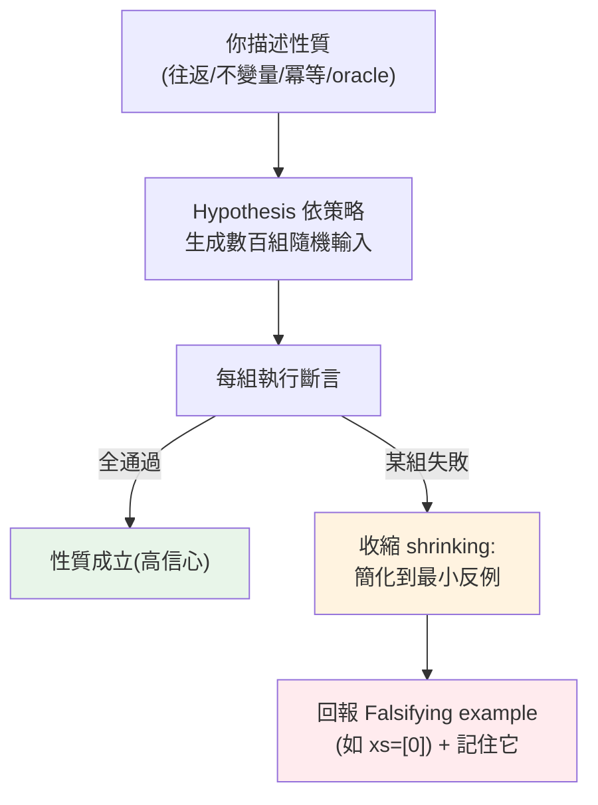

# 屬性測試 property-based testing

> 傳統測試你手寫幾個例子：`add(2, 3) == 5`。但你想得到所有邊界嗎？空字串、負數、超大值、Unicode、None？**屬性測試（property-based testing）** 反過來——你描述「**應該永遠成立的性質**」，讓工具（Hypothesis）自動生成成百上千組輸入去**試圖推翻**它，還會把失敗案例**縮到最小**。這章講這個強大的測試範式。

## 💡 白話導讀（建議先讀）

傳統測試是**舉例**：`add(2, 3) == 5`、`add(-1, 1) == 0`⋯⋯但你舉得完嗎？空字串、負數、超大值、詭異的 Unicode——邊界永遠比想像多。

**屬性測試（property-based testing）** 換一個層次——從「舉例」升級到「**立法**」：

> 不再說「這個輸入該得這個輸出」,改宣告「**對任何輸入,這條性質都成立**」。

然後讓工具（**hypothesis** 套件）當一個**瘋狂測試員**:自動生成幾百組刁鑽輸入（空的、巨大的、負的、奇形怪狀的 Unicode）狂轟你的函式——找到反例,還會**自動縮小**成最簡單的失敗案例給你看。

```python
from hypothesis import given, strategies as st

@given(st.lists(st.integers()))          # 「給我任何整數 list」
def test_sorted_is_ordered(xs):
    result = sorted(xs)
    assert all(a <= b for a, b in zip(result, result[1:]))   # 立法:結果必遞增
```

難的不是寫法,是**想出好性質**。五個現成的立法模板：

1. **往返**:`decode(encode(x)) == x`——編解碼/序列化的必測。
2. **不變量**:`sorted(xs)` 必遞增、`abs(x) >= 0`。
3. **冪等**:做一次和做兩次一樣——`normalize(normalize(x)) == normalize(x)`。
4. **對照參考版**:優化版結果 == 樸素版結果。
5. **代數律**:`add(a,b) == add(b,a)`。

定位:屬性測試**補充**而非取代例子測試——例子管「具體行為對不對」,性質管「**你沒想到的輸入**會不會炸」。純邏輯函式(解析、轉換、計算)上它價值最高。

## Why（為什麼）

傳統的**範例測試（example-based testing）**（見 [pytest](03-pytest-basics.md)）你手動挑幾個輸入、寫出預期輸出：

```python
def test_add():
    assert add(2, 3) == 5
    assert add(0, 0) == 0
    assert add(-1, 1) == 0
```

這很好，但有個根本限制：**你只測到「你想得到」的案例**。而 bug 往往藏在你**沒想到**的邊界——空的、負的、超大的、Unicode、剛好等於 0、剛好溢位、剛好重複。你的例子再多，也蓋不全，且會**反映你的盲點**（你沒想到的情況也不會去測）。

**屬性測試**換一種思路：不寫「具體例子」，而是描述**「對任何合法輸入都該成立的性質（property）」**，然後讓工具**自動生成大量隨機輸入**去驗證。例如「一個字串 encode 再 decode，應該等於原字串」——這對**任何**字串都該成立。工具會丟給你空字串、單字元、超長、含各種 Unicode、含控制字元……幾百組，只要有一組讓性質失敗，就找到 bug。

Python 的 **Hypothesis** 是這領域的主流工具，還有一個殺手級功能：**收縮（shrinking）**——找到失敗案例後，自動把它**縮到最小、最易懂**的形式（如把導致失敗的 500 元素列表縮成 `[0]`），讓你一眼看出問題。屬性測試特別擅長找出「你沒想到的邊界 bug」，是現代測試的重要武器。這章講清楚它的思路與 Hypothesis 用法。

## Theory（理論：找性質而非找例子）

**核心轉變：從「這個輸入 → 這個輸出」（舉例）到「任何輸入 → 這個性質成立」（立法）。**

難的是**想出好的性質**。常見模板：

- **往返 / 反函式（round-trip）**：`decode(encode(x)) == x`、`parse(serialize(x)) == x`——編解碼、序列化最適用。
- **不變量（invariant）**：結果永遠滿足某條件——`sorted(xs)` 永遠遞增、`clamp(x, lo, hi)` 永遠在 `[lo, hi]`、`abs(x) >= 0`。
- **冪等（idempotent）**：做一次和做多次一樣——`sorted(sorted(xs)) == sorted(xs)`、`normalize(normalize(x)) == normalize(x)`。
- **對照參考實作（oracle）**：優化版結果 == 樸素版結果——`fast_sort(xs) == sorted(xs)`。
- **代數性質**：交換律 `add(a, b) == add(b, a)`、`len(a + b) == len(a) + len(b)` 等。

工具（hypothesis）自動生成大量刁鑽輸入驗證性質，找到反例還會**自動縮小**成最簡失敗案例。

## Specification（規範：Hypothesis 用法）

**基本結構**（`pip install hypothesis`）：

```python
from hypothesis import given, strategies as st

@given(st.text())                    # 對任何字串
def test_roundtrip(s):
    assert decode(encode(s)) == s    # 這個性質應永遠成立
```

**常用策略（strategies）——描述輸入的生成**：

```python
st.integers()                        # 任意整數
st.integers(min_value=0, max_value=100)  # 範圍
st.floats(allow_nan=False)           # 浮點（可排除 nan/inf）
st.text()                            # 任意字串（含 Unicode）
st.lists(st.integers())              # 整數列表
st.lists(st.integers(), min_size=1)  # 非空
st.dictionaries(st.text(), st.integers())
st.tuples(st.integers(), st.text())
st.one_of(st.none(), st.integers())  # 多選一
st.builds(User, name=st.text(), age=st.integers(0, 120))  # 建構物件
```

**設定與控制**：

```python
from hypothesis import settings, assume, example

@given(st.integers())
@settings(max_examples=500)          # 生成幾組（預設 100）
@example(0)                          # 明確加入一定要測的案例
def test_x(n):
    assume(n != 0)                   # 過濾掉不適用的輸入（跳過而非失敗）
    ...
```

**與 pytest 整合**：Hypothesis 測試就是普通的測試函式，`pytest` 直接跑（見 [pytest](03-pytest-basics.md)）。

## Implementation（底層：收縮為何是殺手級功能）

**收縮（shrinking）為何關鍵**：隨機測試最大的痛點是——**失敗案例往往又大又亂**。假設 Hypothesis 生成了一個 500 元素、值域橫跨正負百萬的列表讓你的函式崩潰。這個反例**無法直接理解**——是哪個元素？是長度？是某個特定值的組合？你可能要花很久才看懂。

收縮解決這點：找到失敗案例後，Hypothesis **系統性地嘗試「更簡單」的版本**——把列表變短、把數字變小、把字串縮短——只要仍能重現失敗，就繼續簡化，直到**再簡化就不失敗**為止。於是那個 500 元素的怪列表，可能被縮成 **`[0]`**——一眼就看出「喔，我的函式對包含 0 的輸入有問題」。**收縮把「找到 bug」變成「理解 bug」**，這是屬性測試相對於「隨便亂丟輸入」的質變，也是 Hypothesis 的核心價值。

**為何屬性測試能找到範例測試找不到的 bug**：範例測試反映**你的想像**——你想到什麼情況就測什麼，沒想到的（你的盲點）永遠不會被測。屬性測試反映**性質的定義域**——工具依策略系統性地探索輸入空間，包括**你沒想到的邊界**（空、單一、極值、Unicode 邊界、剛好觸發溢位的值）。經典案例：一個看似正確的函式，範例測試全綠，但 Hypothesis 一跑就發現「當輸入包含空字串」或「當數字剛好是 0」或「當列表有重複」時崩潰——這些正是人容易漏、但真實資料會出現的情況。

**代價與定位**：屬性測試不是取代範例測試，而是**互補**——範例測試清楚表達「具體場景的預期」（好讀、好當文件），屬性測試涵蓋「廣泛輸入的性質」（抓邊界）。且屬性測試較慢（跑很多組）、要花心思想出好性質。下面範例展示通過的屬性測試，以及 Hypothesis 抓到 bug 時的收縮輸出。

## Code Example（可執行的 Python 範例）

```python
# property_testing.py — Hypothesis 屬性測試（需要 hypothesis；可用 pytest 執行）
from __future__ import annotations

from hypothesis import given
from hypothesis import strategies as st


# 待測：run-length 編碼與解碼
def rle_encode(s: str) -> list[tuple[str, int]]:
    if not s:
        return []
    result: list[tuple[str, int]] = []
    count = 1
    for i in range(1, len(s)):
        if s[i] == s[i - 1]:
            count += 1
        else:
            result.append((s[i - 1], count))
            count = 1
    result.append((s[-1], count))
    return result


def rle_decode(pairs: list[tuple[str, int]]) -> str:
    return "".join(ch * n for ch, n in pairs)


# 性質 1：往返——任何字串 encode 再 decode 應還原
@given(st.text())
def test_rle_roundtrip(s: str) -> None:
    assert rle_decode(rle_encode(s)) == s


# 性質 2：不變量——sorted 結果永遠遞增
@given(st.lists(st.integers()))
def test_sorted_is_ordered(xs: list[int]) -> None:
    result = sorted(xs)
    assert all(result[i] <= result[i + 1] for i in range(len(result) - 1))


# 性質 3：冪等——排序兩次等於排序一次
@given(st.lists(st.integers()))
def test_sort_idempotent(xs: list[int]) -> None:
    assert sorted(sorted(xs)) == sorted(xs)


# 性質 4：與參考實作對比（oracle）
def my_max(xs: list[int]) -> int:
    m = xs[0]
    for x in xs[1:]:
        if x > m:
            m = x
    return m


@given(st.lists(st.integers(), min_size=1))
def test_my_max_matches_builtin(xs: list[int]) -> None:
    assert my_max(xs) == max(xs)


if __name__ == "__main__":
    # 直接執行時手動觸發（正常用 pytest）
    test_rle_roundtrip()
    test_sorted_is_ordered()
    test_sort_idempotent()
    test_my_max_matches_builtin()
    print("所有屬性測試通過：Hypothesis 已用數百組自動輸入驗證")
    print("  （含空字串、單字元、Unicode、重複、極值、負數等你可能沒想到的邊界）")
```

**預期輸出**（直接執行時）：

```pycon
$ python property_testing.py
所有屬性測試通過：Hypothesis 已用數百組自動輸入驗證
  （含空字串、單字元、Unicode、重複、極值、負數等你可能沒想到的邊界）
```

**當有 bug 時 Hypothesis 的威力**——假設你寫錯了一個性質或函式，例如宣稱「任何整數列表的總和 ≥ 其長度」：

```python
@given(st.lists(st.integers()))
def test_sum_ge_len(xs):
    assert sum(xs) >= len(xs)   # 錯誤的性質！
```

Hypothesis 會**找到並收縮**出最小反例：

```text
Falsifying example: test_sum_ge_len(
    xs=[0],
)
AssertionError
```

逐段解說：

- **性質 1（往返）**：`rle_decode(rle_encode(s)) == s` 對**任何**字串成立。Hypothesis 自動丟空字串、`"aaa"`、`"aAbB"`、含 Unicode/emoji/控制字元的字串……幾百組——比你手寫幾個例子涵蓋廣得多。
- **性質 2/3（不變量/冪等）**：sorted 結果永遠遞增、排序兩次等於一次——這些「應永遠成立」的性質，用一句斷言涵蓋無數輸入。
- **性質 4（oracle）**：自己實作的 `my_max` 對**任何**非空列表都應等於內建 `max`——用參考實作當「神諭」自動比對。
- **收縮的威力**：錯誤性質 `sum(xs) >= len(xs)` 被 Hypothesis 找到反例並**收縮到最小的 `xs=[0]`**（0 ≥ 1 不成立）——不是給你一個 500 元素的亂列表，而是最小、最易懂的反例，一眼看出「當列表是 `[0]` 時失敗」。這就是屬性測試找邊界 bug 的價值。
- **要點**：描述性質（往返/不變量/冪等/oracle）→ Hypothesis 自動生成大量輸入試圖推翻 → 找到就收縮成最小反例。涵蓋你想不到的邊界，是範例測試的強力補充。

## Diagram（圖解：屬性測試流程）



## Best Practice（最佳實踐）

- **屬性測試補充、不取代範例測試**：範例測試表達具體預期（好讀、當文件），屬性測試抓廣泛邊界。
- **找好性質**：往返（編解碼/序列化）、不變量（結果條件）、冪等、與參考實作對比——這些 pattern 最常用。
- **對「有明確性質」的純函式最有效**：編解碼、解析、演算法、資料轉換。
- **用 `assume` 過濾不適用輸入**（跳過而非失敗），用 `@example` 釘住必測案例。
- **善用收縮的最小反例**：它直接指出問題核心。
- **把找到的 bug 加成範例測試（迴歸）**：Hypothesis 會記住，但明確的範例測試更清楚。
- **調 `max_examples`**：關鍵函式多跑幾組（500+）；CI 時間敏感則適量。
- **策略要貼近真實輸入域**：別生成永遠不會出現的輸入，也別漏掉會出現的。

## Common Mistakes（常見誤解）

- **只用範例測試、蓋不到邊界**：反映自己的盲點，漏掉沒想到的情況。
- **想不出性質就放棄**：從往返/不變量/冪等/oracle 這些 pattern 下手。
- **性質寫錯（太強/太弱）**：太強（如 `sum>=len`）會誤報、太弱則抓不到 bug；性質本身要正確。
- **對「無明確性質」的東西硬套**：如複雜業務規則，範例測試可能更合適。
- **忽略收縮的反例**：它是最寶貴的線索，直接看它。
- **策略生成不真實的輸入**：測了一堆現實不會出現的情況、或漏了會出現的。
- **不把找到的 bug 固化成迴歸測試**：同樣的 bug 可能再犯。
- **`max_examples` 設太低**：跑太少組，錯過稀有的觸發輸入。

## Interview Notes（面試重點）

- **能對比範例測試 vs 屬性測試**：具體例子（反映想像/盲點）vs 描述性質 + 自動生成（探索輸入空間、抓邊界）。
- **能舉常見性質 pattern**：往返（round-trip）、不變量、冪等、與參考實作對比（oracle）、代數性質。
- **能解釋收縮（shrinking）的價值**：把失敗案例縮成最小、最易懂的反例，「找到 bug」變「理解 bug」。
- **知道 Hypothesis 的用法**：`@given(strategies)`、常用 strategies、`assume`/`@example`/`settings`。
- **知道屬性測試補充而非取代範例測試**，且對有明確性質的純函式最有效。
- **能舉屬性測試找到範例測試漏掉的邊界 bug**（空、0、重複、Unicode、極值）。

---

🎉 **恭喜完成 Part 12！** 你已掌握 Python 的測試與品質保證：為什麼測試、unittest、pytest（基礎/fixture/參數化）、mock 與 patch、覆蓋率、TDD、doctest、除錯技巧，以及屬性測試。測試是「敢改程式」的安全網，除錯是「查而非猜」的能力。
接下來 [Part 13 工程化與打包](../13-tooling-packaging/README.md) 將進入 pip、venv、uv/poetry、打包發佈與工具鏈。

[⬆️ 回 Part 12 索引](README.md)
