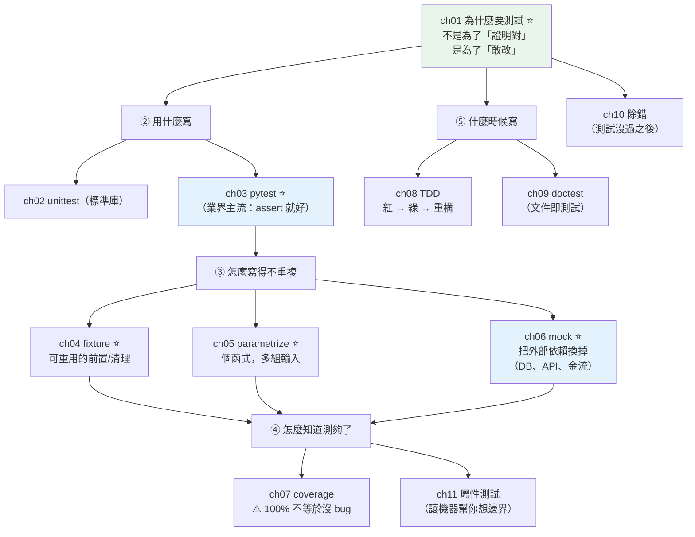

# Part 12 統整：測試全貌

> 把這 11 章串成一張圖——測試回答一個殘酷的問題：**你怎麼「知道」你的程式是對的？**（「我跑過了」不是答案。）

## 🗺️ 知識地圖（這 11 章怎麼串起來）

測試不是「寫完再補的作業」，而是**讓你敢改程式的安全網**。
沒有測試，你每次重構都在賭；有了測試，你按下 Enter 就知道有沒有壞。



**一句話串起來**：

測試的目的**不是「證明程式對」**（那做不到），而是**「讓你敢改」**（ch01）——
這是它真正的價值：**重構的安全網**。

工具上，**[pytest](03-pytest-basics.md) 是業界主流**（ch03）——
用普通的 `assert` 就好，不必像 `unittest`（ch02）寫一堆 `self.assertEqual`。

然後是三招讓測試**不重複、能隔離**：

- **[fixture](04-fixtures.md)**（ch04）：把「每個測試都要準備的東西」抽出來重用。
- **[parametrize](05-parametrize.md)**（ch05）：**一個測試函式，餵多組輸入**——
  不必複製貼上五次。
- **[mock](06-mock.md)**（ch06）：**把外部依賴換成假的**（資料庫、API、金流）——
  測試才會**快、穩定、不花錢**。

最後是「測夠了嗎」：**[coverage](07-coverage.md)**（ch07）告訴你哪些行沒被測到——
但**100% 覆蓋率不等於沒 bug**（它只證明「跑過」，不證明「斷言對」）。

## ⚡ 速查表（什麼情境用什麼）

| 情境 | 怎麼做 | 章節 |
|------|--------|------|
| 寫測試 | **pytest**：函式名 `test_*`，直接用 `assert` | [ch03](03-pytest-basics.md) |
| **每個測試都要準備同樣的東西** | **`@pytest.fixture`**（建立 + 自動清理） | [ch04](04-fixtures.md) |
| 需要臨時檔案／目錄 | 內建 fixture **`tmp_path`**（底層是 [`tempfile`](../11-stdlib/17-tempfile-shutil-glob.md)） | [ch04](04-fixtures.md) |
| **同一個邏輯，多組輸入／預期** | **`@pytest.mark.parametrize`**（別複製貼上） | [ch05](05-parametrize.md) |
| 斷言會拋出例外 | `with pytest.raises(ValueError, match="訊息"):` | [ch03](03-pytest-basics.md) |
| **外部依賴（DB、API、金流、時間）** | **mock**（`Mock(spec=...)` / `unittest.mock.patch`） | [ch06](06-mock.md) |
| mock 要 patch 哪裡？ | **patch「使用處」，不是「定義處」**（最經典的坑） | [ch06](06-mock.md) |
| 驗證「有沒有被呼叫、怎麼被呼叫」 | `mock.assert_called_once_with(...)` / `assert_not_called()` | [ch06](06-mock.md) |
| 看哪些程式碼沒被測到 | `pytest --cov=. --cov-report=term-missing` | [ch07](07-coverage.md) |
| 先寫測試再寫實作 | **TDD**：紅（失敗）→ 綠（通過）→ 重構 | [ch08](08-tdd.md) |
| 讓文件裡的範例**自動被驗證** | `doctest`（範例即測試） | [ch09](09-doctest.md) |
| **懶得想邊界案例** | **屬性測試 `hypothesis`**（機器幫你生刁鑽輸入） | [ch11](11-property-based-testing.md) |
| 測試失敗，想看當下的變數 | `pytest --pdb`（失敗處自動進除錯器）、`breakpoint()` | [ch10](10-debugging.md) |
| 標準庫方案（不能裝套件時） | `unittest`（`self.assertEqual`、`setUp`） | [ch02](02-unittest.md) |

## 🔑 核心心智模型（帶得走的幾句話）

- **測試不是為了「證明對」，是為了「敢改」。** 你永遠無法用測試證明程式沒 bug，
  但**有了測試，你重構時按下 Enter 就知道有沒有壞掉**——這才是它的價值。
- **好的測試要「快、穩、獨立」。** 慢的測試沒人跑；不穩的測試（時好時壞）比沒有更糟
  （大家會開始忽略紅燈）；**測試之間不能互相依賴**（順序一換就爆）。
- **mock 是為了「隔離」，不是為了「偷懶」。** 把資料庫、外部 API、金流換成假的，
  你才能**只測自己的邏輯**——快、不花錢、不受網路影響。
  但**mock 太多也是警訊**：代表你的程式和外部黏太緊
  （該用 [依賴注入](../16-architecture/03-dependency-injection.md) 解耦）。
- **`patch` 要打在「使用處」，不是「定義處」。**
  `mymodule` 裡 `from external import fetch`，要 patch 的是 **`mymodule.fetch`**，
  不是 `external.fetch`——這是 mock 最經典的坑。
- **100% 覆蓋率 ≠ 沒有 bug。** 覆蓋率只證明那行**被執行過**，
  **不證明你的斷言是對的**（極端例子：完全沒有 `assert` 的測試，覆蓋率照樣 100%）。
  它是**找出「完全沒測到」的區域**的工具，不是品質指標。

## 🛠️ 小實作：一個測試檔，走完 fixture + parametrize + mock

情境：一個 `OrderService` 要呼叫**外部金流**。
測試時我們**絕不能真的刷卡**——所以把金流 mock 掉。

```python
# test_orders.py —— Part 12 主線：fixture + parametrize + mock
from __future__ import annotations

from unittest.mock import Mock

import pytest


class PaymentGateway:
    """外部金流——測試時不該真的呼叫它（慢、要錢、不穩定）。"""

    def charge(self, amount: int) -> str:
        raise RuntimeError("真的連線到金流了！測試不該走到這裡")


class OrderService:
    def __init__(self, gateway: PaymentGateway) -> None:
        self.gateway = gateway      # 依賴注入 → 測試時才能替換成假的
                                    # （見 Part 16 的 DI）

    def checkout(self, amount: int) -> str:
        if amount <= 0:
            raise ValueError("金額必須為正數")
        return self.gateway.charge(amount)


@pytest.fixture
def fake_gateway() -> Mock:
    """ch04 fixture：可重用的測試前置——每個測試都拿到一個乾淨的假金流。"""
    gateway = Mock(spec=PaymentGateway)     # spec=：只允許真實存在的方法
    gateway.charge.return_value = "txn_12345"
    return gateway


def test_checkout_success(fake_gateway: Mock) -> None:
    """ch06 mock：把外部依賴換掉，只測「自己的邏輯」。"""
    service = OrderService(fake_gateway)

    assert service.checkout(100) == "txn_12345"
    # 不只驗結果，還驗「怎麼被呼叫」
    fake_gateway.charge.assert_called_once_with(100)


@pytest.mark.parametrize("amount", [0, -1, -999])
def test_checkout_rejects_bad_amount(fake_gateway: Mock, amount: int) -> None:
    """ch05 參數化：一個測試函式，自動展開成三個測試。"""
    service = OrderService(fake_gateway)

    with pytest.raises(ValueError, match="必須為正數"):
        service.checkout(amount)

    # 關鍵斷言：金額不合法時，「絕對沒有」去刷卡
    fake_gateway.charge.assert_not_called()
```

**執行結果**：

```pycon
$ pytest test_orders.py -v
collected 4 items

test_orders.py::test_checkout_success PASSED                        [ 25%]
test_orders.py::test_checkout_rejects_bad_amount[0] PASSED          [ 50%]
test_orders.py::test_checkout_rejects_bad_amount[-1] PASSED         [ 75%]
test_orders.py::test_checkout_rejects_bad_amount[-999] PASSED       [100%]

============================== 4 passed in 0.31s ==============================
```

**這個小檔案示範了測試的四個核心觀念**：

1. **`parametrize` 讓 1 個函式變成 3 個測試**（`[0]`、`[-1]`、`[-999]`）——
   而且**失敗時你一眼看出是哪組輸入炸的**。複製貼上三次做不到這點。

2. **mock 讓測試「快、不花錢、不連網」。**
   真的 `PaymentGateway.charge` 會 `raise RuntimeError`——
   **測試從頭到尾沒碰到它一次**，證明隔離是成功的。

3. **`assert_not_called()` 是最容易被忽略、卻最重要的斷言。**
   我們不只測「金額不合法會拋錯」，更測「**它沒有偷偷去刷卡**」。
   **測試「不該發生的事沒發生」，往往比測試「該發生的發生了」更關鍵。**

4. **能 mock 的前提是「依賴注入」**（`__init__(self, gateway)`）。
   如果 `OrderService` 在內部自己 `PaymentGateway()`，你就**無從替換**——
   **好測試的前提，是好設計**（見 [Part 16 DI](../16-architecture/03-dependency-injection.md)）。

## ✅ 自測清單（答不出來就回去讀）

- [ ] 測試真正的價值是什麼？（提示：不是「證明對」）（[ch01](01-why-testing.md)）
- [ ] pytest 比 unittest 好在哪？（[ch02](02-unittest.md)、[ch03](03-pytest-basics.md)）
- [ ] fixture 解決什麼問題？它怎麼做清理？（[ch04](04-fixtures.md)）
- [ ] 什麼時候該用 `parametrize` 而不是複製測試？（[ch05](05-parametrize.md)）
- [ ] mock 的目的是什麼？mock 太多代表什麼問題？（[ch06](06-mock.md)）
- [ ] `patch` 該打在「定義處」還是「使用處」？為什麼？（[ch06](06-mock.md)）
- [ ] 100% 覆蓋率代表沒有 bug 嗎？為什麼？（[ch07](07-coverage.md)）
- [ ] TDD 的紅綠重構循環，每一步在做什麼？（[ch08](08-tdd.md)）
- [ ] doctest 適合什麼場景？不適合什麼？（[ch09](09-doctest.md)）
- [ ] 屬性測試和一般測試差在哪？它解決什麼痛點？（[ch11](11-property-based-testing.md)）
- [ ] 測試失敗時，怎麼快速看到當下的變數？（[ch10](10-debugging.md)）

## 🎯 面試速查

| 考點 | 面試官想聽到什麼 | 章節 |
|------|------------------|------|
| **為什麼要寫測試？** | 「**不是為了證明程式對**（那不可能），而是為了**敢改**——測試是**重構的安全網**。沒有測試，每次改動都是賭博；有測試，跑一次就知道有沒有壞。它也是**活的文件**（描述程式該有的行為）。」 | [ch01](01-why-testing.md) |
| **好測試的特徵？** | 「**快、穩定、獨立、清楚**。慢的沒人跑；**不穩定的（flaky）比沒有更糟**——會讓團隊開始忽略紅燈；測試之間**不能互相依賴**（順序換了就爆）；失敗訊息要能**一眼看出哪裡錯**。」 | [ch01](01-why-testing.md) |
| **mock 是什麼？何時用？** | 「把**外部依賴**（DB、HTTP API、金流、時間、隨機）換成**可控的假物件**，讓測試**快、穩、不花錢**，並能**模擬難以觸發的情況**（網路超時、API 回錯）。但 **mock 太多是設計警訊**——代表耦合太緊。」 | [ch06](06-mock.md) |
| **`patch` 要打在哪？** | 「**打在「使用處」，不是「定義處」**。若 `mymodule.py` 寫 `from external import fetch`，那 `mymodule` 的命名空間裡已經有一個 `fetch` 了——要 patch **`mymodule.fetch`**。patch `external.fetch` 完全沒效果。這是 mock 最經典的坑。」 | [ch06](06-mock.md) |
| **100% 覆蓋率就沒 bug 了嗎？** | 「**不是**。覆蓋率只證明那行**被執行過**，不證明**斷言是對的**——一個完全沒有 `assert` 的測試，覆蓋率照樣 100%。它是用來**找出完全沒測到的區域**，不是品質指標。追求 100% 常導致寫一堆無意義的測試。」 | [ch07](07-coverage.md) |
| **TDD 的流程？** | 「**紅 → 綠 → 重構**。① 先寫一個**失敗**的測試（描述你要的行為）；② 寫**最少的程式碼**讓它通過；③ 在測試保護下**重構**。好處：測試一定會被寫、介面從使用者角度設計、程式天然可測。」 | [ch08](08-tdd.md) |

---

🎉 **恭喜完成 Part 12！** 你有了**敢改程式的底氣**。

接下來 [Part 13 工程化與打包](../13-tooling-packaging/README.md) 把這份底氣**自動化**：
`ruff`（風格與 lint）、`mypy`（型別）、`pytest`（測試）、`pre-commit`（提交前自動跑）——
**讓機器幫你守門，而不是靠人記得。**

➡️ 下一 Part：[工程化與打包 Tooling & Packaging](../13-tooling-packaging/README.md)

[⬆️ 回 Part 12 索引](README.md)
