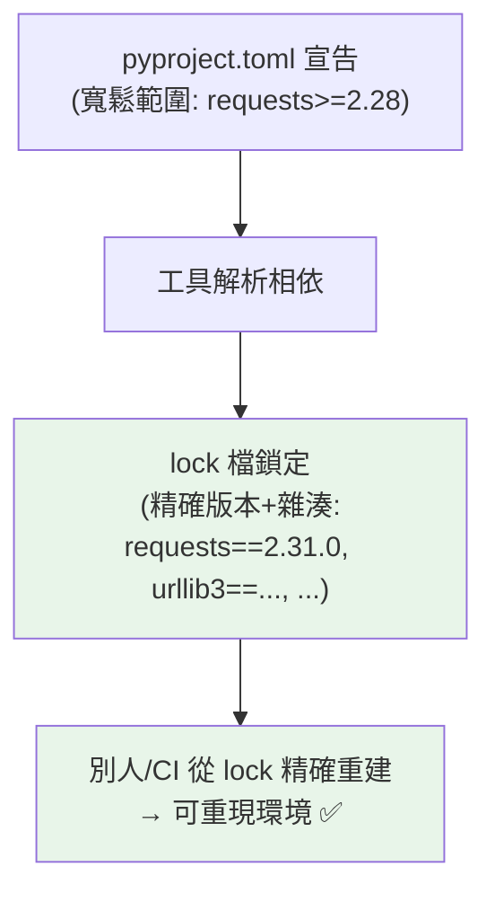

# pip 進階與相依解析

> [Part 1](../01-getting-started/04-pip-and-packages.md) 講了 pip 基礎，這章深入：版本鎖定、`requirements.txt` vs lock 檔、相依解析與衝突、可重現的環境。理解「為什麼我的環境和別人不一樣」的根源，是工程化的第一步。

## Why（為什麼）

「在我電腦上能跑」是團隊協作的惡夢——A 裝了 `requests 2.31`、B 裝了 `2.28`，行為就可能不同。更糟的是「相依衝突」（套件 X 要 `numpy<2`、Y 要 `numpy>=2`）。要讓「環境可重現、可被別人/CI 精確重建」，你得懂 pip 的進階用法：版本規格、鎖定、相依解析、lock 檔。這章補完 [Part 1 的 pip 基礎](../01-getting-started/04-pip-and-packages.md)，講清楚「環境可重現性」這個工程核心問題。

## Theory（理論：可重現性與相依解析）

兩個核心問題：

1. **可重現性（reproducibility）**：如何讓「你的環境」在別人機器、CI、部署伺服器上**精確重建**？——靠鎖定所有套件的精確版本。
2. **相依解析（dependency resolution）**：pip 如何決定「裝哪些版本」以滿足所有套件的版本需求？——pip 有一個 resolver 找出相容的版本組合，找不到就衝突。

關鍵區分：
- **直接相依（direct）**：你明確需要的（`requests`）。
- **傳遞相依（transitive）**：你的相依所需要的（`requests` 需要 `urllib3`、`certifi`…）。

「可重現」要鎖定**所有**相依（直接 + 傳遞）的精確版本。

## Specification（規範：pip 進階指令）

```bash
# 版本規格
pip install "requests==2.31.0"       # 精確版本
pip install "requests>=2.28,<3.0"    # 範圍
pip install "requests~=2.31.0"       # 相容版本（>=2.31.0, ==2.31.*）

# 從 requirements 安裝
pip install -r requirements.txt

# 產生 requirements（凍結目前環境的精確版本）
pip freeze > requirements.txt

# 查看
pip list                             # 已安裝套件
pip show requests                    # 某套件的詳情（含相依）
pip list --outdated                  # 可升級的
pip check                            # 檢查相依衝突

# 可編輯安裝（開發用，見 專案結構）
pip install -e .

# 從 pyproject.toml 安裝專案 + optional deps
pip install -e ".[dev]"
```

## Implementation（版本規格、requirements vs lock、衝突、可重現）

### 版本規格：釘住 vs 範圍

```text
requests              # 最新版（危險：不可重現）
requests==2.31.0      # 精確（可重現，但無法自動修安全性）
requests>=2.28,<3.0   # 範圍（相容更新，但版本可能飄）
requests~=2.31.0      # 相容版本 = >=2.31.0,==2.31.* （只收 patch）
```

- **應用程式（app）**：**釘住精確版本**（`==`）以求可重現——你控制部署環境。
- **函式庫（library）**：用**寬鬆範圍**（`>=`）——別強加精確版本給使用者（會造成衝突）。

這是重要區分：**app 釘死、library 放寬**。

### requirements.txt vs lock 檔

`requirements.txt` + `pip freeze` 是傳統做法，但有缺陷：

```bash
pip freeze > requirements.txt        # 凍結目前所有套件的精確版本
```

`pip freeze` 產生**所有**已裝套件（含傳遞相依）的精確版本——這能重現，但問題是：**它不區分「你直接要的」與「傳遞來的」**，也**不記錄雜湊（無法驗證完整性）**、**不記錄「為什麼裝這個」**。

**現代做法：分離「宣告」與「鎖定」**：
- **宣告**（你要什麼）：`pyproject.toml` 的 dependencies（見 [pyproject.toml](04-pyproject-toml.md)），用寬鬆範圍。
- **鎖定**（精確版本快照）：**lock 檔**（`uv.lock`、`poetry.lock`、`requirements.lock`）——由工具產生，含所有相依的精確版本 + 雜湊。

lock 檔提供「宣告寬鬆、鎖定精確」的兩全——`pyproject.toml` 說「我要 requests」，lock 檔說「精確裝 requests 2.31.0（雜湊 abc...）+ 它的所有相依」。現代工具（uv/poetry，見 [uv/poetry](03-uv-poetry.md)）自動管理 lock 檔。

### 相依衝突與解析

當兩個套件要求不相容的版本，pip 的 resolver 會**找不到相容組合**：

```text
套件 A 要 numpy<2
套件 B 要 numpy>=2
→ 無法同時滿足 → ResolutionImpossible
```

現代 pip（20.3+）有**回溯式 resolver**——會嘗試不同版本組合找相容解。找不到就報 `ResolutionImpossible`，列出衝突。解法：升級/降級某套件、找相容版本、或分離環境。**`pip check`** 可檢查已裝套件間的相依衝突。

### 可重現環境的完整流程

```bash
# 1. 宣告相依（pyproject.toml，寬鬆範圍）
# 2. 鎖定（產生 lock 檔，工具做）
# 3. 別人/CI 從 lock 檔精確安裝
pip install -r requirements.lock     # 或 uv sync / poetry install

# 加速與快取
pip install --no-cache-dir ...       # 不用快取（CI 有時要）
pip download ...                     # 只下載不安裝（離線部署）
```

「可重現」= 宣告 + 鎖定 + 從 lock 精確重建。這是團隊協作、CI、部署的基礎。

## Code Example（可執行的 Python 範例）

```python
# pip_deep_demo.py
from __future__ import annotations

from importlib.metadata import distributions, version


def list_installed() -> dict[str, str]:
    """程式化列出已安裝套件與版本（用 importlib.metadata）。"""
    return {dist.metadata["Name"]: dist.version for dist in distributions()}


def check_version(package: str, spec: str) -> str:
    """檢查已裝版本是否符合規格（簡化示範）。"""
    try:
        installed = version(package)
        return f"{package} {installed}（需求: {spec}）"
    except Exception:
        return f"{package} 未安裝"


def parse_requirement(line: str) -> tuple[str, str]:
    """解析 requirements 行（簡化）。"""
    import re

    match = re.match(r"([\w.-]+)\s*([=<>~!]+.*)?", line.strip())
    if match:
        name = match.group(1)
        spec = match.group(2) or "(任意版本)"
        return name, spec
    return line, ""


def demo() -> None:
    # 1. 列出部分已安裝套件
    installed = list_installed()
    print(f"已安裝套件數: {len(installed)}")
    for pkg in ["pytest", "ruff", "mypy"]:
        print(f"  {check_version(pkg, '>=最新')}")

    # 2. 解析版本規格
    print("\n版本規格解析:")
    for line in ["requests==2.31.0", "numpy>=1.24,<2.0", "flask~=3.0"]:
        name, spec = parse_requirement(line)
        print(f"  {name}: {spec}")

    print("\n可重現性要點：app 釘精確版本、library 用寬鬆範圍、用 lock 檔鎖定")


if __name__ == "__main__":
    demo()
```

**預期輸出**（版本依環境）：

```pycon
$ python pip_deep_demo.py
已安裝套件數: ...
  pytest 9.x.x（需求: >=最新）
  ruff 未安裝（若非 python -m）
  mypy 1.x.x（需求: >=最新）

版本規格解析:
  requests: ==2.31.0
  numpy: >=1.24,<2.0
  flask: ~=3.0

可重現性要點：app 釘精確版本、library 用寬鬆範圍、用 lock 檔鎖定
```

## Diagram（圖解：宣告 vs 鎖定）



## Best Practice（最佳實踐）

- **app 釘精確版本、library 用寬鬆範圍**：app 求可重現、library 別強加版本給使用者。
- **分離宣告（pyproject.toml，寬鬆）與鎖定（lock 檔，精確）**：現代做法，兩全其美。
- **用 lock 檔確保可重現**：CI/部署從 lock 精確安裝（`uv sync`/`poetry install`）。
- **用 `python -m pip`** 避免裝錯 Python（見 [Part 1 pip](../01-getting-started/04-pip-and-packages.md)）。
- **`pip check` 檢查相依衝突**；衝突時升降級或找相容版本。
- **用 `~=`（相容版本）** 當「只收 patch 更新」的折衷（`~=2.31.0` = `>=2.31.0,==2.31.*`）。
- **現代工具（uv/poetry）自動管理 lock**（見 [uv/poetry](03-uv-poetry.md)）——比手動 requirements 好。

## Common Mistakes（常見誤解）

- **app 用最新版（不釘）**：不可重現，某天套件更新就壞。
- **library 釘精確版本**：強加給使用者、造成衝突；用寬鬆範圍。
- **只用 `pip freeze` 不分直接/傳遞相依**：混在一起、難維護、無雜湊；用 lock 檔。
- **不記錄相依**：別人無法重建環境。
- **忽略相依衝突**：`ResolutionImpossible` 硬裝或用 `--no-deps` 繞過會埋雷。
- **在系統 Python 裝專案套件**：污染系統；用虛擬環境（見 [虛擬環境管理](02-venv-and-envs.md)）。
- **不用 lock 檔就宣稱可重現**：寬鬆範圍下版本會飄。

## Interview Notes（面試重點）

- 能解釋**可重現性**問題與解法：**分離宣告（pyproject.toml 寬鬆範圍）與鎖定（lock 檔精確版本+雜湊）**，從 lock 精確重建。
- **知道 app 釘精確版本、library 用寬鬆範圍** 的區分與原因。
- 知道 **直接相依 vs 傳遞相依**，lock 檔鎖定所有相依。
- 知道 **`pip freeze`/requirements.txt 的缺陷**（不分直接/傳遞、無雜湊）與 lock 檔的優勢。
- 知道**相依衝突（ResolutionImpossible）** 的成因與 pip 回溯 resolver、`pip check`。
- 知道現代工具（uv/poetry）自動管理 lock（連結下章）。

---

➡️ 下一章：[虛擬環境管理](02-venv-and-envs.md)

[⬆️ 回 Part 13 索引](README.md)
