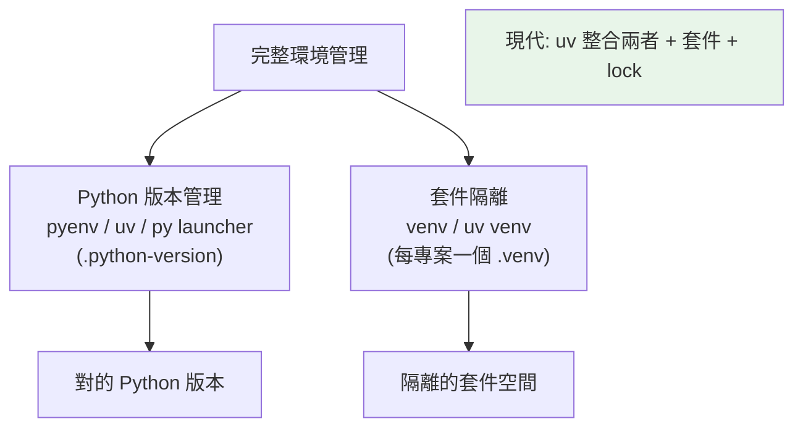

# 虛擬環境管理

> [Part 1](../01-getting-started/05-venv.md) 講了 venv 基礎，這章從「工程管理」角度看：多環境策略、環境與專案的對應、Python 版本管理（pyenv）、以及現代工具如何簡化這一切。

## 💡 白話導讀（建議先讀）

[Part 1 的 venv](../01-getting-started/05-venv.md) 解決了「每個專案一個獨立房間」。但工程實務還有第二個維度：

> 房間解決了「**套件**互不干擾」——那「**Python 本身的版本**」呢？

專案 A 是老系統要 Python 3.10、新專案 B 用 3.12——venv 只能從「已安裝的 Python」建房間,**你得先有那些版本的 Python**。

所以完整的環境管理是兩層：

```text
第一層:Python 版本管理 —— 機器上裝多個 Python(3.10/3.11/3.12),按專案切換
第二層:套件隔離(venv) —— 每個專案自己的房間
```

傳統要拼裝多個工具（pyenv 管版本 + venv 開房間 + pip 裝套件）;現代工具（下一章的 uv/poetry）把兩層一次包辦——`uv python install 3.12` 連 Python 都幫你裝。

這章還處理幾個工程慣例:房間放哪（專案內 `.venv`,進 `.gitignore`）、requirements 怎麼分層（正式 vs 開發依賴）、CI 上怎麼重建環境——把 Part 1 的個人習慣升級成團隊紀律。

## Why（為什麼）

[Part 1 的 venv 章](../01-getting-started/05-venv.md) 講了「為什麼要虛擬環境、怎麼建」。這章進階到「工程管理」：一台機器上有很多專案，每個要獨立環境、可能要不同 Python 版本——如何有系統地管理？如何讓「切到某專案就用對的環境與 Python」？這章講清楚多環境的組織策略、Python 版本管理，以及現代工具（uv 等）如何讓環境管理幾乎自動化。

## Theory（理論：兩個維度的隔離）

環境管理有兩個維度——兩層：

1. **套件隔離**：每個專案有獨立的套件空間（venv，見 [Part 1 venv](../01-getting-started/05-venv.md) 的獨立房間）——避免專案間套件衝突。
2. **Python 版本管理**：不同專案可能要不同 Python 版本（A 用 3.11、B 用 3.12）——需要工具管理多個 Python 版本本身。

完整的環境管理 = **對的 Python 版本 + 隔離的套件空間**。

傳統要組合多個工具（pyenv + venv + pip）；現代工具（uv、poetry）把這些整合成一個。

## Specification（規範：工具速覽）

```bash
# --- venv（標準庫，套件隔離）---
python -m venv .venv
source .venv/bin/activate        # macOS/Linux
.venv\Scripts\activate           # Windows

# --- pyenv（Python 版本管理，macOS/Linux）---
pyenv install 3.12.4             # 安裝某 Python 版本
pyenv local 3.12.4               # 設定當前目錄用 3.12.4（產生 .python-version）
pyenv global 3.11.9              # 設全域預設

# --- uv（現代整合工具，見下章）---
uv venv                          # 建虛擬環境（超快）
uv venv --python 3.12            # 指定 Python 版本
uv sync                          # 依 lock 檔同步環境

# --- Windows：py launcher ---
py -3.12 -m venv .venv           # 用特定版本建 venv
```

## Implementation（多環境策略、pyenv、版本檔、現代工具）

### 多環境策略：一專案一環境

**黃金法則：每個專案一個獨立的 `.venv`**（放在專案目錄下）：

```text
~/projects/
├── project-a/
│   └── .venv/          # A 的環境（django 3.2）
├── project-b/
│   └── .venv/          # B 的環境（django 5.0）
└── project-c/
    └── .venv/          # C 的環境
```

每個專案的 `.venv` 獨立——套件互不干擾。慣例命名 `.venv`（多數編輯器與工具自動辨識）、放進 `.gitignore`（環境是拋棄式的，見 [Part 1 venv](../01-getting-started/05-venv.md)）。

### pyenv：管理多個 Python 版本

venv 隔離套件，但用的是**同一個 Python 版本**。若專案要不同 Python 版本（A 要 3.11、B 要 3.12），用 **pyenv**（macOS/Linux）管理多個版本：

```bash
pyenv install 3.11.9             # 安裝 3.11
pyenv install 3.12.4             # 安裝 3.12

cd project-a
pyenv local 3.11.9               # 這個專案用 3.11（產生 .python-version）

cd ../project-b
pyenv local 3.12.4               # 這個專案用 3.12
```

`pyenv local` 產生 `.python-version` 檔——pyenv 讀它，讓你 `cd` 進專案時自動用對的 Python 版本。搭配 venv：pyenv 選 Python 版本、venv 隔離套件。（Windows 用 py launcher 或 uv。）

### `.python-version`：記錄專案的 Python 版本

`.python-version`（pyenv/uv 都認）記錄專案該用的 Python 版本——**進版控**，讓團隊/CI 用一致的版本：

```text
# .python-version
3.12.4
```

這解決「A 用 3.11 開發、B 用 3.13 就出問題」——大家用同一版本。

### 現代工具：整合一切

傳統要「pyenv 管版本 + venv 隔離 + pip 裝套件 + requirements 鎖定」——四個工具。**現代工具（uv、poetry，見 [uv/poetry](03-uv-poetry.md)）整合這些**：

```bash
# uv：一個工具管 Python 版本 + 環境 + 套件 + lock
uv python install 3.12           # 裝 Python 版本（uv 自己下載！）
uv venv                          # 建環境
uv add requests                  # 加相依（更新 pyproject + lock + 安裝）
uv sync                          # 從 lock 同步環境
```

`uv` 甚至能**自己下載 Python 版本**（不需 pyenv），把「版本 + 環境 + 套件 + lock」全整合——這是環境管理的未來方向。**新專案建議直接用 uv**（快、整合、簡單）。

### 免啟用直接用（CI/Docker）

如 [Part 1 venv](../01-getting-started/05-venv.md) 提過——不必 activate，直接呼叫環境的 python：

```bash
.venv/bin/python script.py       # macOS/Linux
.venv\Scripts\python.exe script.py   # Windows
uv run script.py                 # uv：自動用專案環境執行
```

CI/Docker/Makefile 常用這種免啟用寫法（更明確、更不易錯）。`uv run` 甚至自動確保環境同步後執行。

## Code Example（可執行的 Python 範例）

```python
# venv_management_demo.py
from __future__ import annotations

import sys
from pathlib import Path


def env_info() -> dict[str, str]:
    """回報目前 Python 環境資訊。"""
    return {
        "version": f"{sys.version_info.major}.{sys.version_info.minor}.{sys.version_info.micro}",
        "executable": sys.executable,
        "in_venv": str(sys.prefix != sys.base_prefix),  # 是否在虛擬環境
        "prefix": sys.prefix,
    }


def find_project_python_version() -> str | None:
    """讀 .python-version（若存在），示範專案版本管理。"""
    version_file = Path(".python-version")
    if version_file.exists():
        return version_file.read_text(encoding="utf-8").strip()
    return None


def demo() -> None:
    info = env_info()
    print("目前環境：")
    print(f"  Python 版本: {info['version']}")
    print(f"  在虛擬環境內: {info['in_venv']}")
    print(f"  執行檔: {Path(info['executable']).name}")

    pv = find_project_python_version()
    print(f"\n專案指定版本 (.python-version): {pv or '未設定'}")

    print("\n環境管理策略：")
    print("  - 每專案一個 .venv（放 .gitignore）")
    print("  - .python-version 記錄 Python 版本（進版控）")
    print("  - 現代工具 uv 整合版本+環境+套件+lock")


if __name__ == "__main__":
    demo()
```

**預期輸出**：

```pycon
$ python venv_management_demo.py
目前環境：
  Python 版本: 3.12.x
  在虛擬環境內: True
  執行檔: python.exe

專案指定版本 (.python-version): 未設定

環境管理策略：
  - 每專案一個 .venv（放 .gitignore）
  - .python-version 記錄 Python 版本（進版控）
  - 現代工具 uv 整合版本+環境+套件+lock
```

## Diagram（圖解：環境管理兩維度）



## Best Practice（最佳實踐）

- **每專案一個 `.venv`**（放專案目錄、命名 `.venv`、進 `.gitignore`）。
- **用 `.python-version` 記錄專案 Python 版本**（進版控），讓團隊/CI 一致。
- **Python 版本管理用 pyenv（macOS/Linux）或 uv**（跨平台、能自己下載 Python）。
- **新專案建議直接用 uv**（見 [uv/poetry](03-uv-poetry.md)）：整合版本+環境+套件+lock，快又簡單。
- **CI/Docker 用免啟用寫法**（`.venv/bin/python` 或 `uv run`）：更明確。
- **環境壞了刪掉重建**（`rm -rf .venv`）：環境是拋棄式的（相依記在 pyproject/lock）。
- **別污染系統 Python**：專案套件一律裝進虛擬環境。

## Common Mistakes（常見誤解）

- **多專案共用一個環境**：套件衝突；每專案獨立 `.venv`。
- **不記錄 Python 版本**：團隊用不同版本出問題；用 `.python-version`。
- **把 `.venv` 進版控**：體積大、含絕對路徑、平台相依；gitignore。
- **手動組合一堆工具卻管不好**：現代 uv 整合了，更省心。
- **在系統 Python 裝套件**：污染系統工具；用虛擬環境。
- **搬移專案目錄後 venv 壞掉**：venv 含絕對路徑；刪掉重建（相依在 pyproject/lock）。
- **忘了啟用就裝套件**：裝到別的 Python；確認 `(.venv)` 或用免啟用寫法。

## Interview Notes（面試重點）

- 知道環境管理的**兩維度**：**套件隔離（venv）+ Python 版本管理（pyenv/uv）**。
- 知道**每專案一個 `.venv`**（gitignore）、**`.python-version` 記錄版本**（進版控、團隊一致）。
- 知道 **pyenv 管多 Python 版本**（`.python-version`）、Windows 用 py launcher。
- **知道現代工具 uv 整合版本+環境+套件+lock**（甚至自己下載 Python），是環境管理的方向（連結下章）。
- 知道 CI/Docker 用免啟用寫法（`.venv/bin/python`、`uv run`）。

---

➡️ 下一章：[uv 與 poetry](03-uv-poetry.md)

[⬆️ 回 Part 13 索引](README.md)
