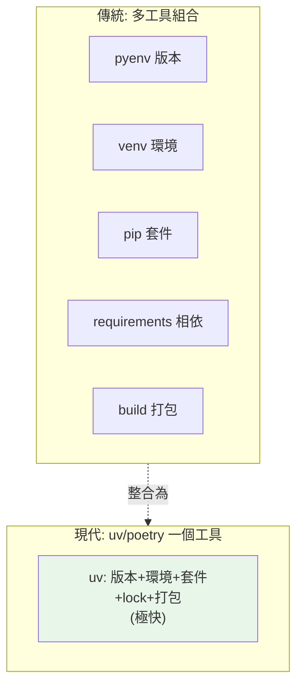

# uv 與 poetry

> uv（Rust 寫的，極快）與 poetry 把「環境 + 套件 + lock + 打包」整合成一個工具，取代「pip + venv + requirements」的手動組合。uv 是近年最受矚目的新工具，速度快數十倍。

## Why（為什麼）

傳統 Python 工作流要手動組合多個工具：venv 建環境、pip 裝套件、requirements 記相依、setuptools 打包。步驟繁瑣、易出錯、且 pip 慢。**現代整合工具**——**poetry**（成熟、pyproject 導向）與 **uv**（Rust 寫、極快、近年爆紅）——把這些整合成單一工具，並自動管理 lock 檔（可重現）。理解它們（尤其 uv）能大幅簡化你的工作流。這章講清楚兩者的定位與用法。

## Theory（理論：整合工具的價值）

現代整合工具解決「工具碎片化」：

| 傳統（多工具） | 整合工具（一個） |
|----------------|------------------|
| venv（環境） | ✅ |
| pip（套件） | ✅ |
| requirements（相依） | ✅ 自動 lock |
| setuptools/build（打包） | ✅ |
| （手動組合） | 一個工具全包 |

**poetry**：成熟、以 pyproject.toml 為中心、自動 lock、能打包發佈。
**uv**：Rust 寫、**極快（比 pip 快 10-100 倍）**、能管 Python 版本、API 類似 pip、近年迅速普及。

**準則**：**新專案優先考慮 uv**（快、整合、活躍發展）；poetry 也是好選擇（成熟穩定）；小專案或函式庫用 pip + pyproject 也行。

## Specification（規範：uv 與 poetry 指令對照）

```bash
# --- uv ---
uv init myproject               # 建新專案（產生 pyproject.toml）
uv venv                         # 建虛擬環境
uv add requests                 # 加相依（更新 pyproject + lock + 安裝）
uv add --dev pytest ruff        # 加開發相依
uv remove requests              # 移除
uv sync                         # 依 lock 同步環境（可重現）
uv run pytest                   # 在專案環境執行（自動同步）
uv lock                         # 更新 lock 檔
uv python install 3.12          # 安裝 Python 版本（uv 自己下載）
uv pip install ...              # pip 相容介面

# --- poetry ---
poetry new myproject            # 建新專案
poetry add requests             # 加相依
poetry add --group dev pytest   # 加開發相依
poetry install                  # 安裝（依 lock）
poetry run pytest               # 在環境執行
poetry lock                     # 更新 lock
poetry build                    # 打包
poetry publish                  # 發佈到 PyPI
```

## Implementation（uv 工作流、poetry、lock、速度）

### uv：現代工作流

uv 的核心工作流——`add`（加相依）、`sync`（同步環境）、`run`（執行）：

```bash
# 建立專案
uv init myproject
cd myproject

# 加相依（自動更新 pyproject.toml + uv.lock + 安裝到 .venv）
uv add requests
uv add --dev pytest ruff mypy   # 開發相依

# 執行（uv run 自動確保環境同步後執行）
uv run python main.py
uv run pytest

# 別人 clone 後：一鍵重建環境
uv sync                         # 依 uv.lock 精確重建（可重現）
```

`uv add` 一步完成「更新宣告 + 更新 lock + 安裝」——不必手動 pip install 再 freeze。`uv sync` 讓別人/CI 從 lock 精確重建（可重現，見 [pip 進階](01-pip-deep.md)）。`uv run` 自動確保環境是最新的才執行——不必手動 activate。

### uv 的速度優勢

uv 用 Rust 寫、有全域快取、平行下載——**比 pip 快 10-100 倍**：

```bash
# pip 安裝一堆套件可能要幾十秒
# uv 通常幾秒內完成（尤其有快取時）
```

這在大型專案、CI（反覆重建環境）差異巨大——CI 的環境建立時間可能從幾分鐘降到幾秒。速度是 uv 爆紅的主因之一。uv 也整合了 Python 版本管理（`uv python install`，自己下載，不需 pyenv）。

### poetry：成熟的選擇

poetry 較早、較成熟，以 pyproject.toml 為中心：

```bash
poetry new myproject            # 建專案骨架
poetry add requests             # 加相依
poetry install                  # 安裝（產生/依 poetry.lock）
poetry run pytest               # 執行
poetry build && poetry publish  # 打包發佈
```

poetry 的相依宣告在 pyproject.toml 的 `[tool.poetry]`（略不同於標準 PEP 621 格式，但新版本支援標準格式）。它成熟穩定、生態完整、打包發佈流程順暢。

### lock 檔：可重現的核心

uv（`uv.lock`）與 poetry（`poetry.lock`）都自動維護 lock 檔——記錄**所有相依的精確版本 + 雜湊**（見 [pip 進階](01-pip-deep.md)）：

- **lock 檔進版控**：讓團隊/CI 從它精確重建。
- **pyproject.toml 宣告寬鬆範圍、lock 檔鎖定精確版本**——兩全其美。
- 更新相依用 `uv lock`/`poetry lock`（重新解析）。

這自動化了「宣告 vs 鎖定」的分離，比手動 requirements 好太多。

### 該用哪個

| 情境 | 建議 |
|------|------|
| 新專案、想要快 | **uv**（快、整合、活躍） |
| 需要成熟穩定 | poetry 或 uv |
| 函式庫發佈 | poetry（打包成熟）或 uv/hatch |
| 簡單腳本/小專案 | pip + pyproject 也行 |
| 現有 poetry 專案 | 繼續用 poetry |

**新專案我推薦 uv**——速度與整合度是明顯優勢，且發展活躍。但 poetry 仍是穩健選擇。

## Code Example（可執行的 Python 範例）

```python
# uv_poetry_demo.py
from __future__ import annotations


def compare_workflows() -> dict[str, list[str]]:
    """對照傳統 vs 現代工作流。"""
    return {
        "傳統（多工具）": [
            "python -m venv .venv",
            "source .venv/bin/activate",
            "pip install requests",
            "pip freeze > requirements.txt",
            "pip install -r requirements.txt  # 別人重建",
        ],
        "uv（整合）": [
            "uv init myproject",
            "uv add requests           # 更新 pyproject+lock+安裝",
            "uv run python main.py     # 自動同步後執行",
            "uv sync                   # 別人一鍵重建",
        ],
    }


def demo() -> None:
    workflows = compare_workflows()
    for name, steps in workflows.items():
        print(f"\n{name}:")
        for step in steps:
            print(f"  $ {step}")

    print("\n重點：")
    print("  - uv 用 Rust 寫，比 pip 快 10-100 倍")
    print("  - uv/poetry 自動管理 lock 檔（可重現）")
    print("  - 新專案建議 uv；poetry 也是好選擇")


if __name__ == "__main__":
    demo()
```

**預期輸出**：

```pycon
$ python uv_poetry_demo.py

傳統（多工具）:
  $ python -m venv .venv
  $ source .venv/bin/activate
  $ pip install requests
  $ pip freeze > requirements.txt
  $ pip install -r requirements.txt  # 別人重建

uv（整合）:
  $ uv init myproject
  $ uv add requests           # 更新 pyproject+lock+安裝
  $ uv run python main.py     # 自動同步後執行
  $ uv sync                   # 別人一鍵重建

重點：
  - uv 用 Rust 寫，比 pip 快 10-100 倍
  - uv/poetry 自動管理 lock 檔（可重現）
  - 新專案建議 uv；poetry 也是好選擇
```

## Diagram（圖解：整合工具取代多工具）



## Best Practice（最佳實踐）

- **新專案優先考慮 uv**：速度（比 pip 快數十倍）、整合（版本+環境+套件+lock）、活躍發展。
- **poetry 也是好選擇**：成熟、穩定、打包發佈順暢。
- **用 `uv add`/`poetry add` 管相依**（自動更新 pyproject + lock + 安裝），別手動 pip。
- **lock 檔進版控**：讓團隊/CI 從它精確重建（`uv sync`/`poetry install`）。
- **用 `uv run`/`poetry run` 執行**：自動用專案環境（不必手動 activate）。
- **pyproject.toml 宣告寬鬆、lock 鎖定精確**：可重現。
- **CI 用 uv 加速環境建立**：從幾分鐘降到幾秒。

## Common Mistakes（常見誤解）

- **還在手動組合 venv + pip + requirements**：現代工具整合了，更省心。
- **lock 檔沒進版控**：失去可重現性；lock 檔要 commit。
- **手動 pip install 繞過工具**：破壞 lock 一致性；用 `uv add`/`poetry add`。
- **混用工具**（一半 pip、一半 poetry）：狀態不一致；選一個工具貫徹。
- **以為 uv 只是「快一點的 pip」**：它整合了版本+環境+lock+打包，是完整工作流。
- **忽略 uv 的 Python 版本管理**：`uv python install` 能自己下載，不需 pyenv。
- **函式庫發佈忘了打包工具**：poetry/uv/hatch 能打包（見 [打包發佈](05-packaging.md)）。

## Interview Notes（面試重點）

- 知道 **uv（Rust、極快、整合）與 poetry（成熟、pyproject 導向）** 把「環境+套件+lock+打包」整合成一個工具，取代 pip+venv+requirements 的手動組合。
- **知道 uv 的速度優勢**（比 pip 快 10-100 倍）與整合度（含 Python 版本管理），是近年最受矚目的工具。
- 知道 **`uv add`/`sync`/`run`** 工作流、**lock 檔自動管理 + 進版控**（可重現）。
- 知道**新專案建議 uv**、poetry 也是好選擇、簡單專案 pip 也行。
- 能連結 [pip 進階](01-pip-deep.md)：這些工具自動化了「宣告 vs 鎖定」的分離。

---

➡️ 下一章：[pyproject.toml 全解析](04-pyproject-toml.md)

[⬆️ 回 Part 13 索引](README.md)
