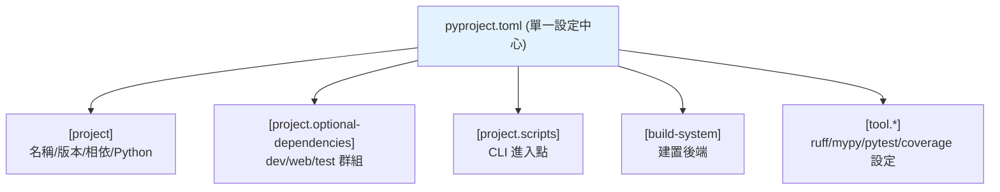

# pyproject.toml 全解析

> `pyproject.toml` 是現代 Python 專案的單一設定中心——專案元資料、相依、建置系統、以及 ruff/mypy/pytest 等工具的設定全放這一個檔。理解它的各區段，就掌握了現代專案的骨架。

## Why（為什麼）

以前 Python 專案設定散落在 `setup.py`、`setup.cfg`、`requirements.txt`、各工具的 `.ini`/`.cfg`——雜亂難管。**`pyproject.toml`（PEP 518/621）** 統一了這一切：一個 TOML 檔（見 [tomllib](../11-stdlib/13-csv-config-tomllib.md)）放專案元資料、相依、建置系統、與所有工具設定。理解它的各區段，你就能讀懂、設定任何現代 Python 專案（包括本手冊自己的 pyproject.toml）。這是現代 Python 工程化的核心檔案。

## Theory（理論：統一的設定中心）

`pyproject.toml` 用 TOML 格式，分成幾個標準區段：

- **`[project]`**（PEP 621）：專案元資料——名稱、版本、相依、Python 需求、作者等。**標準格式**，各工具通用。
- **`[build-system]`**（PEP 518）：用什麼工具建置這個專案（setuptools/hatchling/poetry-core…）。
- **`[tool.*]`**：各工具的設定——`[tool.ruff]`、`[tool.mypy]`、`[tool.pytest.ini_options]` 等。

一個檔管一切——這是它取代 setup.py + setup.cfg + 各種 .ini 的價值。

## Specification（規範：完整結構）

```toml
# --- 專案元資料（PEP 621，標準格式）---
[project]
name = "my-package"
version = "0.1.0"
description = "專案簡述"
readme = "README.md"
requires-python = ">=3.12"
license = { text = "MIT" }
authors = [{ name = "Your Name", email = "you@example.com" }]
dependencies = [
    "requests>=2.28",
    "click>=8.0",
]

[project.optional-dependencies]
dev = ["pytest>=8.0", "ruff>=0.6", "mypy>=1.11"]

[project.scripts]
my-cli = "mypackage.cli:main"        # 命令列進入點

[project.urls]
Homepage = "https://github.com/user/repo"

# --- 建置系統（PEP 518）---
[build-system]
requires = ["setuptools>=68"]
build-backend = "setuptools.build_meta"

# --- 工具設定 ---
[tool.ruff]
line-length = 100
target-version = "py312"

[tool.mypy]
python_version = "3.12"
strict = true

[tool.pytest.ini_options]
testpaths = ["tests"]
```

## Implementation（各區段詳解）

### `[project]`：專案元資料

```toml
[project]
name = "my-package"                  # 套件名（PyPI 上的名字）
version = "0.1.0"                    # 版本（見 語意化版本）
requires-python = ">=3.12"           # 支援的 Python 版本
dependencies = [                     # 執行時相依（寬鬆範圍，見 pip 進階）
    "requests>=2.28",
]
```

`dependencies` 是**執行時必需的套件**（宣告，用寬鬆範圍，見 [pip 進階](01-pip-deep.md)）。`requires-python` 宣告支援的 Python 版本——pip 安裝時會檢查。

### `[project.optional-dependencies]`：可選相依群組

分組管理「非必需」的相依——開發工具、額外功能：

```toml
[project.optional-dependencies]
dev = ["pytest", "ruff", "mypy"]     # 開發用
web = ["fastapi", "uvicorn"]         # Web 功能
test = ["pytest", "pytest-cov"]
```

安裝時選擇群組：

```bash
pip install -e ".[dev]"              # 裝專案 + dev 群組
pip install "my-package[web]"        # 裝 + web 群組
pip install -e ".[dev,web]"          # 多群組
```

這讓「核心相依」與「開發/選用相依」分離——使用者只裝核心，開發者裝 dev。本手冊的 pyproject.toml 就用 `dev` 群組管測試/lint 工具。

### `[build-system]`：建置後端

告訴 pip「怎麼建置這個專案」——需要哪些工具、用哪個 build backend：

```toml
[build-system]
requires = ["setuptools>=68"]        # 建置需要的工具
build-backend = "setuptools.build_meta"
```

常見 backend：
- **setuptools**：最傳統、通用。
- **hatchling**：現代、簡潔（hatch 專案）。
- **poetry-core**：poetry 專案。
- **flit-core**：極簡（純 Python 套件）。

有 `[build-system]` 是「可安裝套件」的必要條件（見 [打包發佈](05-packaging.md)、[專案結構](../01-getting-started/09-project-layout.md)）。

### `[project.scripts]`：命令列進入點

定義「安裝後可用的命令列工具」——把套件的某函式暴露成命令：

```toml
[project.scripts]
my-cli = "mypackage.cli:main"        # 安裝後可執行 `my-cli`
```

安裝後，`my-cli` 命令會呼叫 `mypackage.cli` 的 `main` 函式——這是發佈 CLI 工具的方式（配 argparse，見 [argparse](../11-stdlib/10-argparse.md)）。

### `[tool.*]`：工具設定集中管理

各工具的設定放 `[tool.工具名]`——**集中在一個檔**，不必散落各處：

```toml
[tool.ruff]
line-length = 100                    # ruff（見 ruff/black）
[tool.ruff.lint]
select = ["E", "F", "I", "UP", "B"]

[tool.mypy]
strict = true                        # mypy（見 mypy 工程化）

[tool.pytest.ini_options]
testpaths = ["tests"]                # pytest（見 pytest 基礎）
addopts = "--doctest-modules"

[tool.coverage.run]
branch = true                        # coverage（見 覆蓋率）
```

集中設定的好處：**一個檔看盡專案的所有設定**、團隊/CI 用同一套（避免「本地過、CI 掛」，見 [編輯器設定](../01-getting-started/11-editor-and-tooling-setup.md)）。

## Code Example（可執行的 Python 範例）

```python
# pyproject_demo.py
from __future__ import annotations

import tomllib


SAMPLE = """
[project]
name = "my-package"
version = "0.1.0"
requires-python = ">=3.12"
dependencies = ["requests>=2.28", "click>=8.0"]

[project.optional-dependencies]
dev = ["pytest>=8.0", "ruff>=0.6"]

[project.scripts]
my-cli = "mypackage.cli:main"

[build-system]
requires = ["setuptools>=68"]
build-backend = "setuptools.build_meta"

[tool.ruff]
line-length = 100
"""


def analyze_pyproject(text: str) -> dict[str, object]:
    """解析 pyproject.toml 的關鍵資訊。"""
    config = tomllib.loads(text)
    project = config.get("project", {})
    return {
        "name": project.get("name"),
        "version": project.get("version"),
        "python": project.get("requires-python"),
        "deps": project.get("dependencies", []),
        "dev_deps": project.get("optional-dependencies", {}).get("dev", []),
        "scripts": list(project.get("scripts", {}).keys()),
        "build_backend": config.get("build-system", {}).get("build-backend"),
        "tools": [k for k in config if k == "tool" for _ in [0]] or list(config.get("tool", {}).keys()),
    }


def demo() -> None:
    info = analyze_pyproject(SAMPLE)
    print(f"套件名: {info['name']} v{info['version']}")
    print(f"Python: {info['python']}")
    print(f"執行相依: {info['deps']}")
    print(f"開發相依: {info['dev_deps']}")
    print(f"CLI 命令: {info['scripts']}")
    print(f"建置後端: {info['build_backend']}")
    print(f"工具設定: {info['tools']}")


if __name__ == "__main__":
    demo()
```

**預期輸出**：

```pycon
$ python pyproject_demo.py
套件名: my-package v0.1.0
Python: >=3.12
執行相依: ['requests>=2.28', 'click>=8.0']
開發相依: ['pytest>=8.0', 'ruff>=0.6']
CLI 命令: ['my-cli']
建置後端: setuptools.build_meta
工具設定: ['ruff']
```

## Diagram（圖解：pyproject.toml 的區段）



## Best Practice（最佳實踐）

- **用 `pyproject.toml` 當單一設定中心**：專案元資料 + 相依 + 建置 + 所有工具設定。
- **相依用寬鬆範圍宣告在 `dependencies`**（app 也可較嚴，見 [pip 進階](01-pip-deep.md)）；lock 檔鎖定精確版本。
- **開發/選用相依用 `optional-dependencies` 群組**（dev/test/web），分離核心與開發相依。
- **工具設定集中在 `[tool.*]`**：ruff/mypy/pytest/coverage——一個檔管一切，團隊/CI 一致。
- **CLI 工具用 `[project.scripts]`** 定義進入點。
- **有 `[build-system]`** 讓專案可安裝（配 src layout，見 [專案結構](../01-getting-started/09-project-layout.md)）。
- **別再用 setup.py/setup.cfg**（除非有特殊需求）：pyproject.toml 是現代標準。

## Common Mistakes（常見誤解）

- **設定散落各處**（setup.py + .ini + .cfg）：pyproject.toml 統一了；集中管理。
- **相依全寫死精確版本在 pyproject**：宣告用寬鬆範圍、lock 鎖定精確（app 例外可較嚴）。
- **忘了 `[build-system]`**：專案無法被正確安裝/打包。
- **開發相依混進 `dependencies`**：使用者被迫裝 pytest 等；用 `optional-dependencies`。
- **`requires-python` 沒設**：使用者可能在不支援的版本安裝。
- **TOML 語法錯**（見 [tomllib](../11-stdlib/13-csv-config-tomllib.md)）：如字串沒引號、陣列格式錯。
- **`[project]` 用了 poetry 的舊 `[tool.poetry]` 格式**：新專案用標準 PEP 621 `[project]`。

## Interview Notes（面試重點）

- 知道 **`pyproject.toml`（PEP 518/621）是現代 Python 專案的單一設定中心**，取代 setup.py + setup.cfg + 各種 .ini。
- 能說出主要區段：**`[project]`（元資料/相依/Python）、`[project.optional-dependencies]`（dev/test 群組）、`[project.scripts]`（CLI 進入點）、`[build-system]`（建置後端）、`[tool.*]`（工具設定）**。
- 知道 **`optional-dependencies` 分離核心與開發相依**（`pip install -e ".[dev]"`）。
- 知道**工具設定集中在 `[tool.*]`**（ruff/mypy/pytest），團隊/CI 一致。
- 知道常見 build backend（setuptools/hatchling/poetry-core）與 `[project.scripts]` 定義 CLI。

---

➡️ 下一章：[打包與發佈到 PyPI](05-packaging.md)

[⬆️ 回 Part 13 索引](README.md)
