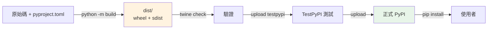

# 打包與發佈到 PyPI

> 把你的套件打包成 wheel、上傳到 PyPI，讓全世界 `pip install` 它。流程：`build` 產生發佈物 → `twine`（或 uv/poetry）上傳 → 別人安裝。理解 sdist vs wheel、語意化版本、與發佈流程。

## 💡 白話導讀（建議先讀）

你每天 `pip install` 別人的套件——這章教你站到**另一邊**:把自己的套件上架,讓全世界裝你的。

流程像出版一本書：

```text
書稿(src/mypackage/)
   ↓ build          —— 排版印刷
成書(dist/)
   ├── mypackage-0.1.0-py3-none-any.whl   ← wheel:印好的精裝書
   └── mypackage-0.1.0.tar.gz             ← sdist:原稿(對方自己印)
   ↓ twine upload(或 uv publish)          —— 送上書店
PyPI(全球書店)
   ↓ pip install mypackage                —— 讀者下單
```

兩種「成書」格式,一句話分清：

- **wheel（.whl）**——**印好的書**:預先建置,裝的人直接上架,快。主要格式。
- **sdist（.tar.gz）**——**原稿**:含原始碼,對方安裝時可能要自己「印」（建置）。當 wheel 的後備。

實際指令少得出奇：

```bash
python -m build        # 排版印刷 → dist/ 出現兩個檔案
twine upload dist/*    # 上架 PyPI(要先註冊帳號 + API token)
```

（元資料——書名、版本、作者——全來自上一章的 pyproject.toml,環環相扣。）

建議第一次先傳 **TestPyPI**（練習用書店）走完全流程,再上正式站。版本號的語意（SemVer:major.minor.patch）章內講。

## Why（為什麼）

寫了一個好用的函式庫，想分享給別人？把它**發佈到 PyPI**（Python Package Index），任何人就能 `pip install your-package`。這需要「打包（packaging）」——把原始碼變成標準的發佈格式（wheel/sdist），上傳到 PyPI。理解打包流程、發佈物格式、版本管理，是「從寫程式到分享程式」的一步。這章講清楚打包發佈的完整流程與關鍵概念。

## Theory（理論：從原始碼到可安裝套件）

打包發佈的流程——出版一本書：

```text
原始碼（src/mypackage/）
    ↓  build（用 build backend 建置——排版印刷）
發佈物（dist/）
    ├── mypackage-0.1.0-py3-none-any.whl   ← wheel（印好的精裝書）
    └── mypackage-0.1.0.tar.gz             ← sdist（原稿）
    ↓  twine upload（或 uv/poetry publish——上架）
PyPI（全球書店）
    ↓  pip install
使用者的環境
```

兩種發佈物：

- **wheel（`.whl`）**：**預先建置**的發佈格式——安裝快（不必建置），主要格式。
- **sdist（`.tar.gz`）**：**原始碼發佈**——含原始碼，安裝時可能要建置；作為 wheel 的後備。

## Specification（規範：打包發佈指令）

```bash
# --- 用 build + twine（標準工具）---
pip install build twine

python -m build                  # 建置：產生 dist/ 裡的 wheel + sdist
twine check dist/*               # 檢查發佈物
twine upload --repository testpypi dist/*   # 先上傳 TestPyPI（測試）
twine upload dist/*              # 上傳正式 PyPI

# --- 用 uv / poetry（整合工具）---
uv build                         # 建置
# poetry build && poetry publish

# 安裝（別人）
pip install mypackage
```

前提：`pyproject.toml` 要有 `[project]` 元資料 + `[build-system]`（見 [pyproject.toml](04-pyproject-toml.md)），且用 src layout（見 [專案結構](../01-getting-started/09-project-layout.md)）。

## Implementation（build、版本、TestPyPI、twine、安全）

### `build`：產生發佈物

`python -m build` 讀 `pyproject.toml`，用 build backend 建置，產生 `dist/` 裡的 wheel 與 sdist：

```bash
python -m build
# 產生：
#   dist/mypackage-0.1.0-py3-none-any.whl
#   dist/mypackage-0.1.0.tar.gz
```

`py3-none-any` 表示「純 Python、不限平台」——若有 C 擴充會產生平台特定的 wheel。建置前確保 `pyproject.toml` 完整（名稱、版本、相依、build-system）。

### 語意化版本（Semantic Versioning）

版本號用 **`主.次.修訂`（MAJOR.MINOR.PATCH）** 的語意化版本（SemVer）：

- **MAJOR**：破壞性變更（不相容的 API 改動）——`1.0.0 → 2.0.0`。
- **MINOR**：新增功能（向後相容）——`1.0.0 → 1.1.0`。
- **PATCH**：修 bug（向後相容）——`1.0.0 → 1.0.1`。

```text
0.x.y     # 開發期（API 可能大改）
1.0.0     # 第一個穩定版
1.2.3     # 主版本 1、加了 2 次功能、修了 3 次
```

遵守 SemVer 讓使用者能安全地用版本範圍（`>=1.0,<2.0` 收相容更新、避開破壞性的 2.0）。**每次發佈遞增對應的版本號**——PyPI 不允許重複上傳同版本。

### TestPyPI：先在測試環境驗證

**別直接上傳正式 PyPI**——先用 **TestPyPI**（測試用的獨立 PyPI）驗證：

```bash
twine upload --repository testpypi dist/*
# 從 TestPyPI 安裝測試
pip install --index-url https://test.pypi.org/simple/ mypackage
```

TestPyPI 讓你驗證「打包正確、安裝正常、README 顯示對」——確認無誤再上正式 PyPI。因為**PyPI 的版本無法覆蓋或刪除重傳**（上傳錯了只能發新版本），先在 TestPyPI 演練很重要。

### `twine`：安全上傳

`twine` 是上傳工具——`twine check` 先驗證發佈物、`twine upload` 上傳：

```bash
twine check dist/*               # 驗證（README 渲染、metadata）
twine upload dist/*              # 上傳（會要求 API token）
```

**認證用 API token**（不用密碼）——在 PyPI 帳號設定產生 token，設在環境變數或 `~/.pypirc`（見 [密鑰管理](../20-security-system-design/05-secrets-management.md)）。現代做法更推薦 **Trusted Publishing（OIDC）**——CI（如 GitHub Actions）直接與 PyPI 建立信任，不需長期 token（更安全）。

### 供應鏈安全

發佈到 PyPI 是**供應鏈**的一環（見 [供應鏈安全](../20-security-system-design/06-supply-chain.md)）——你的套件會被別人信任安裝。注意：

- **保護你的 PyPI 帳號**（2FA、token 最小權限）——帳號被盜可能被植入惡意版本。
- **套件名小心 typosquatting**：惡意者註冊相近名稱（`reqeusts`）騙人裝。
- **審查相依**：你的套件的相依也是使用者的相依。

### 完整發佈檢查清單

1. `pyproject.toml` 完整（名稱、版本、相依、README、license、build-system）。
2. 遞增版本號（SemVer）。
3. `python -m build` 產生 dist/。
4. `twine check dist/*` 驗證。
5. 上傳 TestPyPI 測試安裝。
6. `twine upload dist/*` 上正式 PyPI。
7. 打 git tag（`v0.1.0`）記錄版本。

## Code Example（可執行的 Python 範例）

```python
# packaging_demo.py
from __future__ import annotations


def next_version(current: str, change_type: str) -> str:
    """依 SemVer 計算下一個版本號。"""
    major, minor, patch = map(int, current.split("."))
    if change_type == "major":  # 破壞性變更
        return f"{major + 1}.0.0"
    if change_type == "minor":  # 新功能（相容）
        return f"{major}.{minor + 1}.0"
    if change_type == "patch":  # 修 bug（相容）
        return f"{major}.{minor}.{patch + 1}"
    raise ValueError(f"未知變更類型: {change_type}")


def publish_checklist() -> list[str]:
    """發佈檢查清單。"""
    return [
        "1. pyproject.toml 完整（元資料+build-system）",
        "2. 遞增版本號（SemVer）",
        "3. python -m build → 產生 dist/（wheel + sdist）",
        "4. twine check dist/*",
        "5. 上傳 TestPyPI 測試安裝",
        "6. twine upload dist/*（正式 PyPI）",
        "7. 打 git tag 記錄版本",
    ]


def demo() -> None:
    # SemVer 版本遞增
    print("語意化版本遞增：")
    v = "1.2.3"
    for change in ["patch", "minor", "major"]:
        print(f"  {v} + {change} → {next_version(v, change)}")

    print("\n發佈檢查清單：")
    for step in publish_checklist():
        print(f"  {step}")


if __name__ == "__main__":
    demo()
```

**預期輸出**：

```pycon
$ python packaging_demo.py
語意化版本遞增：
  1.2.3 + patch → 1.2.4
  1.2.3 + minor → 1.3.0
  1.2.3 + major → 2.0.0

發佈檢查清單：
  1. pyproject.toml 完整（元資料+build-system）
  ...
  7. 打 git tag 記錄版本
```

## Diagram（圖解：打包發佈流程）



## Best Practice（最佳實踐）

- **用 `python -m build` 產生 wheel + sdist**（或 `uv build`/`poetry build`）。
- **遵守語意化版本（SemVer）**：major（破壞）、minor（功能）、patch（修 bug）；每次發佈遞增。
- **先上 TestPyPI 驗證**再上正式 PyPI（PyPI 版本不可覆蓋/重傳）。
- **用 API token 或 Trusted Publishing（OIDC）認證**，別用密碼；token 最小權限（見 [密鑰管理](../20-security-system-design/05-secrets-management.md)）。
- **`twine check dist/*`** 驗證發佈物（README 渲染、metadata）。
- **打 git tag 記錄版本**（`v0.1.0`），對應發佈。
- **保護 PyPI 帳號（2FA）、注意供應鏈安全**（見 [供應鏈安全](../20-security-system-design/06-supply-chain.md)）。
- **CI 自動發佈**（打 tag 觸發，見 [CI/CD](../19-cloud-native/05-ci-cd.md)）。

## Common Mistakes（常見誤解）

- **直接上正式 PyPI 沒先測**：打包錯了無法覆蓋，只能發新版；先用 TestPyPI。
- **版本號不遞增/重複**：PyPI 拒絕重複版本；每次發佈遞增。
- **不遵守 SemVer**：破壞性變更卻只加 patch，害使用者的版本範圍出錯。
- **用密碼而非 token 認證**：不安全；用 API token 或 OIDC。
- **`pyproject.toml` 不完整就 build**：缺 build-system/元資料會失敗。
- **忽略供應鏈安全**：帳號被盜、typosquatting 風險。
- **只發 sdist 不發 wheel**：使用者安裝慢（要建置）；build 會自動產生兩者。

## Interview Notes（面試重點）

- 知道打包發佈流程：**`python -m build`（產生 wheel + sdist）→ `twine check`/`upload`（或 uv/poetry publish）→ PyPI → `pip install`**。
- **能區分 wheel（預建、安裝快、主要格式）vs sdist（原始碼、後備）**。
- 知道**語意化版本 SemVer**（major 破壞/minor 功能/patch 修 bug）與遞增規則。
- 知道**先上 TestPyPI 驗證**（PyPI 版本不可覆蓋）、**用 API token/OIDC 認證**（不用密碼）。
- 知道**供應鏈安全**（帳號保護、typosquatting）。
- 前提是 pyproject.toml 完整 + src layout（連結相關章）。

---

➡️ 下一章：[ruff 與 black](06-ruff-black.md)

[⬆️ 回 Part 13 索引](README.md)
