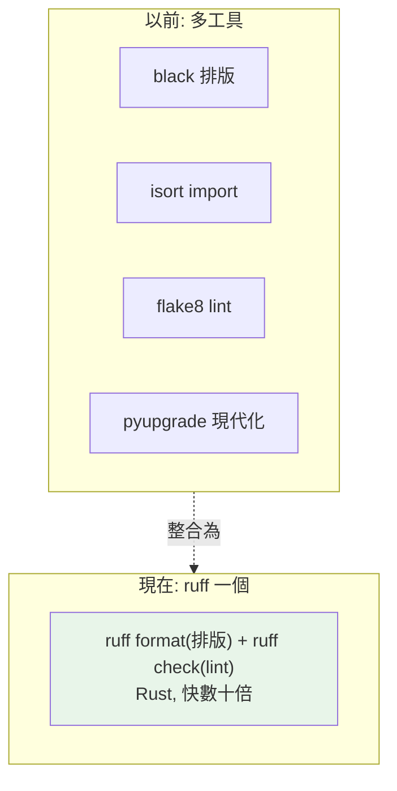

# ruff 與 black

> ruff 用 Rust 寫成，一個工具同時做 lint（抓問題）與 format（排版），速度快數十倍，正在取代 flake8 + black + isort 的組合。理解 linter 與 formatter 的分工，讓程式碼風格自動一致。

## Why（為什麼）

程式碼風格（排版、命名、import 順序）該一致，但靠人腦記與手動調很浪費生命且會爭論。工具能自動化：**formatter（格式化器）** 自動排版、**linter（檢查器）** 抓可疑寫法與潛在 bug。以前用 black（format）+ isort（排 import）+ flake8（lint）三個工具；**ruff**（Rust 寫）把這些整合成一個、快數十倍——正成為新標準。這章講清楚 linter/formatter 的分工與 ruff 的用法，讓程式風格自動一致（呼應 [PEP 8](../01-getting-started/08-pep8-and-style.md)、[編輯器設定](../01-getting-started/11-editor-and-tooling-setup.md)）。

## Theory（理論：linter vs formatter）

兩類工具，職責不同：

- **formatter（格式化器）**：只管**排版**——縮排、空格、換行、引號、行長。**不改變程式邏輯**，只改「長相」。black、`ruff format`。
- **linter（檢查器）**：抓**可疑寫法與潛在 bug**——未用變數、未用 import、可疑比較、風格問題、複雜度。**指出問題**（有些可自動修）。flake8、pylint、`ruff check`。

**分工**：formatter 統一排版（消除排版爭論）、linter 抓問題（提升品質）。兩者互補。**ruff 同時做這兩件事**（`ruff format` + `ruff check`）。

## Specification（規範：ruff 用法）

```bash
# 安裝
pip install ruff

# lint（檢查問題）
ruff check .                     # 檢查
ruff check --fix .               # 檢查並自動修可修的
ruff check --watch .             # 監看模式（改檔即檢查）

# format（排版）
ruff format .                    # 格式化
ruff format --check .            # 只檢查是否已格式化（CI 用，不改檔）
ruff format --diff .             # 顯示會改什麼

# black（若單獨用）
black .                          # 格式化
black --check .                  # 只檢查
```

在 `pyproject.toml` 設定（見 [pyproject.toml](04-pyproject-toml.md)）：

```toml
[tool.ruff]
line-length = 100
target-version = "py312"

[tool.ruff.lint]
select = ["E", "F", "I", "UP", "B", "SIM"]   # 啟用的規則類別
ignore = ["E501"]                             # 忽略特定規則
```

## Implementation（ruff format、ruff check、規則、設定、遷移）

### `ruff format`：自動排版

`ruff format`（相容 black）自動排版——你不必手動對齊、加空格、調換行：

```python
# 排版前（亂）
def  f(x,y ):
    return{'a':x,'b':y}

# ruff format 後（統一）
def f(x, y):
    return {"a": x, "b": y}
```

formatter 讓「排版」成為無意識的自動行為——寫程式時不管排版，存檔/commit 時工具統一。這消除了「該不該加空格、引號用單雙、逗號後換行」的爭論。ruff format 幾乎與 black 相容（black 是事實標準的格式化風格）。

### `ruff check`：lint 抓問題

`ruff check` 抓各種問題——涵蓋 flake8、pyflakes、isort、pyupgrade、bugbear 等數十個工具的規則：

```python
import os          # F401: 未使用的 import
import sys

def f(x):
    y = compute()  # F841: 未使用的變數 y
    if x == None:  # E711: 應用 is None
        return sys.argv
```

`ruff check` 會抓出這些，`--fix` 自動修可修的（未用 import、import 排序等）。它把「執行期才會發現的問題」（拼錯、未用）提前到 lint（見 [編輯器設定](../01-getting-started/11-editor-and-tooling-setup.md)）。

### 規則類別（select）

ruff 有數百條規則，分成類別（用 `select` 啟用）：

| 類別 | 內容 | 來源 |
|------|------|------|
| `E`/`W` | pycodestyle（PEP 8 風格） | pycodestyle |
| `F` | pyflakes（未用/未定義） | pyflakes |
| `I` | import 排序 | isort |
| `UP` | 語法現代化（用新寫法） | pyupgrade |
| `B` | 常見 bug/陷阱 | bugbear |
| `SIM` | 可簡化的寫法 | flake8-simplify |
| `N` | 命名慣例 | pep8-naming |

`select = ["E", "F", "I", "UP", "B"]` 是常見組合。本手冊的 pyproject.toml 就用類似設定。啟用越多規則抓越多，但也可能太吵——依團隊選。

### 遷移：ruff 取代多工具

ruff 一個工具取代了 black + isort + flake8 + pyupgrade + …：

```text
以前：black（format）+ isort（import）+ flake8（lint）+ pyupgrade（現代化）
現在：ruff（全部，且快數十倍）
```

遷移很簡單——ruff 相容這些工具的規則。速度優勢巨大（大型專案 lint 從幾十秒降到不到一秒），這是 ruff 快速普及的主因。**新專案直接用 ruff**；既有專案可漸進遷移。

### CI 與編輯器整合

- **CI**：`ruff check .` + `ruff format --check .`（`--check` 不改檔、只驗證），不通過就擋 PR。
- **編輯器**：裝 Ruff 擴充，存檔自動 format + fix（見 [編輯器設定](../01-getting-started/11-editor-and-tooling-setup.md)）。
- **pre-commit**：commit 前自動跑（見 [pre-commit](08-pre-commit.md)）。

三層把關：編輯器（即時）→ pre-commit（commit 前）→ CI（PR）。

## Code Example（可執行的 Python 範例）

```python
# ruff_demo.py — 這個檔案「乾淨」（通過 ruff check + format）
from __future__ import annotations


def clean_code(items: list[int]) -> dict[str, int]:
    """符合 ruff 規範的乾淨程式碼。"""
    # I: import 已排序（本檔用 __future__）
    # F: 沒有未用的 import/變數
    # E: 排版正確（空格、行長）
    # UP: 用現代語法（list[int] 而非 List[int]）
    return {
        "total": sum(items),
        "count": len(items),
        "max": max(items) if items else 0,
    }


def show_ruff_categories() -> dict[str, str]:
    """ruff 常用規則類別。"""
    return {
        "E/W": "PEP 8 風格（pycodestyle）",
        "F": "未用/未定義（pyflakes）",
        "I": "import 排序（isort）",
        "UP": "語法現代化（pyupgrade）",
        "B": "常見 bug（bugbear）",
        "SIM": "可簡化（simplify）",
    }


def demo() -> None:
    result = clean_code([3, 1, 4, 1, 5])
    print(f"處理結果: {result}")

    print("\nruff 規則類別：")
    for code, desc in show_ruff_categories().items():
        print(f"  {code}: {desc}")

    print("\n重點：")
    print("  - formatter 排版、linter 抓問題（互補）")
    print("  - ruff（Rust）一個工具做兩件事，快數十倍")
    print("  - CI: ruff check . + ruff format --check .")


if __name__ == "__main__":
    demo()
```

**預期輸出**：

```pycon
$ python ruff_demo.py
處理結果: {'total': 14, 'count': 5, 'max': 5}

ruff 規則類別：
  E/W: PEP 8 風格（pycodestyle）
  F: 未用/未定義（pyflakes）
  I: import 排序（isort）
  UP: 語法現代化（pyupgrade）
  B: 常見 bug（bugbear）
  SIM: 可簡化（simplify）

重點：
  - formatter 排版、linter 抓問題（互補）
  - ruff（Rust）一個工具做兩件事，快數十倍
  - CI: ruff check . + ruff format --check .
```

## Diagram（圖解：ruff 整合多工具）



## Best Practice（最佳實踐）

- **用 ruff**（Rust、快、整合 lint + format）取代 black + isort + flake8 的組合。
- **設定集中在 `pyproject.toml`**（`[tool.ruff]`）：line-length、target-version、select 規則、團隊/CI 一致。
- **CI 用 `ruff check .` + `ruff format --check .`**（`--check` 只驗證不改檔），擋不合規的 PR。
- **編輯器開存檔自動 format + fix**（見 [編輯器設定](../01-getting-started/11-editor-and-tooling-setup.md)），排版變無意識。
- **配 pre-commit**（見 [pre-commit](08-pre-commit.md)）：commit 前自動跑。
- **啟用合適的規則類別**（`E`/`F`/`I`/`UP`/`B` 常見）；太吵可 ignore 特定規則。
- **理解 formatter（排版）與 linter（抓問題）互補**：都要。

## Common Mistakes（常見誤解）

- **手動排版/排 import**：浪費生命；用 formatter 自動化。
- **只用 formatter 不用 linter**（或反之）：兩者互補——formatter 排版、linter 抓 bug。
- **設定散落/團隊不一致**：導致「本地過 CI 掛」；集中在 pyproject.toml。
- **CI 用 `ruff format .`（會改檔）而非 `--check`**：CI 該只驗證不改檔。
- **啟用太多規則太吵**：適度選；用 ignore 排除不適用的。
- **還在用慢的 flake8 + black + isort**：ruff 更快更整合。
- **關掉所有 lint 圖清靜**：警告是免費的 bug 預警。

## Interview Notes（面試重點）

- **能區分 formatter（排版，不改邏輯，black/ruff format）vs linter（抓問題/bug，flake8/ruff check）**，兩者互補。
- **知道 ruff（Rust 寫、快數十倍）一個工具做 lint + format**，取代 black + isort + flake8 + pyupgrade。
- 知道 ruff 規則類別（`E`/`F`/`I`/`UP`/`B`/`SIM`）、`--fix` 自動修、設定在 `pyproject.toml`。
- 知道 **CI 用 `--check`（只驗證不改檔）**、編輯器存檔自動、pre-commit 把關（三層）。
- 知道 ruff 快速普及的主因是**速度 + 整合**。

---

➡️ 下一章：[mypy 工程化](07-mypy-tooling.md)

[⬆️ 回 Part 13 索引](README.md)
