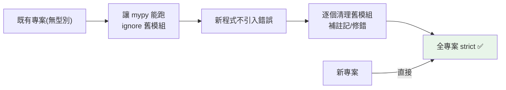

# mypy 工程化

> [Part 5](../05-typing/07-mypy.md) 講了 mypy 基礎，這章從「工程導入」角度看：如何把 mypy 導入既有專案（漸進策略）、strict 設定、處理第三方套件、與 CI 整合——讓型別檢查真正在團隊落地。

## 💡 白話導讀（建議先讀）

[Part 5](../05-typing/07-mypy.md) 教了 mypy 怎麼用。真實世界的問題是：

> 「我接手一個**十萬行、零型別註記**的老專案——mypy 一開,幾千個錯誤。然後呢?」

答案絕對不是「先補完全部型別再說」（永遠不會有那一天）,而是**漸進導入**——像老屋翻新,不是拆掉重蓋,是**一間一間房整修**：

```text
第一步:讓 mypy「能跑」 —— 設定寬鬆、舊模組先豁免(ignore)
        ↓ 此刻起:新程式碼的型別錯誤會被擋住 —— 止血!
第二步:一次收緊一個模組 —— 挑最重要/最常改的先修
        ↓ 每收緊一間,那間從此受保護
第三步:全專案 strict —— 終點,但可能走一年,沒關係
```

精髓一句話:**先止血,再清創**——別讓「舊債清不完」擋住「新債不再欠」。

（新專案沒這個問題:第一天就 `strict = true`,一步到位——本書專案就是。）

工程配套三件事,章內展開:設定寫進 [pyproject.toml](04-pyproject-toml.md)（per-module 豁免清單）、掛進 CI（紅燈擋合併）、第三方套件沒有型別怎麼辦（stub 套件與 ignore_missing_imports）。

## Why（為什麼）

[Part 5 的 mypy 章](../05-typing/07-mypy.md) 講了 mypy 是什麼、怎麼用。這章聚焦「**工程落地**」——真實專案怎麼導入 mypy？既有的大專案沒有型別註記，一開就是幾千個錯誤怎麼辦？如何設定 strict 又不被淹沒？第三方套件沒型別怎麼處理？如何與 CI 整合？這些「把型別檢查真正用起來」的實務問題，是型別註記從「寫了」到「發揮價值」的關鍵。

## Theory（理論：漸進式導入）

mypy 工程化的核心是**漸進式導入（gradual adoption）**——老屋翻新，一間一間修（呼應[漸進式型別](../05-typing/01-why-type-hints.md)）：

- **新專案**：直接 `strict = true`，從第一天就寫好型別。
- **既有專案**：不可能一次補完——**逐步收緊**：
  1. 先讓 mypy 能跑（寬鬆設定、舊模組豁免）——從此**新的型別錯誤被擋住（止血）**。
  2. 逐個模組開啟嚴格檢查（一次收緊一間房）。
  3. 最終全專案 strict。

關鍵心法：**別讓完美擋住開始**——先讓 mypy 跑起來擋新錯，再慢慢清舊債。

## Specification（規範：mypy 設定）

```toml
# pyproject.toml
[tool.mypy]
python_version = "3.12"
strict = true                        # 新專案：全嚴格

# 漸進導入：對特定模組放寬
[[tool.mypy.overrides]]
module = "legacy.*"                  # 舊模組暫時忽略
ignore_errors = true

# 第三方套件沒型別
[[tool.mypy.overrides]]
module = "some_untyped_lib.*"
ignore_missing_imports = true

# strict 展開的重要選項（可個別控制）
# disallow_untyped_defs = true       # 函式必須有型別註記
# no_implicit_optional = true        # 不自動把 =None 變 Optional
# warn_return_any = true             # 回傳 Any 警告
# warn_unused_ignores = true         # 沒用到的 ignore 提示
```

## Implementation（strict、漸進導入、第三方、CI）

### `strict = true`：一次開啟嚴格檢查

`strict` 等同開啟一組嚴格選項——**新專案直接開**，逼自己寫好型別：

```toml
[tool.mypy]
strict = true
```

strict 包含最重要的幾個：`disallow_untyped_defs`（函式必須有註記）、`no_implicit_optional`（`=None` 不自動變 Optional）、`warn_return_any`、`check_untyped_defs` 等。新專案 strict 讓型別品質從一開始就高。

### 漸進導入既有專案

大專案一開 mypy 幾千個錯誤——**別被淹沒**，用漸進策略：

```toml
# 步驟 1：先讓 mypy 能跑，忽略還沒處理的模組
[[tool.mypy.overrides]]
module = ["legacy.*", "old_module.*"]
ignore_errors = true

# 步驟 2：新模組/核心模組開嚴格
# 步驟 3：逐個把 legacy 模組移出 ignore、修好、開嚴格
# 步驟 4：最終全專案 strict
```

策略：
1. **先讓 mypy 跑起來**（忽略舊模組），確保「新程式不引入型別錯誤」。
2. **從核心/新模組開始**開啟檢查。
3. **逐個清理舊模組**（移出 ignore、補註記、修錯）。
4. **逐步縮小 ignore 範圍**，直到全專案 strict。

這讓型別檢查「立刻有價值」（擋新錯誤）而非「等全部補完才有用」。用 `# type: ignore[code]`（帶錯誤代碼 + 註明原因）暫時壓下個別錯誤，之後再修。

### 處理第三方套件

第三方套件可能沒型別資訊（沒 `py.typed` 或 stub），mypy 報 `import-untyped`：

```bash
# 方法 1：裝官方/社群 type stub
pip install types-requests types-PyYAML

# 方法 2：對該模組放行
```

```toml
[[tool.mypy.overrides]]
module = "untyped_package.*"
ignore_missing_imports = true
```

優先裝 **type stub**（`types-*` 套件，提供該套件的型別）；沒有 stub 才用 `ignore_missing_imports`。現代熱門套件多已內建型別（`py.typed` 標記）。

### 與 CI 整合

型別檢查要進 **CI** 才有約束力——沒 CI 把關，型別會逐漸腐爛：

```yaml
# CI（GitHub Actions 範例）
- name: Type check
  run: mypy .
```

CI 跑 `mypy .`，不通過就擋 PR——確保「合併的程式碼型別正確」。配 pre-commit（見 [pre-commit](08-pre-commit.md)）在 commit 前先檢查。**開 `warn_unused_ignores`** 清掉過時的 `# type: ignore`（隨程式改動，有些 ignore 不再需要）。

### mypy 的替代與補充

- **pyright**（微軟）：更快、VS Code 的 Pylance 基於它——即時檢查用它、CI 用 mypy 是常見組合。
- **執行期驗證用 pydantic**：mypy 是靜態檢查（不執行），需要執行期驗證外部資料（API 輸入）用 pydantic（見 [pydantic](../14-web/06-pydantic-validation.md)）——兩者互補（靜態 + 執行期）。

## Code Example（可執行的 Python 範例）

```python
# mypy_tooling_demo.py — mypy strict 通過的範例
from __future__ import annotations


def process_config(config: dict[str, str], key: str) -> str:
    """strict 下：函式有完整型別註記、處理 None。"""
    value = config.get(key)  # value: str | None
    if value is None:  # strict 強制處理 None
        return "default"
    return value.upper()


def migration_strategy() -> list[str]:
    """既有專案導入 mypy 的漸進策略。"""
    return [
        "1. 先讓 mypy 能跑（ignore_errors 忽略舊模組）",
        "2. 確保新程式不引入型別錯誤",
        "3. 從核心/新模組開始開嚴格檢查",
        "4. 逐個清理舊模組（補註記、修錯、移出 ignore）",
        "5. 最終全專案 strict = true",
    ]


def demo() -> None:
    config = {"env": "prod"}
    print(f"process_config('env'): {process_config(config, 'env')}")
    print(f"process_config('missing'): {process_config(config, 'missing')}")

    print("\nmypy 漸進導入策略：")
    for step in migration_strategy():
        print(f"  {step}")

    print("\n重點：")
    print("  - 新專案直接 strict=true")
    print("  - 既有專案漸進導入（別讓完美擋住開始）")
    print("  - 第三方無型別：裝 type stub 或 ignore_missing_imports")
    print("  - 進 CI + pre-commit（否則型別會腐爛）")


if __name__ == "__main__":
    demo()
```

**預期輸出**：

```pycon
$ python mypy_tooling_demo.py
process_config('env'): PROD
process_config('missing'): default

mypy 漸進導入策略：
  1. 先讓 mypy 能跑（ignore_errors 忽略舊模組）
  ...
  5. 最終全專案 strict = true

重點：
  - 新專案直接 strict=true
  ...
```

## Diagram（圖解：漸進導入）



## Best Practice（最佳實踐）

- **新專案直接 `strict = true`**；既有專案**漸進導入**（先讓 mypy 跑、擋新錯誤、逐步清理舊模組）。
- **設定集中在 `pyproject.toml`**（`[tool.mypy]`），團隊/CI 一致。
- **第三方無型別：優先裝 type stub（`types-*`）**，沒有才 `ignore_missing_imports`。
- **`# type: ignore[code]` 帶錯誤代碼 + 註明原因**；開 `warn_unused_ignores` 清過時的。
- **mypy 進 CI + pre-commit**：沒把關型別會腐爛。
- **靜態（mypy）+ 執行期（pydantic）互補**：mypy 檢查程式碼、pydantic 驗證執行期外部資料。
- **考慮 pyright 做即時檢查**（編輯器）、mypy 做 CI。

## Common Mistakes（常見誤解）

- **既有專案一次要求全 strict**：幾千個錯誤淹沒團隊、難推進；漸進導入。
- **寫了型別註記卻不跑 mypy**（無 CI）：沒約束力，型別腐爛。
- **第三方無型別就全域關檢查**：只需對該模組 `ignore_missing_imports`，別關整個專案。
- **無差別 `# type: ignore`**：壓下真正的 bug；帶錯誤代碼 + 原因。
- **以為 mypy 會執行期檢查**：它是**靜態**（不執行）；執行期驗證用 pydantic。
- **不清理過時的 ignore**：累積技術債；開 `warn_unused_ignores`。
- **strict 太痛就完全放棄**：漸進導入，別讓完美擋住開始。

## Interview Notes（面試重點）

- **能講 mypy 的工程導入**：新專案 `strict=true`；既有專案**漸進導入**（先讓 mypy 跑、擋新錯誤、逐步清理舊模組、最終全 strict）——「別讓完美擋住開始」。
- 知道 **strict 展開的重要選項**（`disallow_untyped_defs`、`no_implicit_optional` 等）。
- 知道**第三方無型別的處理**（優先 type stub `types-*`、否則 `ignore_missing_imports`）。
- 知道 **mypy 進 CI + pre-commit**（否則型別腐爛）、`# type: ignore[code]` 帶代碼、`warn_unused_ignores`。
- 知道 **mypy（靜態）+ pydantic（執行期）互補**、pyright 是即時檢查的替代。

---

➡️ 下一章：[pre-commit hooks](08-pre-commit.md)

[⬆️ 回 Part 13 索引](README.md)
