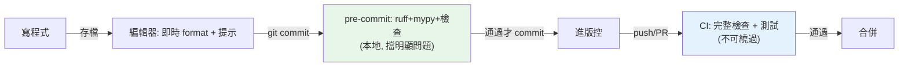

# pre-commit hooks

> pre-commit 在你 `git commit` 前自動跑 ruff、mypy、格式檢查——不合格就擋下提交。它把「品質檢查」自動化到 commit 這一刻，讓爛程式碼進不了版控，也讓 CI 少紅燈。

## Why（為什麼）

前面各章的工具（ruff、mypy、pytest）要「有人記得跑」才有用——但人會忘記，於是不合格的程式碼進了版控、CI 才紅燈、來回浪費時間。**pre-commit** 把這些檢查掛到 git 的 **commit 前**——每次 commit 自動跑 ruff/mypy/格式檢查，不通過就擋下提交。這讓「品質檢查」變成無法繞過的自動關卡，程式碼在進版控前就被把關。這是團隊協作、保持程式碼品質的關鍵工具，也是本 Part 各工具的整合點。

## Theory（理論：git hook 自動化）

**git hook** 是 git 在特定事件（commit、push…）時自動執行的腳本。**pre-commit hook** 在「建立 commit 之前」執行——若它失敗，commit 被取消。

**pre-commit（同名的框架）** 讓管理這些 hook 變簡單——用一個 YAML 檔宣告要跑哪些檢查（ruff、mypy、格式化…），它自動安裝、管理、執行這些工具。

價值：**把品質檢查自動化到 commit 這一刻**——不合格的程式碼**進不了版控**，開發者立即得到回饋（不必等 CI），且團隊每個人都自動遵守同一套標準。

## Specification（規範：pre-commit 用法）

```bash
# 安裝
pip install pre-commit

# 在專案安裝 git hook（一次性，讓 commit 時自動跑）
pre-commit install

# 手動對所有檔案跑（首次導入時）
pre-commit run --all-files

# 更新 hook 版本
pre-commit autoupdate
```

設定檔 `.pre-commit-config.yaml`：

```yaml
repos:
  # ruff：lint + format
  - repo: https://github.com/astral-sh/ruff-pre-commit
    rev: v0.6.0
    hooks:
      - id: ruff             # lint
        args: [--fix]
      - id: ruff-format      # format

  # mypy：型別檢查
  - repo: https://github.com/pre-commit/mirrors-mypy
    rev: v1.11.0
    hooks:
      - id: mypy

  # 通用檢查
  - repo: https://github.com/pre-commit/pre-commit-hooks
    rev: v4.6.0
    hooks:
      - id: trailing-whitespace     # 去尾端空白
      - id: end-of-file-fixer       # 檔尾換行
      - id: check-yaml              # YAML 語法
      - id: check-added-large-files # 擋大檔
```

## Implementation（設定、安裝、執行、與 CI 關係）

### 設定 `.pre-commit-config.yaml`

宣告要跑的 hook——每個 `repo` 提供一組 hook：

```yaml
repos:
  - repo: https://github.com/astral-sh/ruff-pre-commit
    rev: v0.6.0
    hooks:
      - id: ruff
        args: [--fix]        # 自動修可修的
      - id: ruff-format
```

pre-commit 從這些 repo 下載 hook、在隔離環境安裝、執行。`rev` 釘住版本（可重現）。常見 hook：ruff（lint + format）、mypy（型別）、通用檢查（尾端空白、大檔、YAML 語法、密鑰偵測）。

### 安裝與執行

```bash
# 一次性：安裝 git hook
pre-commit install

# 之後每次 git commit 自動跑（改動的檔案）
git commit -m "訊息"
# → 自動跑 ruff/mypy/... → 不通過就擋下 commit
```

`pre-commit install` 後，**每次 `git commit` 都自動跑檢查**（只對這次改動的檔案，快）。若檢查失敗（或自動修改了檔案），commit 被取消——你修好（或 stage 自動修改的檔案）再 commit。首次導入用 `pre-commit run --all-files` 對整個專案跑一遍。

### 自動修 vs 只檢查

有些 hook 會**自動修改**檔案（ruff `--fix`、ruff-format、尾端空白）——修改後 commit 被取消，你要 `git add` 修改的檔案再 commit：

```bash
git commit -m "..."
# ruff-format 修改了檔案 → commit 取消
git add -u              # stage 自動修改的
git commit -m "..."     # 這次通過
```

有些 hook 只**檢查不修**（mypy、大檔檢查）——失敗就要你手動修。

### pre-commit 與 CI 的關係

pre-commit 和 CI **互補、不重複**：

| | pre-commit | CI |
|--|-----------|-----|
| 時機 | commit 前（本地） | push/PR 後（伺服器） |
| 速度 | 快（只查改動檔） | 完整（全專案 + 測試） |
| 可繞過 | 可（`--no-verify`） | 不可（強制） |
| 作用 | 早期回饋、擋明顯問題 | 最終把關（含測試） |

**pre-commit 是第一道防線**（本地即時、擋明顯問題），**CI 是最終防線**（不可繞過、跑完整測試）。三層把關：**編輯器（即時）→ pre-commit（commit 前）→ CI（PR）**（見 [編輯器設定](../01-getting-started/11-editor-and-tooling-setup.md)、[CI/CD](../19-cloud-native/05-ci-cd.md)）。**CI 也該跑 pre-commit**（`pre-commit run --all-files`）以防有人 `--no-verify` 繞過。

### 整合本 Part 的工具

pre-commit 是本 Part 各工具的整合點：

- **ruff**（見 [ruff/black](06-ruff-black.md)）：lint + format。
- **mypy**（見 [mypy 工程化](07-mypy-tooling.md)）：型別檢查。
- **通用檢查**：尾端空白、大檔、密鑰偵測（防意外 commit 密鑰，見 [密鑰管理](../20-security-system-design/05-secrets-management.md)）。

一個 pre-commit 設定把這些自動化——commit 前全部跑一遍。

## Code Example（可執行的 Python 範例）

```python
# pre_commit_demo.py
from __future__ import annotations


def sample_config() -> str:
    """範例 .pre-commit-config.yaml。"""
    return """repos:
  - repo: https://github.com/astral-sh/ruff-pre-commit
    rev: v0.6.0
    hooks:
      - id: ruff
        args: [--fix]
      - id: ruff-format
  - repo: https://github.com/pre-commit/mirrors-mypy
    rev: v1.11.0
    hooks:
      - id: mypy
  - repo: https://github.com/pre-commit/pre-commit-hooks
    rev: v4.6.0
    hooks:
      - id: trailing-whitespace
      - id: check-added-large-files
"""


def quality_gates() -> dict[str, str]:
    """三層品質把關。"""
    return {
        "編輯器（即時）": "存檔自動 format + 型別提示",
        "pre-commit（commit 前）": "ruff + mypy + 通用檢查（本地、可繞過）",
        "CI（push/PR）": "完整檢查 + 測試（伺服器、不可繞過）",
    }


def demo() -> None:
    print("三層品質把關：")
    for gate, desc in quality_gates().items():
        print(f"  {gate}: {desc}")

    print("\n.pre-commit-config.yaml 範例：")
    print(sample_config())

    print("設定流程：")
    print("  $ pip install pre-commit")
    print("  $ pre-commit install         # 安裝 git hook")
    print("  $ pre-commit run --all-files # 首次對全專案跑")
    print("  之後每次 git commit 自動跑")


if __name__ == "__main__":
    demo()
```

**預期輸出**：

```pycon
$ python pre_commit_demo.py
三層品質把關：
  編輯器（即時）: 存檔自動 format + 型別提示
  pre-commit（commit 前）: ruff + mypy + 通用檢查（本地、可繞過）
  CI（push/PR）: 完整檢查 + 測試（伺服器、不可繞過）

.pre-commit-config.yaml 範例：
repos:
  - repo: https://github.com/astral-sh/ruff-pre-commit
  ...

設定流程：
  $ pip install pre-commit
  ...
```

## Diagram（圖解：三層品質把關）



## Best Practice（最佳實踐）

- **用 pre-commit 把品質檢查自動化到 commit 前**：ruff（lint + format）、mypy、通用檢查——擋不合格的程式進版控。
- **`pre-commit install` 一次、之後自動跑**；首次導入用 `pre-commit run --all-files`。
- **`rev` 釘住 hook 版本**（可重現）；`pre-commit autoupdate` 定期更新。
- **CI 也跑 `pre-commit run --all-files`**：防有人 `--no-verify` 繞過本地 hook。
- **pre-commit（本地、快、第一道）+ CI（伺服器、完整、最終）互補**，別重複造輪子。
- **加密鑰偵測 hook**（`detect-secrets` 等）防意外 commit 密鑰（見 [密鑰管理](../20-security-system-design/05-secrets-management.md)）。
- **hook 保持快**：pre-commit 只查改動檔（慢的檢查如完整測試放 CI）。

## Common Mistakes（常見誤解）

- **靠人記得跑 ruff/mypy**：會忘記，不合格程式進版控；用 pre-commit 自動化。
- **忘了 `pre-commit install`**：設定了但沒安裝 hook，commit 時不會跑。
- **pre-commit 跑太慢的檢查**（完整測試）：拖慢每次 commit；慢的放 CI。
- **只有 pre-commit 沒有 CI**：pre-commit 可 `--no-verify` 繞過；CI 是不可繞過的最終防線。
- **CI 不跑 pre-commit**：有人繞過本地 hook，CI 該補跑 `--all-files`。
- **`rev` 不釘版本**：hook 版本飄，行為不一致。
- **自動修改後忘了 re-add**：ruff-format 改了檔，要 `git add` 再 commit。

## Interview Notes（面試重點）

- 知道 **pre-commit 在 `git commit` 前自動跑檢查（ruff/mypy/通用），不通過就擋下提交**——把品質檢查自動化到 commit 這一刻，擋不合格程式進版控。
- 知道**設定 `.pre-commit-config.yaml`（宣告 hook）+ `pre-commit install`（安裝 git hook）**，之後自動跑（只查改動檔）。
- **能講 pre-commit 與 CI 的互補**：pre-commit（本地、快、第一道、可繞過）+ CI（伺服器、完整、最終、不可繞過），**CI 也該跑 pre-commit 防繞過**。
- 知道**三層品質把關**：編輯器（即時）→ pre-commit（commit 前）→ CI（PR）。
- 知道它是本 Part 工具（ruff/mypy）的整合點、可加密鑰偵測。

---

➡️ 下一章：[CLI 應用開發 (argparse / click / typer)](09-cli-apps.md)

[⬆️ 回 Part 13 索引](README.md)
