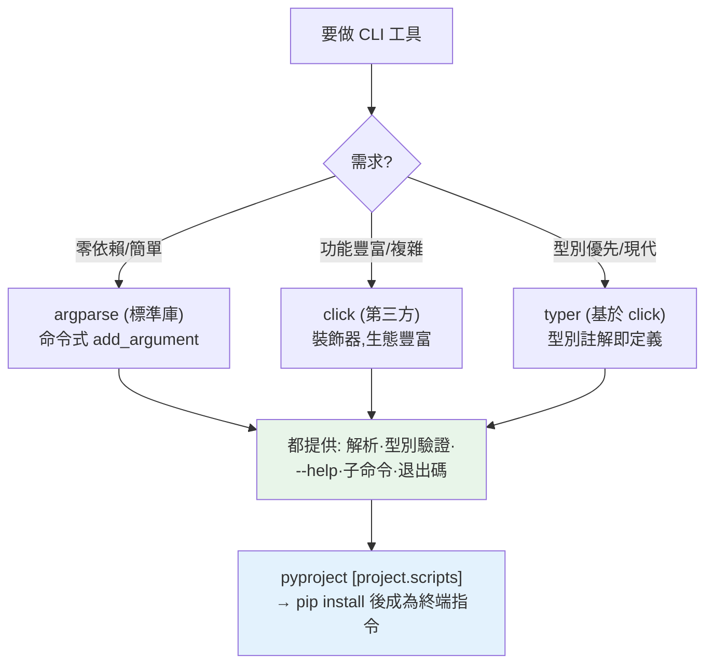

# CLI 應用開發 (argparse / click / typer)

> Python 不只寫服務與腳本，也是打造**命令列工具（CLI）** 的利器——`pip`、`ruff`、`black`、`uv` 全是 Python CLI。要做出專業的 CLI（子命令、選項、`--help`、錯誤處理），你需要對的工具。這章講三個層級：標準庫的 `argparse`、現代的 `click` 與 `typer`。

## 💡 白話導讀（建議先讀）

你天天在用的 pip、ruff、uv 的介面——這章教你打造同款:**專業的命令列工具（CLI）**。

先拆解「專業 CLI」的標配零件（拿 git 對照秒懂）：

```text
git  commit  -m "fix"  --verbose
 │      │        │          │
工具  子命令   帶值選項    布林旗標
```

- **位置參數**:必要的輸入(`greet Alice` 的 Alice)
- **選項/旗標**:`--count 3`(帶值)、`-v`(開關)
- **子命令**:一個工具多個動作(git commit / git push)——各自有自己的參數
- **`--help`**:自動生成的說明書
- **退出碼**:0=成功、非 0=失敗——**shell 和 CI 靠這個判斷**,別忘了它

工具三選,一句話定位：

| 工具 | 風格 | 何時選 |
|------|------|--------|
| **argparse** | 標準庫,命令式(add_argument) | 簡單工具、不想加依賴([Part 11 學過](../11-stdlib/10-argparse.md)) |
| **click** | 第三方,裝飾器宣告式 | **複雜 CLI 的主流**:子命令、顏色、進度條生態全 |
| **typer** | 第三方,型別註記即介面 | click 的現代皮:參數的型別註記自動變成 CLI 定義——寫起來最像普通函式 |

選型口訣:**零依賴用 argparse,要漂亮用 click,愛型別用 typer**(typer 底層就是 click)。
這章各寫一個同款工具對比,再補專業級細節:進入點設定(pyproject 的 `[project.scripts]`,讓 `pip install` 後直接有指令可打)、錯誤輸出到 stderr、退出碼紀律。

## Why（為什麼）

很多 Python 程式的介面是**命令列**——資料處理腳本、部署工具、開發輔助、自動化任務。你每天用的工具（`pip install`、`ruff check`、`git commit`）都是 CLI。一個好的 CLI 讓工具**好用、可組合、可自動化**（能寫進 shell script、CI pipeline）。

新手常直接讀 `sys.argv` 手動解析參數：

```python
import sys
name = sys.argv[1]              # 🔴 沒有驗證、沒有 --help、沒有錯誤訊息
count = int(sys.argv[2])       # 位置錯了、少給參數就崩潰
```

這很脆弱——沒有 `--help`、參數順序/型別錯了就丟出醜陋的 traceback、無法做子命令、無法有選填/旗標。**專業的 CLI 需要一個參數解析框架**來處理：解析位置參數與選項、型別轉換與驗證、自動產生 `--help`、子命令（如 `git commit` / `git push`）、清楚的錯誤訊息。

Python 有三個層級的選擇：**`argparse`**（標準庫、無需安裝、功能完整）、**`click`**（第三方、用裝飾器、更符合直覺、生態豐富）、**`typer`**（基於 click、用**型別註解**定義、最現代、與 [FastAPI](../14-web/04-fastapi-basics.md) 同作者同風格）。這章講清楚三者的定位與用法，讓你能做出專業的 CLI 工具。它與[打包發佈](05-packaging.md)（把 CLI 裝成可執行指令）相關。

## Theory（理論：CLI 的組成與三個工具）

**一個 CLI 的標準零件**（拿 git 對照）：

- **位置參數（positional）**：必要、依順序（`greet Alice` 的 `Alice`）。
- **選項 / 旗標（option / flag）**：`--count 3`（帶值）、`--verbose`（布林）。通常選填、有預設值。
- **子命令（subcommand）**：一個工具多個動作（`git commit`、`git push`）——各有自己的參數。
- **`--help`**：自動產生的說明書。
- **退出碼（exit code）**：成功 0、失敗非 0——shell/CI 靠它判斷（見 [os/sys](../11-stdlib/01-os-sys.md)）。

**三個工具的定位**：

- **`argparse`（標準庫）**：零依賴、功能完整、命令式風格（`add_argument`）——簡單工具、不想加依賴時首選。
- **`click`（第三方）**：裝飾器宣告式、樣板少、說明與錯誤處理漂亮、生態豐富（顏色、進度條、prompt）——**複雜 CLI 的主流**。
- **`typer`（第三方）**：建於 click 之上——**型別註記即介面**：函式參數的型別註記自動成為 CLI 定義，寫起來最像普通函式。

## Specification（規範：三種寫法）

**`argparse`（標準庫）**：

```python
import argparse
parser = argparse.ArgumentParser(description="打招呼工具")
parser.add_argument("name", help="對象")               # 位置參數
parser.add_argument("-c", "--count", type=int, default=1)  # 選項（帶型別）
parser.add_argument("--upper", action="store_true")    # 布林旗標
args = parser.parse_args()                              # 解析 sys.argv
print(("HELLO" if args.upper else "Hello"), args.name)
```

**`click`（裝飾器）**：

```python
import click

@click.command()
@click.argument("name")
@click.option("--count", default=1, help="重複次數")
@click.option("--upper", is_flag=True)
def greet(name, count, upper):
    msg = f"Hello, {name}!"
    click.echo((msg.upper() if upper else msg) * count)
```

**`typer`（型別註解）**：

```python
import typer

def greet(name: str, count: int = 1, upper: bool = False):
    msg = f"Hello, {name}!"
    typer.echo((msg.upper() if upper else msg) * count)

typer.run(greet)   # 型別註解自動變成參數定義 + 驗證 + 說明
```

三者都自動產生 `--help`、做型別驗證、給清楚錯誤。**子命令**：argparse 用 `add_subparsers`、click 用 `@click.group()`、typer 用 `typer.Typer()` app。

**打包成指令**（見 [打包](05-packaging.md)）：在 `pyproject.toml` 設 `[project.scripts]`，`pip install` 後就能直接在終端輸入 `greet Alice`：

```toml
[project.scripts]
greet = "mypackage.cli:main"
```

## Implementation（底層：解析、驗證、子命令分派）

**參數解析框架幫你做什麼**：手動讀 `sys.argv` 你要自己處理——判斷哪個是位置參數、哪個是選項、`--count 3` 的值、`--count=3` 的等號形式、`-c 3` 的短選項、`-cv` 的旗標合併、型別轉換（字串 `"3"` → int 3）、必填檢查、預設值、產生 `--help`……這些**又多又容易出錯**。框架把這些通通處理好：你**宣告**「有哪些參數、什麼型別、選填還必填」，框架負責解析、轉型、驗證、產生說明。argparse/click/typer 的差別只是**宣告的風格**（命令式 add_argument / 裝飾器 / 型別註解），底層做的事一樣。

**型別驗證與錯誤處理**：宣告 `--count` 是 `int`，框架收到 `--count abc` 就**自動報清楚的錯誤**（`invalid int value: 'abc'`）並以非 0 退出碼結束——而非丟出裸 `ValueError` traceback。這對 CLI 很重要：使用者輸入錯時要得到**友善、可理解**的訊息（而非嚇人的堆疊），且**退出碼**要正確（讓呼叫它的 shell script/CI 能判斷成敗）。typer 更進一步——直接用 Python 型別註解當驗證來源，型別即契約（同 [pydantic](../14-web/06-pydantic-validation.md)、FastAPI 的哲學）。

**子命令如何運作**：`git commit`、`git push` 這種「一個工具多個動作」用子命令。框架把第一個非選項參數當**子命令名**，分派到對應的子 parser/函式，各自解析自己的參數。這讓一個 CLI 能組織成多個相關動作，各有各的參數與說明。下面用標準庫 `argparse` 實作一個帶子命令的 CLI，並示範以程式方式解析（可測試）——這是驗證 CLI 邏輯的好方法。

## Code Example（可執行的 Python 範例）

```python
# cli_demo.py — argparse 子命令 CLI（純標準庫；可程式化解析以便測試）
from __future__ import annotations

import argparse


def build_parser() -> argparse.ArgumentParser:
    parser = argparse.ArgumentParser(prog="greet", description="打招呼 CLI 工具")
    sub = parser.add_subparsers(dest="command", required=True)

    # 子命令 hello：帶選項與旗標
    hello = sub.add_parser("hello", help="打招呼")
    hello.add_argument("name", help="對象")
    hello.add_argument("-c", "--count", type=int, default=1, help="重複次數")
    hello.add_argument("--upper", action="store_true", help="轉大寫")

    # 子命令 bye
    bye = sub.add_parser("bye", help="說再見")
    bye.add_argument("name")

    return parser


def run(argv: list[str]) -> str:
    """以程式方式解析 argv 並執行（回傳輸出字串，方便測試）。"""
    args = build_parser().parse_args(argv)
    if args.command == "bye":
        return f"Bye, {args.name}!"
    greeting = f"Hello, {args.name}!"
    if args.upper:
        greeting = greeting.upper()
    return "\n".join([greeting] * args.count)


def main() -> None:
    # 一般會用 build_parser().parse_args()（讀 sys.argv）
    # 這裡示範幾種呼叫（模擬使用者在終端輸入）
    print("$ greet hello Alice")
    print(run(["hello", "Alice"]))
    print("\n$ greet hello Bob -c 2 --upper")
    print(run(["hello", "Bob", "-c", "2", "--upper"]))
    print("\n$ greet bye Carol")
    print(run(["bye", "Carol"]))


if __name__ == "__main__":
    main()
```

**預期輸出**：

```pycon
$ python cli_demo.py
$ greet hello Alice
Hello, Alice!

$ greet hello Bob -c 2 --upper
HELLO, BOB!
HELLO, BOB!

$ greet bye Carol
Bye, Carol!
```

逐段解說：

- **`build_parser`**：宣告 CLI 結構——兩個子命令 `hello`（帶位置參數 `name`、選項 `--count`、旗標 `--upper`）與 `bye`。argparse 自動處理解析、型別轉換、`--help`。
- **子命令分派**：`greet hello Alice` 走 hello 分支、`greet bye Carol` 走 bye 分支——一個工具、多個動作，各有自己的參數。這就是 `git commit`/`git push` 的模式。
- **選項與旗標**：`-c 2` 讓招呼重複 2 次、`--upper` 轉大寫——選填、有預設值、型別驗證（`-c` 會轉成 int）。
- **`run(argv)` 可測試**：把解析邏輯包成接受 `argv` 列表的函式——可以在測試裡直接呼叫 `run(["hello", "Alice"])` 驗證，不必真的從終端執行。這是測試 CLI 的好方法。
- **型別驗證**：若使用者輸入 `-c abc`，argparse 自動報 `invalid int value: 'abc'` 並以非 0 退出——友善錯誤、正確退出碼。
- **要點**：用參數解析框架（argparse/click/typer）而非手讀 `sys.argv`——獲得子命令、選項、型別驗證、`--help`、清楚錯誤。argparse 零依賴、click/typer 更現代好用。

## Diagram（圖解：三個工具的取捨）



## Best Practice（最佳實踐）

- **用參數解析框架而非手讀 `sys.argv`**：獲得驗證、`--help`、子命令、清楚錯誤。
- **選對工具**：零依賴/簡單用 `argparse`；複雜/豐富用 `click`；型別優先/現代用 `typer`。
- **把解析與邏輯分離**：解析後呼叫可測試的函式（別把邏輯塞進解析回呼），如範例的 `run(argv)`。
- **正確使用退出碼**：成功 0、失敗非 0（讓 shell/CI 判斷，見 [os/sys](../11-stdlib/01-os-sys.md)）。
- **提供清楚的 `--help` 與錯誤訊息**：CLI 的使用者體驗很大部分是這些。
- **用子命令組織多動作工具**（`tool do-x` / `tool do-y`）。
- **打包成指令**（`[project.scripts]`）：`pip install` 後直接可用（見 [打包](05-packaging.md)）。
- **輸出對管線友善**：正常輸出到 stdout、錯誤到 stderr，方便組合（`|`、重導）。

## Common Mistakes（常見誤解）

- **手動讀 `sys.argv` 解析**：沒有驗證/說明/子命令，順序或型別錯就崩潰。
- **把業務邏輯塞進解析層**：難測試；解析後呼叫獨立函式。
- **不設退出碼（或永遠回 0）**：呼叫它的 script/CI 無法判斷成敗。
- **錯誤直接丟裸 traceback**：使用者看不懂；框架能給友善訊息。
- **正常輸出與錯誤都印 stdout**：破壞管線組合；錯誤該進 stderr。
- **為了型別/驗證重造輪子**：typer 用型別註解就有了。
- **複雜 CLI 硬用 argparse 寫得又臭又長**：click/typer 更簡潔。
- **不提供 `--help` / 說明不清**：使用者不會用。

## Interview Notes（面試重點）

- **能說明為何用參數解析框架而非手讀 `sys.argv`**：驗證、型別轉換、`--help`、子命令、清楚錯誤、退出碼。
- **能對比 argparse / click / typer**：標準庫命令式 vs 裝飾器 vs 型別註解，及各自定位（零依賴 / 豐富 / 現代）。
- **知道 CLI 的組成**：位置參數、選項/旗標、子命令、`--help`、退出碼。
- **知道解析與邏輯分離** 以利測試（`run(argv)`）。
- **知道退出碼與 stdout/stderr 分流** 對 shell/CI/管線的重要。
- **知道用 `[project.scripts]` 打包成終端指令**（見 [打包](05-packaging.md)）。

---

🎉 **恭喜完成 Part 13！** 你已掌握 Python 的工程化與打包：pip 進階、虛擬環境、uv/poetry、pyproject.toml、打包發佈、ruff、mypy、pre-commit，以及 CLI 應用開發。這是「把 Python 專案做得專業」的工具鏈。
接下來 [Part 14 Web 開發](../14-web/README.md) 將進入 WSGI/ASGI、FastAPI、REST API 與認證。

[⬆️ 回 Part 13 索引](README.md)
