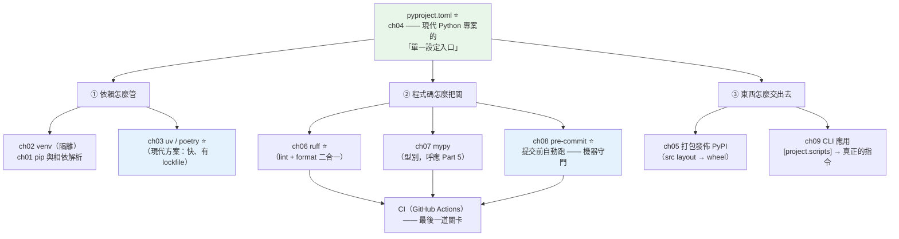

# Part 13 統整：工程化與打包全貌

> 把這 9 章串成一張圖——核心是一句話：**讓機器幫你守門，不要靠人記得。**

## 🗺️ 知識地圖（這 9 章怎麼串起來）

Part 13 把散落的工具收攏成一條線。而它們的**中心，是一個檔案**：



**一句話串起來**：

現代 Python 專案的一切，都收斂到 **[`pyproject.toml`](04-pyproject-toml.md)**（ch04）——
**專案的身分（名稱、版本）、依賴、建置方式、工具設定（ruff/mypy/pytest）全在這一個檔案裡**。
（以前這些散在 `setup.py`、`setup.cfg`、`requirements.txt`、`.flake8`、`mypy.ini`……）

從這個中心，長出三條線：

- **依賴怎麼管** → [venv](02-venv-and-envs.md) 隔離（ch02）、
  [pip](01-pip-deep.md) 解析（ch01）、
  現代方案 **[uv](03-uv-poetry.md)**（ch03，快得誇張，且有 **lockfile** 保證可重現）。
- **程式碼怎麼把關** → **[ruff](06-ruff-black.md)**（ch06，lint + format 二合一，取代 flake8+black+isort）、
  **[mypy](07-mypy-tooling.md)**（ch07，呼應 [Part 5](../05-typing/README.md)）、
  再用 **[pre-commit](08-pre-commit.md)**（ch08）**在你 commit 之前自動跑一遍**。
- **東西怎麼交出去** → [打包上 PyPI](05-packaging.md)（ch05）、
  或用 `[project.scripts]` 讓套件變成**真正的命令列指令**（ch09）。

## ⚡ 速查表（什麼情境用什麼）

| 情境 | 怎麼做 | 章節 |
|------|--------|------|
| **開新專案的第一件事** | 建 venv：`python -m venv .venv` 並啟用 | [ch02](02-venv-and-envs.md) |
| 專案的設定要放哪 | **全部放 `pyproject.toml`**（依賴、工具設定、建置） | [ch04](04-pyproject-toml.md) |
| **裝套件很慢／想要 lockfile** | **`uv`**（Rust 寫的，比 pip 快 10~100 倍；`uv lock` 鎖版本） | [ch03](03-uv-poetry.md) |
| 讓依賴**可重現**（今天裝的和明天一樣） | **lockfile**（`uv.lock` / `poetry.lock`）——釘死版本與雜湊 | [ch03](03-uv-poetry.md) |
| 開發時安裝自己的套件 | **`pip install -e .`**（可編輯安裝：改程式碼立刻生效） | [ch05](05-packaging.md) |
| **格式化 + lint** | **`ruff format` + `ruff check --fix`**（一個工具取代 black/isort/flake8） | [ch06](06-ruff-black.md) |
| 型別檢查 | `mypy .`；舊專案**漸進採用**（先寬鬆、逐模組收緊） | [ch07](07-mypy-tooling.md) |
| **不想每次都忘記跑檢查** | **`pre-commit`**——commit 前自動跑 ruff/mypy，沒過就擋下 | [ch08](08-pre-commit.md) |
| 專案結構 | **src layout**（`src/pkg/`）——逼你以「安裝後的樣子」測試 | [ch05](05-packaging.md) |
| 讓套件變成終端機指令 | **`[project.scripts]`**：`greeter = "greeter.cli:main"` | [ch09](09-cli-apps.md) |
| 寫 CLI | 簡單用 **argparse**（標準庫）；複雜／要子命令用 **typer/click** | [ch09](09-cli-apps.md) |
| 發佈到 PyPI | `python -m build` → `twine upload`（先上 TestPyPI 練習） | [ch05](05-packaging.md) |
| 相依衝突（A 要 X<2，B 要 X>=2） | 看 pip 的解析錯誤；用 lockfile 固定；必要時放寬版本範圍 | [ch01](01-pip-deep.md) |

## 🔑 核心心智模型（帶得走的幾句話）

- **`pyproject.toml` 是唯一的設定入口。** 看到專案裡還有 `setup.py`、`requirements.txt`、
  `.flake8`、`mypy.ini` 散落各處——那是**舊時代的遺跡**，能收攏就收攏。
- **讓機器守門，不要靠人記得。** 「記得跑 format」「記得跑測試」——**人一定會忘**。
  正解是 **pre-commit（本機守門）+ CI（遠端守門）**：
  沒過就**commit 不了 / merge 不了**。
- **ruff 一個打三個。** 它同時是 **linter + formatter + import 排序器**
  （取代 flake8 + black + isort），而且**快到你感覺不到它在跑**。
- **lockfile 才能「可重現」。** `requirements.txt` 寫 `requests` 是浮動的——
  今天裝 2.31、明天可能裝到含漏洞的新版。
  **lockfile 釘死精確版本＋雜湊**（也是[供應鏈安全](../20-security-system-design/06-supply-chain.md)的基礎）。
- **src layout 是為了「逼你正確測試」。** 程式碼放在 `src/` 下，
  測試時**只能 import 到「已安裝」的套件**——避免「在專案根目錄剛好能跑、
  裝起來就壞掉」的經典坑。
- **`pip install -e .` 是開發模式。** 它把套件「連結」到你的原始碼——
  改程式碼**立刻生效**，不必每次重裝。

## 🛠️ 小實作：從零做出一個「可安裝、可執行」的套件

一份 `pyproject.toml`，就能讓你的程式碼變成**真正的命令列工具**。

**專案結構（src layout）**：

```text
greeter/
├── pyproject.toml
└── src/
    └── greeter/
        ├── __init__.py
        └── cli.py
```

**`pyproject.toml`——一個檔案，管完全部**：

```toml
[build-system]
requires = ["hatchling"]
build-backend = "hatchling.build"

[project]
name = "greeter"
version = "0.1.0"
description = "Part 13 統整小實作"
requires-python = ">=3.12"

# ch09：這一行讓套件變成「真正的指令」
[project.scripts]
greeter = "greeter.cli:main"

# ch06：工具設定也在同一個檔案（不必再有 .flake8 / setup.cfg）
[tool.ruff]
line-length = 100

[tool.ruff.lint]
select = ["E", "F", "I", "UP"]

# ch07
[tool.mypy]
strict = true
```

**`src/greeter/cli.py`**：

```python
"""ch09 CLI：用 argparse 收參數，透過 [project.scripts] 變成真正的指令。"""

from __future__ import annotations

import argparse


def greet(name: str, times: int = 1) -> str:
    """產生問候語。"""
    return "\n".join(f"你好, {name}!" for _ in range(times))


def main() -> None:
    parser = argparse.ArgumentParser(prog="greeter", description="打招呼")
    parser.add_argument("name", help="要問候的對象")
    parser.add_argument("-n", "--times", type=int, default=1, help="重複次數")
    args = parser.parse_args()
    print(greet(args.name, args.times))
```

**跑一遍完整流程**：

```bash
# ch06 / ch07：機器把關
$ ruff check src/
All checks passed!

$ mypy src/
Success: no issues found in 2 source files

# ch05：可編輯安裝（改程式碼立刻生效）
$ pip install -e .

# ch09：你的套件，現在是一個「真正的指令」了
$ greeter 世界 -n 2
你好, 世界!
你好, 世界!
```

**這個小專案示範了 Part 13 的整條線**：

- **一個 `pyproject.toml`** 同時定義了：專案身分、Python 版本需求、
  **指令進入點**、**ruff 設定**、**mypy 設定**——
  以前這需要 `setup.py` + `setup.cfg` + `.flake8` + `mypy.ini` 四個檔案。

- **`[project.scripts]` 那一行**（`greeter = "greeter.cli:main"`）是魔法所在：
  安裝後，`greeter` 就成了**系統的一個指令**——
  這正是 `pip`、`ruff`、`pytest` 這些工具的做法。

- **src layout** 讓 `pip install -e .` 之後，
  你 import 到的是**「安裝後的套件」**，而不是「剛好在旁邊的資料夾」。

再配上 **pre-commit**（ch08），把 `ruff` 和 `mypy` 掛成提交前的鉤子——
**你就再也不會「忘記跑檢查」了**。

## ✅ 自測清單（答不出來就回去讀）

- [ ] `pyproject.toml` 取代了哪些舊檔案？它放了哪幾類東西？（[ch04](04-pyproject-toml.md)）
- [ ] venv 到底隔離了什麼？（[ch02](02-venv-and-envs.md)）
- [ ] `uv` 比 `pip` 好在哪？lockfile 解決什麼問題？（[ch03](03-uv-poetry.md)）
- [ ] `pip install -e .` 的 `-e` 是什麼意思？（[ch05](05-packaging.md)）
- [ ] 為什麼推薦 src layout？它防止了什麼？（[ch05](05-packaging.md)）
- [ ] ruff 取代了哪三個工具？（[ch06](06-ruff-black.md)）
- [ ] pre-commit 解決什麼問題？和 CI 是什麼關係？（[ch08](08-pre-commit.md)）
- [ ] 怎麼讓你的套件變成一個終端機指令？（[ch09](09-cli-apps.md)）
- [ ] 舊專案要導入 mypy，怎麼漸進進行？（[ch07](07-mypy-tooling.md)）
- [ ] 相依衝突（dependency conflict）怎麼發生的？怎麼處理？（[ch01](01-pip-deep.md)）

## 🎯 面試速查

| 考點 | 面試官想聽到什麼 | 章節 |
|------|------------------|------|
| **`pyproject.toml` 是什麼？** | 「現代 Python 專案的**單一設定入口**（PEP 518/621）——專案 metadata、依賴、建置後端、**以及各工具的設定**（ruff、mypy、pytest）全在裡面。取代了過去散落的 `setup.py`、`setup.cfg`、`requirements.txt`、`.flake8`。」 | [ch04](04-pyproject-toml.md) |
| **lockfile 為什麼重要？** | 「保證**可重現的建置**。`requirements.txt` 寫 `requests` 是浮動的——今天裝 2.31、明天可能裝到不同版本，甚至含漏洞或被下毒的版本。lockfile **釘死精確版本 + 雜湊**，安裝時驗證，是[供應鏈安全](../20-security-system-design/06-supply-chain.md)的基礎。」 | [ch03](03-uv-poetry.md) |
| **pre-commit 和 CI 的關係？** | 「**兩道防線**。pre-commit 在**本機、commit 前**跑（快速回饋，避免把爛程式碼推上去）；CI 在**遠端、PR 時**跑（**最終把關**，因為本機的 hook 可以被 `--no-verify` 跳過）。**兩者都要有。**」 | [ch08](08-pre-commit.md) |
| **ruff 為什麼取代 flake8 + black？** | 「**快**（Rust 寫的，比 flake8 快 10~100 倍）、**一個工具做完 lint + format + import 排序**（少裝三個套件、少三份設定）、且相容既有規則。現在是社群主流。」 | [ch06](06-ruff-black.md) |
| **src layout 的好處？** | 「**逼你以「安裝後的樣子」測試**。程式碼在 `src/` 下，就不會因為『剛好在專案根目錄執行』而 import 成功——避免『本機能跑、裝起來就壞』的經典問題（例如漏了把某個模組加進打包清單）。」 | [ch05](05-packaging.md) |

---

🎉 **恭喜完成 Part 13！** 到這裡，**Python 工程師的基本功已經完整**——
你會寫、會測、會把關、會交付。

接下來 [Part 14 Web 開發](../14-web/README.md) 開始**做真東西**：
用 FastAPI 蓋一個 API 服務。你會遇到本書的貫穿專案 **task-api**——
而 Part 5 的型別註記，在那裡會突然變成**執行期的資料驗證**（pydantic），
[Part 9 的 async](../09-concurrency/README.md) 也會派上真正的用場。

➡️ 下一 Part：[Web 開發 Web Development](../14-web/README.md)

[⬆️ 回 Part 13 索引](README.md)
