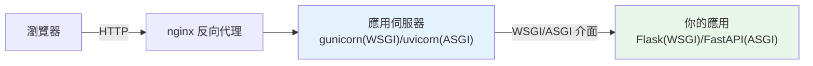

# WSGI 與 ASGI

> WSGI/ASGI 是「Web 伺服器」與「Python 應用」之間的標準介面——WSGI 是同步時代的標準（Flask/Django），ASGI 是非同步時代的標準（FastAPI）。理解它們，才懂 Python Web 框架的底層架構。

## 💡 白話導讀（建議先讀）

一個 Web 請求從瀏覽器到你的 Python 程式，中間隔著幾層。先畫清楚：

```text
瀏覽器 → nginx(門口接待) → gunicorn/uvicorn(應用伺服器) → 你的 Flask/FastAPI
                                        ↑ 這中間的「交接規格」= WSGI/ASGI
```

WSGI/ASGI 就是**「出菜口的規格」**——應用伺服器（外場）和你的應用（廚房）之間怎麼交接請求、怎麼收回應,有一套標準。

有標準的好處,和[插座規格](../04-oop/08-dunder-methods.md)一樣：**任何符合 WSGI 的應用（Flask、Django）,能插上任何 WSGI 伺服器（gunicorn、uWSGI）**——框架與伺服器解耦,各自替換。

兩代規格,一句話分：

- **WSGI**——**同步時代**的規格:一個請求佔住一個 worker 直到做完（[Part 9 的店員模式](../09-concurrency/03-threading.md)）。Flask、Django 傳統模式。
- **ASGI**——**async 時代**的規格:支援 async/await、WebSocket、海量並發連線（[單人服務生模式](../09-concurrency/07-asyncio-basics.md)）。FastAPI、現代 Django。

配對背起來:**WSGI 配 gunicorn,ASGI 配 uvicorn**。之後每章講的 FastAPI,全部跑在 ASGI 上——這章是地基。

## Why（為什麼）

你的 FastAPI/Flask 應用怎麼被 nginx/gunicorn 呼叫、怎麼收到 HTTP 請求？答案是 **WSGI/ASGI**——「Web 伺服器」與「Python 應用框架」之間的**標準介面**。理解它能解答：為什麼 Flask 要配 gunicorn、為什麼 FastAPI 要配 uvicorn、同步框架與非同步框架的根本差異、以及「為什麼 asyncio 在 Web 這麼重要」。這是 Python Web 生態的架構地基，也是理解後續框架章節的前提。

## Theory（理論：伺服器與應用的介面）

Web 請求的處理鏈：

```text
使用者瀏覽器 → HTTP → Web 伺服器（nginx）→ 應用伺服器（gunicorn/uvicorn）
                                                    ↓ WSGI/ASGI 介面（出菜口規格）
                                              你的 Python 應用（Flask/FastAPI）
```

**WSGI/ASGI 是「應用伺服器」與「你的應用」之間的標準協定**——定義「伺服器怎麼把請求交給應用、應用怎麼回傳回應」。有了標準：

- 任何 WSGI 應用（Flask、Django）可跑在任何 WSGI 伺服器（gunicorn、uWSGI）上。
- 框架與伺服器**解耦**——換框架不必換伺服器，反之亦然。

兩個標準：

- **WSGI（Web Server Gateway Interface）**：**同步**——一個請求佔一個 worker 直到完成。
- **ASGI（Asynchronous SGI）**：**非同步**——支援 async/await、WebSocket、長連線與海量並發。

## Specification（規範：介面形式）

```python
# --- WSGI 應用（同步）---
def application(environ, start_response):
    """WSGI 應用是一個可呼叫物件。

    environ: dict，含請求資訊（method、path、headers...）
    start_response: 回呼，設定狀態碼與回應標頭
    回傳: 回應主體的 bytes 迭代器
    """
    status = "200 OK"
    headers = [("Content-Type", "text/plain")]
    start_response(status, headers)
    return [b"Hello, WSGI"]

# 執行：gunicorn myapp:application

# --- ASGI 應用（非同步）---
async def application(scope, receive, send):
    """ASGI 應用是一個 async 可呼叫物件。

    scope: dict，含連線資訊（type、method、path...）
    receive: async 函式，接收事件（請求主體、WebSocket 訊息）
    send: async 函式，送出事件（回應、WebSocket 訊息）
    """
    await send({"type": "http.response.start", "status": 200,
                "headers": [(b"content-type", b"text/plain")]})
    await send({"type": "http.response.body", "body": b"Hello, ASGI"})

# 執行：uvicorn myapp:application
```

## Implementation（WSGI 同步、ASGI 非同步、為何 ASGI、伺服器）

### WSGI：同步、一請求一 worker

WSGI 是**同步**的——一個 worker 處理一個請求，**期間被佔用**（即使在等 I/O）。要並發處理多請求，靠**多個 worker**（多行程/多執行緒）：

```text
gunicorn -w 4 myapp:app    # 4 個 worker，同時處理 4 個請求
```

WSGI 的限制：**每個並發請求佔一個 worker**——I/O 密集（等 DB、等外部 API）時 worker 閒著等，浪費。要處理大量並發連線，得開很多 worker（記憶體開銷大），或...用 ASGI。

### ASGI：非同步、單 worker 高並發

ASGI 支援 **async/await**（見 [asyncio 基礎](../09-concurrency/07-asyncio-basics.md)）——一個 worker 用事件迴圈**並發處理大量請求**，等 I/O 時切去處理別的請求：

```text
uvicorn myapp:app          # 單一 event loop 可並發處理數千連線
```

ASGI 的優勢（源自 asyncio）：
- **高並發**：單 worker 處理大量 I/O 密集請求（等 DB/API 時不阻塞，見 [asyncio](../09-concurrency/07-asyncio-basics.md)）。
- **WebSocket / 長連線**：ASGI 支援雙向、長連線的協定（WSGI 不行，見 [WebSocket](13-websocket.md)）。
- **背景任務、串流**：非同步能力帶來更多可能。

這就是為什麼**現代 Python Web（FastAPI）用 ASGI**——I/O 密集的 Web 服務（大量 API 呼叫、DB 查詢）從 asyncio 的並發受益巨大。

### WSGI vs ASGI 對比

| | WSGI | ASGI |
|--|------|------|
| 模型 | 同步 | 非同步（async/await） |
| 並發 | 多 worker（一請求一 worker） | 單 worker event loop（高並發） |
| 框架 | Flask、Django（傳統） | FastAPI、Starlette、Django 3+ |
| 伺服器 | gunicorn、uWSGI | uvicorn、hypercorn |
| WebSocket | ❌ | ✅ |
| 適合 | 傳統 Web、CPU 密集 | I/O 密集、高並發、即時 |

### 應用伺服器

你的框架應用不直接面對網際網路——前面有**應用伺服器**（把 HTTP 轉成 WSGI/ASGI 呼叫）、常再前面有 **nginx**（反向代理、靜態檔、TLS）：

- **WSGI 伺服器**：gunicorn（最常用）、uWSGI。
- **ASGI 伺服器**：uvicorn（最常用，基於 uvloop 快）、hypercorn。

生產部署常是 **nginx → gunicorn/uvicorn → 你的應用**（見 [Gunicorn/Uvicorn](../19-cloud-native/03-gunicorn-uvicorn.md)）。FastAPI 常用 **gunicorn + uvicorn workers**（gunicorn 管多個 uvicorn worker）兼顧多核心與 async。

## Code Example（可執行的 Python 範例）

```python
# wsgi_asgi_demo.py — 純 WSGI/ASGI 應用（不需框架）
from __future__ import annotations

from collections.abc import Callable, Iterable


# --- WSGI 應用（同步）---
def wsgi_app(
    environ: dict[str, object],
    start_response: Callable[[str, list[tuple[str, str]]], object],
) -> Iterable[bytes]:
    """最小的 WSGI 應用。"""
    path = environ.get("PATH_INFO", "/")
    status = "200 OK"
    headers = [("Content-Type", "text/plain; charset=utf-8")]
    start_response(status, headers)
    body = f"WSGI: 你請求了 {path}".encode()
    return [body]


def simulate_wsgi_request(app: Callable, path: str) -> tuple[str, bytes]:
    """模擬 WSGI 伺服器呼叫應用。"""
    captured: dict[str, object] = {}

    def start_response(status: str, headers: list) -> None:
        captured["status"] = status
        captured["headers"] = headers

    environ = {"PATH_INFO": path, "REQUEST_METHOD": "GET"}
    body_parts = app(environ, start_response)
    body = b"".join(body_parts)
    return str(captured["status"]), body


def demo() -> None:
    # 模擬 WSGI 伺服器呼叫應用
    status, body = simulate_wsgi_request(wsgi_app, "/hello")
    print(f"WSGI 回應狀態: {status}")
    print(f"WSGI 回應主體: {body.decode()}")

    print("\n架構：")
    print("  瀏覽器 → nginx → gunicorn/uvicorn → [WSGI/ASGI] → 你的應用")
    print("\n  WSGI（同步）：Flask/Django，多 worker，一請求一 worker")
    print("  ASGI（非同步）：FastAPI，單 worker event loop，高並發 + WebSocket")


if __name__ == "__main__":
    demo()
```

**預期輸出**：

```pycon
$ python wsgi_asgi_demo.py
WSGI 回應狀態: 200 OK
WSGI 回應主體: WSGI: 你請求了 /hello

架構：
  瀏覽器 → nginx → gunicorn/uvicorn → [WSGI/ASGI] → 你的應用

  WSGI（同步）：Flask/Django，多 worker，一請求一 worker
  ASGI（非同步）：FastAPI，單 worker event loop，高並發 + WebSocket
```

## Diagram（圖解：請求處理鏈）



## Best Practice（最佳實踐）

- **理解 WSGI/ASGI 是「伺服器 ↔ 應用」的標準介面**：框架與伺服器解耦。
- **I/O 密集、高並發、需要 WebSocket → 用 ASGI（FastAPI + uvicorn）**：從 asyncio 的並發受益。
- **傳統同步應用 → WSGI（Flask/Django + gunicorn）** 也完全可行（多數 CRUD 應用夠用）。
- **生產部署用應用伺服器**（gunicorn/uvicorn），別直接用框架的開發伺服器（見 [Gunicorn/Uvicorn](../19-cloud-native/03-gunicorn-uvicorn.md)）。
- **FastAPI 生產常用 gunicorn + uvicorn workers**：兼顧多核心與 async。
- **前面放 nginx**：反向代理、靜態檔、TLS、負載平衡。
- **別自己寫 WSGI/ASGI 應用**：用框架（Flask/FastAPI）；理解介面是為了懂底層。

## Common Mistakes（常見誤解）

- **不懂為何 Flask 要配 gunicorn**：框架應用需要 WSGI/ASGI 伺服器來面對 HTTP。
- **用框架的開發伺服器上生產**：Flask 的 `app.run()`、FastAPI 的 dev 伺服器不適合生產（單執行緒、不穩）；用 gunicorn/uvicorn。
- **以為 ASGI 一定比 WSGI 好**：ASGI 適合 I/O 密集/高並發/即時；傳統 CRUD 用 WSGI 也很好，且更簡單。
- **在 ASGI 應用做阻塞操作**：卡住 event loop（見 [async Web](12-async-web-background.md)）。
- **CPU 密集用 async Web**：async 是為 I/O，CPU 重活該用多行程（見 [如何選並發](../09-concurrency/13-choosing-concurrency-model.md)）。
- **混淆「Web 伺服器」（nginx）與「應用伺服器」（gunicorn/uvicorn）**：各司其職。

## Interview Notes（面試重點）

- **能說明 WSGI/ASGI 是「應用伺服器 ↔ Python 應用」的標準介面**，讓框架與伺服器解耦。
- **能對比 WSGI（同步、一請求一 worker、Flask/Django、gunicorn）vs ASGI（非同步 async/await、單 worker 高並發、FastAPI、uvicorn、支援 WebSocket）**。
- 知道 **ASGI 的優勢源自 asyncio**：I/O 密集高並發、WebSocket/長連線——這是 FastAPI 用 ASGI 的原因。
- 知道請求鏈：**瀏覽器 → nginx → gunicorn/uvicorn → WSGI/ASGI → 應用**，生產別用開發伺服器。
- 知道 FastAPI 生產常用 gunicorn + uvicorn workers（多核心 + async）。

---

➡️ 下一章：[HTTP 與 Web 基礎](02-http-basics.md)

[⬆️ 回 Part 14 索引](README.md)
