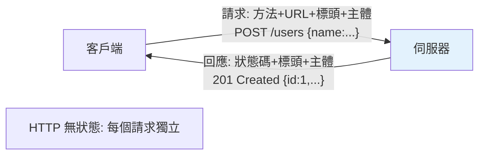

# HTTP 與 Web 基礎

> HTTP 是 Web 的語言——方法（GET/POST/...）、狀態碼（2xx/4xx/5xx）、標頭、請求/回應。搞懂這些「協定常識」，你才知道 API 該怎麼設計、狀態碼該回什麼、為什麼 REST 這樣做。

## 💡 白話導讀（建議先讀）

HTTP 是 Web 世界的共通語言。整個模型就是**點餐單與回單**：

**請求（點餐單）**四個欄位：

```text
方法      想做什麼:GET(看菜單) POST(下單) PUT/PATCH(改單) DELETE(退單)
路徑      對哪個東西:/users/42
標頭      附註:我是誰(認證)、我要 JSON 格式
主體      內容物:下單的具體資料(通常 JSON)
```

**回應（回單）**三個欄位:**狀態碼**(結果如何)+ 標頭 + 主體(回傳資料)。

狀態碼只要記住**開頭數字的分類**,個別碼查表即可：

- **2xx 成功**(200 OK、201 已建立、204 成功但沒內容)
- **4xx 你的錯**(400 單子寫錯、401 沒登入、403 沒權限、404 沒這東西、422 資料驗證失敗)
- **5xx 我的錯**(500 廚房著火)

最後一個重要性質:**HTTP 是無狀態的**——服務生沒有記憶,這次點餐他不記得你上次是誰。
「保持登入」的幻覺靠的是**每次都出示會員卡**（cookie/token,[第 14 章](14-cors-cookie-session.md)、[第 9 章](09-auth.md)分講)。

這章是整個 Part 的字典——後面每章都在用這些詞。

## Why（為什麼）

寫 Web API 前，得先懂 Web 的語言——**HTTP**。API 的每個端點都是「收 HTTP 請求、回 HTTP 回應」；設計 API 就是決定「用什麼方法、回什麼狀態碼、放什麼標頭」。不懂 HTTP，就會回錯狀態碼（成功卻回 200 給刪除失敗）、用錯方法（用 GET 改資料）、設計出不符慣例的 API。這章講清楚 HTTP 的核心概念——是 REST API 設計（見 [REST](08-rest-api.md)）與所有 Web 章節的基礎。

## Theory（理論：請求-回應模型）

HTTP 是**請求-回應（request-response）** 協定——點餐單與回單，一來一回：

**請求（request）** 組成：

- **方法（method）**：想做什麼（GET 讀、POST 建、PUT/PATCH 改、DELETE 刪）。
- **URL/路徑**：對哪個資源。
- **標頭（headers）**：附加資訊（認證、內容型別、接受格式）。
- **主體（body）**：資料（POST/PUT 的內容，通常 JSON）。

**回應（response）** 組成：

- **狀態碼（status code）**：結果如何（2xx 成功、4xx 客戶端錯、5xx 伺服器錯）。
- **標頭（headers）**：附加資訊（內容型別、快取）。
- **主體（body）**：回傳資料（通常 JSON）。

HTTP 是**無狀態（stateless）** 的——每個請求獨立，伺服器不記得上一個請求（服務生沒有記憶；狀態靠 cookie/token 維持，見 [cookie/session](14-cors-cookie-session.md)）。

## Specification（規範：方法與狀態碼）

### HTTP 方法

| 方法 | 用途 | 冪等? | 安全? |
|------|------|:----:|:----:|
| `GET` | 讀取資源 | ✅ | ✅（不改資料） |
| `POST` | 建立資源 | ❌ | ❌ |
| `PUT` | 完整更新/取代 | ✅ | ❌ |
| `PATCH` | 部分更新 | ❌ | ❌ |
| `DELETE` | 刪除 | ✅ | ❌ |

- **安全（safe）**：不改變伺服器狀態（GET）。
- **冪等（idempotent）**：多次執行結果相同（GET/PUT/DELETE；POST 不是）。

### 狀態碼

| 範圍 | 意義 | 常見 |
|------|------|------|
| **2xx** | 成功 | 200 OK、201 Created、204 No Content |
| **3xx** | 重導向 | 301 永久、302 暫時、304 未修改 |
| **4xx** | 客戶端錯誤 | 400 Bad Request、401 未認證、403 禁止、404 找不到、409 衝突、422 驗證失敗、429 太多請求 |
| **5xx** | 伺服器錯誤 | 500 內部錯誤、502 閘道錯誤、503 服務不可用 |

## Implementation（方法語意、狀態碼選擇、標頭、無狀態）

### 方法的語意：用對的方法

**用符合語意的方法**——這是 REST 的基礎（見 [REST](08-rest-api.md)）：

```text
GET  /users        讀取使用者列表（不改資料）
GET  /users/1      讀取單一使用者
POST /users        建立使用者（body 帶資料）
PUT  /users/1      完整更新使用者 1
PATCH /users/1     部分更新使用者 1
DELETE /users/1    刪除使用者 1
```

**別用 GET 改資料**（GET 該是安全的、可被快取/重試）、**別用 POST 做讀取**。方法的語意讓 API 可預測、可被快取/重試機制正確處理。

### 狀態碼：回對的碼

**回符合結果的狀態碼**——這是 API 品質的基本：

```text
成功建立    → 201 Created
成功讀取    → 200 OK
成功刪除    → 204 No Content（無回傳主體）
輸入格式錯  → 400 Bad Request
驗證失敗    → 422 Unprocessable Entity
未登入      → 401 Unauthorized
沒權限      → 403 Forbidden
找不到      → 404 Not Found
衝突（重複）→ 409 Conflict
伺服器錯    → 500 Internal Server Error
```

**別用 200 打發一切**（有些 API 什麼都回 200，成敗放 body——反模式）。正確的狀態碼讓客戶端、監控、快取能正確反應。

### 常見標頭

```text
# 請求標頭
Content-Type: application/json      內容型別
Authorization: Bearer <token>        認證
Accept: application/json             接受的回應格式

# 回應標頭
Content-Type: application/json       回應型別
Cache-Control: max-age=3600          快取
Set-Cookie: session=...              設定 cookie
Location: /users/1                   201 時新資源的位置
```

標頭傳遞「請求/回應的元資料」——認證、內容協商、快取、cookie。

### 無狀態與狀態維持

HTTP 無狀態——伺服器不記得上一個請求。要「記住使用者已登入」，靠：
- **Cookie**：伺服器設 cookie，瀏覽器每次帶上（session，見 [CORS/cookie](14-cors-cookie-session.md)）。
- **Token**：客戶端每次帶 `Authorization: Bearer <token>`（JWT，見 [JWT](../20-security-system-design/04-jwt.md)）。

無狀態的好處：伺服器可水平擴展（任何 worker 都能處理任何請求，不必共享狀態）。

### 常見錯誤示範

```text
❌ GET /deleteUser?id=1        用 GET 改資料（該用 DELETE）
❌ POST /getUser              用 POST 讀資料（該用 GET）
❌ 刪除失敗回 200 + {"error"}  該回 4xx/5xx
❌ 找不到回 200 + null         該回 404
```

## Code Example（可執行的 Python 範例）

```python
# http_basics_demo.py
from __future__ import annotations

from enum import Enum


class HTTPStatus(Enum):
    OK = 200
    CREATED = 201
    NO_CONTENT = 204
    BAD_REQUEST = 400
    UNAUTHORIZED = 401
    FORBIDDEN = 403
    NOT_FOUND = 404
    CONFLICT = 409
    UNPROCESSABLE = 422
    SERVER_ERROR = 500


def status_for_operation(operation: str, success: bool) -> int:
    """依操作與結果選對的狀態碼。"""
    if not success:
        return HTTPStatus.NOT_FOUND.value if operation == "read" else HTTPStatus.BAD_REQUEST.value
    mapping = {
        "create": HTTPStatus.CREATED.value,  # 201
        "read": HTTPStatus.OK.value,  # 200
        "update": HTTPStatus.OK.value,  # 200
        "delete": HTTPStatus.NO_CONTENT.value,  # 204
    }
    return mapping.get(operation, HTTPStatus.OK.value)


def method_for_action(action: str) -> str:
    """依動作選對的 HTTP 方法。"""
    return {
        "讀取": "GET",
        "建立": "POST",
        "完整更新": "PUT",
        "部分更新": "PATCH",
        "刪除": "DELETE",
    }.get(action, "GET")


def demo() -> None:
    # 狀態碼選擇
    print("操作 → 狀態碼：")
    for op in ["create", "read", "update", "delete"]:
        print(f"  {op} 成功 → {status_for_operation(op, True)}")
    print(f"  read 失敗 → {status_for_operation('read', False)}")

    # 方法選擇
    print("\n動作 → HTTP 方法：")
    for action in ["讀取", "建立", "完整更新", "刪除"]:
        print(f"  {action} → {method_for_action(action)}")

    print("\n重點：用對的方法（語意）、回對的狀態碼、HTTP 無狀態")


if __name__ == "__main__":
    demo()
```

**預期輸出**：

```pycon
$ python http_basics_demo.py
操作 → 狀態碼：
  create 成功 → 201
  read 成功 → 200
  update 成功 → 200
  delete 成功 → 204
  read 失敗 → 404

動作 → HTTP 方法：
  讀取 → GET
  建立 → POST
  完整更新 → PUT
  刪除 → DELETE

重點：用對的方法（語意）、回對的狀態碼、HTTP 無狀態
```

## Diagram（圖解：請求-回應）



## Best Practice（最佳實踐）

- **用符合語意的方法**：GET 讀（安全、冪等）、POST 建、PUT/PATCH 改、DELETE 刪——別用 GET 改資料。
- **回符合結果的狀態碼**：201 建立、204 刪除、400/422 輸入錯、401/403 認證/授權、404 找不到、409 衝突——別用 200 打發一切。
- **善用標頭**：`Content-Type`、`Authorization`、`Cache-Control`；201 回應設 `Location`。
- **理解 HTTP 無狀態**：狀態靠 cookie/token 維持；無狀態利於水平擴展。
- **GET 該安全且冪等**：不改資料、可被快取/重試。
- **這是 REST 的基礎**（見 [REST](08-rest-api.md)）：資源 + 方法 + 狀態碼。

## Common Mistakes（常見誤解）

- **用 GET 改資料 / POST 讀資料**：違反方法語意；GET 可能被快取/重試，改資料會出事。
- **什麼都回 200**：成敗放 body 而非狀態碼——反模式；用正確狀態碼。
- **刪除失敗回 200、找不到回 200+null**：該回 4xx；讓客戶端能正確判斷。
- **混淆 401（未認證）與 403（已認證但沒權限）**：401 是「你是誰？」、403 是「你不能做這個」。
- **混淆 400（格式錯）與 422（驗證失敗）**：400 是請求本身壞、422 是格式對但內容不合法。
- **以為 HTTP 有狀態**：無狀態；狀態靠 cookie/token。

## Interview Notes（面試重點）

- 知道 **HTTP 是無狀態的請求-回應協定**，請求（方法+URL+標頭+主體）、回應（狀態碼+標頭+主體）。
- **能對應方法與語意**：GET（讀、安全、冪等）、POST（建）、PUT（完整更新、冪等）、PATCH（部分更新）、DELETE（刪、冪等），並知道**安全/冪等**的意義。
- **能對應狀態碼**：2xx（200/201/204）、4xx（400/401/403/404/409/422/429）、5xx（500/502/503），尤其**401 vs 403、400 vs 422**。
- 知道 **無狀態 → 狀態靠 cookie/token 維持 → 利於水平擴展**。
- 知道這是 REST 設計的基礎（連結 [REST](08-rest-api.md)）。

---

➡️ 下一章：[Flask 入門](03-flask.md)

[⬆️ 回 Part 14 索引](README.md)
