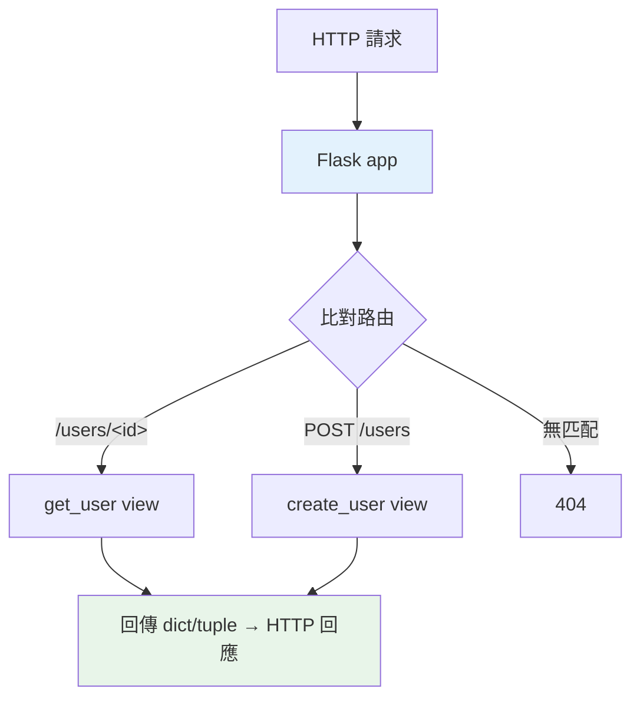

# Flask 入門

> Flask 是輕量、極簡的 WSGI 微框架——用裝飾器定義路由、幾行就能跑一個 Web 應用。它「微」在核心小、可自由選配；適合小專案、學習、或需要高度掌控時。

## Why（為什麼）

Flask 是 Python 最流行的**微框架（microframework）** 之一——極簡、易上手、彈性高。「微」不是功能少，而是**核心小、不強加選擇**（DB、認證等由你自選套件）。理解 Flask 能讓你快速建 Web 應用、也理解「微框架」哲學。雖然新專案的 API 服務多選 FastAPI（見 [FastAPI 基礎](04-fastapi-basics.md)），但 Flask 仍廣泛使用（既有專案、簡單應用、需要 WSGI 時），且它簡單的模型是理解 Web 框架的好起點。

## Theory（理論：微框架與路由）

Flask 是 **WSGI 框架**（同步，見 [WSGI/ASGI](01-wsgi-asgi.md)），核心概念：

- **應用物件**：`app = Flask(__name__)`，代表你的 Web 應用。
- **路由（route）**：用 `@app.route` 裝飾器把「URL 路徑」對應到「處理函式（view function）」。
- **請求/回應**：處理函式回傳的字串/dict 自動變成 HTTP 回應。

「微」的哲學：**核心只做路由 + 請求處理，其他（DB、表單、認證）由你選套件組合**——自由但要自己組裝。

## Specification（規範：Flask 基本）

```python
from flask import Flask, request, jsonify

app = Flask(__name__)

# 路由（GET）
@app.route("/")
def home():
    return "Hello, Flask"

# 路徑參數
@app.route("/users/<int:user_id>")
def get_user(user_id: int):
    return jsonify({"id": user_id})

# 指定方法
@app.route("/users", methods=["POST"])
def create_user():
    data = request.get_json()          # 讀 JSON body
    return jsonify(data), 201          # (回應, 狀態碼)

# query 參數
@app.route("/search")
def search():
    q = request.args.get("q", "")      # ?q=...
    return jsonify({"query": q})

# 執行（開發用）
if __name__ == "__main__":
    app.run(debug=True)
# 生產：gunicorn myapp:app
```

## Implementation（路由、請求、回應、藍圖）

### 路由與路徑參數

```python
from flask import Flask, jsonify

app = Flask(__name__)

@app.route("/users/<int:user_id>")     # <int:...> 型別轉換
def get_user(user_id: int):
    return jsonify({"id": user_id, "name": f"User{user_id}"})

@app.route("/posts/<slug>")            # 字串參數（預設）
def get_post(slug: str):
    return jsonify({"slug": slug})
```

`<int:user_id>` 從 URL 抓參數並轉型（int/string/float/path）。路徑參數對應到處理函式的參數名。

### 讀取請求資料

```python
from flask import request

@app.route("/create", methods=["POST"])
def create():
    # JSON body
    data = request.get_json()          # dict
    # query 參數（?key=value）
    page = request.args.get("page", 1, type=int)
    # 表單資料
    name = request.form.get("name")
    # 標頭
    auth = request.headers.get("Authorization")
    return jsonify({"received": data})
```

`request` 物件（全域、當前請求）提供各種資料：`get_json()`（JSON body）、`args`（query）、`form`（表單）、`headers`（標頭）。

### 回應：字串、dict、狀態碼

```python
from flask import jsonify

@app.route("/api")
def api():
    # 回 dict → 自動變 JSON（新版 Flask）
    return {"status": "ok"}

@app.route("/created", methods=["POST"])
def created():
    # (回應, 狀態碼) tuple
    return jsonify({"id": 1}), 201     # 201 Created

@app.route("/error")
def error():
    return jsonify({"error": "not found"}), 404
```

回傳 dict 自動變 JSON 回應；回傳 tuple `(body, status)` 可指定狀態碼（見 [HTTP 基礎](02-http-basics.md)）。`jsonify` 明確產生 JSON 回應。

### Blueprint：組織大型應用

大應用不該把所有路由塞一個檔——用 **Blueprint** 把路由分組到不同模組：

```python
# users.py
from flask import Blueprint

users_bp = Blueprint("users", __name__, url_prefix="/users")

@users_bp.route("/")
def list_users():
    return {"users": []}

# app.py
from flask import Flask
from users import users_bp

app = Flask(__name__)
app.register_blueprint(users_bp)       # /users/... 路由掛上
```

Blueprint 讓你把相關路由（users、posts、auth）分成模組、各自有 URL 前綴——大型應用的組織方式。

### Flask 生態

Flask「微」——常搭配套件：
- **Flask-SQLAlchemy**：ORM（見 [SQLAlchemy](../15-database/14-sqlalchemy-orm.md)）。
- **Flask-Login**：認證。
- **Flask-Migrate**：DB migration。
- **Flask-CORS**：跨域（見 [CORS](14-cors-cookie-session.md)）。

自由組裝——這是微框架的特色（也是要自己選型的負擔）。

## Code Example（可執行的 Python 範例）

```python
# flask_demo.py — 展示 Flask 應用的結構（邏輯可獨立測試）
from __future__ import annotations


# 註：此範例展示「處理邏輯」，可獨立測試（不需真的跑 Flask 伺服器）
def route_handler(method: str, path: str, body: dict | None = None) -> tuple[dict, int]:
    """模擬 Flask 路由分派（示範路由邏輯）。"""
    # GET /users/<id>
    if method == "GET" and path.startswith("/users/"):
        user_id = int(path.split("/")[-1])
        return {"id": user_id, "name": f"User{user_id}"}, 200

    # POST /users
    if method == "POST" and path == "/users":
        if not body or "name" not in body:
            return {"error": "name 為必填"}, 400
        return {"id": 1, "name": body["name"]}, 201

    # DELETE /users/<id>
    if method == "DELETE" and path.startswith("/users/"):
        return {}, 204

    return {"error": "not found"}, 404


def demo() -> None:
    # 模擬各種請求
    print("GET /users/5:")
    body, status = route_handler("GET", "/users/5")
    print(f"  {status}: {body}")

    print("\nPOST /users (含 name):")
    body, status = route_handler("POST", "/users", {"name": "Alice"})
    print(f"  {status}: {body}")

    print("\nPOST /users (缺 name):")
    body, status = route_handler("POST", "/users", {})
    print(f"  {status}: {body}")

    print("\nDELETE /users/1:")
    body, status = route_handler("DELETE", "/users/1")
    print(f"  {status}: {body}")

    print("\nFlask 實際寫法：@app.route('/users/<int:id>') def get_user(id): ...")


if __name__ == "__main__":
    demo()
```

**預期輸出**：

```pycon
$ python flask_demo.py
GET /users/5:
  200: {'id': 5, 'name': 'User5'}

POST /users (含 name):
  201: {'id': 1, 'name': 'Alice'}

POST /users (缺 name):
  400: {'error': 'name 為必填'}

DELETE /users/1:
  204: {}

Flask 實際寫法：@app.route('/users/<int:id>') def get_user(id): ...
```

## Diagram（圖解：Flask 路由分派）



## Best Practice（最佳實踐）

- **用 `@app.route` 定義路由**，指定 `methods=[...]`（預設只 GET）。
- **回 dict 自動變 JSON**、回 `(body, status)` 指定狀態碼（見 [HTTP 基礎](02-http-basics.md)）。
- **用 Blueprint 組織大型應用**：路由分模組、各有 URL 前綴。
- **生產用 gunicorn**（`gunicorn app:app`），別用 `app.run()`（開發伺服器，見 [Gunicorn/Uvicorn](../19-cloud-native/03-gunicorn-uvicorn.md)）。
- **設定用環境變數 / 設定物件**（見 [設定管理](../16-architecture/11-config-management.md)），別寫死。
- **需要非同步/自動驗證/自動文件 → 考慮 FastAPI**（見 [FastAPI 基礎](04-fastapi-basics.md)）；Flask 適合簡單/傳統/需高度掌控。
- **善用 Flask 生態套件**（SQLAlchemy、Login…）組裝所需功能。

## Common Mistakes（常見誤解）

- **忘了指定 `methods`**：`@app.route` 預設只接受 GET；POST 端點要 `methods=["POST"]`。
- **用 `app.run()` 上生產**：開發伺服器單執行緒、不穩；用 gunicorn。
- **所有路由塞一個檔**：大應用難維護；用 Blueprint 分模組。
- **`debug=True` 上生產**：洩漏堆疊資訊、安全風險；生產關閉。
- **手動解析 JSON / 驗證**：Flask 沒內建驗證；複雜驗證用 pydantic 或 marshmallow（FastAPI 內建 pydantic）。
- **忘了 Flask 是同步（WSGI）**：I/O 密集高並發不如 ASGI（見 [WSGI/ASGI](01-wsgi-asgi.md)）。

## Interview Notes（面試重點）

- 知道 **Flask 是輕量 WSGI 微框架**：`@app.route` 定義路由、`request` 讀請求、回 dict/tuple 變回應；「微」= 核心小、自由選配。
- 知道 **路徑參數（`<int:id>`）、`request.get_json()`/`args`/`form`、`(body, status)` 回應、Blueprint 組織**。
- 知道**生產用 gunicorn 而非 `app.run()`**、`debug=True` 別上生產。
- 能對比 **Flask（同步、微、自由組裝）vs FastAPI（非同步、內建驗證/文件）**，知道各自適用。
- 知道 Flask 生態（SQLAlchemy/Login/CORS 等外掛）。

---

➡️ 下一章：[FastAPI 基礎](04-fastapi-basics.md)

[⬆️ 回 Part 14 索引](README.md)
