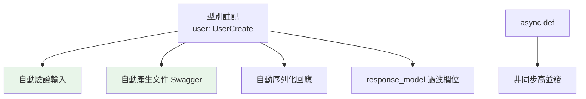

# FastAPI 基礎

> FastAPI 用型別註記做一切——自動驗證輸入、自動產生 API 文件、原生支援 async。它把 Python 的型別系統（pydantic）與 ASGI 的非同步結合，是現代 Python API 的首選框架。

## 💡 白話導讀（建議先讀）

FastAPI 的核心點子聰明到讓人嫉妒：

> **你反正都要寫型別註記（[Part 5](../05-typing/README.md) 練的）——那就讓型別註記自動幹三件事。**

```python
from fastapi import FastAPI
from pydantic import BaseModel

app = FastAPI()

class Item(BaseModel):
    name: str
    price: float

@app.post("/items/{item_id}")
async def create(item_id: int, item: Item):
    return {"id": item_id, "item": item}
```

就這樣,你**免費**得到：

1. **自動驗證**:`item_id: int`——URL 抓下來自動轉 int,不是數字直接回 422 錯誤(附詳細原因),你的函式**保證**拿到乾淨資料。
2. **自動文件**:打開 `/docs`——一份**互動式 API 文件**(Swagger UI)已經生成好了,能直接在網頁上試打 API。寫文件這件事,消失了。
3. **原生 async**:`async def` 端點直接跑在 [ASGI/event loop](01-wsgi-asgi.md) 上——海量並發 I/O 的正解。

一句話總結它的哲學:**一份型別,三種用途(驗證規則+API 文件+編輯器提示)**——你寫得更少,得到更多。

這就是為什麼 FastAPI 成為 Python 現代後端的預設選擇,也是本書 [task-api 實戰專案](../../project/)的底座。

## Why（為什麼）

FastAPI 是近年最受歡迎的 Python Web 框架——因為它把幾件麻煩事**自動化**：用 pydantic 型別註記（見 [pydantic](06-pydantic-validation.md)）**自動驗證**請求資料、**自動產生** OpenAPI 文件（互動式 API 文件）、原生 **async**（ASGI，見 [WSGI/ASGI](01-wsgi-asgi.md)）帶來高並發。你只要寫帶型別註記的函式，FastAPI 就處理驗證、序列化、文件、錯誤。這章講 FastAPI 的核心，理解它為何是現代 Python API 的首選。

## Theory（理論：型別驅動的框架）

FastAPI 的核心設計——**用 Python 型別註記驅動一切**（見 [Part 5](../05-typing/README.md)）：

- **參數型別 → 自動解析與驗證**：`user_id: int` 自動從 URL 抓並轉型/驗證。
- **pydantic 模型 → 請求/回應驗證**：body 對應 pydantic 模型，自動驗證。
- **型別 → 自動文件**：從型別產生 OpenAPI schema，提供互動式文件（Swagger UI，`/docs`）。
- **async def → 非同步處理**：原生支援 async（ASGI）。

一句話：

> 「你寫的型別註記」＝「驗證規則」＝「API 文件」——一份型別多用途，這是 FastAPI 省事的核心。

## Specification（規範：FastAPI 基本）

```python
from fastapi import FastAPI
from pydantic import BaseModel

app = FastAPI()

# 路徑操作（用裝飾器 + HTTP 方法）
@app.get("/")
def home():
    return {"message": "Hello"}

# 路徑參數（型別自動轉換 + 驗證）
@app.get("/users/{user_id}")
def get_user(user_id: int):            # int 自動轉型/驗證
    return {"id": user_id}

# query 參數（有預設值 = 選用）
@app.get("/search")
def search(q: str, limit: int = 10):   # q 必填、limit 選用
    return {"query": q, "limit": limit}

# 請求 body（pydantic 模型自動驗證）
class UserCreate(BaseModel):
    name: str
    age: int

@app.post("/users", status_code=201)
def create_user(user: UserCreate):     # body 自動驗證
    return {"id": 1, **user.model_dump()}

# 執行（開發）：uvicorn main:app --reload
# 文件：http://localhost:8000/docs（自動產生的 Swagger UI）
```

## Implementation（型別驗證、自動文件、async、回應模型）

### 路徑/query 參數：型別自動處理

```python
from fastapi import FastAPI

app = FastAPI()

@app.get("/items/{item_id}")
def get_item(item_id: int, q: str | None = None):
    # item_id 從路徑抓，自動轉 int（非數字 → 422 錯誤）
    # q 從 query 抓（?q=...），選用（有預設 None）
    return {"item_id": item_id, "q": q}
```

FastAPI 依型別註記自動：**路徑參數**（`{item_id}` → 函式參數）、**query 參數**（其餘參數，有預設 = 選用）。型別轉換 + 驗證自動——傳 `/items/abc` 會自動回 422（`item_id` 不是 int）。不必手動解析/驗證（對比 Flask 要 `request.args.get`）。

### 請求 body：pydantic 自動驗證

body 用 **pydantic 模型**——FastAPI 自動解析 JSON、驗證、轉成模型物件（見 [pydantic](06-pydantic-validation.md)）：

```python
from pydantic import BaseModel

class Product(BaseModel):
    name: str
    price: float
    tags: list[str] = []

@app.post("/products")
def create_product(product: Product):
    # FastAPI 自動：解析 JSON body → 驗證 → 轉成 Product 物件
    # 缺欄位/型別錯 → 自動回 422 + 詳細錯誤
    return {"id": 1, "name": product.name, "price": product.price}
```

傳來的 JSON 自動驗證成 `Product`——缺 `name`、`price` 不是數字，FastAPI 自動回 **422** 加**詳細的錯誤訊息**（哪個欄位、什麼問題）。這是 FastAPI 最省事的地方——**驗證免費**。

### 自動 API 文件

FastAPI **自動產生互動式 API 文件**（從型別）——不必手寫：

```text
http://localhost:8000/docs      # Swagger UI（互動式，可直接測試 API）
http://localhost:8000/redoc     # ReDoc（另一種文件介面）
http://localhost:8000/openapi.json   # OpenAPI schema（機器可讀）
```

文件顯示每個端點、參數、請求/回應 schema、可直接在瀏覽器測試——**這是 FastAPI 的殺手級功能**。型別註記即文件，永遠與程式同步。

### async 支援

FastAPI 原生支援 async（ASGI）——處理函式可以是 `async def`，用於非阻塞 I/O（見 [async Web](12-async-web-background.md)）：

```python
@app.get("/data")
async def get_data():
    result = await fetch_from_db()     # 非阻塞 I/O
    return result

@app.get("/sync")
def get_sync():                        # 也可用同步（FastAPI 自動丟執行緒池）
    return {"ok": True}
```

`async def` 端點用事件迴圈處理（高並發）；`def` 端點 FastAPI 自動丟執行緒池（避免阻塞 loop）。這讓 FastAPI 兼顧 async 與同步程式碼。

### 回應模型

用 `response_model` 指定回應的 schema——FastAPI 據此驗證/過濾回應、產生文件：

```python
class UserOut(BaseModel):
    id: int
    name: str
    # 注意：沒有 password 欄位

@app.get("/users/{id}", response_model=UserOut)
def get_user(id: int) -> dict:
    return {"id": id, "name": "Alice", "password": "secret"}
    # response_model 過濾掉 password（不在 UserOut）→ 回應不含它
```

`response_model` 確保回應符合 schema、**過濾掉不該回的欄位**（如 password）——這對安全很重要（別洩漏敏感欄位）。

## Code Example（可執行的 Python 範例）

```python
# fastapi_basics_demo.py — 展示 FastAPI 的驗證邏輯（用 pydantic，可獨立測試）
from __future__ import annotations

from pydantic import BaseModel, Field, ValidationError


class UserCreate(BaseModel):
    """請求 body 模型（FastAPI 會自動驗證）。"""

    name: str = Field(min_length=1)
    age: int = Field(ge=0, le=150)
    email: str


class UserOut(BaseModel):
    """回應模型（過濾敏感欄位）。"""

    id: int
    name: str
    # 沒有 password（回應不會洩漏）


def validate_user_input(data: dict) -> tuple[bool, str]:
    """模擬 FastAPI 的自動驗證。"""
    try:
        UserCreate(**data)
        return True, "驗證通過"
    except ValidationError as e:
        return False, f"驗證失敗（{e.error_count()} 個錯誤）"


def demo() -> None:
    # 合法輸入
    ok, msg = validate_user_input({"name": "Alice", "age": 30, "email": "a@b.com"})
    print(f"合法輸入: {msg}")

    # 非法輸入（缺 email、age 超範圍）
    ok, msg = validate_user_input({"name": "Bob", "age": 200})
    print(f"非法輸入: {msg}")

    # response_model 過濾敏感欄位
    full_data = {"id": 1, "name": "Alice", "password": "secret"}
    filtered = UserOut(**full_data)
    print(f"\n回應模型過濾後: {filtered.model_dump()}")  # 不含 password

    print("\nFastAPI 自動：型別驗證 + 422 錯誤 + Swagger 文件 + async")


if __name__ == "__main__":
    demo()
```

**預期輸出**：

```pycon
$ python fastapi_basics_demo.py
合法輸入: 驗證通過
非法輸入: 驗證失敗（2 個錯誤）

回應模型過濾後: {'id': 1, 'name': 'Alice'}

FastAPI 自動：型別驗證 + 422 錯誤 + Swagger 文件 + async
```

## Diagram（圖解：FastAPI 型別驅動）



## Best Practice（最佳實踐）

- **用 FastAPI 建現代 API**：型別驅動的自動驗證 + 文件 + async，省下大量樣板。
- **請求/回應用 pydantic 模型**（見 [pydantic](06-pydantic-validation.md)）：自動驗證、清楚的 schema。
- **用 `response_model` 過濾回應欄位**：別洩漏敏感資料（password 等）。
- **善用自動文件**（`/docs`）：型別即文件、可互動測試、永遠同步。
- **I/O 用 `async def`**（配 async 函式庫，見 [async Web](12-async-web-background.md)）；同步程式 FastAPI 自動丟執行緒池。
- **生產用 uvicorn/gunicorn+uvicorn workers**（見 [Gunicorn/Uvicorn](../19-cloud-native/03-gunicorn-uvicorn.md)），別用 `--reload`（開發用）。
- **狀態碼用 `status_code=`** 明確指定（見 [HTTP 基礎](02-http-basics.md)）。

## Common Mistakes（常見誤解）

- **不用 pydantic 模型手動驗證**：白費 FastAPI 的自動驗證；用模型。
- **回應含敏感欄位**：沒用 `response_model` 過濾，洩漏 password 等；用 response_model。
- **在 `async def` 裡做阻塞操作**：卡住 event loop（見 [async Web](12-async-web-background.md)）；用 async 函式庫或 `def`（自動丟執行緒池）。
- **生產用 `--reload`**：開發用、有效能與安全問題。
- **忽略自動文件**：FastAPI 免費給你，善用它。
- **手動解析 JSON body**：FastAPI 用 pydantic 模型自動做。
- **回錯狀態碼**：用 `status_code=` 指定（201 建立等）。

## Interview Notes（面試重點）

- 知道 **FastAPI 用型別註記驅動一切**：**自動驗證輸入（pydantic）、自動產生 OpenAPI 文件（Swagger）、原生 async（ASGI）**——一份型別多用途。
- 知道**路徑參數/query 參數/body（pydantic 模型）的型別自動處理**，錯誤自動回 422 + 詳細訊息。
- 知道 **`response_model` 過濾回應欄位**（別洩漏敏感資料）的重要性。
- 知道 **async def 高並發、def 自動丟執行緒池**、自動文件 `/docs` 是殺手功能。
- 能對比 **FastAPI（型別驅動、自動驗證/文件、async）vs Flask（微、手動、同步）**。

---

➡️ 下一章：[路由與請求處理](05-routing.md)

[⬆️ 回 Part 14 索引](README.md)
