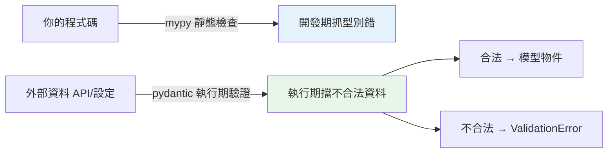

# pydantic 驗證

> 外部丟進來的 JSON，你真的要一個欄位一個欄位手寫 `if` 檢查型別對不對嗎？pydantic 說不用——你只寫一個型別，它就自動幫你驗證、轉換、報清楚的錯。這是 FastAPI 最迷人的那顆引擎。

## 💡 白話導讀（建議先讀）

[Part 5](../05-typing/07-mypy.md) 的 mypy 是「出發前的檢查員」——但它有個天生管不到的區域：

> **執行期從外面飛進來的資料**——API 請求的 JSON、外部服務的回應——mypy 靜態分析看不到它們。

型別註記說 `age: int`,但使用者送來 `"abc"`——mypy 沒轍(它不執行程式),爆炸發生在執行期。

**pydantic 就是站在國境線上的海關**:

```python
from pydantic import BaseModel, Field

class User(BaseModel):
    name: str = Field(min_length=1)
    age: int = Field(ge=0, le=150)

User(name="Alice", age="30")     # "30" 自動轉成 30(合理轉換放行)
User(name="", age=-5)            # ValidationError!附詳細清單:
                                 #   name: 太短 / age: 必須 >= 0
```

分工至此完整——**同一套型別註記,兩位檢查員各守一邊**：

- **mypy**:靜態,管**你自己寫的程式碼**(開發期)。
- **pydantic**:執行期,管**外面來的資料**(國境線)。

pydantic 的檢查風格很務實:**能合理轉換就轉**(字串 "30" → 30)、**不合法就拋 ValidationError**——而且錯誤清單詳細到能直接回給前端(FastAPI 的 422 就是這麼來的)。

這章展開它的武器庫:Field 約束、自訂 validator、巢狀模型、`model_dump` 序列化——[task-api 的 models](../../project/) 全在用。

## Why（為什麼）

外部資料（API 請求、設定檔、使用者輸入）不可信——你得驗證。手寫驗證（一堆 if 檢查型別、範圍、必填）又累又不全。**pydantic** 用型別註記（見 [Part 5](../05-typing/README.md)）**自動驗證與轉換**執行期資料：定義一個模型、丟資料進去、pydantic 驗證每個欄位、不合法拋詳細錯誤。它是 FastAPI 的驗證引擎（見 [FastAPI 基礎](04-fastapi-basics.md)），也可獨立用於任何「驗證外部資料」的場景。這章講清楚 pydantic 的核心。

## Theory（理論：執行期驗證，補 mypy 的另一半）

回顧[為什麼型別註記](../05-typing/01-why-type-hints.md)——mypy 是**靜態**檢查（不執行程式）。但**執行期的外部資料**（API 請求）mypy 管不到——需要**執行期驗證**。pydantic 補上這一半：

- **mypy**：靜態檢查你的**程式碼**（開發期的檢查員）。
- **pydantic**：執行期驗證**外部資料**（國境線上的海關）。

pydantic 的核心流程：

> 定義 `BaseModel`（型別註記宣告欄位）→ 丟資料進去 → **自動驗證與轉換**（合理轉換放行，如 `"30"` → 30）→ 不合法拋 `ValidationError`（含詳細訊息，可直接回給客戶端）。

型別註記既是宣告也是驗證規則——一份型別多用途。

## Specification（規範：pydantic 模型）

```python
from pydantic import BaseModel, Field, field_validator, EmailStr

class User(BaseModel):
    name: str                              # 必填字串
    age: int = Field(ge=0, le=150)         # 0-150
    email: str
    tags: list[str] = []                   # 有預設 = 選用
    is_active: bool = True

# 驗證（合法）
user = User(name="Alice", age=30, email="a@b.com")
user.name                                  # 'Alice'
user.model_dump()                          # dict
user.model_dump_json()                     # JSON 字串

# 驗證（不合法 → ValidationError）
User(name="Bob", age=200)                  # age 超範圍 + 缺 email → ValidationError

# 自訂驗證
class Product(BaseModel):
    price: float

    @field_validator("price")
    @classmethod
    def price_positive(cls, v: float) -> float:
        if v <= 0:
            raise ValueError("價格必須為正")
        return v

# 從 JSON/dict 建立
User.model_validate({"name": "X", "age": 1, "email": "..."})
User.model_validate_json('{"name": "X", ...}')
```

## Implementation（模型驗證、Field 約束、自訂驗證、轉換、v2）

### 定義模型與自動驗證

```python
from pydantic import BaseModel, ValidationError

class Order(BaseModel):
    id: int
    quantity: int
    price: float

# 合法：自動驗證 + 轉換（字串 "5" → int 5）
order = Order(id=1, quantity="5", price="99.9")  # 自動轉型！
print(order.quantity, order.price)               # 5 99.9（已轉型）

# 不合法：拋 ValidationError（詳細）
try:
    Order(id="abc", quantity=-1)
except ValidationError as e:
    print(e.errors())    # [{'loc': ('id',), 'msg': '...', 'type': '...'}, ...]
```

pydantic 自動**驗證 + 轉換**——`"5"` 自動轉 `int`（寬鬆）、不合法拋 `ValidationError` 含每個錯誤的位置與原因。這比手寫驗證全面太多。

### `Field`：欄位約束

用 `Field` 加約束（範圍、長度、正則、預設、別名）：

```python
from pydantic import BaseModel, Field

class Product(BaseModel):
    name: str = Field(min_length=1, max_length=100)
    price: float = Field(gt=0)                  # > 0
    quantity: int = Field(ge=0, default=0)      # >= 0，預設 0
    sku: str = Field(pattern=r"^[A-Z]{3}\d{4}$")  # 正則
    discount: float = Field(ge=0, le=1, default=0)  # 0-1
```

`Field` 的約束（`gt`/`ge`/`lt`/`le`/`min_length`/`max_length`/`pattern`）自動驗證——比手寫 if 檢查清楚且全面。約束也用於產生 OpenAPI 文件（FastAPI）。

### 自訂驗證器

複雜規則用 `@field_validator`（單欄位）或 `@model_validator`（跨欄位）：

```python
from pydantic import BaseModel, field_validator, model_validator

class Registration(BaseModel):
    password: str
    password_confirm: str

    @field_validator("password")
    @classmethod
    def password_strength(cls, v: str) -> str:
        if len(v) < 8:
            raise ValueError("密碼至少 8 字元")
        return v

    @model_validator(mode="after")
    def passwords_match(self) -> "Registration":
        if self.password != self.password_confirm:
            raise ValueError("密碼不一致")
        return self
```

`field_validator` 驗證/轉換單一欄位、`model_validator` 做跨欄位驗證（如兩密碼一致）——複雜業務規則的地方。

### 型別轉換與嚴格模式

pydantic 預設**寬鬆轉換**（`"5"` → int）。要嚴格（不自動轉）用 strict：

```python
from pydantic import BaseModel, StrictInt

class Strict(BaseModel):
    value: StrictInt          # 只接受真正的 int，不接受 "5"

# 或整個模型 strict
class Config(BaseModel):
    model_config = {"strict": True}
```

寬鬆轉換方便（API 常傳字串）但要注意（`"5"` 被當 5）；需要嚴格時用 StrictInt 等。

### 巢狀模型與序列化

pydantic 模型可巢狀，序列化成 dict/JSON：

```python
class Address(BaseModel):
    city: str
    zipcode: str

class User(BaseModel):
    name: str
    address: Address              # 巢狀模型

user = User(name="Alice", address={"city": "台北", "zipcode": "100"})
user.model_dump()                 # {'name': 'Alice', 'address': {'city': ..., ...}}
user.model_dump_json()            # JSON 字串
```

`model_dump()`（→ dict）、`model_dump_json()`（→ JSON）序列化——比手動 json.dumps 處理巢狀物件方便（見 [json](../11-stdlib/04-json.md)）。

### pydantic v2（重要）

pydantic **v2**（用 Rust 寫核心，快很多）是現代版本，API 有變（`model_dump` 取代 `dict()`、`model_validate` 取代 `parse_obj`）：

| v1（舊） | v2（現代） |
|----------|-----------|
| `.dict()` | `.model_dump()` |
| `.json()` | `.model_dump_json()` |
| `parse_obj()` | `model_validate()` |
| `@validator` | `@field_validator` |

**新專案用 v2**（本章都是 v2 語法）。v2 快數倍且是 FastAPI 現代版本的基礎。

## Code Example（可執行的 Python 範例）

```python
# pydantic_demo.py
from __future__ import annotations

from pydantic import BaseModel, Field, ValidationError, field_validator


class UserRegistration(BaseModel):
    """使用者註冊模型（含約束與自訂驗證）。"""

    username: str = Field(min_length=3, max_length=20)
    age: int = Field(ge=13, le=120)
    email: str
    password: str

    @field_validator("email")
    @classmethod
    def email_has_at(cls, v: str) -> str:
        if "@" not in v:
            raise ValueError("email 格式錯誤")
        return v

    @field_validator("password")
    @classmethod
    def password_strong(cls, v: str) -> str:
        if len(v) < 8:
            raise ValueError("密碼至少 8 字元")
        return v


def try_register(data: dict) -> str:
    """嘗試建立模型，回報結果。"""
    try:
        user = UserRegistration(**data)
        return f"成功: {user.username}"
    except ValidationError as e:
        errors = [f"{err['loc'][0]}: {err['msg']}" for err in e.errors()]
        return f"失敗: {errors}"


def demo() -> None:
    # 合法
    print(try_register({
        "username": "alice", "age": 30, "email": "a@b.com", "password": "secret123"
    }))

    # 多個錯誤（自動全部回報）
    print(try_register({
        "username": "ab", "age": 200, "email": "bad", "password": "123"
    }))

    # 自動轉型（字串 "25" → int）
    user = UserRegistration(username="bob", age="25", email="b@c.com", password="password")
    print(f"\n自動轉型: age={user.age}（型別 {type(user.age).__name__}）")
    print(f"序列化: {user.model_dump(exclude={'password'})}")  # 排除密碼


if __name__ == "__main__":
    demo()
```

**預期輸出**：

```pycon
$ python pydantic_demo.py
成功: alice
失敗: ['username: String should have at least 3 characters', 'age: Input should be less than or equal to 120', 'email: Value error, email 格式錯誤', 'password: Value error, 密碼至少 8 字元']

自動轉型: age=25（型別 int）
序列化: {'username': 'bob', 'age': 25, 'email': 'b@c.com'}
```

## Diagram（圖解：pydantic 補 mypy 的另一半）



## Best Practice（最佳實踐）

- **驗證外部資料用 pydantic**：API 請求、設定、使用者輸入——執行期驗證（補 mypy 的靜態檢查）。
- **用 `Field` 約束**（範圍、長度、正則）取代手寫 if 檢查；複雜規則用 `@field_validator`/`@model_validator`。
- **用 pydantic v2**（`model_dump`/`model_validate`/`@field_validator`）：快、現代、FastAPI 基礎。
- **序列化用 `model_dump()`/`model_dump_json()`**（含 `exclude=`/`include=` 過濾欄位，如排除密碼）。
- **請求模型與回應模型分開**（`UserCreate` vs `UserOut`）：回應排除敏感欄位（見 [FastAPI 基礎](04-fastapi-basics.md)）。
- **注意寬鬆轉換**（`"5"` → int）：需嚴格用 `StrictInt` 等。
- **理解 pydantic = 執行期驗證、mypy = 靜態檢查**：互補，都要。

## Common Mistakes（常見誤解）

- **手寫一堆 if 驗證外部資料**：pydantic 自動做且全面；用它。
- **用 pydantic v1 舊 API**（`.dict()`/`@validator`）：新專案用 v2（`.model_dump()`/`@field_validator`）。
- **回應洩漏敏感欄位**：`model_dump()` 沒 exclude password；用 `exclude=` 或分開的回應模型。
- **以為 pydantic 是靜態檢查**：它是**執行期**驗證（與 mypy 互補）。
- **忽略寬鬆轉換的陷阱**：`"5"` 被當 5；需嚴格用 Strict 型別。
- **複雜驗證塞進路由函式**：用 `@field_validator`/`@model_validator` 放模型裡。
- **請求與回應共用同一模型**：回應可能洩漏欄位；分開設計。

## Interview Notes（面試重點）

- **知道 pydantic 是執行期資料驗證**（用型別註記），**補 mypy（靜態檢查程式碼）的另一半（執行期驗證外部資料）**——是 FastAPI 的驗證引擎。
- 知道 **`BaseModel` + 型別註記 → 自動驗證與轉換 → 不合法拋 `ValidationError`（詳細）**。
- 知道 **`Field` 約束**（gt/ge/min_length/pattern）、**`@field_validator`/`@model_validator`**（單/跨欄位驗證）。
- **知道 pydantic v2**（`model_dump`/`model_validate`，取代 v1 的 `dict`/`parse_obj`）、Rust 核心快。
- 知道**序列化 `model_dump()`（含 exclude 過濾敏感欄位）**、寬鬆轉換的陷阱、請求/回應模型分開。

---

➡️ 下一章：[middleware](07-middleware.md)

[⬆️ 回 Part 14 索引](README.md)
