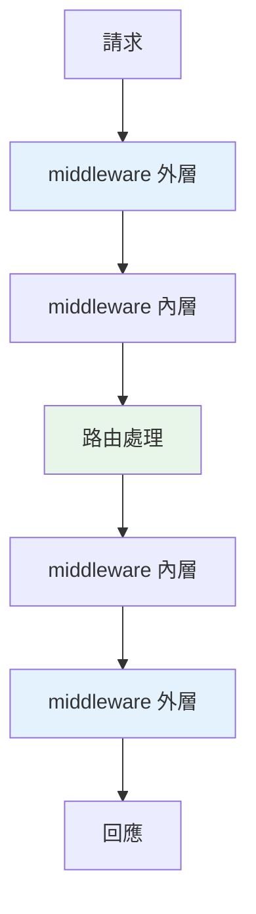

# middleware

> middleware 是「包在每個請求外圍」的程式——在請求進入路由前、回應送出後執行。用它做跨所有端點的橫切關注：日誌、計時、CORS、認證、錯誤處理。它是「洋蔥模型」的一層。

## 💡 白話導讀（建議先讀）

有些事「每個請求都要做」：記 log、計時、加安全標頭、驗 token——寫進每個端點？一百個端點寫一百遍？

**middleware** 的答案:在請求的必經之路上設**關卡**——所有請求進出都要過:

```text
請求進來 →  [關卡A] → [關卡B] → 端點處理
回應出去 ←  [關卡A] ← [關卡B] ←    ↓
```

注意路徑形狀:**進來穿過 A、B,出去反向再穿一次**——這叫**洋蔥模型**(一層包一層)。
每個關卡有兩次出手機會:**去程**(記錄請求、驗身分、蓋時間戳)與**回程**(計算耗時、加標頭、統一格式)。

FastAPI 寫法直白:

```python
@app.middleware("http")
async def add_timing(request, call_next):
    start = time.perf_counter()          # 去程:進端點前
    response = await call_next(request)  # ← 往內走(下一層/端點)
    response.headers["X-Time"] = f"{time.perf_counter()-start:.3f}"  # 回程
    return response
```

`call_next` 就是「往洋蔥內層走」的門——它前面的程式碼是去程,後面是回程。

定位一句話:**橫切所有端點的事放 middleware,單一端點的共用邏輯放 [Depends](11-fastapi-depends.md)**——兩者分工,端點函式保持乾淨。

## Why（為什麼）

有些事情要對**每個請求**做：記錄請求、計時、加通用標頭、處理 CORS、統一錯誤格式。在每個路由函式重複這些很蠢。**middleware** 讓你把「跨所有端點的橫切關注」寫一次、套用到全部請求——它包在請求處理的外圍，請求進來時先經過它、回應出去時再經過它。理解 middleware 的「洋蔥模型」與用途，是建結構化 Web 應用的一環（呼應 [裝飾器](../08-functional-decorators/03-decorator-basics.md) 的橫切關注概念）。

## Theory（理論：洋蔥模型）

**middleware** 是「包在請求-回應處理外圍」的關卡。多個 middleware 形成**洋蔥模型（onion model）**——請求由外往內穿過每層到達路由，回應由內往外穿回：

```text
請求 →  [middleware A] → [middleware B] → 路由處理
回應 ←  [middleware A] ← [middleware B] ← 路由處理
```

每個 middleware 有兩次出手機會：

- **請求往內**時：記錄、驗證、往 request 加東西（去程）。
- **回應往外**時：加標頭、計時、統一格式（回程）。

橫切關注集中在 middleware，路由函式保持乾淨。

## Specification（規範：FastAPI middleware）

```python
from fastapi import FastAPI, Request
import time

app = FastAPI()

# 函式式 middleware（最常見）
@app.middleware("http")
async def add_timing(request: Request, call_next):
    start = time.perf_counter()
    response = await call_next(request)    # 呼叫下一層（路由或下個 middleware）
    elapsed = time.perf_counter() - start
    response.headers["X-Process-Time"] = str(elapsed)
    return response

# 內建 middleware（如 CORS）
from fastapi.middleware.cors import CORSMiddleware
app.add_middleware(
    CORSMiddleware,
    allow_origins=["https://example.com"],
    allow_methods=["*"],
)
```

## Implementation（call_next、洋蔥流程、常見用途、順序）

### 函式式 middleware：`call_next`

FastAPI 的 middleware 用 `@app.middleware("http")` 裝飾——收 `request`、呼叫 `call_next(request)`（往內傳給下一層）、拿到 `response`（往外傳回）：

```python
from fastapi import FastAPI, Request
import time, logging

app = FastAPI()
logger = logging.getLogger(__name__)

@app.middleware("http")
async def log_and_time(request: Request, call_next):
    # 請求往內：記錄
    logger.info("→ %s %s", request.method, request.url.path)
    start = time.perf_counter()

    response = await call_next(request)     # 傳給下一層（路由）

    # 回應往外：加計時標頭、記錄
    elapsed = time.perf_counter() - start
    response.headers["X-Process-Time"] = f"{elapsed:.4f}"
    logger.info("← %s (%.4fs)", response.status_code, elapsed)
    return response
```

`call_next` 之前的程式碼在「請求往內」執行、之後的在「回應往外」執行——這就是洋蔥模型。每個請求都會經過這段（跨所有端點）。

### 常見 middleware 用途

| 用途 | 說明 |
|------|------|
| **日誌/計時** | 記錄每個請求、量處理時間 |
| **CORS** | 跨域資源共享（見 [CORS](14-cors-cookie-session.md)） |
| **認證** | 檢查 token（但 FastAPI 更常用 Depends，見 [Depends](11-fastapi-depends.md)） |
| **統一錯誤格式** | 捕捉例外、回統一的錯誤 JSON |
| **加通用標頭** | 安全標頭、request ID |
| **壓縮/GZip** | 壓縮回應 |
| **限流** | rate limiting |

### 內建 middleware

FastAPI/Starlette 提供現成 middleware，用 `add_middleware` 掛：

```python
from fastapi.middleware.cors import CORSMiddleware
from fastapi.middleware.gzip import GZipMiddleware

app.add_middleware(GZipMiddleware, minimum_size=1000)     # 壓縮大回應
app.add_middleware(
    CORSMiddleware,                                        # 跨域
    allow_origins=["https://myapp.com"],
    allow_credentials=True,
    allow_methods=["*"],
    allow_headers=["*"],
)
```

CORS 是最常用的內建 middleware（前後端分離必備，見 [CORS](14-cors-cookie-session.md)）。

### middleware 順序（洋蔥層次）

middleware 的**執行順序 = 註冊順序的反向包裹**——後加的在外層。多個 middleware 時要注意順序（如 CORS 通常要在最外層）：

```python
app.add_middleware(A)     # 較內層
app.add_middleware(B)     # 較外層（後加的包在外面）
# 請求：B → A → 路由；回應：路由 → A → B
```

### middleware vs Depends

**middleware 適合「真正跨所有端點」的橫切關注**（日誌、CORS、計時）；**「特定端點的依賴」（認證、DB 連線、取當前使用者）用 `Depends`**（見 [Depends](11-fastapi-depends.md)）更精確、可測試。別把「只有某些端點需要」的邏輯放 middleware（它套用到全部）。

## Code Example（可執行的 Python 範例）

```python
# middleware_demo.py — 展示洋蔥模型的執行順序（可獨立測試）
from __future__ import annotations

from collections.abc import Callable


class MiddlewareChain:
    """模擬 middleware 洋蔥模型。"""

    def __init__(self) -> None:
        self.log: list[str] = []

    def make_middleware(self, name: str) -> Callable:
        def middleware(request: str, call_next: Callable) -> str:
            self.log.append(f"→ {name} (請求往內)")
            response = call_next(request)
            self.log.append(f"← {name} (回應往外)")
            return response

        return middleware

    def run(self, middlewares: list[Callable], handler: Callable, request: str) -> str:
        """把 middleware 串成洋蔥，最內層是 handler。"""

        def build_chain(index: int) -> Callable:
            if index >= len(middlewares):
                return handler
            return lambda req: middlewares[index](req, build_chain(index + 1))

        return build_chain(0)(request)


def demo() -> None:
    chain = MiddlewareChain()

    # 兩層 middleware：計時、日誌
    timing = chain.make_middleware("計時")
    logging_mw = chain.make_middleware("日誌")

    def handler(request: str) -> str:
        chain.log.append(f"  [路由處理 {request}]")
        return f"回應給 {request}"

    result = chain.run([timing, logging_mw], handler, "GET /users")

    print("洋蔥模型執行順序：")
    for entry in chain.log:
        print(f"  {entry}")
    print(f"\n最終回應: {result}")

    print("\n重點：請求由外往內、回應由內往外（洋蔥模型）")


if __name__ == "__main__":
    demo()
```

**預期輸出**：

```pycon
$ python middleware_demo.py
洋蔥模型執行順序：
  → 計時 (請求往內)
  → 日誌 (請求往內)
    [路由處理 GET /users]
  ← 日誌 (回應往外)
  ← 計時 (回應往外)

最終回應: 回應給 GET /users

重點：請求由外往內、回應由內往外（洋蔥模型）
```

## Diagram（圖解：洋蔥模型）



## Best Practice（最佳實踐）

- **middleware 用於真正跨所有端點的橫切關注**：日誌、計時、CORS、統一錯誤格式、通用標頭。
- **理解洋蔥模型**：`call_next` 之前處理請求、之後處理回應；註冊順序影響包裹層次。
- **CORS 用內建 `CORSMiddleware`**（見 [CORS](14-cors-cookie-session.md)），前後端分離必備。
- **特定端點的邏輯用 `Depends` 而非 middleware**（認證、DB、當前使用者，見 [Depends](11-fastapi-depends.md)）——更精確、可測試。
- **middleware 保持輕量**：每個請求都經過，別放昂貴操作。
- **async middleware 別阻塞**（見 [async Web](12-async-web-background.md)）：卡住 event loop 影響所有請求。
- **統一錯誤格式可用 middleware 或 exception handler**（見 [例外處理](16-exception-handlers.md)）。

## Common Mistakes（常見誤解）

- **把「特定端點」的邏輯放 middleware**：套用到全部端點（不需要的也跑）；用 Depends。
- **middleware 順序沒注意**：CORS 該在外層、認證的順序影響行為。
- **middleware 做昂貴操作**：每個請求都跑，拖慢全部。
- **async middleware 裡阻塞**：卡住 event loop。
- **忘了 `return response`**：middleware 必須回傳 response（往外傳）。
- **用 middleware 做認證卻難測試/難精確控制**：FastAPI 的 Depends 更適合認證（可依端點、可測試）。
- **不理解洋蔥模型**：搞不清 middleware 的執行時機（請求往內 vs 回應往外）。

## Interview Notes（面試重點）

- **知道 middleware 是「包在請求-回應外圍的橫切關注」**，用**洋蔥模型**（請求由外往內、回應由內往外，`call_next` 分界）。
- 知道**常見用途**：日誌、計時、CORS、統一錯誤格式、通用標頭、限流。
- **能區分 middleware（真正跨所有端點）vs Depends（特定端點的依賴，如認證/DB）**——後者更精確可測試。
- 知道**內建 middleware（CORS/GZip）用 `add_middleware`**、middleware 順序影響包裹層次。
- 知道 middleware 要輕量、async 別阻塞、必須 return response。

---

➡️ 下一章：[REST API 設計](08-rest-api.md)

[⬆️ 回 Part 14 索引](README.md)
