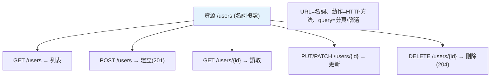

# REST API 設計

> REST 是一套 API 設計慣例——用「資源（名詞）+ HTTP 方法（動詞）」組織 API，配對的狀態碼。遵循 REST 讓 API 可預測、易懂、好用。這章講清楚 REST 的原則與良好 API 設計的實踐。

## Why（為什麼）

同樣是「使用者管理 API」，好的設計（`GET /users/1`、`DELETE /users/1`）一看就懂、壞的設計（`GET /getUser?id=1`、`POST /removeUser`）雜亂難用。**REST（Representational State Transfer）** 是主流的 API 設計風格——用一致的慣例（資源、方法、狀態碼）讓 API 可預測。理解 REST 原則與良好設計實踐，你才能設計出「別人一看就會用」的 API。這章整合 [HTTP 基礎](02-http-basics.md) 的知識到 API 設計。

## Theory（理論：資源 + 方法）

REST 的核心思想：**把 API 組織成「資源」，用 HTTP 方法操作它們**。

- **資源（resource）**：用**名詞**（複數）表示——`/users`、`/orders`、`/products`。資源是「東西」。
- **方法（method）**：用 HTTP **動詞**表示操作——GET（讀）、POST（建）、PUT/PATCH（改）、DELETE（刪）。
- **狀態碼**：表示結果（見 [HTTP 基礎](02-http-basics.md)）。

關鍵：**URL 用名詞（資源）、動作用 HTTP 方法**——別把動作放 URL（`/getUser`、`/deleteUser` 是反模式）。這讓一組資源的 CRUD 有一致、可預測的形式。

## Specification（規範：RESTful 端點設計）

```text
資源：users

GET    /users           列出所有使用者（可帶分頁/篩選 query）
POST   /users           建立使用者（body 帶資料）→ 201
GET    /users/{id}      取單一使用者 → 200 或 404
PUT    /users/{id}      完整更新使用者
PATCH  /users/{id}      部分更新使用者
DELETE /users/{id}      刪除使用者 → 204

巢狀資源（使用者的訂單）：
GET    /users/{id}/orders        某使用者的訂單
POST   /users/{id}/orders        為某使用者建訂單

集合的 query 參數（不放路徑）：
GET    /users?page=2&limit=20&status=active&sort=-created_at
```

## Implementation（資源設計、狀態碼、分頁、版本、HATEOAS）

### 資源與 CRUD 對應

REST API 的核心是「資源的 CRUD」對應到「方法 + 路徑」：

```text
操作        方法    路徑            狀態碼
建立(Create) POST   /users          201 Created
讀取(Read)   GET    /users/{id}     200 OK / 404
列表         GET    /users          200 OK
更新(Update) PUT    /users/{id}     200 OK
部分更新     PATCH  /users/{id}     200 OK
刪除(Delete) DELETE /users/{id}     204 No Content
```

一致的形式——任何資源（users、products、orders）都用同一套模式。使用者學會一個資源的 API，就懂全部。

### 用對狀態碼

REST API 要回**符合語意的狀態碼**（見 [HTTP 基礎](02-http-basics.md)）：

```text
201 Created          建立成功（回 Location 標頭指向新資源）
200 OK               讀取/更新成功
204 No Content       刪除成功（無回傳主體）
400 Bad Request      請求格式錯
422 Unprocessable    驗證失敗
401 Unauthorized     未登入
403 Forbidden        沒權限
404 Not Found        資源不存在
409 Conflict         衝突（如 email 重複）
429 Too Many         限流
```

### 分頁、篩選、排序：用 query 參數

集合端點（列表）用 **query 參數**做分頁、篩選、排序——**不放路徑**：

```text
GET /users?page=2&limit=20              分頁
GET /users?status=active&role=admin     篩選
GET /users?sort=-created_at             排序（- 表降序）
GET /users?search=alice                 搜尋
```

分頁回應常含 metadata：

```json
{
  "data": [...],
  "pagination": {"page": 2, "limit": 20, "total": 150, "pages": 8}
}
```

大集合**一定要分頁**（別一次回全部）——保護伺服器與客戶端。

### API 版本

API 會演進，破壞性變更需要版本——常見用 URL 前綴：

```text
/v1/users          版本 1
/v2/users          版本 2（不相容的變更）
```

版本讓舊客戶端繼續用 v1、新的用 v2——避免破壞既有整合（呼應 SemVer，見 [打包發佈](../13-tooling-packaging/05-packaging.md)）。也有用標頭版本的做法（`Accept: application/vnd.api.v2+json`）。

### 良好 API 設計的其他實踐

- **一致的命名**：複數名詞（`/users` 不是 `/user`）、小寫、連字號（`/user-profiles`）。
- **一致的錯誤格式**：所有錯誤回同樣結構的 JSON（見 [例外處理](16-exception-handlers.md)）。
- **HATEOAS（進階）**：回應含相關資源的連結（讓 API 可導航）——理想的 REST，但實務常簡化。
- **文件**：FastAPI 自動產生（見 [FastAPI 基礎](04-fastapi-basics.md)）。
- **冪等性**：GET/PUT/DELETE 冪等（見 [HTTP 基礎](02-http-basics.md)、[冪等性](../22-distributed-systems/06-idempotency.md)）。

## Code Example（可執行的 Python 範例）

```python
# rest_design_demo.py
from __future__ import annotations


def rest_endpoint(operation: str, resource: str, resource_id: int | None = None) -> dict[str, object]:
    """依 REST 慣例產生端點設計。"""
    designs = {
        "list": ("GET", f"/{resource}", 200),
        "create": ("POST", f"/{resource}", 201),
        "read": ("GET", f"/{resource}/{{id}}", 200),
        "update": ("PUT", f"/{resource}/{{id}}", 200),
        "delete": ("DELETE", f"/{resource}/{{id}}", 204),
    }
    method, path, status = designs[operation]
    return {"method": method, "path": path, "status": status}


def is_restful(method: str, path: str) -> tuple[bool, str]:
    """檢查是否符合 REST 慣例（簡化）。"""
    # 反模式：動詞放 URL
    verbs = ["get", "create", "delete", "update", "remove", "add"]
    path_lower = path.lower()
    for verb in verbs:
        if verb in path_lower:
            return False, f"URL 含動詞 '{verb}'（動作應用 HTTP 方法）"
    return True, "符合 REST 慣例"


def demo() -> None:
    # RESTful 端點設計
    print("使用者資源的 REST 端點：")
    for op in ["list", "create", "read", "update", "delete"]:
        d = rest_endpoint(op, "users")
        print(f"  {op:8} → {d['method']:6} {d['path']:20} ({d['status']})")

    # 檢查 REST 慣例
    print("\nREST 慣例檢查：")
    for method, path in [("GET", "/users/1"), ("POST", "/createUser"), ("DELETE", "/users/1")]:
        ok, msg = is_restful(method, path)
        mark = "✓" if ok else "✗"
        print(f"  {mark} {method} {path}: {msg}")


if __name__ == "__main__":
    demo()
```

**預期輸出**：

```pycon
$ python rest_design_demo.py
使用者資源的 REST 端點：
  list     → GET    /users               (200)
  create   → POST   /users               (201)
  read     → GET    /users/{id}          (200)
  update   → PUT    /users/{id}          (200)
  delete   → DELETE /users/{id}          (204)

REST 慣例檢查：
  ✓ GET /users/1: 符合 REST 慣例
  ✗ POST /createUser: URL 含動詞 'create'（動作應用 HTTP 方法）
  ✓ DELETE /users/1: 符合 REST 慣例
```

## Diagram（圖解：REST 資源 + 方法）



## Best Practice（最佳實踐）

- **資源用名詞（複數）、動作用 HTTP 方法**：`GET /users/{id}` 不是 `/getUser?id=`。
- **回符合語意的狀態碼**（201 建立、204 刪除、404、409、422，見 [HTTP 基礎](02-http-basics.md)）。
- **分頁/篩選/排序用 query 參數**（不放路徑）；大集合一定分頁。
- **API 版本用 URL 前綴**（`/v1/`），破壞性變更升版本。
- **一致的命名與錯誤格式**：複數名詞、小寫連字號、統一的錯誤 JSON（見 [例外處理](16-exception-handlers.md)）。
- **善用 FastAPI 自動文件**（見 [FastAPI 基礎](04-fastapi-basics.md)）：型別即文件。
- **遵守方法的安全/冪等語意**（GET 安全、PUT/DELETE 冪等）。

## Common Mistakes（常見誤解）

- **動詞放 URL**：`/getUser`、`/deleteUser`——反模式；動作用 HTTP 方法。
- **什麼都回 200**：該用正確狀態碼（201/204/404/409/422）。
- **列表不分頁**：一次回幾萬筆，拖垮伺服器/客戶端；分頁。
- **分頁/篩選放路徑**：`/users/page/2` 不如 `/users?page=2`；用 query。
- **資源用單數/不一致**：`/user` vs `/users` 混用；統一複數。
- **破壞性變更不升版本**：破壞既有客戶端；用版本。
- **錯誤格式不一致**：每個端點回不同的錯誤結構；統一。

## Interview Notes（面試重點）

- **能說出 REST 原則**：**資源用名詞（複數）、動作用 HTTP 方法、配對狀態碼**——`GET /users/{id}` 而非 `/getUser`。
- 能設計一組資源的 RESTful 端點（CRUD 對應方法 + 路徑 + 狀態碼）。
- 知道**分頁/篩選/排序用 query 參數**（不放路徑）、大集合一定分頁。
- 知道 **API 版本**（URL 前綴）、一致命名與錯誤格式。
- 知道方法的**安全/冪等語意**（GET 安全、PUT/DELETE 冪等，連結 [HTTP 基礎](02-http-basics.md)）。
- 能指出反模式（動詞放 URL、什麼都回 200、不分頁）。

---

➡️ 下一章：[認證與授權](09-auth.md)

[⬆️ 回 Part 14 索引](README.md)
