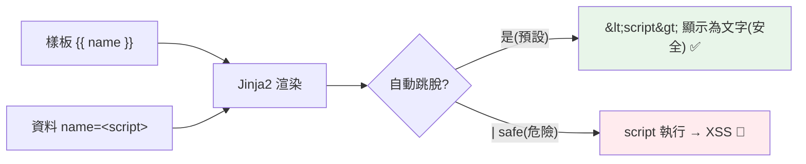

# 模板與靜態檔

> 不是每個後端都只回 JSON——有時你要伺服器直接吐出一整頁 HTML。這章講 Jinja2 模板怎麼把資料填進 HTML 樣板、靜態檔怎麼提供，以及那道一不小心就打開的 XSS 大門（別關掉模板的自動跳脫）。

## 💡 白話導讀（建議先讀）

前面都在回 JSON(給程式吃)。若要伺服器直接產出**給人看的 HTML 頁面**,用**模板**——本質是**填空信紙**：

```html
<!-- 信紙(樣板):挖好空格的 HTML -->
<h1>哈囉,{{ name }}!</h1>
<ul>
     <!-- 還能寫迴圈/條件 -->
  <li>{{ item }}</li>

</ul>
```

```python
template.render(name="Alice", items=["蘋果", "香蕉"])   # 資料填進空格 → 完整 HTML
```

**Jinja2** 是 Python 世界的標準信紙引擎(Flask 內建、FastAPI 可配)。三個詞:**樣板**(有空格的 HTML)+**上下文**(要填的資料 dict)+**渲染**(填好交卷)。

安全課必須劃重點——**XSS(跨站腳本)**:
如果使用者暱稱填了 `<script>偷你cookie()</script>`,而你把它直接填進 HTML——**這段腳本會在其他訪客的瀏覽器裡執行**。
Jinja2 的救命預設:**自動跳脫(autoescape)**——`<` 變 `&lt;`,腳本變成無害的純文字顯示。
所以鐵律:**永遠別對不可信資料用 `| safe` 關掉跳脫**——那等於拆掉防毒門。

(什麼時候用模板 vs 前後端分離?傳統多頁站/後台/郵件內容用模板;SPA 就純 API+JSON——定位問題,章內討論。)

## Why（為什麼）

不是所有 Web 都是「純 API + 前端框架」——有些是**伺服器渲染 HTML**（傳統網站、後台、簡單頁面）。這需要**模板引擎**——把資料填進 HTML 樣板產生完整頁面。Python 最常用 **Jinja2**。同時 Web 要提供**靜態檔**（CSS、JS、圖片）。理解模板渲染與靜態檔，加上一個關鍵安全點（XSS 與自動跳脫），能讓你建伺服器渲染的網站。這章講清楚（現代 API + SPA 架構下模板較少用，但仍是重要基礎）。

## Theory（理論：模板引擎）

**模板引擎**把「HTML 樣板 + 資料」渲染成完整 HTML——填空信紙：

- **樣板（template）**：含**佔位符**與**控制邏輯**的 HTML（`{{ variable }}`、``）——挖好空格的信紙。
- **上下文（context）**：填入的資料（dict）。
- **渲染（render）**：把資料填進樣板 → 完整 HTML。

**Jinja2** 是 Python 最流行的模板引擎（Flask 內建、FastAPI 可配）——語法簡潔、功能強，且**預設自動跳脫 HTML**（autoescape，防 XSS：`<script>` 變無害純文字）。

## Specification（規範：Jinja2 與靜態檔）

```python
# --- FastAPI + Jinja2 ---
from fastapi import FastAPI, Request
from fastapi.templating import Jinja2Templates
from fastapi.staticfiles import StaticFiles

app = FastAPI()
templates = Jinja2Templates(directory="templates")
app.mount("/static", StaticFiles(directory="static"), name="static")   # 靜態檔

@app.get("/users/{name}")
def user_page(request: Request, name: str):
    return templates.TemplateResponse(
        "user.html",
        {"request": request, "name": name, "items": ["a", "b", "c"]},
    )
```

```html
<!-- templates/user.html -->
<!DOCTYPE html>
<html>
<head><link rel="stylesheet" href="/static/style.css"></head>
<body>
    <h1>你好，{{ name }}</h1>          {# 變數（自動跳脫）#}
    <ul>
                {# 迴圈 #}
        <li>{{ item }}</li>
    
    </ul>
               {# 條件 #}
        <p>管理員面板</p>
    
</body>
</html>
```

## Implementation（Jinja2 語法、繼承、靜態檔、XSS）

### Jinja2 語法：變數、迴圈、條件

```html
{{ variable }}                     {# 輸出變數（自動 HTML 跳脫）#}
{{ user.name }}                    {# 屬性存取 #}
{{ price | round(2) }}             {# 過濾器（filter）#}

            {# 迴圈 #}
    {{ item }}


.........   {# 條件 #}

{# 這是註解 #}
```

Jinja2 的三種標記：`{{ }}`（輸出）、``（控制邏輯）、`{# #}`（註解）。過濾器（`|`）做轉換（`round`、`upper`、`length`…）。

### 模板繼承：共用版型

用 `` + `` 讓多個頁面共用版型（header/footer）：

```html
<!-- base.html -->
<html>
<body>
    <header>共用標頭</header>
        {# 子模板填這裡 #}
    <footer>共用頁尾</footer>
</body>
</html>

<!-- page.html -->


    <h1>本頁內容</h1>

```

模板繼承避免重複 HTML——共用的放 base、各頁只寫差異。這是組織模板的核心。

### 靜態檔

靜態檔（CSS、JS、圖片）不需渲染，直接提供——FastAPI 用 `StaticFiles` 掛載：

```python
from fastapi.staticfiles import StaticFiles
app.mount("/static", StaticFiles(directory="static"), name="static")
# /static/style.css → static/style.css
# /static/app.js → static/app.js
```

⚠️ **生產環境靜態檔通常由 nginx 直接提供**（更快、卸載應用伺服器負擔，見 [Gunicorn/Uvicorn](../19-cloud-native/03-gunicorn-uvicorn.md)）——應用只提供動態內容。

### 🔴 XSS 與自動跳脫

**最重要的安全點**：模板渲染使用者資料時，若不跳脫，惡意輸入會執行——**XSS（跨站腳本攻擊）**：

```html
{# 使用者的 name 是 <script>steal()</script> #}
{{ name }}          {# ✅ Jinja2 自動跳脫 → &lt;script&gt;... 顯示為文字 #}
{{ name | safe }}   {# 🔴 危險！關掉跳脫 → 惡意 script 會執行 #}
```

**Jinja2 預設自動 HTML 跳脫**——把 `<`、`>`、`&` 等轉成 HTML 實體，讓使用者輸入被當**文字**顯示而非**HTML/JS 執行**。這防止 XSS（見 [XSS/CSRF](../20-security-system-design/07-owasp-xss-csrf.md)）。

**鐵律**：**別對不可信資料用 `| safe`**（它關掉跳脫）——只有你完全信任的內容才用。永遠讓自動跳脫保護你。

### 模板 vs API + 前端框架

現代 Web 常是**純 API（FastAPI）+ 前端框架（React/Vue）** 而非伺服器渲染——前端框架處理 UI、API 只回 JSON。模板適合：傳統網站、後台、簡單頁面、SEO 重要的靜態內容、或不想用前端框架時。兩種架構各有適用。

## Code Example（可執行的 Python 範例）

```python
# templates_demo.py — 展示模板渲染邏輯與 XSS 跳脫（用 Jinja2 核心）
from __future__ import annotations

from jinja2 import Environment


def render_template(template_str: str, context: dict[str, object]) -> str:
    """渲染 Jinja2 模板（autoescape 開啟，防 XSS）。"""
    env = Environment(autoescape=True)  # 自動跳脫 HTML
    template = env.from_string(template_str)
    return template.render(**context)


def render_unsafe(template_str: str, context: dict[str, object]) -> str:
    """關閉跳脫（危險！示範用）。"""
    env = Environment(autoescape=False)
    return env.from_string(template_str).render(**context)


def demo() -> None:
    # 1. 變數 + 迴圈
    template = """<h1>{{ name }}</h1>
<ul><li>{{ item }}</li></ul>"""
    html = render_template(template, {"name": "Alice", "items": ["蘋果", "香蕉"]})
    print("渲染結果：")
    print(html)

    # 2. XSS 跳脫（自動跳脫保護）
    malicious = "<script>steal()</script>"
    safe_html = render_template("<p>{{ name }}</p>", {"name": malicious})
    print(f"\n自動跳脫（安全）: {safe_html}")
    print("  → script 被轉成文字，不會執行")

    unsafe_html = render_unsafe("<p>{{ name }}</p>", {"name": malicious})
    print(f"\n關閉跳脫（危險）: {unsafe_html}")
    print("  → script 會執行！這是 XSS 漏洞")

    print("\n重點：Jinja2 預設自動跳脫防 XSS；別對不可信資料用 | safe")


if __name__ == "__main__":
    demo()
```

**預期輸出**：

```pycon
$ python templates_demo.py
渲染結果：
<h1>Alice</h1>
<ul><li>蘋果</li><li>香蕉</li></ul>

自動跳脫（安全）: <p>&lt;script&gt;steal()&lt;/script&gt;</p>
  → script 被轉成文字，不會執行

關閉跳脫（危險）: <p><script>steal()</script></p>
  → script 會執行！這是 XSS 漏洞

重點：Jinja2 預設自動跳脫防 XSS；別對不可信資料用 | safe
```

## Diagram（圖解：模板渲染 + XSS 跳脫）



## Best Practice（最佳實踐）

- **伺服器渲染 HTML 用 Jinja2**：`{{ }}` 輸出、`` 邏輯、模板繼承共用版型。
- **保持自動跳脫開啟**（Jinja2 預設）：防 XSS；**別對不可信資料用 `| safe`**。
- **靜態檔用 `StaticFiles` 掛載**（開發）；**生產由 nginx 直接提供**（更快）。
- **模板繼承避免重複**（base + block）。
- **邏輯留在後端、模板只做展示**：別把複雜邏輯塞模板（難測、難維護）。
- **考慮架構**：純 API + 前端框架（React/Vue）vs 伺服器渲染——依需求選；SEO/簡單頁面模板較適合。
- **CSRF 防護**（表單，見 [XSS/CSRF](../20-security-system-design/07-owasp-xss-csrf.md)）：表單提交要防 CSRF。

## Common Mistakes（常見誤解）

- **對不可信資料用 `| safe`**：關掉跳脫 → XSS 漏洞；讓自動跳脫保護。
- **關閉 autoescape**：全域 XSS 風險；保持開啟。
- **複雜邏輯塞模板**：難測難維護；邏輯留後端、模板只展示。
- **生產靜態檔由應用伺服器提供**：慢、浪費資源；用 nginx。
- **重複的 HTML 不用繼承**：維護惡夢；用 base + block。
- **忘了 CSRF 防護**：表單被跨站偽造請求。
- **模板拼接使用者輸入到 SQL/命令**：注入風險（見 [注入攻擊](../20-security-system-design/02-injection.md)）——那是另一層問題。

## Interview Notes（面試重點）

- 知道 **Jinja2 是 Python 主流模板引擎**：`{{ }}`（輸出）、``（邏輯）、模板繼承（base + block 共用版型）。
- **關鍵安全點：Jinja2 預設自動跳脫防 XSS**——把使用者輸入當文字顯示；**別對不可信資料用 `| safe`**（關掉跳脫 = XSS 漏洞）。
- 知道**靜態檔用 StaticFiles（開發），生產由 nginx 提供**（更快）。
- 知道**邏輯留後端、模板只展示**、模板繼承避免重複。
- 能對比**伺服器渲染（模板）vs 純 API + 前端框架**的架構取捨。

---

➡️ 下一章：[FastAPI 依賴注入 Depends](11-fastapi-depends.md)

[⬆️ 回 Part 14 索引](README.md)
