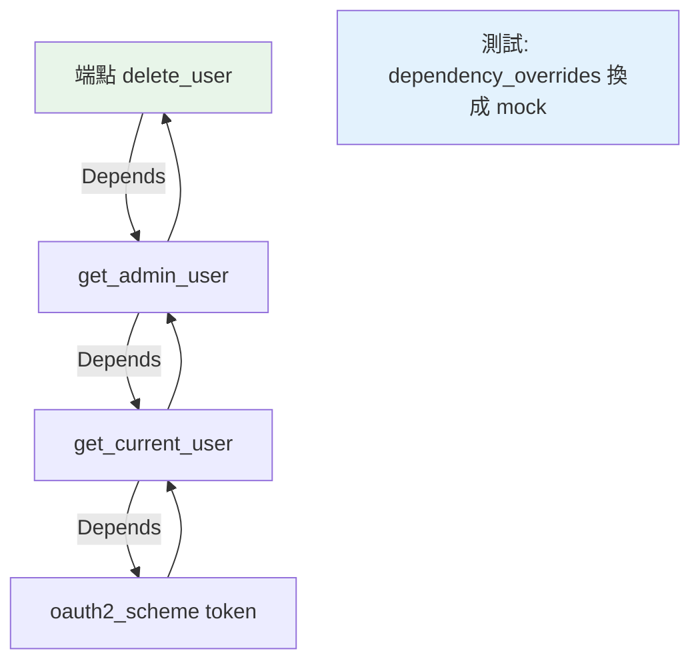

# FastAPI 依賴注入 Depends

> `Depends` 是 FastAPI 的依賴注入系統——把「共用邏輯」（DB 連線、當前使用者、分頁參數）抽成依賴，端點用 `Depends()` 宣告需要它。它讓共用邏輯集中、可重用、可測試，是 FastAPI 最強大的特性之一。

## 💡 白話導讀（建議先讀）

很多端點需要同樣的東西：DB 連線、「目前登入的使用者」、分頁參數。每個端點自己弄一遍？

如果你讀過 [Part 12 的 fixture](../12-testing/04-fixtures.md),FastAPI 的 `Depends` 會非常眼熟——**同一招:參數宣告需要什麼,框架自動送上**：

```python
from fastapi import Depends

async def get_current_user(token: str = Header()) -> User:
    return decode_and_verify(token)          # 共用邏輯寫一次

@app.get("/me")
async def me(user: User = Depends(get_current_user)):   # 點餐:我要「當前使用者」
    return user     # 進到這裡,user 已經驗好、拿好了

@app.get("/orders")
async def orders(user: User = Depends(get_current_user)):  # 另一個端點,同一道菜
    ...
```

這就是[依賴注入](../16-architecture/03-dependency-injection.md)——「要什麼用宣告的,別自己動手拿」。四個紅利：

1. **寫一次,處處用**——驗 token 的邏輯只有一份。
2. **可巢狀**——依賴可以依賴別的依賴(get_current_user 依賴 get_db),FastAPI 遞迴解析。
3. **測試可換菜**——`app.dependency_overrides[get_db] = fake_db`,測試時整鍋換成假的([第 15 章](15-testclient.md)的殺手鐧)。
4. **需要收尾的用 yield**——yield 前開連線、yield 後關([Part 6 流水線](../06-error-handling/07-contextlib.md)又一次)。

[task-api 的 deps.py](../../project/) 就是這章的實戰樣本。

## Why（為什麼）

很多端點需要同樣的東西：一個 DB 連線、驗證過的當前使用者、共用的分頁參數。在每個端點重複這些邏輯很蠢，也難測試。**FastAPI 的 `Depends`（依賴注入）** 讓你把這些共用邏輯抽成「依賴」，端點只要宣告「我需要這個依賴」，FastAPI 自動提供。這是 FastAPI 最強大、最 Pythonic 的特性——把 [依賴注入](../16-architecture/03-dependency-injection.md) 的概念做成框架核心。理解它，你的 FastAPI 程式會乾淨、可重用、可測試。

## Theory（理論：依賴注入）

**依賴注入（DI，見 [DI](../16-architecture/03-dependency-injection.md)）**：不是「函式自己去建立/取得需要的東西」，而是「宣告需要、由外部提供」——同 [pytest fixture](../12-testing/04-fixtures.md) 的點餐模式。

FastAPI 的 `Depends`：

- **定義依賴**：一個函式（或類別），回傳端點需要的東西（DB 連線、當前使用者⋯⋯）——菜寫一次。
- **宣告需要**：端點參數用 `Depends(依賴函式)`——FastAPI 自動呼叫依賴、注入結果。
- **依賴可巢狀**：依賴可以有自己的依賴（FastAPI 遞迴解析）。

好處：**共用邏輯集中（寫一次）、可重用（多端點共用）、可測試（`dependency_overrides` 換假的）、可組合（依賴用依賴）**。

## Specification（規範：Depends 用法）

```python
from fastapi import Depends, FastAPI, HTTPException

app = FastAPI()

# 定義依賴（函式）
def get_db():
    db = create_connection()
    try:
        yield db              # yield 依賴（含清理，類似 fixture）
    finally:
        db.close()

def get_current_user(token: str = Depends(oauth2_scheme)):
    user = decode_token(token)
    if not user:
        raise HTTPException(401)
    return user

# 端點宣告需要依賴
@app.get("/users/me")
def read_me(user = Depends(get_current_user)):    # 注入當前使用者
    return user

@app.get("/items")
def list_items(db = Depends(get_db)):             # 注入 DB 連線
    return db.query(...)

# 依賴用依賴（巢狀）
def get_admin(user = Depends(get_current_user)):  # 依賴 get_current_user
    if not user.is_admin:
        raise HTTPException(403)
    return user
```

## Implementation（定義依賴、yield 清理、巢狀、可測試性）

### 定義與使用依賴

```python
from fastapi import Depends, FastAPI

app = FastAPI()

# 共用的分頁參數依賴
def pagination(page: int = 1, limit: int = 20) -> dict:
    return {"page": page, "limit": limit, "offset": (page - 1) * limit}

@app.get("/users")
def list_users(params: dict = Depends(pagination)):
    # params 自動注入 {'page':..., 'limit':..., 'offset':...}
    return {"page": params["page"], "users": [...]}

@app.get("/orders")
def list_orders(params: dict = Depends(pagination)):   # 重用同一依賴
    return {"page": params["page"], "orders": [...]}
```

`pagination` 依賴被多個端點重用——分頁邏輯寫一次。FastAPI 自動呼叫依賴、注入結果。依賴的參數（`page`/`limit`）也自動變成端點的 query 參數（顯示在文件）。

### `yield` 依賴：含清理

依賴用 `yield`（類似 [fixture](../12-testing/04-fixtures.md) 與 [context manager](../06-error-handling/06-context-manager.md)）——`yield` 前是設定、`yield` 的值注入、`yield` 後是清理：

```python
def get_db():
    db = SessionLocal()       # 設定：建立 DB session
    try:
        yield db              # 注入給端點
    finally:
        db.close()            # 清理：關閉（即使端點出錯也執行）

@app.get("/users")
def list_users(db = Depends(get_db)):
    return db.query(User).all()
    # 端點結束後，get_db 的 finally 自動關閉 db
```

`yield` 依賴保證清理（關 DB 連線、釋放資源）——這是管理「每請求資源」的標準做法（見 [async DB](../15-database/19-async-database.md)）。

### 巢狀依賴：依賴用依賴

依賴可以有自己的依賴——FastAPI 遞迴解析整條鏈：

```python
def get_current_user(token: str = Depends(oauth2_scheme)):
    return decode_token(token)

def get_admin_user(user = Depends(get_current_user)):    # 依賴前者
    if not user.is_admin:
        raise HTTPException(403, "需要管理員")
    return user

@app.delete("/users/{id}")
def delete_user(id: int, admin = Depends(get_admin_user)):  # 只需宣告最終的
    ...   # admin 已確保是管理員
```

`delete_user` 只宣告 `get_admin_user`，FastAPI 自動解析 `get_admin_user → get_current_user → oauth2_scheme` 整條鏈。這讓認證授權（見 [認證授權](09-auth.md)）能模組化組合。

### 可測試性：覆寫依賴

`Depends` 的一大好處是**測試時可覆寫依賴**——用假的 DB、假的使用者，不必真的連 DB/登入（見 [TestClient](15-testclient.md)）：

```python
# 測試時覆寫依賴
def override_get_db():
    return fake_db

app.dependency_overrides[get_db] = override_get_db   # 換成假的

# 測試就用 fake_db，不碰真實 DB
```

`dependency_overrides` 讓測試能注入 mock（見 [mock](../12-testing/06-mock.md)）——這是 `Depends` 比 middleware 更適合認證/DB 的原因（可測試、可依端點）。

### 類別作為依賴

依賴也可以是類別（用 `__init__` 收參數、實例當依賴）：

```python
class CommonQueryParams:
    def __init__(self, q: str | None = None, limit: int = 100):
        self.q = q
        self.limit = limit

@app.get("/items")
def list_items(commons: CommonQueryParams = Depends()):   # Depends() 用類別本身
    return {"q": commons.q, "limit": commons.limit}
```

## Code Example（可執行的 Python 範例）

```python
# depends_demo.py — 展示依賴注入的概念（可獨立測試）
from __future__ import annotations

from collections.abc import Callable
from typing import Any


class DependencyResolver:
    """模擬 FastAPI 的依賴解析。"""

    def __init__(self) -> None:
        self.overrides: dict[Callable, Callable] = {}

    def resolve(self, dependency: Callable, **kwargs: Any) -> Any:
        """解析依賴（考慮覆寫，用於測試）。"""
        actual = self.overrides.get(dependency, dependency)
        return actual(**kwargs)


# 依賴：分頁參數
def pagination(page: int = 1, limit: int = 20) -> dict[str, int]:
    return {"page": page, "limit": limit, "offset": (page - 1) * limit}


# 依賴：當前使用者（模擬）
def get_current_user(token: str) -> dict[str, object]:
    if token == "valid-token":
        return {"id": 1, "name": "Alice", "is_admin": False}
    raise ValueError("401: 無效 token")


# 巢狀依賴：管理員
def get_admin(user: dict[str, object]) -> dict[str, object]:
    if not user["is_admin"]:
        raise ValueError("403: 需要管理員")
    return user


def demo() -> None:
    resolver = DependencyResolver()

    # 1. 分頁依賴（可重用）
    params = resolver.resolve(pagination, page=2, limit=10)
    print(f"分頁依賴: {params}")

    # 2. 認證依賴
    user = resolver.resolve(get_current_user, token="valid-token")
    print(f"當前使用者: {user['name']}")

    # 3. 授權（巢狀依賴）
    try:
        get_admin(user)
    except ValueError as e:
        print(f"授權檢查: {e}")

    # 4. 測試時覆寫依賴（注入假使用者）
    resolver.overrides[get_current_user] = lambda token: {"id": 99, "name": "TestUser", "is_admin": True}
    test_user = resolver.resolve(get_current_user, token="anything")
    print(f"\n覆寫後（測試）: {test_user['name']}（is_admin={test_user['is_admin']}）")

    print("\n重點：Depends 讓共用邏輯集中、可重用、可巢狀、可測試（覆寫）")


if __name__ == "__main__":
    demo()
```

**預期輸出**：

```pycon
$ python depends_demo.py
分頁依賴: {'page': 2, 'limit': 10, 'offset': 10}
當前使用者: Alice
授權檢查: 403: 需要管理員
覆寫後（測試）: TestUser（is_admin=True）

重點：Depends 讓共用邏輯集中、可重用、可巢狀、可測試（覆寫）
```

## Diagram（圖解：依賴注入與巢狀）



## Best Practice（最佳實踐）

- **共用邏輯用 `Depends` 抽成依賴**：DB 連線、當前使用者、分頁參數——寫一次、多端點重用。
- **每請求資源用 `yield` 依賴**（DB session 等）：保證清理（類似 fixture/context manager）。
- **認證授權用依賴**（`get_current_user`、`get_admin`，見 [認證授權](09-auth.md)）：可組合、可測試（勝過 middleware）。
- **巢狀依賴組合**：依賴用依賴，FastAPI 自動解析整條鏈。
- **測試用 `dependency_overrides` 覆寫**：注入 mock DB/使用者，不碰真實資源（見 [TestClient](15-testclient.md)）。
- **依賴保持聚焦單一**：一個依賴提供一種東西。
- **這是 FastAPI 版的 DI**（見 [DI](../16-architecture/03-dependency-injection.md)）：讓程式鬆耦合、可測試。

## Common Mistakes（常見誤解）

- **在每個端點重複共用邏輯**：DB 連線、認證重複；用 Depends 抽出。
- **`yield` 依賴忘了 finally 清理**：資源洩漏（DB 連線沒關）。
- **用 middleware 做認證而非 Depends**：middleware 套用全部、難測試；Depends 可依端點、可覆寫。
- **依賴做太多事**：一個依賴提供一種東西，保持聚焦。
- **測試不用 `dependency_overrides`**：真的連 DB/登入，慢又脆弱；覆寫成 mock。
- **不知道依賴的參數會變 query 參數**：依賴的 `page`/`limit` 自動變端點的 query（顯示在文件）。

## Interview Notes（面試重點）

- **知道 `Depends` 是 FastAPI 的依賴注入**：共用邏輯（DB/當前使用者/分頁）抽成依賴、端點宣告需要、FastAPI 自動注入——集中、可重用、可測試。
- 知道 **`yield` 依賴**（含清理，類似 fixture/context manager）管理每請求資源（DB session）。
- 知道**巢狀依賴**（依賴用依賴，自動解析鏈）——認證授權模組化。
- **知道 `dependency_overrides` 讓測試可覆寫依賴**（注入 mock）——這是 Depends 比 middleware 適合認證的原因（可測試、可依端點）。
- 能連結 [DI](../16-architecture/03-dependency-injection.md)：這是 FastAPI 把依賴注入做成核心。

---

➡️ 下一章：[async Web 與 background tasks](12-async-web-background.md)

[⬆️ 回 Part 14 索引](README.md)
