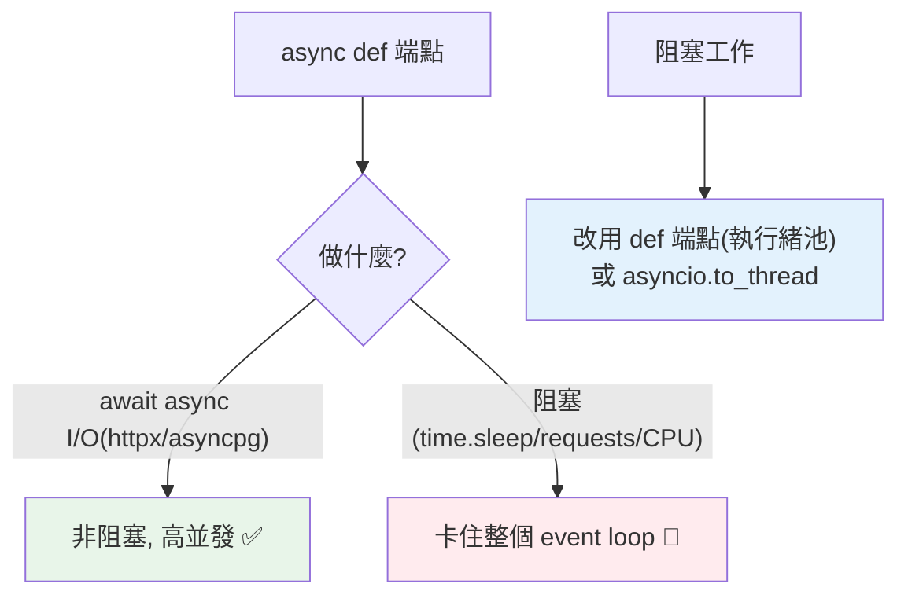

# async Web 與 background tasks

> FastAPI 的 async 讓一個 worker 並發處理大量 I/O 請求——但前提是「一路 async 到底」，一個阻塞操作就毀掉整個 event loop。加上 background tasks 讓你「回應後才做慢工作」。這章講 async Web 的實踐與陷阱。

## Why（為什麼）

FastAPI 的高並發來自 async（見 [WSGI/ASGI](01-wsgi-asgi.md)、[asyncio](../09-concurrency/07-asyncio-basics.md)）——但用不好反而更慢：一個阻塞操作（同步 DB 查詢、`requests`、重 CPU）會**卡住整個 event loop**，所有並發請求停擺。同時，有些工作（發 email、寫 log、處理檔案）不該讓使用者等——用 **background tasks** 在回應後才做。理解 async Web 的正確用法與陷阱，是寫高效 FastAPI 服務的關鍵。

## Theory（理論：async 端點與阻塞陷阱）

FastAPI 端點可以是 `async def`（非同步）或 `def`（同步）：

- **`async def` 端點**：在 event loop 執行——用於**非阻塞 I/O**（await async 操作）。多請求並發（等 I/O 時切換）。
- **`def` 端點**：FastAPI **自動丟到執行緒池**執行——避免同步程式阻塞 loop。

**關鍵陷阱**：**在 `async def` 端點裡做阻塞操作 = 卡住整個 event loop**（見 [to_thread](../09-concurrency/11-blocking-in-async.md)）——所有並發請求停擺。這是 async Web 最嚴重的效能殺手。

## Specification（規範：async 端點與 background tasks）

```python
from fastapi import FastAPI, BackgroundTasks

app = FastAPI()

# async 端點（非阻塞 I/O）
@app.get("/data")
async def get_data():
    result = await async_db_query()      # await async 操作（不阻塞）
    return result

# 同步端點（FastAPI 自動丟執行緒池）
@app.get("/compute")
def compute():
    return heavy_sync_work()             # 同步、可能阻塞，但在執行緒池

# background tasks（回應後才執行）
@app.post("/send-email")
async def send_email(email: str, background_tasks: BackgroundTasks):
    background_tasks.add_task(send_email_slow, email)  # 排入背景
    return {"message": "已排入寄送"}     # 立刻回應，不等 email 寄完
```

## Implementation（async 端點、阻塞陷阱、background tasks、真背景任務）

### async 端點：一路 async 到底

`async def` 端點用於「等外部 I/O」——用 **async 函式庫**（`httpx`、`asyncpg`、`aiofiles`）：

```python
import httpx

@app.get("/weather/{city}")
async def get_weather(city: str):
    async with httpx.AsyncClient() as client:
        resp = await client.get(f"https://api.weather.com/{city}")   # 非阻塞
        return resp.json()
```

多個這種請求能並發（等 API 時 event loop 處理別的請求）——這是 FastAPI 高並發的來源。前提是「**一路 async**」：用 async 版函式庫（`httpx` 而非 `requests`、`asyncpg` 而非同步 DB）。

### 🔴 阻塞陷阱：卡住 event loop

**在 `async def` 裡做阻塞操作是災難**：

```python
# 🔴 危險：async 端點裡阻塞
@app.get("/bad")
async def bad():
    time.sleep(5)                # 阻塞！卡住整個 event loop 5 秒
    resp = requests.get(url)     # 阻塞！同步 HTTP 卡住 loop
    return resp.json()
    # 這 5 秒內，所有其他並發請求都停擺！

# ✅ 正解一：用 async 函式庫
@app.get("/good")
async def good():
    async with httpx.AsyncClient() as client:
        resp = await client.get(url)   # 非阻塞
        return resp.json()

# ✅ 正解二：阻塞操作丟執行緒池（用 def 端點或 to_thread）
@app.get("/good2")
def good2():                     # def 端點自動丟執行緒池
    resp = requests.get(url)     # 同步，但在執行緒池不卡 loop
    return resp.json()
```

**規則**：`async def` 端點裡**只能 await async 操作**，不能有阻塞（`time.sleep`、`requests`、同步 DB、重 CPU）。有阻塞就用 `def` 端點（FastAPI 丟執行緒池）或 `asyncio.to_thread`（見 [to_thread](../09-concurrency/11-blocking-in-async.md)）。

### `def` vs `async def` 怎麼選

| 端點做什麼 | 用 |
|-----------|-----|
| 純 async I/O（await async 函式庫） | `async def` |
| 同步 I/O（`requests`、同步 DB）或 CPU 工作 | `def`（自動丟執行緒池） |
| 混合 | `async def` + `to_thread` 處理阻塞部分 |

**別在 `async def` 裡放阻塞** —— 要嘛全 async、要嘛用 `def`。

### Background tasks：回應後才做

有些工作不該讓使用者等——發 email、寫 log、清理、通知。**`BackgroundTasks`** 讓工作在**回應送出後**才執行：

```python
from fastapi import BackgroundTasks

def write_log(message: str):
    with open("log.txt", "a") as f:
        f.write(message + "\n")

@app.post("/orders")
async def create_order(order: Order, background_tasks: BackgroundTasks):
    save_order(order)
    background_tasks.add_task(write_log, f"訂單 {order.id} 建立")   # 排入背景
    background_tasks.add_task(send_notification, order.user_email)
    return {"id": order.id}      # 立刻回應，log/通知在回應後才做
```

使用者立刻收到回應（不等 log/email），這些工作在背景執行。適合「不影響回應、可稍後做」的輕量工作。

### 真正的背景任務：任務佇列

`BackgroundTasks` 適合**輕量、快速**的背景工作。**重、長、需可靠性的背景任務**（影片轉檔、批次處理、定時任務）該用**任務佇列（task queue）**——**Celery**、**RQ**、**Dramatiq**（見 [事件驅動與訊息佇列](../16-architecture/10-event-driven-mq.md)）：

```text
BackgroundTasks：輕量、與請求同生命週期、簡單（發 email、寫 log）
任務佇列（Celery）：重、可靠、可重試、可監控、獨立 worker（轉檔、批次）
```

任務佇列把工作放進佇列（Redis/RabbitMQ），獨立的 worker 行程處理——可靠、可擴展、可重試。重活用它，別用 BackgroundTasks（那和請求同生命週期，伺服器重啟就丟失）。

## Code Example（可執行的 Python 範例）

```python
# async_web_demo.py — 展示 async/阻塞的概念（可獨立測試）
from __future__ import annotations

import asyncio


async def async_io_task(name: str, delay: float) -> str:
    """非阻塞 I/O（正確：用 asyncio.sleep）。"""
    await asyncio.sleep(delay)  # 非阻塞
    return f"{name} 完成"


async def concurrent_requests(names: list[str]) -> list[str]:
    """多個 async 端點能並發（不阻塞）。"""
    return await asyncio.gather(*(async_io_task(n, 0.05) for n in names))


class BackgroundTaskQueue:
    """模擬 background tasks（回應後執行）。"""

    def __init__(self) -> None:
        self.tasks: list[str] = []
        self.executed: list[str] = []

    def add_task(self, description: str) -> None:
        self.tasks.append(description)

    def run_after_response(self) -> None:
        """模擬回應後執行背景任務。"""
        for task in self.tasks:
            self.executed.append(f"背景執行: {task}")


async def handle_order(order_id: int) -> tuple[dict, BackgroundTaskQueue]:
    """端點：立刻回應 + 排背景任務。"""
    bg = BackgroundTaskQueue()
    bg.add_task(f"寫 log: 訂單 {order_id}")
    bg.add_task(f"發通知: 訂單 {order_id}")
    response = {"id": order_id, "status": "created"}
    return response, bg  # 回應立刻返回，背景任務稍後執行


async def main() -> None:
    # 1. async 並發（多請求同時進行）
    results = await concurrent_requests(["A", "B", "C"])
    print(f"並發 async I/O: {results}")

    # 2. background tasks
    response, bg = await handle_order(42)
    print(f"\n立刻回應: {response}")
    bg.run_after_response()  # 回應後才執行
    print("回應後執行背景任務:")
    for entry in bg.executed:
        print(f"  {entry}")

    print("\n重點：async 端點只 await async 操作（別阻塞）；")
    print("      BackgroundTasks 輕量、Celery 重活")


if __name__ == "__main__":
    asyncio.run(main())
```

**預期輸出**：

```pycon
$ python async_web_demo.py
並發 async I/O: ['A 完成', 'B 完成', 'C 完成']

立刻回應: {'id': 42, 'status': 'created'}
回應後執行背景任務:
  背景執行: 寫 log: 訂單 42
  背景執行: 發通知: 訂單 42

重點：async 端點只 await async 操作（別阻塞）；
      BackgroundTasks 輕量、Celery 重活
```

## Diagram（圖解：async 端點與阻塞）



## Best Practice（最佳實踐）

- **async 端點一路 async 到底**：用 async 函式庫（`httpx`/`asyncpg`/`aiofiles`）、`asyncio.sleep`——別在 `async def` 裡阻塞。
- **阻塞/CPU 工作用 `def` 端點**（FastAPI 自動丟執行緒池）或 `asyncio.to_thread`（見 [to_thread](../09-concurrency/11-blocking-in-async.md)）。
- **輕量的「回應後才做」用 `BackgroundTasks`**（發 email、寫 log）。
- **重、長、需可靠的背景任務用任務佇列（Celery/RQ）**（見 [事件驅動](../16-architecture/10-event-driven-mq.md)）——別用 BackgroundTasks。
- **不確定端點該 async 還是 sync**：純 async I/O 用 async def、有阻塞用 def。
- **CPU 密集別用 async Web**：async 是為 I/O；CPU 重活用行程池（見 [如何選並發](../09-concurrency/13-choosing-concurrency-model.md)）。
- **量測並發效能**：確認 async 真的帶來並發（沒被阻塞卡住）。

## Common Mistakes（常見誤解）

- **在 `async def` 裡做阻塞操作**（`time.sleep`、`requests`、同步 DB、重 CPU）：卡住整個 event loop，所有請求停擺——async Web 頭號災難。
- **用 `requests` 而非 `httpx`**（在 async 端點）：阻塞；用 async 函式庫。
- **CPU 密集用 async 端點**：async 是為 I/O，CPU 重活卡 loop；用行程池。
- **重背景任務用 BackgroundTasks**：與請求同生命週期、伺服器重啟丟失、不可靠；用 Celery。
- **不知道 `def` 端點會丟執行緒池**：以為同步端點會卡 loop（其實 FastAPI 自動處理）。
- **background tasks 裡阻塞卻在 async context**：注意任務本身的 async/sync。

## Interview Notes（面試重點）

- **知道 async 端點的高並發來自 async I/O**，但**在 `async def` 裡阻塞會卡住整個 event loop**（所有請求停擺）——最嚴重的陷阱。
- 知道**一路 async 到底**（async 函式庫）、**阻塞/CPU 用 `def` 端點（FastAPI 自動丟執行緒池）或 `to_thread`**。
- 知道 **`def` vs `async def` 的選擇**（純 async I/O → async、阻塞/CPU → def）。
- 知道 **`BackgroundTasks`（輕量、回應後執行）vs 任務佇列 Celery（重、可靠、獨立 worker）** 的區別。
- 知道 **CPU 密集別用 async Web**（用行程池），能連結 [如何選並發](../09-concurrency/13-choosing-concurrency-model.md)。

---

➡️ 下一章：[WebSocket 即時通訊](13-websocket.md)

[⬆️ 回 Part 14 索引](README.md)
