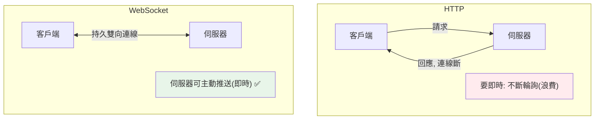

# WebSocket 即時通訊

> HTTP 是「請求-回應」的單向模式，不適合即時（聊天、通知、即時資料）。WebSocket 提供「持久、雙向」的連線——伺服器能主動推送給客戶端。這是 ASGI（非 WSGI）才支援的能力。

## 💡 白話導讀（建議先讀）

HTTP 的天生形狀是**寄信**:你寄一封（請求）,對方回一封（回應）,結束。
問題:**對方不能主動寄給你**——伺服器有新訊息（聊天、通知、即時行情）,只能等你下次來問（輪詢:每秒寄信問「有事嗎?」——又吵又慢）。

**WebSocket 是把信件升級成電話**:撥通一次,**線不掛**——之後**雙方隨時開口**,伺服器終於能主動推送。

| | HTTP(寄信) | WebSocket(電話) |
|--|-----------|-----------------|
| 方向 | 單向問答 | **雙向隨時說** |
| 連線 | 一問一答就斷 | **持久不掛線** |
| 伺服器主動推 | ❌ 只能等你問 | ✅ |
| 適合 | 一般 API | 聊天/通知/即時資料 |

接通的過程:先用 HTTP 敲門,協商「**升級**」成 WebSocket——之後就是持久雙向通道,直到一方掛斷。

FastAPI 寫法:

```python
@app.websocket("/ws")
async def chat(ws: WebSocket):
    await ws.accept()                      # 接起電話
    while True:
        msg = await ws.receive_text()      # 聽
        await ws.send_text(f"回音:{msg}")  # 說 —— 隨時可主動 send!
```

為什麼這章放在 async 之後?**幾千條不掛的電話線**,正是[單人服務生](../09-concurrency/07-asyncio-basics.md)的主場——每條線大部分時間在「等對方說話」,ASGI/asyncio 天生擅長。
（工程補充:斷線重連、多實例廣播要靠 Redis pub/sub——章內談。）

## Why（為什麼）

HTTP 是「客戶端問、伺服器答」——要即時更新（聊天訊息、股價、通知），客戶端得不斷輪詢（polling），浪費且有延遲。**WebSocket** 提供「持久、雙向」的連線——建立後雙方都能隨時發送，**伺服器能主動推送**給客戶端。這是聊天、即時通知、協作編輯、即時儀表板的基礎。WebSocket 需要 **ASGI**（見 [WSGI/ASGI](01-wsgi-asgi.md)）——這是 FastAPI（ASGI）能做、Flask（WSGI）不能的能力之一。

## Theory（理論：持久雙向連線）

**WebSocket** 與 HTTP 的根本差異——電話 vs 寄信：

| | HTTP | WebSocket |
|--|------|-----------|
| 模式 | 請求-回應（單向寄信） | 全雙工（雙向通話） |
| 連線 | 短暫（一問一答就斷） | 持久（接通後保持） |
| 推送 | ❌（客戶端要輪詢） | ✅（伺服器主動推） |
| 適合 | 一般 API | 即時（聊天/通知/串流） |

連線流程：**HTTP 握手升級成 WebSocket → 持久連線建立 → 雙方隨時收發 → 直到一方關閉**。

因為連線持久且雙向，伺服器能主動推送——「即時」的關鍵。而**幾千條長連線**正需要 ASGI 的非同步能力（見 [asyncio](../09-concurrency/07-asyncio-basics.md)——單人服務生顧幾千條不掛的電話線）。

## Specification（規範：FastAPI WebSocket）

```python
from fastapi import FastAPI, WebSocket, WebSocketDisconnect

app = FastAPI()

@app.websocket("/ws")
async def websocket_endpoint(websocket: WebSocket):
    await websocket.accept()              # 接受連線
    try:
        while True:
            data = await websocket.receive_text()    # 接收訊息
            await websocket.send_text(f"收到: {data}") # 送出訊息
    except WebSocketDisconnect:
        print("客戶端斷線")

# 也可收發 JSON
# data = await websocket.receive_json()
# await websocket.send_json({"key": "value"})
```

## Implementation（連線生命週期、廣播、連線管理）

### WebSocket 端點生命週期

```python
from fastapi import WebSocket, WebSocketDisconnect

@app.websocket("/ws/{client_id}")
async def websocket_endpoint(websocket: WebSocket, client_id: str):
    await websocket.accept()              # 1. 接受連線（握手）
    try:
        while True:                       # 2. 持續收發（連線保持）
            message = await websocket.receive_text()
            await websocket.send_text(f"{client_id}: {message}")
    except WebSocketDisconnect:           # 3. 客戶端斷線
        print(f"{client_id} 斷線")
```

流程：`accept()`（接受連線）→ `while` 迴圈持續 `receive`/`send`（連線保持）→ `WebSocketDisconnect`（斷線時拋出）。這與 HTTP 端點（一次請求一次回應）完全不同——是**持久的雙向對話**。

### 廣播：一對多推送

即時應用（聊天室）常需**廣播**——把一個客戶端的訊息推給所有連線的客戶端。要管理「所有連線」：

```python
from fastapi import WebSocket

class ConnectionManager:
    def __init__(self) -> None:
        self.active: list[WebSocket] = []

    async def connect(self, ws: WebSocket) -> None:
        await ws.accept()
        self.active.append(ws)

    def disconnect(self, ws: WebSocket) -> None:
        self.active.remove(ws)

    async def broadcast(self, message: str) -> None:
        for connection in self.active:        # 推給所有連線
            await connection.send_text(message)

manager = ConnectionManager()

@app.websocket("/chat")
async def chat(websocket: WebSocket):
    await manager.connect(websocket)
    try:
        while True:
            data = await websocket.receive_text()
            await manager.broadcast(f"訊息: {data}")   # 廣播給所有人
    except WebSocketDisconnect:
        manager.disconnect(websocket)
```

`ConnectionManager` 追蹤所有活躍連線、廣播訊息給全部——這是聊天室的核心模式。async + ASGI 讓一個 worker 能管理大量並發長連線。

### 多實例的挑戰：需要訊息佇列

上面的 `ConnectionManager` 只在**單一伺服器實例**內廣播——若你有多個伺服器實例（水平擴展，見 [Kubernetes](../19-cloud-native/06-kubernetes.md)），實例 A 的連線收到訊息，實例 B 的連線收不到（它們的 `active` 列表不同）。

解法：用 **Redis pub/sub 或訊息佇列**（見 [事件驅動](../16-architecture/10-event-driven-mq.md)、[訊息佇列](../22-distributed-systems/04-message-queue.md)）當「跨實例的廣播通道」——訊息發到 Redis、所有實例訂閱、各自推給自己的連線。這是生產級即時系統的架構。

### 認證與安全

WebSocket 也需要認證（見 [認證授權](09-auth.md））——但 WebSocket 握手的認證較特殊（不能用一般標頭的方式）：常用 query 參數帶 token、或握手時驗證 cookie。且要注意來源驗證（防跨站 WebSocket 劫持）。

## Code Example（可執行的 Python 範例）

```python
# websocket_demo.py — 展示連線管理與廣播邏輯（可獨立測試）
from __future__ import annotations


class FakeWebSocket:
    """模擬 WebSocket 連線。"""

    def __init__(self, client_id: str) -> None:
        self.client_id = client_id
        self.received: list[str] = []

    def send(self, message: str) -> None:
        self.received.append(message)


class ConnectionManager:
    """管理 WebSocket 連線並廣播。"""

    def __init__(self) -> None:
        self.active: list[FakeWebSocket] = []

    def connect(self, ws: FakeWebSocket) -> None:
        self.active.append(ws)

    def disconnect(self, ws: FakeWebSocket) -> None:
        if ws in self.active:
            self.active.remove(ws)

    def broadcast(self, message: str) -> None:
        for connection in self.active:
            connection.send(message)


def demo() -> None:
    manager = ConnectionManager()

    # 三個客戶端連線
    alice = FakeWebSocket("Alice")
    bob = FakeWebSocket("Bob")
    cara = FakeWebSocket("Cara")
    for ws in [alice, bob, cara]:
        manager.connect(ws)
    print(f"連線數: {len(manager.active)}")

    # Alice 發訊息 → 廣播給所有人
    manager.broadcast("Alice: 大家好")
    print(f"\nAlice 廣播後：")
    print(f"  Alice 收到: {alice.received}")
    print(f"  Bob 收到: {bob.received}")
    print(f"  Cara 收到: {cara.received}")

    # Cara 斷線後再廣播
    manager.disconnect(cara)
    manager.broadcast("Bob: Cara 走了")
    print(f"\nCara 斷線後 Bob 廣播：")
    print(f"  Bob 收到: {bob.received[-1]}")
    print(f"  Cara 收到數: {len(cara.received)}（斷線後沒收到新訊息）")

    print("\n重點：WebSocket 持久雙向、伺服器可主動推送；多實例需 Redis pub/sub")


if __name__ == "__main__":
    demo()
```

**預期輸出**：

```pycon
$ python websocket_demo.py
連線數: 3

Alice 廣播後：
  Alice 收到: ['Alice: 大家好']
  Bob 收到: ['Alice: 大家好']
  Cara 收到: ['Alice: 大家好']

Cara 斷線後 Bob 廣播：
  Bob 收到: Bob: Cara 走了
  Cara 收到數: 1（斷線後沒收到新訊息）

重點：WebSocket 持久雙向、伺服器可主動推送；多實例需 Redis pub/sub
```

## Diagram（圖解：HTTP vs WebSocket）



## Best Practice（最佳實踐）

- **即時需求（聊天、通知、即時資料）用 WebSocket**：持久雙向、伺服器可推送——勝過輪詢。
- **需要 ASGI**（FastAPI）：WebSocket 是 ASGI 能力（WSGb/Flask 不行，見 [WSGI/ASGI](01-wsgi-asgi.md)）。
- **用 ConnectionManager 管理連線 + 廣播**：追蹤活躍連線、處理斷線（`WebSocketDisconnect`）。
- **多實例用 Redis pub/sub / 訊息佇列跨實例廣播**（見 [事件驅動](../16-architecture/10-event-driven-mq.md)）：水平擴展的即時系統必需。
- **處理斷線與清理**：`WebSocketDisconnect` 時從管理器移除連線。
- **認證 WebSocket 連線**（token via query / cookie）、驗證來源（防劫持）。
- **簡單即時需求也可考慮 SSE（Server-Sent Events）**：單向推送（伺服器→客戶端）比 WebSocket 簡單。

## Common Mistakes（常見誤解）

- **用輪詢做即時**：浪費、有延遲；用 WebSocket。
- **在 WSGI（Flask）想用 WebSocket**：不支援；WebSocket 需要 ASGI（FastAPI）。
- **多實例的 ConnectionManager 只在單實例廣播**：其他實例的連線收不到；需 Redis pub/sub。
- **不處理斷線**：連線列表累積死連線；捕捉 `WebSocketDisconnect` 清理。
- **WebSocket 不認證**：任何人可連；要驗證 token/來源。
- **廣播時對已斷線的連線發送**：出錯；發送前處理斷線。
- **CPU 密集塞進 WebSocket handler**：卡住 event loop（見 [async Web](12-async-web-background.md)）。

## Interview Notes（面試重點）

- **能對比 HTTP（請求-回應、單向、短暫）vs WebSocket（全雙工、雙向、持久、伺服器可推送）**，及 WebSocket 適用即時場景（聊天/通知/串流）。
- 知道 **WebSocket 需要 ASGI**（FastAPI 支援、WSGI/Flask 不支援）。
- 知道連線生命週期（`accept` → `while receive/send` → `WebSocketDisconnect`）與 **ConnectionManager 廣播模式**。
- **知道多實例需 Redis pub/sub / 訊息佇列跨實例廣播**（水平擴展的即時系統）——連結分散式。
- 知道要處理斷線清理、認證 WebSocket、以及 SSE 是單向推送的簡單替代。

---

➡️ 下一章：[CORS、cookie 與 session](14-cors-cookie-session.md)

[⬆️ 回 Part 14 索引](README.md)
