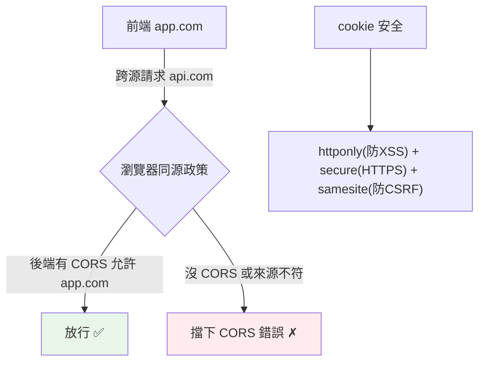

# CORS、cookie 與 session

> CORS 是瀏覽器的跨域安全機制（前後端分離必碰）、cookie 是伺服器在瀏覽器存小資料、session 用 cookie 維持登入。搞懂它們，才能正確處理前後端分離的認證與跨域。

## 💡 白話導讀（建議先讀）

前後端分離的第一天,幾乎人人撞牆:本機前端呼叫後端 API,瀏覽器紅字:

```text
... has been blocked by CORS policy ...
```

這不是 bug,是瀏覽器的**保安**在執勤。三個角色一次講清：

**1. 同源政策——瀏覽器的門禁。**
瀏覽器規定:網頁**預設只能呼叫「同源」的 API**(源=協定+網域+埠,一字不差)。
為什麼?防惡意網站:你開著銀行分頁,另一個惡意網站的 JS 若能隨意呼叫銀行 API(還自動帶上你的 cookie)——災難。門禁是保護**使用者**的。

**2. CORS——後端簽發的放行名單。**
前端 `app.com` 要打後端 `api.com`(跨源)——合法需求。
**由後端**在回應標頭聲明「我允許 app.com 來訪」,瀏覽器就放行:

```text
app.add_middleware(CORSMiddleware, allow_origins=["https://app.com"], ...)
```

重點:CORS 是**後端設定、瀏覽器執行**;`allow_origins=["*"]` 等於拆門禁,上線別這樣。

**3. cookie 與 session——無狀態世界的會員卡。**
[HTTP 沒有記憶](02-http-basics.md),「保持登入」靠:伺服器發**會員卡**(Set-Cookie),瀏覽器**每次請求自動出示**;卡上只寫編號(session id),詳細資料在櫃檯的本子(伺服器 session)裡查。
安全三旗標順手背:`HttpOnly`(JS 摸不到,防 XSS 偷卡)、`Secure`(只走 HTTPS)、`SameSite`(防 CSRF 冒用)。

## Why（為什麼）

前後端分離（React 前端 + FastAPI 後端，不同網域）時，你一定會遇到 **CORS 錯誤**（瀏覽器擋跨域請求）。而登入狀態的維持靠 **cookie / session**。這三者是「前後端分離的 Web 應用」繞不開的：CORS 決定跨域能不能通、cookie 存狀態、session 維持登入。搞錯會導致「前端連不到後端」「登入狀態丟失」「安全漏洞（CSRF）」。這章講清楚三者的機制與正確設定。

## Theory（理論：同源政策與 CORS）

**同源政策（Same-Origin Policy）** 是瀏覽器的安全門禁——**預設禁止網頁向「不同源」發送請求**（源 = 協定 + 網域 + 埠）。這防止惡意網站借你的瀏覽器（連同 cookie）偷打別站 API——保護的是使用者。

前後端分離時，前端（`https://app.com`）呼叫後端（`https://api.com`）——跨源，被擋。

**CORS（Cross-Origin Resource Sharing）** 是「放行跨源請求」的機制——**後端**透過回應標頭**明確允許**特定來源存取（簽發放行名單），瀏覽器據此放行。

**cookie / session**——無狀態世界的會員卡：

- **cookie**：伺服器透過 `Set-Cookie` 在瀏覽器存小資料，瀏覽器**每次請求自動帶上**。
- **session**：cookie 只存 session id（卡號），伺服器據此查使用者狀態（櫃檯的本子）（見[認證授權](09-auth.md)）。

## Specification（規範：CORS、cookie 設定）

```python
# --- CORS（FastAPI）---
from fastapi.middleware.cors import CORSMiddleware

app.add_middleware(
    CORSMiddleware,
    allow_origins=["https://app.example.com"],   # 允許的來源（別用 "*" 配 credentials）
    allow_credentials=True,                        # 允許帶 cookie
    allow_methods=["GET", "POST", "PUT", "DELETE"],
    allow_headers=["*"],
)

# --- 設定 cookie ---
from fastapi import Response

@app.post("/login")
def login(response: Response):
    response.set_cookie(
        key="session_id",
        value="abc123",
        httponly=True,        # JS 不能讀（防 XSS 偷 cookie）
        secure=True,          # 只在 HTTPS 傳送
        samesite="lax",       # 防 CSRF
        max_age=3600,         # 有效期（秒）
    )
    return {"message": "登入成功"}

# 讀 cookie
from fastapi import Cookie
@app.get("/me")
def me(session_id: str = Cookie(None)):
    return {"session": session_id}
```

## Implementation（CORS 設定、cookie 屬性、CSRF、session）

### CORS：允許跨源

前後端不同源時，後端要用 CORS middleware 允許前端的來源：

```python
from fastapi.middleware.cors import CORSMiddleware

app.add_middleware(
    CORSMiddleware,
    allow_origins=["https://myapp.com"],   # 明確列出允許的來源
    allow_credentials=True,                 # 若要帶 cookie
    allow_methods=["*"],
    allow_headers=["*"],
)
```

**關鍵安全點**：**`allow_origins` 別用 `"*"` 配 `allow_credentials=True`**——那等於「允許任何網站帶著使用者的 cookie 呼叫你的 API」（CSRF 風險）。要**明確列出**允許的來源。CORS 是 middleware（見 [middleware](07-middleware.md)），對每個請求檢查來源。

瀏覽器對某些跨源請求先發 **preflight（OPTIONS 請求）** 問「允許嗎」——CORS middleware 自動處理。

### cookie 的安全屬性

設 cookie 時，**安全屬性至關重要**（防 XSS/CSRF 偷 cookie/濫用）：

```python
response.set_cookie(
    key="session",
    value="...",
    httponly=True,      # 🔒 JS 讀不到（document.cookie）→ 防 XSS 偷 cookie
    secure=True,        # 🔒 只在 HTTPS 傳送 → 防竊聽
    samesite="lax",     # 🔒 限制跨站帶 cookie → 防 CSRF
    max_age=3600,
)
```

- **`httponly=True`**：JavaScript 無法讀取（`document.cookie` 看不到）——即使有 XSS 也偷不到 cookie（見 [XSS](../20-security-system-design/07-owasp-xss-csrf.md)）。**session cookie 一定要 httponly**。
- **`secure=True`**：只在 HTTPS 傳送——防明文竊聽。
- **`samesite`**：`lax`/`strict` 限制「跨站請求是否帶 cookie」——防 CSRF。

### CSRF：跨站請求偽造

**CSRF（Cross-Site Request Forgery）**：惡意網站誘導使用者的瀏覽器**帶著使用者的 cookie** 對你的網站發請求（如轉帳）——因為瀏覽器自動帶 cookie（見 [XSS/CSRF](../20-security-system-design/07-owasp-xss-csrf.md)）。防護：

- **`samesite` cookie 屬性**：限制跨站帶 cookie（主要防護）。
- **CSRF token**：表單/請求帶一個伺服器驗證的 token。
- **API 用 token 認證（Authorization 標頭）而非 cookie**：標頭不會被瀏覽器自動帶上，天然免疫 CSRF——這是 JWT（見 [JWT](../20-security-system-design/04-jwt.md)）在 API 場景勝過 cookie session 的一個原因。

### session vs token（回顧）

如 [認證授權](09-auth.md) 所述：

- **session（cookie）**：伺服器存 session、cookie 存 session id、瀏覽器自動帶——傳統 Web、有 CSRF 風險（需防護）。
- **token（JWT，Authorization 標頭）**：客戶端存 token、每次手動帶標頭——API/SPA、無 CSRF（標頭不自動帶）、無狀態。

前後端分離的 API 常用 **token 認證**（避免 cookie 的 CSRF 複雜性）；傳統伺服器渲染 Web 用 session cookie。

## Code Example（可執行的 Python 範例）

```python
# cors_cookie_demo.py — 展示 CORS 檢查與 cookie 安全屬性（可獨立測試）
from __future__ import annotations


def check_cors(origin: str, allowed_origins: list[str]) -> tuple[bool, str]:
    """模擬 CORS 來源檢查。"""
    if "*" in allowed_origins:
        return True, "允許任何來源（⚠️ 配 credentials 不安全）"
    if origin in allowed_origins:
        return True, "允許（來源在白名單）"
    return False, "拒絕（跨源被 CORS 擋）"


def build_secure_cookie(name: str, value: str) -> dict[str, object]:
    """建立安全的 cookie 設定。"""
    return {
        "key": name,
        "value": value,
        "httponly": True,  # 防 XSS 偷 cookie
        "secure": True,  # 只在 HTTPS
        "samesite": "lax",  # 防 CSRF
        "max_age": 3600,
    }


def demo() -> None:
    # 1. CORS 檢查
    allowed = ["https://myapp.com", "https://admin.myapp.com"]
    print("CORS 來源檢查：")
    for origin in ["https://myapp.com", "https://evil.com"]:
        ok, msg = check_cors(origin, allowed)
        mark = "✓" if ok else "✗"
        print(f"  {mark} {origin}: {msg}")

    # 危險設定
    ok, msg = check_cors("https://evil.com", ["*"])
    print(f"  ⚠️ allow_origins=['*']: {msg}")

    # 2. 安全 cookie
    cookie = build_secure_cookie("session_id", "abc123")
    print("\n安全 cookie 設定：")
    for key in ["httponly", "secure", "samesite"]:
        print(f"  {key}: {cookie[key]}")

    print("\n重點：")
    print("  - CORS 別用 '*' 配 credentials（CSRF 風險）")
    print("  - session cookie 要 httponly + secure + samesite")
    print("  - API 用 token(Authorization 標頭) 天然免疫 CSRF")


if __name__ == "__main__":
    demo()
```

**預期輸出**：

```pycon
$ python cors_cookie_demo.py
CORS 來源檢查：
  ✓ https://myapp.com: 允許（來源在白名單）
  ✗ https://evil.com: 拒絕（跨源被 CORS 擋）
  ⚠️ allow_origins=['*']: 允許任何來源（⚠️ 配 credentials 不安全）

安全 cookie 設定：
  httponly: True
  secure: True
  samesite: lax

重點：
  - CORS 別用 '*' 配 credentials（CSRF 風險）
  - session cookie 要 httponly + secure + samesite
  - API 用 token(Authorization 標頭) 天然免疫 CSRF
```

## Diagram（圖解：CORS 與同源政策）



## Best Practice（最佳實踐）

- **CORS 明確列出允許來源**，**別用 `"*"` 配 `allow_credentials=True`**（CSRF 風險）。
- **session cookie 一定要 `httponly=True`（防 XSS 偷）+ `secure=True`（HTTPS）+ `samesite`（防 CSRF）**。
- **API/SPA 優先用 token 認證（Authorization 標頭）**：無狀態、天然免疫 CSRF（標頭不自動帶）。
- **傳統 Web 用 session cookie 時，防 CSRF**：samesite + CSRF token。
- **CORS 是 middleware**（見 [middleware](07-middleware.md)）——用 `CORSMiddleware`。
- **理解同源政策是瀏覽器的保護**：CORS 是「有條件放行」，不是「關掉保護」。
- **用 HTTPS**：cookie/token 明文傳輸會被竊聽。

## Common Mistakes（常見誤解）

- **`allow_origins=["*"]` + `allow_credentials=True`**：允許任何網站帶 cookie 呼叫，CSRF 大洞——嚴重錯誤。
- **session cookie 沒 httponly**：XSS 能偷 cookie（`document.cookie`）；一定 httponly。
- **cookie 沒 secure 卻在 HTTPS**：可能明文傳；設 secure。
- **不設 samesite**：CSRF 風險；設 lax/strict。
- **前後端不同源忘了設 CORS**：前端連不到後端（CORS 錯誤）；設 CORSMiddleware。
- **API 用 cookie session 卻不防 CSRF**：漏洞；用 token 或 CSRF 防護。
- **不用 HTTPS**：cookie/token 被竊聽。
- **以為 CORS 是後端安全機制**：CORS 是瀏覽器機制（保護使用者），不擋非瀏覽器的直接請求。

## Interview Notes（面試重點）

- **知道同源政策（瀏覽器安全機制，禁止跨源）與 CORS（有條件放行跨源）**——前後端分離必碰。
- **關鍵安全：CORS 別用 `"*"` 配 credentials**（CSRF 風險）、明確列來源。
- **知道 cookie 安全屬性：`httponly`（防 XSS 偷）、`secure`（HTTPS）、`samesite`（防 CSRF）**——session cookie 都要設。
- **知道 CSRF**（跨站帶 cookie 偽造請求）與防護（samesite、CSRF token、或用 token 認證天然免疫）。
- **能對比 session cookie（自動帶、有 CSRF 風險）vs token 認證（Authorization 標頭、無 CSRF、適合 API）**。
- 知道 CORS 是瀏覽器機制（不擋直接請求）、要用 HTTPS。

---

➡️ 下一章：[測試 Web：TestClient](15-testclient.md)

[⬆️ 回 Part 14 索引](README.md)
