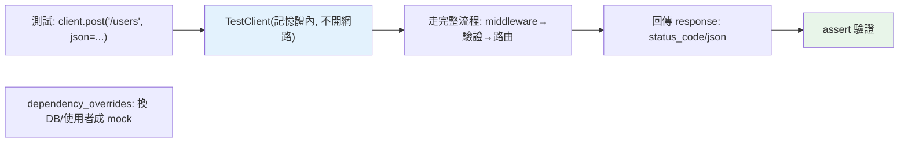

# 測試 Web：TestClient

> FastAPI 的 `TestClient` 讓你像發真實 HTTP 請求一樣測試 API——但不必真的啟動伺服器。配合 pytest、依賴覆寫，你能快速、可靠地測試每個端點的行為。

## 💡 白話導讀（建議先讀）

API 寫好了怎麼測?難道要:啟動伺服器 → 開 Postman 手點 → 眼睛比對結果?

FastAPI 的 `TestClient` 讓你**不開店就試菜**——請求直接在記憶體裡送進你的應用,不走網路、不起伺服器：

```python
from fastapi.testclient import TestClient
from myapp.main import app

client = TestClient(app)

def test_create_user():
    resp = client.post("/users", json={"name": "Alice"})   # 像真的發 HTTP
    assert resp.status_code == 201
    assert resp.json()["name"] == "Alice"
```

寫起來就是 [pytest](../12-testing/03-pytest-basics.md) + [httpx 語法](../11-stdlib/14-http-client.md)——你全都會了。

它的珍貴在**快而且真**:不開網路所以飛快;但請求走的是**完整的真實流程**(middleware、驗證、路由、例外處理全過一遍)——測到的是真行為,不是 mock 拼裝。

殺手鐧是和[依賴注入](11-fastapi-depends.md)的組合技——**dependency_overrides 換食材**:

```python
app.dependency_overrides[get_db] = lambda: fake_db          # DB 換成記憶體假貨
app.dependency_overrides[get_current_user] = lambda: test_user  # 直接「已登入」
```

真 DB、真登入流程通通不用碰——這正是 [task-api 測試](../../project/)的寫法,端到端快又穩。
(這也回答了為什麼架構要用 DI——**可測試性是設計出來的**,[Part 16](../16-architecture/03-dependency-injection.md) 收割。)

## Why（為什麼）

Web API 也要測試（見 [為什麼測試](../12-testing/01-why-testing.md)）——確認端點回對的狀態碼、對的資料、正確處理錯誤與認證。但「真的啟動伺服器、發 HTTP 請求」慢又麻煩。FastAPI 的 **`TestClient`** 讓你**在測試裡直接呼叫 API**（不啟動伺服器、不開網路），像發真實請求一樣拿到回應。配合 pytest（見 [pytest 基礎](../12-testing/03-pytest-basics.md)）與依賴覆寫（見 [Depends](11-fastapi-depends.md)），能快速、可靠地測試 Web 應用。這章講清楚 Web 測試的實踐。

## Theory（理論：不啟動伺服器的 HTTP 測試）

`TestClient`（基於 httpx）**在記憶體內**直接把請求送給你的 ASGI 應用——不經過真實網路、不啟動伺服器（不開店試菜）：

- **像發真實 HTTP**：`client.get("/users")`、`client.post("/users", json=...)`——語法同 httpx（見 [HTTP client](../11-stdlib/14-http-client.md)）。
- **快**：不開網路、不啟動伺服器。
- **完整**：走完整請求流程（middleware、驗證、路由、例外處理）——測到真實行為。

配合依賴覆寫（`dependency_overrides`），能把 DB、認證換成假的——測試不碰真實資源（換食材）。

## Specification（規範：TestClient 用法）

```python
from fastapi.testclient import TestClient
from myapp import app

client = TestClient(app)

def test_read_users():
    response = client.get("/users")
    assert response.status_code == 200
    assert response.json() == [...]

def test_create_user():
    response = client.post("/users", json={"name": "Alice", "age": 30})
    assert response.status_code == 201
    assert response.json()["name"] == "Alice"

def test_validation_error():
    response = client.post("/users", json={"name": ""})  # 缺 age
    assert response.status_code == 422    # pydantic 驗證失敗

def test_with_auth():
    response = client.get("/me", headers={"Authorization": "Bearer token"})
    assert response.status_code == 200

# 依賴覆寫（測試用假 DB/使用者）
app.dependency_overrides[get_db] = lambda: fake_db
```

## Implementation（基本測試、狀態碼、依賴覆寫、fixture）

### 基本 API 測試

```python
from fastapi.testclient import TestClient
from myapp import app

client = TestClient(app)

def test_get_user():
    response = client.get("/users/1")
    assert response.status_code == 200
    data = response.json()
    assert data["id"] == 1

def test_create_and_verify():
    # POST 建立
    create_resp = client.post("/users", json={"name": "Bob", "email": "b@c.com"})
    assert create_resp.status_code == 201
    user_id = create_resp.json()["id"]

    # GET 驗證
    get_resp = client.get(f"/users/{user_id}")
    assert get_resp.json()["name"] == "Bob"
```

`TestClient` 的方法（`get`/`post`/`put`/`delete`）對應 HTTP 方法，回傳 response 物件（`.status_code`、`.json()`、`.headers`）——像用 httpx（見 [HTTP client](../11-stdlib/14-http-client.md)）。

### 測試各種情況

好的 API 測試涵蓋**成功、驗證失敗、找不到、認證、授權**（見 [為什麼測試](../12-testing/01-why-testing.md) 的邊界/錯誤）：

```python
def test_success():
    assert client.get("/users/1").status_code == 200

def test_not_found():
    assert client.get("/users/99999").status_code == 404

def test_validation_error():
    resp = client.post("/users", json={"age": 200})  # 缺 name、age 超範圍
    assert resp.status_code == 422
    assert "detail" in resp.json()      # pydantic 詳細錯誤

def test_unauthorized():
    assert client.get("/me").status_code == 401       # 未帶 token

def test_forbidden():
    resp = client.delete("/users/1", headers=normal_user_token)
    assert resp.status_code == 403                    # 非 admin
```

配 [參數化](../12-testing/05-parametrize.md) 測多組輸入更省。

### 依賴覆寫：測試用假 DB/使用者

`TestClient` 配 **`dependency_overrides`**（見 [Depends](11-fastapi-depends.md)）——把真實依賴（DB、當前使用者）換成 mock，測試不碰真實資源：

```python
from myapp import app, get_db, get_current_user

# 測試用的假 DB
def override_get_db():
    return fake_test_db

# 測試用的假使用者
def override_get_current_user():
    return {"id": 1, "name": "TestUser", "is_admin": True}

app.dependency_overrides[get_db] = override_get_db
app.dependency_overrides[get_current_user] = override_get_current_user

def test_admin_endpoint():
    # 因為覆寫了 get_current_user 成 admin，不必真的登入
    response = client.delete("/users/2")
    assert response.status_code == 204

# 測試後清除覆寫
app.dependency_overrides.clear()
```

依賴覆寫是 FastAPI 測試的**殺手級功能**——不必真的連 DB、不必真的登入，用假的注入。這是 `Depends` 設計為可測試的體現（見 [Depends](11-fastapi-depends.md)）。

### 配 pytest fixture

用 pytest fixture（見 [fixture](../12-testing/04-fixtures.md)）管理 TestClient 與覆寫：

```python
import pytest
from fastapi.testclient import TestClient
from myapp import app, get_db

@pytest.fixture
def client():
    # setup：覆寫依賴
    app.dependency_overrides[get_db] = lambda: fake_db
    yield TestClient(app)
    # teardown：清除覆寫
    app.dependency_overrides.clear()

def test_users(client):
    assert client.get("/users").status_code == 200
```

fixture 讓每個測試有乾淨的 client 與依賴覆寫、測試後自動清理——這是組織 Web 測試的標準做法。

### 測試 WebSocket

`TestClient` 也能測 WebSocket（見 [WebSocket](13-websocket.md)）：

```python
def test_websocket():
    with client.websocket_connect("/ws") as websocket:
        websocket.send_text("hello")
        data = websocket.receive_text()
        assert data == "收到: hello"
```

## Code Example（可執行的 Python 範例）

```python
# testclient_demo.py — 展示 API 測試邏輯（模擬 TestClient，可獨立執行）
from __future__ import annotations


class FakeAPI:
    """模擬一個 API（示範測試邏輯）。"""

    def __init__(self) -> None:
        self.users: dict[int, dict] = {1: {"id": 1, "name": "Alice"}}
        self.current_user: dict | None = None

    def get_user(self, user_id: int) -> tuple[dict, int]:
        if user_id in self.users:
            return self.users[user_id], 200
        return {"detail": "找不到"}, 404

    def create_user(self, data: dict) -> tuple[dict, int]:
        if "name" not in data or not data["name"]:
            return {"detail": "name 為必填"}, 422  # 驗證失敗
        new_id = max(self.users) + 1
        user = {"id": new_id, "name": data["name"]}
        self.users[new_id] = user
        return user, 201

    def delete_user(self, user_id: int) -> tuple[dict, int]:
        if self.current_user is None:
            return {"detail": "未認證"}, 401
        if not self.current_user.get("is_admin"):
            return {"detail": "需要 admin"}, 403
        self.users.pop(user_id, None)
        return {}, 204


def demo() -> None:
    api = FakeAPI()

    # 測試各種情況（像 TestClient 測試）
    print("API 測試（各種情況）：")
    _, status = api.get_user(1)
    print(f"  GET /users/1 → {status}（成功）")

    _, status = api.get_user(999)
    print(f"  GET /users/999 → {status}（找不到）")

    _, status = api.create_user({"name": "Bob"})
    print(f"  POST /users(有name) → {status}（建立）")

    _, status = api.create_user({"name": ""})
    print(f"  POST /users(空name) → {status}（驗證失敗）")

    # 認證/授權（依賴覆寫模擬）
    _, status = api.delete_user(2)
    print(f"  DELETE(未登入) → {status}（未認證）")

    api.current_user = {"id": 1, "is_admin": False}  # 覆寫成一般使用者
    _, status = api.delete_user(2)
    print(f"  DELETE(一般使用者) → {status}（未授權）")

    api.current_user = {"id": 1, "is_admin": True}  # 覆寫成 admin
    _, status = api.delete_user(2)
    print(f"  DELETE(admin) → {status}（成功）")

    print("\n重點：TestClient 不啟動伺服器測 API；dependency_overrides 換 mock")


if __name__ == "__main__":
    demo()
```

**預期輸出**：

```pycon
$ python testclient_demo.py
API 測試（各種情況）：
  GET /users/1 → 200（成功）
  GET /users/999 → 404（找不到）
  POST /users(有name) → 201（建立）
  POST /users(空name) → 422（驗證失敗）
  DELETE(未登入) → 401（未認證）
  DELETE(一般使用者) → 403（未授權）
  DELETE(admin) → 204（成功）

重點：TestClient 不啟動伺服器測 API；dependency_overrides 換 mock
```

## Diagram（圖解：TestClient 測試流程）



## Best Practice（最佳實踐）

- **用 `TestClient` 測 API**：不啟動伺服器、走完整流程、快又完整。
- **測各種情況**：成功、驗證失敗（422）、找不到（404）、未認證（401）、未授權（403）——涵蓋邊界與錯誤。
- **用 `dependency_overrides` 換 mock**：假 DB、假使用者——測試不碰真實資源、不必真登入（見 [Depends](11-fastapi-depends.md)）。
- **用 pytest fixture 管理 client 與覆寫**（setup/teardown，見 [fixture](../12-testing/04-fixtures.md)）。
- **配參數化測多組輸入**（見 [參數化](../12-testing/05-parametrize.md)）。
- **驗證 status_code + json + 必要的標頭**：不只測成功，也測回傳內容正確。
- **測試進 CI**（見 [CI/CD](../19-cloud-native/05-ci-cd.md)）：每次 push 自動測 API。

## Common Mistakes（常見誤解）

- **真的啟動伺服器 + 發網路請求測 API**：慢、脆弱；用 TestClient（記憶體內）。
- **測試真的連 DB/呼叫外部**：慢、有副作用；用 dependency_overrides 換 mock。
- **只測成功路徑**：漏了 422/404/401/403；測各種情況。
- **不清除 dependency_overrides**：測試間互相污染；fixture teardown 清除。
- **只測 status_code 不測 json**：回對狀態碼但資料錯也算過；驗證回傳內容。
- **不測認證/授權**：安全相關的端點沒測；用覆寫模擬各種使用者。
- **Web 測試不進 CI**：手動測會漏；納入 CI。

## Interview Notes（面試重點）

- **知道 `TestClient`（基於 httpx）在記憶體內測 API**：不啟動伺服器、走完整流程（middleware/驗證/路由）、快又完整。
- 知道**測各種情況**：成功、422 驗證失敗、404、401 未認證、403 未授權。
- **知道 `dependency_overrides` 換 mock DB/使用者**——不碰真實資源、不必真登入（這是 `Depends` 可測試的體現）。
- 知道**配 pytest fixture 管理 client 與覆寫**（setup/teardown）、配參數化測多組。
- 知道驗證 status_code + json、測試進 CI、TestClient 也能測 WebSocket。

---

➡️ 下一章：[例外處理與錯誤回應](16-exception-handlers.md)

[⬆️ 回 Part 14 索引](README.md)
