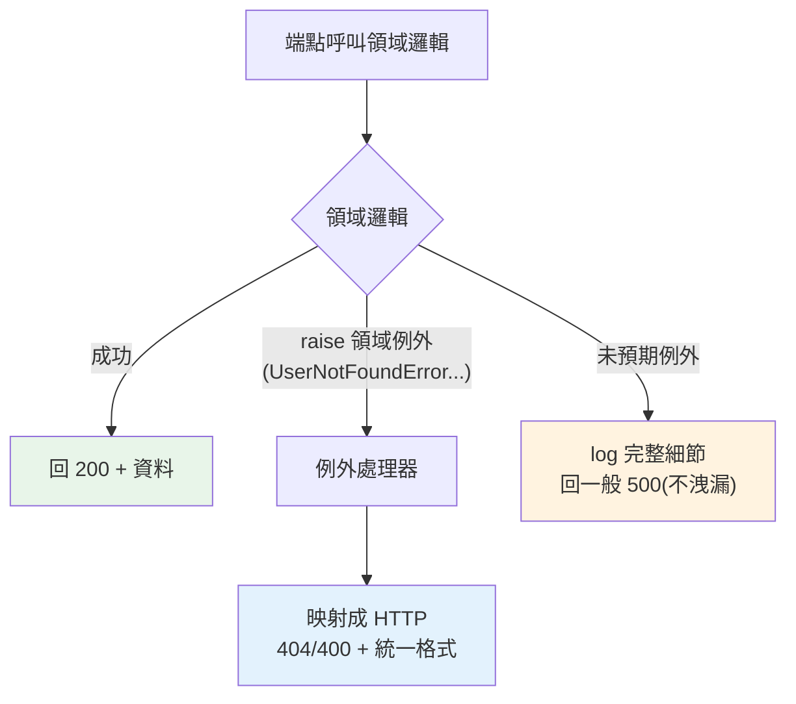

# 例外處理與錯誤回應

> API 出錯時，該回什麼？隨便讓例外冒出成 500、還是回「乾淨、一致、對客戶端有用」的錯誤？FastAPI 的 `HTTPException` 與例外處理器讓你把錯誤變成結構化的 HTTP 回應——這是專業 API 的分水嶺。

## Why（為什麼）

API 一定會遇到錯誤：找不到資源、驗證失敗、沒權限、外部服務掛掉。**怎麼回應錯誤，決定 API 的專業程度**。糟糕的 API 讓例外直接冒出變成 `500 Internal Server Error`（洩漏堆疊、客戶端無從處理）；好的 API 回**結構化、一致、正確狀態碼**的錯誤回應（`404` + `{"detail": "找不到使用者"}`）。這章講清楚 FastAPI 的錯誤處理——`HTTPException`、自訂例外處理器、統一錯誤格式——把 [錯誤處理](../06-error-handling/01-exceptions-basics.md) 的原則落實到 Web。

## Theory（理論：例外到 HTTP 回應的映射）

Web API 的錯誤處理核心是：**把 Python 例外映射成正確的 HTTP 回應**。

- **HTTP 狀態碼有語意**（見 [HTTP 基礎](02-http-basics.md)）：`400` 客戶端錯、`401` 未認證、`403` 未授權、`404` 找不到、`422` 驗證失敗、`500` 伺服器錯。錯誤要回**對的狀態碼**。
- **FastAPI 的 `HTTPException`**：在端點裡 `raise HTTPException(404, "找不到")`，FastAPI 轉成 `404` 回應 + JSON body。
- **例外處理器（exception handler）**：把「自訂領域例外」統一轉成 HTTP 回應——領域邏輯拋乾淨的例外（`UserNotFoundError`），處理器負責轉成 HTTP。

關鍵原則：**領域邏輯不該知道 HTTP**（見 [分層架構](../16-architecture/01-layered-architecture.md)）——它拋領域例外，Web 層的例外處理器負責映射成狀態碼。

## Specification（規範：HTTPException 與例外處理器）

```python
from fastapi import FastAPI, HTTPException, Request
from fastapi.responses import JSONResponse

app = FastAPI()

# 1. 端點直接拋 HTTPException
@app.get("/users/{user_id}")
def get_user(user_id: int):
    user = db.get(user_id)
    if user is None:
        raise HTTPException(status_code=404, detail="找不到使用者")
    return user

# 2. 帶自訂標頭的 HTTPException
raise HTTPException(
    status_code=401,
    detail="未認證",
    headers={"WWW-Authenticate": "Bearer"},
)

# 3. 自訂領域例外 + 例外處理器
class UserNotFoundError(Exception):
    def __init__(self, user_id: int):
        self.user_id = user_id

@app.exception_handler(UserNotFoundError)
def handle_user_not_found(request: Request, exc: UserNotFoundError):
    return JSONResponse(
        status_code=404,
        content={"detail": f"找不到使用者 {exc.user_id}", "code": "USER_NOT_FOUND"},
    )
```

## Implementation（HTTPException、自訂例外、統一格式、驗證錯誤）

### HTTPException：端點的標準錯誤

在端點裡發現問題，用 `HTTPException` 拋出正確狀態碼——FastAPI 轉成 HTTP 回應：

```python
from fastapi import HTTPException

@app.get("/orders/{order_id}")
def get_order(order_id: int, user=Depends(get_current_user)):
    order = db.get_order(order_id)
    if order is None:
        raise HTTPException(404, "找不到訂單")            # 找不到
    if order.owner_id != user.id:
        raise HTTPException(403, "無權存取此訂單")         # 沒權限
    return order
```

`HTTPException(status_code, detail)` 回 `{"detail": "..."}` + 對應狀態碼。**每種錯誤回對的狀態碼**（404 找不到、403 沒權限）——客戶端能據此處理（見 [HTTP 基礎](02-http-basics.md) 的狀態碼語意）。

### 自訂領域例外 + 處理器：分離關注點

更好的架構：**領域邏輯拋領域例外（不含 HTTP），Web 層用例外處理器映射成 HTTP**——領域層不依賴 Web（見 [分層架構](../16-architecture/01-layered-architecture.md)、[自訂例外](../06-error-handling/04-custom-exceptions.md)）：

```python
# --- 領域層：拋乾淨的領域例外（不知道 HTTP）---
class DomainError(Exception):
    """所有領域例外的基底。"""

class UserNotFoundError(DomainError):
    def __init__(self, user_id: int) -> None:
        self.user_id = user_id
        super().__init__(f"找不到使用者 {user_id}")

class InsufficientBalanceError(DomainError):
    def __init__(self, needed: int, available: int) -> None:
        self.needed, self.available = needed, available

def transfer(from_id: int, amount: int) -> None:
    user = repo.get(from_id)
    if user is None:
        raise UserNotFoundError(from_id)          # 領域例外，不是 HTTPException
    if user.balance < amount:
        raise InsufficientBalanceError(amount, user.balance)
    ...

# --- Web 層：例外處理器映射成 HTTP ---
@app.exception_handler(UserNotFoundError)
def handle_not_found(request: Request, exc: UserNotFoundError):
    return JSONResponse(404, content={"detail": str(exc), "code": "USER_NOT_FOUND"})

@app.exception_handler(InsufficientBalanceError)
def handle_balance(request: Request, exc: InsufficientBalanceError):
    return JSONResponse(
        status_code=400,
        content={"detail": "餘額不足", "needed": exc.needed, "available": exc.available},
    )
```

好處：**領域邏輯乾淨（純業務，可在非 Web 場景重用、好測試）、HTTP 映射集中在 Web 層**。這是 [分層架構](../16-architecture/01-layered-architecture.md) 在錯誤處理的體現。

### 統一錯誤格式

好的 API 讓**所有錯誤回應格式一致**——客戶端能用同一套邏輯解析：

```python
# 統一錯誤格式：{"error": {"code": ..., "message": ..., "details": ...}}
from fastapi import Request
from fastapi.responses import JSONResponse

def error_response(status: int, code: str, message: str, details=None) -> JSONResponse:
    return JSONResponse(
        status_code=status,
        content={"error": {"code": code, "message": message, "details": details}},
    )

@app.exception_handler(DomainError)
def handle_domain_error(request: Request, exc: DomainError):
    # 統一處理所有領域例外
    return error_response(400, exc.__class__.__name__, str(exc))
```

一致的錯誤格式（都有 `code`、`message`）讓前端好處理——別讓每個端點回不同結構的錯誤。

### 覆寫驗證錯誤格式

pydantic 驗證失敗（見 [pydantic 驗證](06-pydantic-validation.md)）預設回 `422` + FastAPI 的格式。你可覆寫成自己的統一格式：

```python
from fastapi.exceptions import RequestValidationError

@app.exception_handler(RequestValidationError)
def handle_validation_error(request: Request, exc: RequestValidationError):
    return error_response(
        422, "VALIDATION_ERROR", "輸入驗證失敗", details=exc.errors()
    )
```

### 別洩漏內部細節

**生產環境的錯誤回應絕不能洩漏堆疊追蹤、內部路徑、SQL**（見 [安全](../20-security-system-design/01-security-mindset.md)）——那是資安風險。對「未預期的例外」回一般的 `500`，把細節寫進 log（見 [logging](../11-stdlib/12-logging.md)）給自己看，不回給客戶端：

```python
import logging

logger = logging.getLogger(__name__)

@app.exception_handler(Exception)
def handle_unexpected(request: Request, exc: Exception):
    logger.exception("未預期的錯誤")     # 完整細節進 log（給開發者）
    return error_response(500, "INTERNAL_ERROR", "伺服器內部錯誤")   # 客戶端只看到一般訊息
```

## Code Example（可執行的 Python 範例）

```python
# exception_handler_demo.py — 展示領域例外映射成 HTTP（可獨立測試）
from __future__ import annotations


# --- 領域層：領域例外（不知道 HTTP）---
class DomainError(Exception):
    """領域例外基底。"""


class UserNotFoundError(DomainError):
    def __init__(self, user_id: int) -> None:
        self.user_id = user_id
        super().__init__(f"找不到使用者 {user_id}")


class InsufficientBalanceError(DomainError):
    def __init__(self, needed: int, available: int) -> None:
        self.needed = needed
        self.available = available
        super().__init__("餘額不足")


# --- Web 層：把領域例外映射成 HTTP 回應 ---
def map_to_http(exc: Exception) -> tuple[int, dict[str, object]]:
    """例外處理器：領域例外 → (狀態碼, 統一錯誤 body)。"""
    if isinstance(exc, UserNotFoundError):
        return 404, {"error": {"code": "USER_NOT_FOUND", "message": str(exc)}}
    if isinstance(exc, InsufficientBalanceError):
        return 400, {
            "error": {
                "code": "INSUFFICIENT_BALANCE",
                "message": "餘額不足",
                "details": {"needed": exc.needed, "available": exc.available},
            }
        }
    # 未預期的例外：回一般 500，不洩漏細節
    return 500, {"error": {"code": "INTERNAL_ERROR", "message": "伺服器內部錯誤"}}


# --- 領域邏輯：拋乾淨的領域例外 ---
def transfer(balance: int, amount: int, user_exists: bool) -> str:
    if not user_exists:
        raise UserNotFoundError(1)
    if balance < amount:
        raise InsufficientBalanceError(amount, balance)
    return "轉帳成功"


def demo() -> None:
    cases = [
        ("正常轉帳", 1000, 500, True),
        ("使用者不存在", 1000, 500, False),
        ("餘額不足", 100, 500, True),
    ]
    print("領域例外 → HTTP 回應映射：")
    for name, balance, amount, exists in cases:
        try:
            result = transfer(balance, amount, exists)
            print(f"  {name}: 200 {result}")
        except DomainError as e:
            status, body = map_to_http(e)
            print(f"  {name}: {status} {body['error']}")

    # 未預期的例外
    status, body = map_to_http(RuntimeError("DB 連線失敗，密碼是 xxx"))
    print(f"  未預期錯誤: {status} {body['error']}（細節不洩漏，只進 log）")

    print("\n重點：領域拋乾淨例外、Web 層映射成 HTTP；統一格式；別洩漏內部細節")


if __name__ == "__main__":
    demo()
```

**預期輸出**：

```pycon
$ python exception_handler_demo.py
領域例外 → HTTP 回應映射：
  正常轉帳: 200 轉帳成功
  使用者不存在: 404 {'code': 'USER_NOT_FOUND', 'message': '找不到使用者 1'}
  餘額不足: 400 {'code': 'INSUFFICIENT_BALANCE', 'message': '餘額不足', 'details': {'needed': 500, 'available': 100}}
  未預期錯誤: 500 {'code': 'INTERNAL_ERROR', 'message': '伺服器內部錯誤'}（細節不洩漏，只進 log）

重點：領域拋乾淨例外、Web 層映射成 HTTP；統一格式；別洩漏內部細節
```

## Diagram（圖解：例外處理分層）



## Best Practice（最佳實踐）

- **端點的錯誤用 `HTTPException` 回對的狀態碼**：404 找不到、403 沒權限、400 客戶端錯——別讓例外冒成 500。
- **領域邏輯拋領域例外（不含 HTTP）、Web 層用例外處理器映射**（見 [分層架構](../16-architecture/01-layered-architecture.md)）：領域乾淨、可重用、好測。
- **統一錯誤格式**（都有 `code`/`message`）：客戶端用同一套邏輯解析。
- **未預期的例外回一般 500 + 細節進 log，絕不洩漏堆疊/內部路徑給客戶端**（見 [安全](../20-security-system-design/01-security-mindset.md)）。
- **善用狀態碼語意**（見 [HTTP 基礎](02-http-basics.md)）：讓客戶端能程式化處理錯誤。
- **可覆寫 `RequestValidationError`** 讓驗證錯誤符合你的統一格式（見 [pydantic 驗證](06-pydantic-validation.md)）。
- **錯誤也要測試**（見 [TestClient](15-testclient.md)）：測 404/403/422/500 回對的狀態碼與格式。

## Common Mistakes（常見誤解）

- **讓例外直接冒出變 500**：客戶端無從處理、洩漏堆疊；用 HTTPException/處理器回結構化錯誤。
- **所有錯誤都回 500 或都回 200**：狀態碼沒語意；回對的碼（404/403/400/422）。
- **領域邏輯直接拋 `HTTPException`**：領域層耦合 Web、難在非 Web 重用；拋領域例外、Web 層映射。
- **錯誤格式不一致**：每個端點回不同結構，前端難處理；統一格式。
- **回應洩漏堆疊/SQL/內部路徑**：資安風險；細節進 log，客戶端只看一般訊息。
- **不測錯誤路徑**：只測成功；測 404/403/422 等錯誤回應。
- **把 400（客戶端錯）當 500（伺服器錯）**：混淆責任歸屬；驗證/找不到是 4xx。

## Interview Notes（面試重點）

- **知道 `HTTPException(status_code, detail)` 是端點回錯誤的標準**——回對的狀態碼（404/403/400/422），別讓例外冒成 500。
- **能說出「領域邏輯拋領域例外、Web 層用例外處理器映射成 HTTP」的分層好處**（領域乾淨、可重用、好測，連結 [分層架構](../16-architecture/01-layered-architecture.md)）。
- 知道**統一錯誤格式**（code/message）的價值、**可覆寫 `RequestValidationError`**。
- **知道錯誤回應絕不能洩漏堆疊/內部細節**（資安）——未預期例外回一般 500、細節進 log。
- 知道善用**狀態碼語意**（4xx 客戶端錯 vs 5xx 伺服器錯）、錯誤路徑也要測試。

---

⬅️ 這是 Part 14 的最後一章。

[⬆️ 回 Part 14 索引](README.md) ｜ [下一 Part：資料庫 ➡️](../15-database/README.md)
