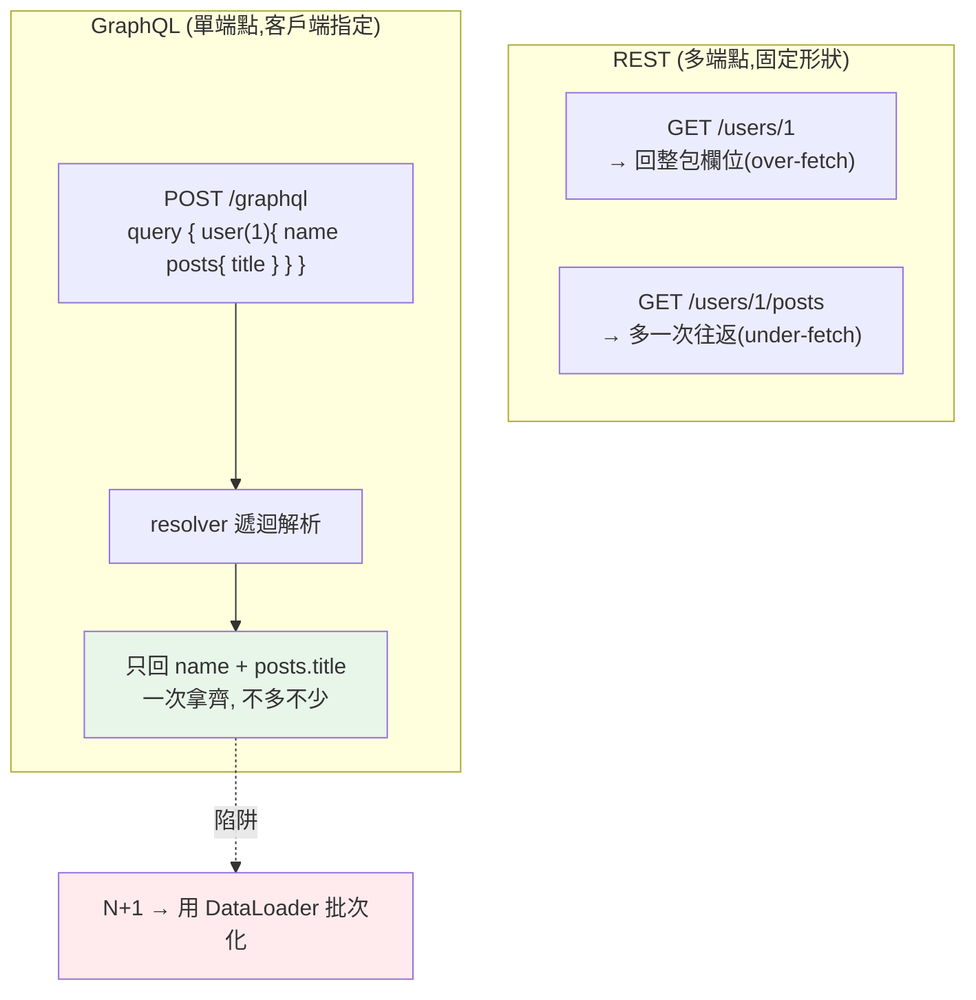

# GraphQL

> REST 的痛：拿使用者資料要打 `/users/1`，拿他的貼文要再打 `/users/1/posts`，而且每個端點回傳固定欄位——你只要名字卻拿到一整包。**GraphQL** 換一種思路：**一個端點、由客戶端精確指定要哪些欄位（含巢狀關聯）**，一次拿齊、不多不少。這章講 GraphQL 的核心概念、與 REST 的取捨，以及 Python 實作。

## 💡 白話導讀（建議先讀）

REST 用久了會遇到兩個癢處(尤其行動端):

1. **拿太多**:只要使用者名字,`/users/1` 卻回 20 個欄位(over-fetching)。
2. **跑太多趟**:要「使用者+他的貼文+每篇的留言數」——打三次 API(under-fetching)。

**GraphQL 把「固定套餐」換成「自助點菜單」**——客戶端精確勾選要什麼,一次上齊:

```graphql
query {
  user(id: 1) {
    name              # 只要名字
    posts {           # 順便他的貼文
      title           # 每篇只要標題
    }
  }
}
```

回來的 JSON **形狀和點單一模一樣**——不多不少、一趟搞定。

三個核心零件:**Schema**(菜單:有哪些型別、欄位、關聯——強型別契約)、**Query**(點單)、**Resolver**(廚房:每個欄位怎麼取到資料的函式)。
Python 生態用 **strawberry**(型別註記風格,FastAPI 好搭)。

但天下沒有免費的菜單,兩個代價要知道：

1. **N+1 查詢**——GraphQL 的頭號陷阱:查 N 個使用者的貼文,resolver 天真實作=打 N+1 次資料庫([Part 15 的老朋友](../15-database/20-n-plus-1.md))。解法叫 **DataLoader**(批次+快取)。
2. **快取變難**:全走 POST /graphql,HTTP 快取失靈。

選型建議:**REST 是預設**(簡單、快取好、工具全);GraphQL 適合「多端消費、資料關聯深、欄位需求多變」的場景——別為了酷而上。

## Why（為什麼）

[REST API](08-rest-api.md) 用「資源 + 端點」組織，簡單通用，但有兩個常見痛點：

- **over-fetching（拿太多）**：`GET /users/1` 回傳使用者的**所有欄位**（name、email、address、settings…），但你的手機畫面只需要 `name` 和頭像——傳輸了一堆用不到的資料，浪費頻寬。
- **under-fetching（拿太少）+ N+1 往返**：要顯示「使用者和他的 5 篇貼文標題」，得先 `GET /users/1`、再 `GET /users/1/posts`，甚至每篇貼文再打一次——**多次網路往返**，行動裝置上又慢又耗電。

問題根源：**REST 端點回傳的欄位是「伺服器決定」的固定形狀**，客戶端只能接受。不同客戶端（Web、iOS、Android）需求不同，卻共用同一組固定端點。

**GraphQL**（Facebook 提出）換一種思路：

- **單一端點**（通常 `POST /graphql`），不再是一堆資源端點。
- **客戶端用查詢語言精確描述要什麼**——哪些欄位、哪些巢狀關聯——**伺服器只回這些，不多不少**。
- **一次請求拿齊關聯資料**（使用者 + 貼文 + 貼文的留言），避免多次往返。

這解決了 over/under-fetching，讓前端能**自主決定資料形狀**，特別適合多樣化的客戶端與複雜的關聯資料。代價是伺服器較複雜、快取較難、有自己的坑（N+1、查詢複雜度攻擊）。這章講清楚它的原理與取捨，以及 Python 怎麼做。它與 [REST](08-rest-api.md) 是互補的選擇。

## Theory（理論：schema、query、resolver）

**GraphQL 的三個核心**——菜單、點單、廚房：

- **Schema（結構描述）**：用型別系統定義「有哪些資料、欄位、關聯」——伺服器與客戶端之間的**強型別契約**（菜單）。
- **Query（查詢）**：客戶端寫的、**精確描述要什麼**的請求——形狀對應 schema，但**只列出想要的欄位**（點單）。回傳 JSON 的形狀與點單一致。
- **Resolver（解析器）**：伺服器端「每個欄位怎麼取得資料」的函式（廚房）——GraphQL 引擎按 query 的形狀逐欄位呼叫 resolver 組裝結果。

這個設計正面解決 REST 的 over-fetching（拿太多）與 under-fetching（跑太多趟）——代價是 N+1 陷阱（需 DataLoader）與快取變難。

## Specification（規範：GraphQL 操作與 Python）

**三種操作**：

- **Query（查詢，讀）**：取資料（對應 REST 的 GET）。
- **Mutation（變更，寫）**：改資料（對應 POST/PUT/DELETE）。
- **Subscription（訂閱）**：即時推送（透過 WebSocket，見 [WebSocket](13-websocket.md)）。

**Python 實作——用函式庫**（別自己寫引擎）：

- **Strawberry**（現代、型別優先、用 Python type hints 定義 schema，與 [FastAPI](04-fastapi-basics.md) 整合好）：

  ```python
  import strawberry

  @strawberry.type
  class User:
      id: int
      name: str
      @strawberry.field
      def posts(self) -> list["Post"]:
          return get_posts_for_user(self.id)   # resolver

  @strawberry.type
  class Query:
      @strawberry.field
      def user(self, id: int) -> User:
          return get_user(id)

  schema = strawberry.Schema(query=Query)
  ```

- **Graphene**（較早期、成熟）。

**內建的好處**：schema 是**自我文件化**的（客戶端可透過 introspection 查詢 schema）、有 GraphiQL 之類的互動式查詢介面。

**選型**：REST 適合簡單、資源導向、需要 HTTP 快取的 API；GraphQL 適合複雜關聯、多樣客戶端、要精確控制資料形狀的場景。也可兩者並存。

## Implementation（底層：resolver 遞迴與 N+1 陷阱）

**GraphQL 引擎如何執行查詢**：收到查詢後，引擎**依查詢的樹狀結構、遞迴呼叫 resolver**。以 `user(id:1){ name posts{ title } }` 為例：先呼叫 `user` resolver（拿到使用者物件）→ 對每個要求的欄位呼叫其 resolver（`name` 直接取、`posts` 呼叫 posts resolver 拿貼文列表）→ 對每篇貼文的 `title` 取值。最後**依查詢的形狀組裝 JSON** 回傳。因為「客戶端指定欄位 → 引擎只解析這些欄位」，所以**只回要的、不多不少**——這是解決 over-fetching 的機制。而巢狀查詢讓「使用者 + 貼文」一次拿齊，解決 under-fetching 的多次往返。

**GraphQL 的頭號陷阱——N+1 查詢**：雖然 GraphQL 減少了「網路往返」，但在**伺服器端**很容易產生 [N+1 資料庫查詢](../15-database/20-n-plus-1.md)。查 `users{ posts{ title } }` 時：`users` resolver 查一次拿到 N 個使用者，然後對**每個**使用者的 `posts` resolver **各查一次資料庫**——1 + N 次查詢。這是 GraphQL 的經典效能坑。解法：**DataLoader**——一個批次載入 + 快取的機制，把「N 次單筆查詢」收集起來合併成「1 次批次查詢」（如 `WHERE user_id IN (...)`），大幅減少 DB 查詢（同 [eager loading](../15-database/20-n-plus-1.md) 的精神）。用 GraphQL 一定要懂 DataLoader，否則效能會很差。

**GraphQL 的其他挑戰**：**快取難**——REST 可用 HTTP 快取（URL 當 key），但 GraphQL 都是 `POST /graphql`、查詢多變，無法簡單用 HTTP 快取（要在應用層做）。**查詢複雜度攻擊**——客戶端能構造超深/超廣的巢狀查詢拖垮伺服器，要限制查詢深度/複雜度。這些是選 GraphQL 要付的代價。下面用純 Python 實作一個迷你 resolver，示範「客戶端指定欄位 → 只回這些」的核心概念（真實請用 Strawberry）。

## Code Example（可執行的 Python 範例）

```python
# graphql_demo.py — GraphQL 核心概念的迷你實作（純標準庫；真實用 Strawberry）
from __future__ import annotations

# 模擬資料源
_DB: dict[str, dict[int, dict[str, object]]] = {
    "users": {
        1: {"id": 1, "name": "Alice", "email": "a@x.com", "post_ids": [10, 11]},
    },
    "posts": {
        10: {"id": 10, "title": "Hello", "body": "long body ..."},
        11: {"id": 11, "title": "World", "body": "long body ..."},
    },
}

# selection 可以是欄位名(str) 或 巢狀 (欄位名, 子選擇)
Selection = list[object]


def resolve_user(user_id: int, selection: Selection) -> dict[str, object]:
    """resolver：依客戶端指定的 selection 只回這些欄位（含巢狀）。"""
    user = _DB["users"][user_id]
    result: dict[str, object] = {}
    for field in selection:
        if isinstance(field, str):
            result[field] = user[field]  # 純量欄位：直接取
        else:  # 巢狀關聯，如 ("posts", ["title"])
            name, subfields = field  # type: ignore[misc]
            if name == "posts":
                post_ids = user["post_ids"]
                assert isinstance(post_ids, list)
                result["posts"] = [
                    {f: _DB["posts"][pid][f] for f in subfields}
                    for pid in post_ids
                ]
    return result


def main() -> None:
    # 查詢 1：只要 name（避免 over-fetch：不回 email/post_ids）
    print("query { user(1) { name } }")
    print(f"  → {resolve_user(1, ['name'])}")

    # 查詢 2：要 name + email
    print("\nquery { user(1) { name email } }")
    print(f"  → {resolve_user(1, ['name', 'email'])}")

    # 查詢 3：巢狀——name + posts { title }（一次拿齊關聯，避免多次往返）
    print("\nquery { user(1) { name posts { title } } }")
    print(f"  → {resolve_user(1, ['name', ('posts', ['title'])])}")


if __name__ == "__main__":
    main()
```

**預期輸出**：

```pycon
$ python graphql_demo.py
query { user(1) { name } }
  → {'name': 'Alice'}

query { user(1) { name email } }
  → {'name': 'Alice', 'email': 'a@x.com'}

query { user(1) { name posts { title } } }
  → {'name': 'Alice', 'posts': [{'title': 'Hello'}, {'title': 'World'}]}
```

逐段解說：

- **查詢 1（避免 over-fetching）**：客戶端只要 `name` → resolver 只回 `{'name': 'Alice'}`，**不回** email、post_ids 等用不到的欄位。對比 REST 的 `GET /users/1` 會回整包——GraphQL 讓客戶端精確控制，省頻寬。
- **查詢 2**：要 `name` + `email` → 就回這兩個。**回傳形狀完全對應查詢**——這是 GraphQL 的核心特性。
- **查詢 3（避免 under-fetching）**：巢狀查詢 `name` + `posts { title }` → **一次**拿到使用者名 + 他的貼文標題。對比 REST 要多次往返（先查 user 再查 posts），GraphQL 一次搞定。注意 posts 只回 `title`（不回 body），再次精確控制。
- **N+1 警示**：這裡 `posts` resolver 對每個使用者查一次——真實系統若有 N 個使用者就是 N+1 次 DB 查詢，要用 **DataLoader** 批次化（見 [N+1](../15-database/20-n-plus-1.md)）。
- **要點**：GraphQL = 單一端點 + 客戶端指定欄位（含巢狀）→ 只回要的、一次拿齊。解決 over/under-fetching，代價是伺服器複雜、N+1 陷阱、快取難。真實用 Strawberry/Graphene。

## Diagram（圖解：REST vs GraphQL）



## Best Practice（最佳實踐）

- **依場景選 REST 或 GraphQL**：簡單資源導向/需 HTTP 快取用 REST；複雜關聯/多樣客戶端/精確資料形狀用 GraphQL。
- **用成熟函式庫（Strawberry/Graphene）**，別自己寫引擎。
- **一定用 DataLoader 解 N+1**：批次載入關聯資料，否則效能極差。
- **限制查詢複雜度/深度**：防惡意的超深巢狀查詢拖垮伺服器。
- **善用 schema 的強型別契約與自我文件化**：introspection、GraphiQL。
- **在應用層做快取**（GraphQL 無法簡單用 HTTP 快取）。
- **mutation 遵循清晰的輸入/輸出型別**、錯誤處理明確。
- **REST 與 GraphQL 可並存**：不必二選一，各用於適合的部分。

## Common Mistakes（常見誤解）

- **忽略 N+1**：巢狀 resolver 各自查 DB，效能崩潰；必用 DataLoader。
- **以為 GraphQL 一定比 REST 好**：它是取捨——伺服器複雜、快取難、有自己的坑。
- **不限制查詢複雜度**：惡意深巢狀查詢成 DoS 面向。
- **想用 HTTP 快取 GraphQL**：都是 POST /graphql，URL 無法當 key；要應用層快取。
- **自己手刻 GraphQL 引擎**：複雜易錯；用 Strawberry/Graphene。
- **把所有 API 都改成 GraphQL**：簡單資源 API 用 REST 更省更好快取。
- **schema 設計不當**（過深耦合、無版本策略）：難演進。
- **暴露過多內部結構**：GraphQL 靈活但別讓客戶端能查到不該查的。

## Interview Notes（面試重點）

- **能說出 GraphQL 解決什麼**：REST 的 over-fetching（回太多）與 under-fetching（多次往返），讓客戶端精確指定資料形狀。
- **能講三核心**：schema（強型別契約）、query（客戶端指定欄位/巢狀）、resolver（怎麼取值），及三種操作（query/mutation/subscription）。
- **能解釋 N+1 是 GraphQL 頭號陷阱**與 DataLoader 的批次化解法。
- **能對比 REST vs GraphQL 的取捨**：GraphQL 靈活但伺服器複雜、快取難、有查詢複雜度攻擊。
- **知道 Python 用 Strawberry/Graphene**、schema 自我文件化。
- **知道 GraphQL 不是 REST 的全面替代**，兩者依場景並存。

---

➡️ 下一章：[API 設計實務](18-api-design.md)

[⬆️ 回 Part 14 索引](README.md)
