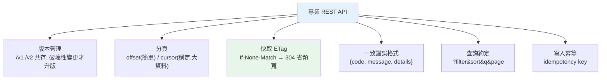

# API 設計實務

> 能跑的 API 和好用的 API 差很多。**版本管理**讓你能演進而不打爆舊客戶端、**分頁**讓大集合不撐爆回應、**快取（ETag）** 省頻寬、**一致的錯誤格式**讓客戶端好處理。這章把散落各處的 REST API 設計實務收攏成一份實用清單，讓你的 API 專業、好維護、好用。

## 💡 白話導讀（建議先讀）

能跑的 API 和**好用的 API** 差在哪?差在一個心態:

> **API 是簽了字的合約**——一旦有客戶端在用,你就不能隨意改。這章全是「如何演進而不毀約」的技術。

**版本管理**——毀約前的緩衝：
`/v1/users` → `/v2/users`(URL 版本,最常見)。原則:**破壞性變更才升版**(移除欄位、改語意);純新增(加選填欄位、加端點)不用——舊客戶端自然忽略新欄位。

**分頁**——大集合別一次全倒：

- **offset/limit**(`?page=2&size=20`):直觀、能跳頁;但深分頁慢、資料變動時會漏/重複。
- **cursor(游標)**:「給我這個標記之後的 20 筆」——穩定、快,無限捲動的標配;代價是不能跳頁。

**快取(ETag)**——「沒變就別重傳」:
回應帶 ETag(內容指紋),客戶端下次帶 `If-None-Match` 來問——沒變回 **304**(空身體),省頻寬省時間。

**冪等(idempotency)**——「重試安全嗎?」:
GET/PUT/DELETE 天生冪等(做兩次=做一次);**POST 不是**——網路逾時重送=重複下單!解法:**Idempotency-Key**(客戶端帶唯一鍵,伺服器見過就回上次結果)——[Part 22 練習題](../../exercises/part22/)寫過的那個,支付 API 的標配。

加上一致的錯誤格式、限流標頭——這章把 API 從「能動」修煉到「專業」。

## Why（為什麼）

前面的 [REST](08-rest-api.md)、[認證](09-auth.md)、[pydantic 驗證](06-pydantic-validation.md) 教你把 API 「做出來」。但把 API 做得**專業、可長久維護**，還有一批實務問題要處理，它們決定了 API 好不好用、能不能演進：

- **API 要改怎麼辦？** 你加了欄位、改了行為——已經在用舊版的客戶端會不會壞？→ **版本管理**。
- **回傳一萬筆資料？** 一次全回撐爆回應、拖垮客戶端與伺服器。→ **分頁（pagination）**。
- **同一筆資料被反覆請求？** 每次都傳完整內容浪費頻寬。→ **快取（ETag / conditional request）**。
- **錯誤長什麼樣？** 每個端點回不同格式的錯誤，客戶端要寫一堆特例。→ **一致的錯誤格式**。
- **怎麼過濾、排序、搜尋？** → 統一的**查詢參數約定**。

這些不是「有沒有功能」的問題，而是「**設計得好不好**」的問題——它們是 senior 工程師與新手的差別。這章把這些 REST API 設計實務整理成清單，並用可執行範例示範核心的分頁、ETag、版本管理邏輯。這是把 API 從「能用」提升到「好用、可演進」的關鍵。

## Theory（理論：可演進的 API 設計原則）

**API 是契約**——一旦有客戶端在用，就不能隨意打破。好的設計圍繞「**能演進而不破壞**」：

**版本管理（versioning）**：

- **URL 路徑版本**（`/v1/users`）：最常見、直觀、好路由。
- **Header 版本**：URL 乾淨，但較隱晦。
- **原則**：**破壞性變更才升版本**（移除欄位、改變意義、改必填）；非破壞性變更（新增選填欄位、新端點）不必升——舊客戶端自然忽略。

**分頁（pagination）**：

- **Offset/Limit**（`?page=2&size=20`）：簡單直觀、能跳頁；深分頁慢、資料變動會漏/重複。
- **Cursor（游標）**：「這個標記之後的 N 筆」——穩定、快（無限捲動標配）；不能跳頁。

**快取**：ETag（內容指紋）+ `If-None-Match` → 沒變回 304 空身體，省頻寬。

**冪等**：GET/PUT/DELETE 天生冪等；POST 不是——用 **Idempotency-Key** 防重試造成重複操作（支付 API 標配）。

## Specification（規範：設計清單）

**版本管理**：`/v1/...`；破壞性變更升版、非破壞性不升；舊版給合理的淘汰期。

**分頁回應格式**（統一）：

```json
{
  "items": [...],
  "page": 2, "size": 20, "total": 195, "total_pages": 10,
  "links": { "next": "/v1/users?page=3", "prev": "/v1/users?page=1" }
}
```

**過濾/排序/搜尋**（查詢參數約定）：

```text
GET /v1/orders?status=paid&sort=-created_at&q=keyword&page=1&size=20
                (過濾)      (排序,-表降冪)  (搜尋)   (分頁)
```

**一致的錯誤格式**（見 [例外處理器](16-exception-handlers.md)）：

```json
{ "error": { "code": "NOT_FOUND", "message": "找不到訂單 123", "details": [...] } }
```

**快取**：`ETag` + `If-None-Match` → 304；`Cache-Control` 控制快取策略。

**其他實務**：

- **狀態碼正確**（200/201/204/400/401/403/404/409/422/429/500，見 [HTTP](02-http-basics.md)）。
- **寫入操作用 [idempotency key](../22-distributed-systems/06-idempotency.md)** 防重複。
- **限流** 回 `429` + `Retry-After`（見 [限流器](../20-security-system-design/11-system-design-rate-limiter.md)）。
- **HATEOAS**（回應內含相關連結）——讓 API 可被探索（進階、選用）。
- **用 OpenAPI 自動產生文件**（FastAPI 內建，見 [FastAPI](04-fastapi-basics.md)）。

## Implementation（底層：cursor 分頁、ETag 304、版本共存）

**offset 分頁為何在深分頁與變動資料下有問題**：`?offset=10000&limit=20` 要資料庫**跳過**前 10000 筆再取 20 筆——多數資料庫仍要掃過那 10000 筆（O(offset)），深分頁越來越慢。更糟的是**資料變動時的漂移**：你在看第 2 頁時，有人在第 1 頁插入了一筆——所有資料往後移一格，你的第 3 頁會**重複**看到原本第 2 頁的最後一筆（或漏掉一筆）。**Cursor 分頁**用「上次最後一筆的排序值（如 id 或時間戳）」當游標，下次 `WHERE id > cursor ORDER BY id LIMIT 20`——走索引（O(log n)）、且不受前面插入/刪除影響（不漏不重）。所以大型、即時、無限捲動的列表用 cursor。

**ETag/304 如何省頻寬**：伺服器對資源算一個 **ETag**（內容指紋，如內容的 hash 或版本號）。首次回應帶 `ETag: "abc123"` + 完整內容。客戶端快取內容與 ETag。下次請求帶 `If-None-Match: "abc123"`——伺服器**比對**：若資源沒變（ETag 相同），回 **`304 Not Modified` + 空 body**，客戶端直接用快取的內容。省下的是「重傳整個資源」的頻寬——對大資源、高頻請求（如列表、圖片 metadata）效果顯著。關鍵是伺服器只回 304 這幾十 bytes，而非整個資源。

**版本共存如何運作**：`/v1` 和 `/v2` 通常**同時存在**一段時間——舊客戶端繼續打 `/v1`，新客戶端用 `/v2`。實作上，v1 和 v2 可以是不同的路由 + 不同的回應 schema（甚至共用底層 service 但不同的呈現層）。這讓你能**推進 API 演進而不強迫所有客戶端同時升級**——給舊版一個淘汰期（deprecation window）、通知客戶端遷移、期滿再下線 v1。「破壞性變更才升版」的原則讓版本數不會爆炸——大多數變更（加選填欄位）根本不需要新版本。下面範例實作分頁、ETag/304、版本路由的核心邏輯。

## Code Example（可執行的 Python 範例）

```python
# api_design.py — 分頁 / ETag 條件請求 / 版本路由（純標準庫，可執行）
from __future__ import annotations

import hashlib
from typing import TypeVar

T = TypeVar("T")


def paginate(items: list[T], page: int, size: int) -> dict[str, object]:
    """offset 分頁：回統一格式（items + 分頁中繼資訊 + 導覽連結）。"""
    total = len(items)
    total_pages = (total + size - 1) // size
    start = (page - 1) * size
    return {
        "items": items[start : start + size],
        "page": page,
        "size": size,
        "total": total,
        "total_pages": total_pages,
        "links": {
            "next": f"?page={page + 1}&size={size}" if page < total_pages else None,
            "prev": f"?page={page - 1}&size={size}" if page > 1 else None,
        },
    }


def make_etag(content: str) -> str:
    """內容指紋（實務用內容 hash 或版本號）。"""
    return hashlib.md5(content.encode()).hexdigest()[:8]


def handle_conditional_get(content: str, if_none_match: str | None) -> tuple[int, str | None]:
    """ETag 條件請求：內容沒變回 304（空 body 省頻寬）。"""
    etag = make_etag(content)
    if if_none_match == etag:
        return 304, None  # Not Modified：客戶端用快取
    return 200, content  # 回完整內容 + ETag


def route_version(path: str) -> str:
    """URL 路徑版本：v1 與 v2 共存，舊客戶端不受影響。"""
    if path.startswith("/v1/"):
        return "v1 handler（穩定，維護中）"
    if path.startswith("/v2/"):
        return "v2 handler（新版）"
    return "404 Not Found"


def main() -> None:
    # 分頁：100 筆資料取第 2 頁
    data = list(range(1, 101))
    result = paginate(data, page=2, size=10)
    print(f"分頁 page=2: items={result['items']}")
    print(f"  total_pages={result['total_pages']}, next={result['links']['next']}")

    # ETag 條件請求
    content = "resource-content-v1"
    etag = make_etag(content)
    print(f"\nETag = {etag}")
    print(f"首次請求(無 If-None-Match): {handle_conditional_get(content, None)[0]} + 完整內容")
    status, body = handle_conditional_get(content, etag)
    print(f"帶相同 ETag: {status} Not Modified, body={body}（省頻寬）")

    # 版本路由
    print(f"\n版本路由:")
    print(f"  /v1/users → {route_version('/v1/users')}")
    print(f"  /v2/users → {route_version('/v2/users')}")


if __name__ == "__main__":
    main()
```

**預期輸出**：

```pycon
$ python api_design.py
分頁 page=2: items=[11, 12, 13, 14, 15, 16, 17, 18, 19, 20]
  total_pages=10, next=?page=3&size=10

ETag = d1cda8c1
首次請求(無 If-None-Match): 200 + 完整內容
帶相同 ETag: 304 Not Modified, body=None（省頻寬）

版本路由:
  /v1/users → v1 handler（穩定，維護中）
  /v2/users → v2 handler（新版）
```

逐段解說：

- **分頁**：`paginate` 回**統一格式**——`items`（本頁資料）+ 中繼資訊（page/size/total/total_pages）+ 導覽連結（next/prev）。第 2 頁取到第 11–20 筆、共 10 頁、附下一頁連結。客戶端用同一套邏輯處理所有分頁端點。
- **ETag 條件請求**：首次請求回 `200` + 完整內容 + ETag。客戶端下次帶 `If-None-Match: <etag>`——內容沒變 → 回 `304 Not Modified` + **空 body**，客戶端用快取。省下的是「重傳整個資源」的頻寬。
- **版本路由**：`/v1` 與 `/v2` **共存**——舊客戶端繼續用 v1、新客戶端用 v2，API 得以演進而不打破舊客戶端。（ETag 的 hash 值 `d1cda8c1` 依內容而定。）
- **要點**：分頁（統一格式）、ETag（省頻寬）、版本管理（可演進）是專業 REST API 的三大實務。加上一致的錯誤格式、正確狀態碼、查詢參數約定、冪等，就是「好用、可維護、可演進」的 API。

## Diagram（圖解：API 設計實務）



## Best Practice（最佳實踐）

- **用版本管理（`/v1`）並遵循「破壞性變更才升版」**：非破壞性（加選填欄位）不升版，給舊版淘汰期。
- **列表端點一律分頁**：大資料用 cursor（穩定、快）、能跳頁的小資料用 offset。
- **回統一的分頁格式**（items + 中繼 + 連結）：客戶端一套邏輯處理。
- **用 ETag + 條件請求省頻寬**：內容沒變回 304。
- **一致的錯誤格式**（code/message/details）+ 正確狀態碼（見 [例外處理器](16-exception-handlers.md)、[HTTP](02-http-basics.md)）。
- **統一查詢參數約定**（過濾/排序/搜尋/分頁）。
- **寫入操作支援 [idempotency key](../22-distributed-systems/06-idempotency.md)**、限流回 `429 + Retry-After`。
- **用 OpenAPI 自動產文件**（FastAPI 內建）：契約清楚、可互動測試。

## Common Mistakes（常見誤解）

- **無版本策略直接改 API**：打破在用的客戶端。
- **每個小改動都升版本**：版本爆炸；非破壞性變更不必升。
- **列表端點不分頁**：回一萬筆撐爆回應、拖垮客戶端。
- **深分頁全用 offset**：offset 很大時慢、資料變動漏/重複；大資料用 cursor。
- **不用快取**：反覆傳完整資源浪費頻寬；用 ETag/304。
- **錯誤格式不一致**：每個端點回不同結構，客戶端要寫特例。
- **狀態碼亂用**（成功回 200 卻含錯誤、什麼都回 200）：客戶端無法程式化判斷。
- **查詢參數各端點各自發明**：客戶端要學一堆不一致的約定。

## Interview Notes（面試重點）

- **能講 API 版本管理**：URL vs header 版本、破壞性 vs 非破壞性變更、版本共存與淘汰期。
- **能對比 offset vs cursor 分頁**：簡單能跳頁 vs 穩定快（深分頁/變動資料）。
- **能解釋 ETag/條件請求如何省頻寬**：內容指紋 + If-None-Match → 304 空 body。
- **知道一致性原則**：統一錯誤格式、查詢參數約定、正確狀態碼、命名慣例。
- **知道寫入要冪等、限流回 429、用 OpenAPI 文件化**。
- **能把「能用的 API」提升到「好用、可演進、可維護」**，這是資深工程師的體現。

---

⬅️ 這是 Part 14 的最後一章。


➡️ 下一章：[Part 14 統整：Web 開發全貌](19-summary.md)

[⬆️ 回 Part 14 索引](README.md)
