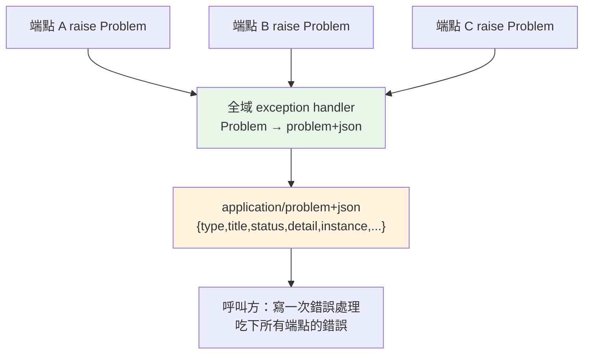

# 錯誤契約:RFC 9457 problem+json 與版本策略

> 你的 API 成功時回什麼,大家都很講究;失敗時回什麼,卻常常每個端點各寫各的。RFC 9457 給了一個標準答案:讓「錯誤」也有一個機器讀得懂、全站一致的形狀。

## 💡 白話導讀（建議先讀）

前一章 [18-api-design](18-api-design.md) 講了 API 設計的大方向。這章專攻其中最容易被做爛的一塊:
**API 出錯時,到底該回什麼?**

先看一個真實的痛。假設你在串三個端點,它們回的錯誤長這樣:

```text
端點 A：  {"error": "not found"}
端點 B：  {"message": "資源不存在", "code": 4004}
端點 C：  {"status": "fail", "reason": "no such user", "errno": -2}
```

三個端點、三種形狀。你的前端 / 呼叫方**每接一個端點就要重寫一次錯誤處理**——
到底看 `error` 還是 `message` 還是 `reason`?錯誤碼在 `code` 還是 `errno`?這就是「沒有錯誤契約」的災難。

**契約(contract)** 的意思是:**雙方事先講好一個固定格式**,之後所有錯誤都長這個樣子。
呼叫方寫一次錯誤處理,就能吃下你所有端點的錯誤。

那格式該長怎樣?與其每家自己發明,IETF 直接出了一份標準——**RFC 9457「Problem Details for HTTP APIs」**
(它取代了舊的 RFC 7807)。核心就一句話:**用一個叫 `application/problem+json` 的 JSON,
裡面有幾個固定欄位**:

- `type`:這種錯誤的「身分證網址」(一個 URI,點進去可以看這種錯誤的說明)。
- `title`:人看的簡短標題(如「餘額不足」),同一種錯誤固定不變。
- `status`:HTTP 狀態碼(如 403),跟著放進 body 方便記 log。
- `detail`:這一次錯誤的具體說明(如「帳戶餘額 30 不足以支付 50」)。
- `instance`:出錯的那個資源路徑(如 `/accounts/123/pay`)。

還可以加**擴充欄位**(extension members),放機器要用的資料——例如餘額不足就附上 `balance` 和 `cost`,
讓前端不用再解析 `detail` 那句人話就能顯示。

一個生活比喻:**RFC 9457 就像制式的「退件通知單」**。不管哪個部門退你件,單子欄位都一樣:
哪種問題(type)、標題(title)、狀態、細節、哪份文件出錯(instance)。你不用每個部門學一套看單方法。

這章的可執行範例,會帶你**親手組出一個合規的 problem+json**,並示範擴充欄位怎麼放。

## 🎯 什麼時候會用到

- **任何對外 / 跨團隊的 API**:一旦你的 API 有「別人」在串(前端、行動端、其他服務、第三方),
  統一錯誤格式就能省下每個消費端各寫一套錯誤處理的成本。
- **微服務之間**:服務 A 呼叫服務 B 失敗時,B 回 problem+json,A 能用同一套邏輯解讀所有下游錯誤。
- **驗證錯誤要回逐欄位訊息**:表單哪個欄位錯、錯在哪,用擴充欄位 `errors` 帶回去。
- **要規劃 API 版本與破壞性變更**:錯誤契約是 API 契約的一部分,改它就是破壞性變更——
  這章後半會講版本策略。

## Why（為什麼）

因為**成功回應有 schema、錯誤回應也該有 schema**,否則錯誤處理無法規模化。

- **不統一 = N 個端點 × M 種格式**。呼叫方要為每種格式寫一套解析,新端點一加又要改。
- **人話訊息不可靠**。`detail` 是給人看的,會隨時被改文案。機器要判斷的東西(是哪種錯、餘額多少)
  必須放在**穩定的欄位**(`type`、擴充欄位),而不是叫前端去正則比對 `detail` 那句話。
- **`type` 是可演進的錨點**。用一個 URI 當「錯誤種類」的唯一識別,之後要新增錯誤種類、
  補文件、國際化,都圍著這個 `type` 走,不會撞名。
- **標準勝過自創**。RFC 9457 已被 FastAPI 生態、各大 API gateway 支援,選它等於免費得到互通性。

## Theory（理論：problem+json 的欄位語意）

RFC 9457 定義的**標準成員(members)**:

| 欄位 | 必要性 | 語意 |
|------|--------|------|
| `type` | 建議 | 錯誤**種類**的 URI 識別;省略時預設 `"about:blank"`,此時 `title` 應等於狀態碼的標準片語 |
| `title` | 建議 | 該種錯誤的**簡短人類標題**,同一 `type` 固定不變(給人快速辨識) |
| `status` | 建議 | HTTP 狀態碼,**同時**放進 body(方便 log / 中間層,不必回去讀 HTTP 狀態列) |
| `detail` | 選用 | **這一次**發生的具體說明(可含動態值),給人看的 |
| `instance` | 選用 | 發生問題的**具體資源** URI(哪一筆訂單、哪個帳戶) |

**擴充成員(extension members)**:你可以在頂層加任意欄位(如 `errors`、`balance`、`traceId`),
它們與標準欄位**平級**。這是給機器用的結構化資料。

關鍵區分:

```text
type      → 「哪一種」錯誤（穩定、可當 key、可分派處理）
title     → 「這種錯誤叫什麼」（穩定的人類標題）
detail    → 「這一次」的細節（會變，給人看，別拿來做程式判斷）
擴充欄位   → 「這一次」的機器可讀資料（給程式判斷、給前端顯示）
```

## Specification（規範：HTTP 層面）

- **Content-Type 必須是 `application/problem+json`**(不是普通 `application/json`)——
  這讓中間層 / 客戶端一眼就知道「這是一個標準錯誤」。
- HTTP **狀態碼仍要正確**(403 就回 403),`status` 欄位只是**額外**放一份進 body。
- `type` 是 URI;不必真的可以連(可用 `about:blank`),但慣例是放一個能連到說明文件的網址。
- 一個回應**只描述一個主要問題**;多個子錯誤(如多欄位驗證)用擴充欄位(如 `errors` 陣列)承載。

## Implementation（實作：一個可重用的 Problem 類別）

實務上你會做兩件事:(1) 一個 `Problem` 類別能序列化成合規 JSON;(2) 一個
**全域例外處理器**,把任何 `Problem` 例外轉成 `application/problem+json` 回應
(接續 [16-exception-handlers](16-exception-handlers.md) 的機制)。

下面範例先把「資料模型」做對——這是契約的核心。FastAPI 的接線在其後示範。

## Code Example（可執行的 Python 範例）

```python
# problem_details.py —— RFC 9457 problem+json 統一錯誤契約
from __future__ import annotations

import json
from dataclasses import dataclass, field

PROBLEM_CONTENT_TYPE = "application/problem+json"


@dataclass
class Problem(Exception):
    """RFC 9457 問題細節。status/title 必填，其餘選填，extensions 放自訂欄位。"""

    status: int
    title: str
    type: str = "about:blank"
    detail: str | None = None
    instance: str | None = None
    extensions: dict[str, object] = field(default_factory=dict)

    def to_dict(self) -> dict[str, object]:
        body: dict[str, object] = {
            "type": self.type,
            "title": self.title,
            "status": self.status,
        }
        if self.detail is not None:
            body["detail"] = self.detail
        if self.instance is not None:
            body["instance"] = self.instance
        body.update(self.extensions)  # 擴充成員與標準欄位並列（RFC 9457）
        return body

    def to_json(self) -> str:
        return json.dumps(self.to_dict(), ensure_ascii=False)


def insufficient_funds(balance: int, cost: int, path: str) -> Problem:
    return Problem(
        status=403,
        type="https://example.com/probs/insufficient-funds",
        title="餘額不足",
        detail=f"帳戶餘額 {balance} 不足以支付 {cost}",
        instance=path,
        extensions={"balance": balance, "cost": cost},
    )


if __name__ == "__main__":
    print("Content-Type:", PROBLEM_CONTENT_TYPE)
    print(insufficient_funds(30, 50, "/accounts/123/pay").to_json())
```

**預期輸出**：

```pycon
$ python problem_details.py
Content-Type: application/problem+json
{"type": "https://example.com/probs/insufficient-funds", "title": "餘額不足", "status": 403, "detail": "帳戶餘額 30 不足以支付 50", "instance": "/accounts/123/pay", "balance": 30, "cost": 50}
```

**逐段解說**:

- `Problem` 同時繼承 `Exception`——所以你可以 `raise insufficient_funds(...)`,
  再由全域處理器統一轉成回應。錯誤即例外、例外即契約,一份定義兩用。
- `to_dict` 只在欄位**有值時**才放進去(`detail`/`instance` 選填)——符合「選填就別出現」的慣例。
- `body.update(self.extensions)` 把 `balance`、`cost` **攤平到頂層**,與 `status` 平級。
  這正是 RFC 9457 說的 extension members:前端拿到 `balance` 直接顯示,不用去解析 `detail` 那句人話。
- `title` 固定是「餘額不足」(對應這個 `type`),`detail` 才帶動態數字——**穩定的給機器、變動的給人**。

**接到 FastAPI**(示意,需實際框架環境):

```python
from fastapi import FastAPI, Request
from fastapi.responses import JSONResponse

app = FastAPI()


@app.exception_handler(Problem)
async def problem_handler(request: Request, exc: Problem) -> JSONResponse:
    return JSONResponse(
        status_code=exc.status,
        content=exc.to_dict(),
        media_type=PROBLEM_CONTENT_TYPE,   # 關鍵：application/problem+json
    )


@app.post("/accounts/{account_id}/pay")
async def pay(account_id: str) -> dict[str, str]:
    balance, cost = 30, 50
    if balance < cost:
        raise insufficient_funds(balance, cost, f"/accounts/{account_id}/pay")
    return {"status": "ok"}
```

任何端點只要 `raise Problem(...)`,就自動回出合規的 `application/problem+json`——**契約集中在一處**。

## Diagram（圖解：統一錯誤契約）



## Best Practice（最佳實踐）

- **`type` 用穩定 URI 當錯誤種類的主鍵**,前端用它分派(`switch(problem.type)`),別用 `detail` 字串比對。
- **機器要用的資料放擴充欄位**(`balance`、`errors`、`retryAfter`),別塞進 `detail` 讓人去 parse。
- **`Content-Type` 一定設 `application/problem+json`**,別回成普通 `application/json`。
- **HTTP 狀態碼與 `status` 欄位保持一致**,兩邊別打架。
- **別把內部細節洩進 `detail`**(stack trace、SQL、內部主機名);要排錯用 `traceId` 擴充欄位串 log。
- **集中定義錯誤種類**:把 `insufficient_funds()` 這類工廠函式收在一個模組,全站共用,避免各端點自創格式。

## Common Mistakes（常見誤解）

- **「錯誤回 `{\"error\": \"...\"}` 就好」**。短期能動,長期讓每個消費端各寫一套解析;
  換成標準格式,呼叫方一套處理吃全部。
- **「把判斷邏輯建在 `detail` 上」**。`detail` 是人話、隨時會改文案,拿它做 `if` 判斷遲早爆。
  用 `type` 或擴充欄位。
- **「HTTP 回 200,錯誤資訊塞在 body」**。錯就要回對應的 4xx/5xx,別用 200 包錯誤——
  中間層、監控、快取全靠狀態碼判斷。
- **「problem+json 就是普通 json」**。差在 `Content-Type`;設成 `application/problem+json`
  才能讓客戶端 / 閘道辨識這是標準錯誤。
- **「多欄位錯誤塞成一大串字串」**。用擴充欄位 `errors: [{field, message}, ...]`,結構化才好給前端逐欄標紅。

## Interview Notes（面試重點）

- **「你怎麼設計 API 的錯誤回應?」**
  面試官想聽:**統一錯誤契約**,最好點名 **RFC 9457 / problem+json**。要點:固定欄位
  (`type`/`title`/`status`/`detail`/`instance`)+ 擴充欄位放機器可讀資料;`Content-Type` 用
  `application/problem+json`;用 `type`(URI)當錯誤種類主鍵而非字串訊息;全域例外處理器集中轉換。

- **「`type`、`title`、`detail` 差在哪?為什麼要分?」**
  `type` 是錯誤**種類**的穩定 URI(給機器分派)、`title` 是這種錯誤的固定人類標題、
  `detail` 是**這一次**的動態說明(給人看,別拿來程式判斷)。分開才能「穩定的給機器、變動的給人」。

- **「改錯誤格式算不算破壞性變更?」**
  算。錯誤契約是 API 契約的一部分,消費端會依賴它。**新增擴充欄位**通常安全(相容),
  但**改欄位語意、拿掉欄位、改 `type`** 就是破壞性變更,要走版本策略(見下)。

- **「RFC 9457 和 7807 的關係?」**
  9457 是 7807 的**修訂替代版**(2023),概念相同、澄清了一些細節。新專案直接引 9457。

## 延伸：破壞性變更與版本策略

錯誤契約是 API 契約的一部分,這裡順帶把「API 怎麼演進」講清楚:

- **相容變更(不需升版)**:新增選填欄位、新增擴充成員、新增端點、放寬輸入限制。
- **破壞性變更(需升版)**:移除 / 改名欄位、改欄位型別或語意、收緊驗證、改 `type` 意義、改狀態碼。
- **版本放哪**:URL 路徑版(`/v1/…`,最直觀、最常見)、或 header 版(`Accept: application/vnd.api+json;version=1`)。
  路徑版對多數團隊最省事,選一種並貫徹。
- **退場**:舊版標 `Deprecation` / `Sunset` 標頭(接 [ch08 REST](08-rest-api.md)),給消費端遷移期,別直接拔。

---

➡️ 下一章：[ETag、條件請求與 webhook 設計](20-etag-conditional-webhook.md)

[⬆️ 回 Part 14 索引](README.md)
