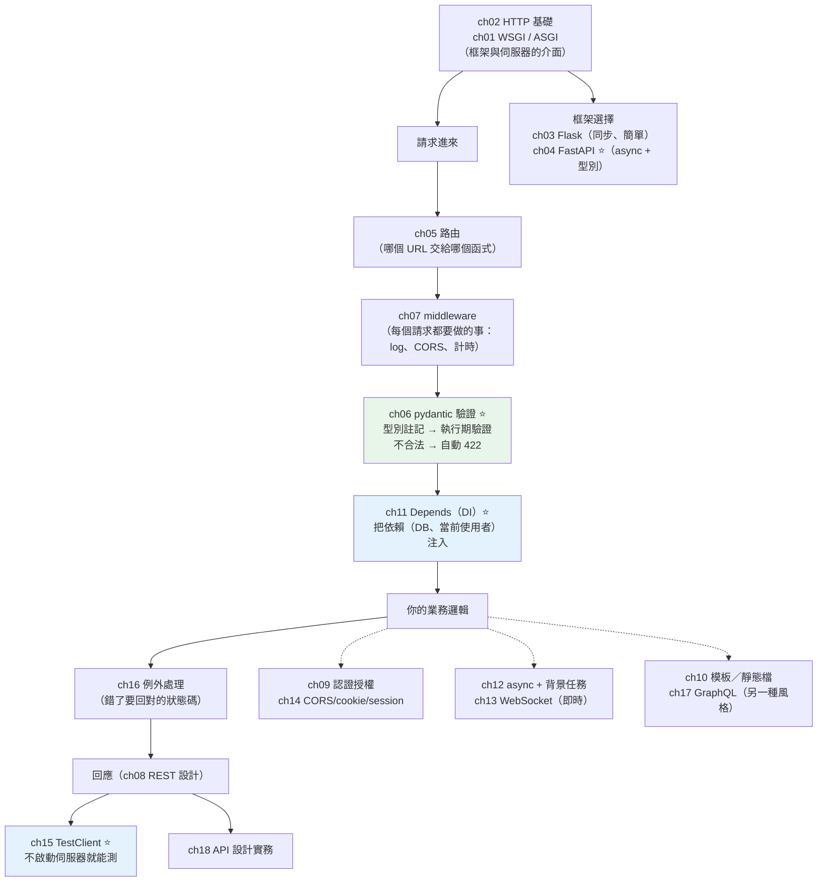

# Part 14 統整：Web 開發全貌

> 把這 18 章串成一張圖——最大的驚喜是：**你在 [Part 5](../05-typing/README.md) 學的型別註記，在這裡突然變成了「執行期的資料驗證」。**

## 🗺️ 知識地圖（這 18 章怎麼串起來）

Web 開發看似很多東西，但骨架只有一條：
**請求進來 → 驗證 → 處理 → 回應**。其餘各章都掛在這條線上。



**一句話串起來**：

Web 框架做的事，本質是**把 HTTP 請求轉成一次函式呼叫**。
中間的 **[WSGI/ASGI](01-wsgi-asgi.md)**（ch01）就是「伺服器」與「框架」之間的插頭規格——
**WSGI 是同步的（Flask）、ASGI 是非同步的（FastAPI）**。

而 **FastAPI 最迷人的一點**，是它把 [Part 5 的型別註記](../05-typing/README.md)**變成了真正的工作**：

```text
def create_task(data: TaskIn) -> TaskOut:   # ← 這不只是註記
```

**pydantic**（ch06）讀這個註記，然後：
**自動驗證**輸入、**自動轉型**、不合法**自動回 422**、還**自動生出 API 文件**。
在 Part 5 裡「不影響執行期」的註記，到了這裡**變成了執行期的守門員**。

再加上 **[Depends](11-fastapi-depends.md)**（ch11，依賴注入）——
把資料庫連線、當前使用者「注入」進來，
測試時就能**替換成假的**（呼應 [Part 12 的 mock](../12-testing/06-mock.md)）。

## ⚡ 速查表（什麼情境用什麼）

| 情境 | 怎麼做 | 章節 |
|------|--------|------|
| **開新 API 專案** | **FastAPI**（async + 型別 + 自動文件）；小工具／傳統同步用 Flask | [ch04](04-fastapi-basics.md)、[ch03](03-flask.md) |
| 驗證請求資料 | **pydantic model**——**不要自己寫 `if not data.get("x")`** | [ch06](06-pydantic-validation.md) |
| 限制欄位範圍 | `Field(ge=1, le=5)`、`min_length`——不合法自動 **422** | [ch06](06-pydantic-validation.md) |
| 參數從哪來 | 路徑 `{id}` → 路徑參數；簡單型別 → query；pydantic model → **body** | [ch05](05-routing.md) |
| **注入資料庫／當前使用者** | **`Depends`**（測試時可覆寫 → 好測） | [ch11](11-fastapi-depends.md) |
| 每個請求都要做的事（log、計時、CORS） | **middleware** | [ch07](07-middleware.md) |
| 資源不存在 | **`raise HTTPException(404)`**——**別回 200 配空值** | [ch16](16-exception-handlers.md) |
| 建立成功要回什麼 | **201 Created**（不是 200） | [ch08](08-rest-api.md) |
| REST 的 URL 怎麼取名 | **名詞複數 + HTTP 動詞**：`POST /tasks`、`GET /tasks/{id}`——**不要 `/createTask`** | [ch08](08-rest-api.md) |
| **測 API** | **`TestClient`**——不用真的啟動伺服器 | [ch15](15-testclient.md) |
| 登入 / 權限 | JWT（見 [Part 20](../20-security-system-design/04-jwt.md)）+ `Depends` 取當前使用者 | [ch09](09-auth.md) |
| 前端在別的網域，被瀏覽器擋 | **CORS** middleware（設定允許的來源） | [ch14](14-cors-cookie-session.md) |
| 回應慢的工作（寄信、產報表） | **BackgroundTasks**（先回應，之後再做） | [ch12](12-async-web-background.md) |
| 伺服器要「主動推」給前端 | **WebSocket**（聊天、通知、即時更新） | [ch13](13-websocket.md) |
| 前端想「一次要剛好需要的欄位」 | GraphQL（另一種風格，非必要） | [ch17](17-graphql.md) |
| 回傳 HTML 頁面 | 模板（Jinja2）＋靜態檔 | [ch10](10-templates.md) |
| API 版本、分頁、錯誤格式 | 見 API 設計實務 | [ch18](18-api-design.md) |

## 🔑 核心心智模型（帶得走的幾句話）

- **Web 框架＝把 HTTP 請求轉成一次函式呼叫。** 路由決定「哪個函式」，
  pydantic 決定「參數長什麼樣」，回傳值決定「回應」。沒有魔法。
- **型別註記在這裡「活了」。** Part 5 說註記不影響執行期——
  但 **pydantic 讀了它，並據此在執行期驗證**。
  這是 FastAPI 最大的賣點：**寫一次型別，同時得到驗證 + 轉型 + 文件 + IDE 補全**。
- **驗證要在「最外層」做完。** 不合法的資料**根本不該進到業務邏輯**——
  pydantic 在入口就把它擋下（自動 422），
  這也是 [Part 20 資安](../20-security-system-design/01-input-validation.md)的第一道防線。
- **`Depends` 是為了「可測試」。** 把 DB、當前使用者做成依賴，
  測試時就能**整組換掉**——這正是 [Part 16 依賴注入](../16-architecture/03-dependency-injection.md)
  在 FastAPI 的化身。
- **HTTP 狀態碼是 API 的語言。** 建立成功回 **201**、驗證失敗回 **422**、
  沒權限回 **403**、不存在回 **404**。**「永遠回 200，錯誤寫在 body 裡」是壞設計**——
  它讓所有客戶端都得解析 body 才知道成功沒。
- **ASGI ≠ 一定比較快。** async 只在 **I/O-bound** 時發揮（[Part 9](../09-concurrency/README.md)）——
  而 Web 服務**幾乎都是 I/O-bound**（等 DB、等外部 API），所以 async 很適合。

## 🛠️ 小實作：50 行的 task-api，走完整條 Web 骨架

```python
# app.py —— Part 14 主線：型別 → 驗證 → DI → REST → 測試
from __future__ import annotations

from typing import Annotated

from fastapi import Depends, FastAPI, HTTPException, status
from pydantic import BaseModel, Field

app = FastAPI(title="task-api (mini)")


# ── ch06 pydantic：Part 5 的「型別註記」在這裡變成「執行期驗證」──
class TaskIn(BaseModel):
    title: str = Field(min_length=1, max_length=50)
    priority: int = Field(default=1, ge=1, le=5)      # 只能 1~5，超出自動 422


class TaskOut(TaskIn):
    id: int
    done: bool = False


# ── ch11 Depends：抽成依賴 → 測試時可整組替換（呼應 Part 12 mock）──
class TaskRepo:
    def __init__(self) -> None:
        self._items: dict[int, TaskOut] = {}
        self._next = 1

    def add(self, data: TaskIn) -> TaskOut:
        task = TaskOut(id=self._next, **data.model_dump())
        self._items[self._next] = task
        self._next += 1
        return task

    def get(self, task_id: int) -> TaskOut | None:
        return self._items.get(task_id)

    def list_all(self) -> list[TaskOut]:
        return list(self._items.values())


_repo = TaskRepo()


def get_repo() -> TaskRepo:
    return _repo


Repo = Annotated[TaskRepo, Depends(get_repo)]


# ── ch05 路由 + ch08 REST：名詞複數、HTTP 動詞表達動作、回對的狀態碼 ──
@app.post("/tasks", response_model=TaskOut, status_code=status.HTTP_201_CREATED)
def create_task(data: TaskIn, repo: Repo) -> TaskOut:
    return repo.add(data)                    # 驗證已由 pydantic 做完


@app.get("/tasks", response_model=list[TaskOut])
def list_tasks(repo: Repo) -> list[TaskOut]:
    return repo.list_all()


# ── ch16 例外處理：找不到就回 404，不要回 200 配空值 ──
@app.get("/tasks/{task_id}", response_model=TaskOut)
def get_task(task_id: int, repo: Repo) -> TaskOut:
    task = repo.get(task_id)
    if task is None:
        raise HTTPException(status_code=404, detail=f"task {task_id} 不存在")
    return task
```

**測試（ch15 TestClient——不用真的啟動伺服器）**：

```python
# test_app.py
from fastapi.testclient import TestClient

from app import app

client = TestClient(app)


def test_create_and_get() -> None:
    response = client.post("/tasks", json={"title": "寫統整章", "priority": 3})
    assert response.status_code == 201          # 建立 → 201，不是 200
    task = response.json()
    assert task["id"] == 1 and task["done"] is False

    response = client.get(f"/tasks/{task['id']}")
    assert response.status_code == 200
    assert response.json()["title"] == "寫統整章"


def test_validation_rejects_bad_priority() -> None:
    """pydantic 自動擋下不合法輸入——你一行驗證都沒寫。"""
    response = client.post("/tasks", json={"title": "壞資料", "priority": 99})
    assert response.status_code == 422          # 自動的！


def test_404_for_missing() -> None:
    assert client.get("/tasks/999").status_code == 404
```

**執行結果**：

```pycon
$ pytest test_app.py -v
test_app.py::test_create_and_get PASSED                         [ 33%]
test_app.py::test_validation_rejects_bad_priority PASSED        [ 66%]
  422 錯誤細節: Input should be less than or equal to 5
test_app.py::test_404_for_missing PASSED                        [100%]

============================== 3 passed in 0.59s ==============================
```

**最值得注意的是第二個測試**：

我送出 `priority: 99`（合法範圍是 1~5），API 回了 **422**，
錯誤訊息是 **`Input should be less than or equal to 5`**。

**而我一行驗證程式碼都沒有寫。**

我只寫了一個型別註記：

```python
priority: int = Field(default=1, ge=1, le=5)
```

pydantic 讀了它，就**自動**完成了：**驗證 → 產生錯誤訊息 → 回 422 → 寫進 OpenAPI 文件**。

這就是 Part 14 最大的收穫——
**[Part 5](../05-typing/README.md) 說「型別註記不影響執行期」，那是對 Python 而言。
但只要有人（pydantic）願意讀它，它就能變成執行期的守門員。**

（順帶一提：`Depends` 讓 `TaskRepo` 可以在測試時被整組換掉——
這正是 [Part 12](../12-testing/06-mock.md) 說的「能 mock 的前提是好設計」。）

## ✅ 自測清單（答不出來就回去讀）

- [ ] WSGI 和 ASGI 差在哪？為什麼 FastAPI 用 ASGI？（[ch01](01-wsgi-asgi.md)）
- [ ] HTTP 的無狀態（stateless）是什麼意思？那登入狀態怎麼保持？（[ch02](02-http-basics.md)、[ch14](14-cors-cookie-session.md)）
- [ ] pydantic 怎麼知道要驗證什麼？（提示：它讀了什麼）（[ch06](06-pydantic-validation.md)）
- [ ] FastAPI 怎麼決定一個參數是從路徑、query 還是 body 來？（[ch05](05-routing.md)）
- [ ] `Depends` 解決什麼問題？為什麼它讓程式更好測？（[ch11](11-fastapi-depends.md)）
- [ ] middleware 適合做什麼？不適合做什麼？（[ch07](07-middleware.md)）
- [ ] REST 的 URL 該怎麼命名？為什麼不該有 `/createTask`？（[ch08](08-rest-api.md)）
- [ ] 建立成功該回什麼狀態碼？驗證失敗呢？不存在呢？（[ch08](08-rest-api.md)、[ch16](16-exception-handlers.md)）
- [ ] CORS 是誰在擋？為什麼要有它？（[ch14](14-cors-cookie-session.md)）
- [ ] 寄確認信這種慢工作，該怎麼處理？（[ch12](12-async-web-background.md)）
- [ ] 什麼時候該用 WebSocket 而不是 HTTP？（[ch13](13-websocket.md)）
- [ ] 怎麼測 API 而不用真的啟動伺服器？（[ch15](15-testclient.md)）
- [ ] Flask 和 FastAPI 各適合什麼場景？（[ch03](03-flask.md)、[ch04](04-fastapi-basics.md)）
- [ ] GraphQL 解決了 REST 的什麼痛點？代價是什麼？（[ch17](17-graphql.md)）
- [ ] 回傳 HTML 頁面用什麼？（[ch10](10-templates.md)）
- [ ] API 要加版本、分頁、統一錯誤格式，怎麼做？（[ch18](18-api-design.md)）
- [ ] JWT 存在 cookie 還是 localStorage？各有什麼風險？（[ch09](09-auth.md)）

## 🎯 面試速查

| 考點 | 面試官想聽到什麼 | 章節 |
|------|------------------|------|
| **WSGI vs ASGI？** | 「都是**伺服器與框架之間的介面標準**。**WSGI 是同步的**——一個 worker 一次處理一個請求，等 I/O 時就閒置阻塞（Flask、Django 傳統模式）。**ASGI 是非同步的後繼**，支援 `async`/`await`、WebSocket、長連線，一個 worker 能用 event loop **並發**處理大量 I/O（FastAPI）。」 | [ch01](01-wsgi-asgi.md) |
| **FastAPI 為什麼快／好用？** | 「① **ASGI + async**，I/O-bound 場景吞吐高；② **用型別註記驅動一切**——pydantic 讀註記做**執行期驗證、轉型**，還**自動生 OpenAPI 文件**。等於『寫一次型別，拿到驗證 + 文件 + IDE 補全』。」 | [ch04](04-fastapi-basics.md)、[ch06](06-pydantic-validation.md) |
| **pydantic 在做什麼？** | 「**把型別註記變成執行期的資料驗證**。它解析請求 body、**驗證型別與約束**（`ge`/`le`/`min_length`）、**自動轉型**，不合法就回 **422** 並附上清楚的錯誤訊息。這讓『驗證』在**最外層**就完成，髒資料進不了業務邏輯。」 | [ch06](06-pydantic-validation.md) |
| **REST API 設計原則？** | 「**資源用名詞複數**（`/tasks`），**動作用 HTTP 動詞**（GET/POST/PUT/DELETE）——**不要 `/createTask`**。**用對狀態碼**：建立 201、驗證失敗 422、無權限 403、不存在 404。**別永遠回 200 把錯誤塞在 body**。」 | [ch08](08-rest-api.md) |
| **`Depends` 的價值？** | 「**依賴注入**。把 DB session、當前使用者、設定做成依賴宣告——FastAPI 負責建立與注入，**測試時可以整組覆寫成假的**。它讓路由函式**只關心業務**，也讓程式**天然可測**。」 | [ch11](11-fastapi-depends.md) |
| **CORS 是什麼？** | 「**瀏覽器的同源政策**：前端在 `a.com`，想打 `api.b.com`，瀏覽器會擋。CORS 是**後端告訴瀏覽器『我允許這個來源』**的機制（回應標頭）。注意：**它是瀏覽器的限制，不是安全機制**——後端該做的授權一樣不能少。」 | [ch14](14-cors-cookie-session.md) |

---

🎉 **恭喜完成 Part 14！** 你能蓋出一個**有驗證、有文件、可測試**的 API 了。

但有個問題：上面的 `TaskRepo` 把資料存在**記憶體的 dict** 裡——
**程式一重啟，全部消失。**

接下來 [Part 15 資料庫](../15-database/README.md)（全書最長的 Part，25 章）
要把資料**真正存下來**——從關聯模型、索引、交易的**原理**，
一路到 SQLAlchemy、連線池、N+1 問題的**實戰**。

➡️ 下一 Part：[資料庫 Database](../15-database/README.md)

[⬆️ 回 Part 14 索引](README.md)
