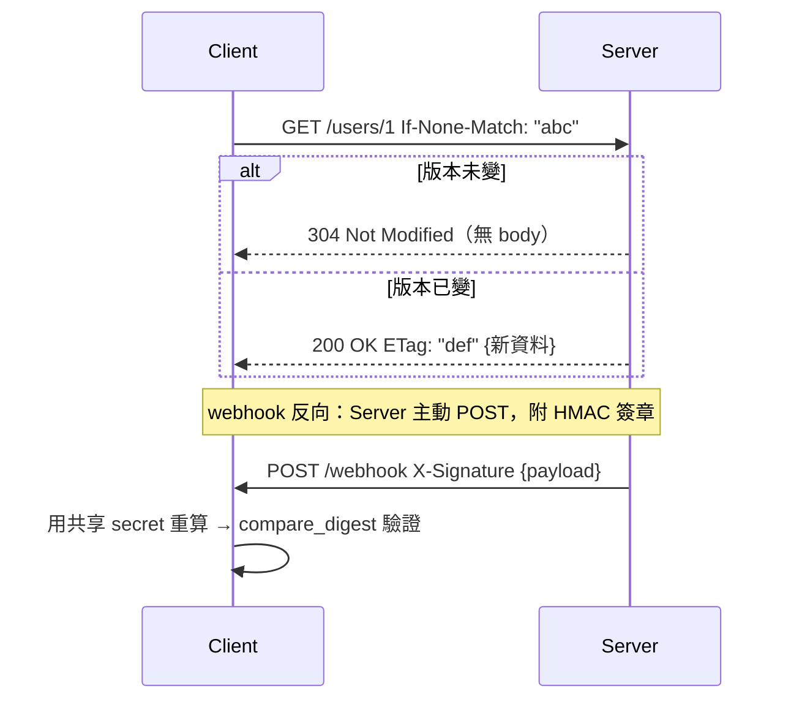

# ETag、條件請求與 webhook 設計

> 兩個都跟「版本」和「信任」有關的主題:ETag 讓客戶端問「這資料還是我手上那版嗎?」沒變就不用重傳;webhook 讓你送事件給別人時,對方能驗證「這真的是你送的、沒被人偽造或竄改」。

## 💡 白話導讀（建議先讀）

這章有兩個看似無關、其實都在解決「**怎麼確認一份資料的版本 / 來源可信**」的主題。

**第一件事:ETag 與條件請求——省流量、防覆蓋。**

想像你每次打開一個 App 頁面,它都重新下載一份一模一樣的資料。**明明沒變,卻重傳一次**,浪費頻寬也慢。

ETag(Entity Tag,實體標籤)就是解法。伺服器給每份資料一個**版本指紋**(通常是內容的雜湊),
放在回應的 `ETag` 標頭裡。下次客戶端來要同一份資料時,順便說「我手上的版本是這個指紋
(`If-None-Match: 指紋`),如果沒變就別重傳」。伺服器一比對:

- **沒變** → 回一個空的 **304 Not Modified**(「你那份還能用」),**不傳 body**,省流量。
- **變了** → 回 200 + 新資料 + 新 ETag。

用生活比喻:ETag 就像**書的版次**。你打電話問書店「我手上是第 3 版,有新版嗎?」——
店員說「還是第 3 版」你就不用跑一趟(304);說「出第 4 版了」你才去買(200)。

ETag 還有第二個用途:**防止並行覆蓋(樂觀鎖)**。你要改一筆資料時,附上
`If-Match: 你基於的版本指紋`。如果這期間別人已經改過(版本指紋變了),伺服器回 **412 Precondition Failed**,
拒絕你的覆蓋——避免你把別人的修改蓋掉。這就是「你編輯的是舊版,請重新整理」的底層機制。

**第二件事:webhook——你反過來主動通知別人。**

前面整個 Part 你都是「別人來打你的 API」。webhook 是**反過來**:當你這邊發生某件事
(付款成功、訂單出貨),你**主動 HTTP POST 一個通知到對方預留的網址**。第三方服務
(Stripe、GitHub)都用這招通知你。

但問題來了:對方收到一個 POST,**怎麼確定真的是你送的,不是駭客偽造的?**
答案是 **HMAC 簽章**:你和對方共享一把密鑰(secret),你用密鑰對 payload 算一個簽章附在 header,
對方用同一把密鑰重算一次比對——**一致才可信**。駭客沒有密鑰,算不出對的簽章,也就偽造不了。
(這正是 [Part 20 資安：密碼雜湊與 HMAC](../20-security-system-design/08-password-hashing.md) 的實戰應用。)

這章的可執行範例,會讓你親手實作 ETag 產生 / 304 判斷,以及 webhook 的簽 / 驗。

## 🎯 什麼時候會用到

- **回傳「很少變但常被讀」的資料**:設定檔、商品目錄、使用者 profile——加 ETag,
  客戶端沒變就吃 304,省頻寬也省你的 DB。
- **避免並行編輯互相覆蓋**:多人 / 多分頁同時編一筆資料時,用 `If-Match` 做樂觀鎖,
  擋掉「後蓋前」的悲劇。
- **串接第三方的事件通知**:接 Stripe 付款、GitHub push、LINE 訊息等 webhook 時,
  **一定要驗 HMAC 簽章**,否則等於開一個誰都能戳的後門。
- **你自己對外送 webhook**:當你的服務要通知客戶系統時,幫 payload 簽 HMAC,讓對方能驗你。

## Why（為什麼）

- **頻寬與延遲**:沒變的資料重傳是純浪費。ETag + 304 讓「沒變」的成本趨近於零(只傳標頭)。
- **正確性(防丟失更新)**:沒有條件請求,兩個人同時編輯,後存的會**默默蓋掉**前一個人的修改。
  `If-Match` + 412 把它變成一個明確的衝突,而不是無聲的資料遺失。
- **安全(來源驗證)**:webhook 端點是公開網址,不驗簽 = 任何人都能偽造事件(假造一筆「付款成功」)。
  HMAC 用「共享密鑰 + 雜湊」證明來源與完整性,且**不需要在網路上傳密鑰本身**。

## Theory（理論）

### ETag 與條件請求

```text
第一次：
  Client → GET /users/1
  Server → 200 OK   ETag: "abc123"   {資料}

第二次（客戶端手上已有 "abc123"）：
  Client → GET /users/1   If-None-Match: "abc123"
  Server 比對目前 ETag：
     一樣 → 304 Not Modified（無 body）        ← 省流量
     不同 → 200 OK  ETag: "新指紋"  {新資料}
```

- **強 ETag**(`"abc"`):位元組完全相同才算同版。**弱 ETag**(`W/"abc"`):語意相同即可。多數情況用強的。
- **`If-None-Match`**(讀):給 GET 用,做快取驗證 → 命中回 304。
- **`If-Match`**(寫):給 PUT/PATCH/DELETE 用,做樂觀鎖 → 版本過期回 412。

### 樂觀鎖(optimistic locking)

```text
A 讀到 v1（ETag "v1"）           B 也讀到 v1
A PUT  If-Match:"v1" → 成功，變 v2
B PUT  If-Match:"v1" → 412！     ← 你基於的 v1 已過期，請重讀
```

「樂觀」的意思是:**先假設不會衝突,真的衝突時才擋**(用版本比對),不像悲觀鎖要先鎖住整筆。

### webhook 與 HMAC 簽章

```text
你（發送方）：
  簽章 = HMAC-SHA256(secret, payload)
  POST 對方網址   Header: X-Signature: sha256=<簽章>   Body: payload

對方（接收方）：
  期望 = HMAC-SHA256(同一把 secret, 收到的 payload)
  用「定時比較」比對 期望 == 收到的簽章 → 一致才處理
```

- **HMAC** = 帶密鑰的雜湊。沒有 secret 就算不出正確簽章,所以能證明「來源」+「內容沒被改」。
- **要用定時比較**(`hmac.compare_digest`)而非 `==`:一般字串比較會「越早不同越早返回」,
  攻擊者能藉回應時間**逐位元組猜出簽章**(時序攻擊)。`compare_digest` 花的時間與內容無關。

## Specification（規範：相關 HTTP 元素）

| 元素 | 用途 |
|------|------|
| `ETag: "..."` 回應標頭 | 伺服器標示資源目前版本指紋 |
| `If-None-Match:` 請求標頭 | 讀取:手上版本仍最新則回 **304** |
| `If-Match:` 請求標頭 | 寫入:基於的版本已過期則回 **412** |
| `304 Not Modified` | 無 body,叫客戶端用快取那份 |
| `412 Precondition Failed` | 前置條件(版本)不符,拒絕此次寫入 |
| webhook 簽章標頭(名稱自訂) | 如 `X-Hub-Signature-256: sha256=...`(GitHub 慣例) |

## Implementation（實作：純標準庫就能做）

ETag 只需要對 body 做雜湊;HMAC 用 `hmac` + `hashlib`。下面範例把四件事做齊:
產生 ETag、判斷 304、判斷 412(樂觀鎖)、webhook 簽 / 驗。

## Code Example（可執行的 Python 範例）

```python
# etag_webhook.py —— ETag 條件請求 + webhook HMAC 簽章
from __future__ import annotations

import hashlib
import hmac


def make_etag(body: bytes) -> str:
    """用內容雜湊產生強 ETag（內容變 → ETag 變）。"""
    return '"' + hashlib.sha256(body).hexdigest()[:16] + '"'


def is_not_modified(if_none_match: str | None, current_etag: str) -> bool:
    """處理 If-None-Match：客戶端手上的版本仍是最新 → True（回 304）。"""
    if not if_none_match:
        return False
    tags = [t.strip() for t in if_none_match.split(",")]
    return current_etag in tags or "*" in tags


def precondition_failed(if_match: str | None, current_etag: str) -> bool:
    """處理 If-Match（樂觀鎖）：客戶端基於的版本已過期 → True（回 412）。"""
    if not if_match:
        return False
    tags = [t.strip() for t in if_match.split(",")]
    return current_etag not in tags and "*" not in tags


def sign_webhook(secret: bytes, payload: bytes) -> str:
    """用 HMAC-SHA256 對 payload 簽章（送 webhook 時放進 header）。"""
    return "sha256=" + hmac.new(secret, payload, hashlib.sha256).hexdigest()


def verify_webhook(secret: bytes, payload: bytes, signature: str) -> bool:
    """驗證 webhook 簽章；用 compare_digest 防時序攻擊。"""
    expected = sign_webhook(secret, payload)
    return hmac.compare_digest(expected, signature)


if __name__ == "__main__":
    body = b'{"id":1,"name":"ada"}'
    etag = make_etag(body)
    print("ETag:", etag)
    print("手上是最新版 → 回 304?", is_not_modified(etag, etag))
    print("手上是舊版 → 回 304?", is_not_modified('"old"', etag))
    sig = sign_webhook(b"secret", body)
    print("簽章:", sig)
    print("驗證正確簽章:", verify_webhook(b"secret", body, sig))
    print("驗證被竄改的 payload:", verify_webhook(b"secret", body + b"x", sig))
```

**預期輸出**：

```pycon
$ python etag_webhook.py
ETag: "b3dcc885cf0613ee"
手上是最新版 → 回 304? True
手上是舊版 → 回 304? False
簽章: sha256=8c9c1889eb02fb5cba525fd49515fb1d2e1951e7d16466e9dcad16fca940d5cd
驗證正確簽章: True
驗證被竄改的 payload: False
```

**逐段解說**:

- `make_etag` 用 SHA-256 前 16 碼當指紋:**內容一改,指紋就變**——這正是「版本」該有的性質。
- `is_not_modified` 支援逗號分隔的多個 tag 與 `*`(符合 HTTP 規範),命中就回 304。
- `precondition_failed` 是樂觀鎖:客戶端 `If-Match` 的版本不在目前版本裡 → 回 412,擋下覆蓋。
- `verify_webhook` **關鍵在 `hmac.compare_digest`**:被竄改的 payload 算出的期望簽章不符 → False,
  且比對時間不洩漏資訊。**永遠別用 `expected == signature`**。

**接到 FastAPI**(示意):

```python
from fastapi import FastAPI, Header, Request, Response

app = FastAPI()


@app.get("/users/{user_id}")
async def get_user(user_id: int, response: Response,
                   if_none_match: str | None = Header(default=None)) -> dict[str, int] | Response:
    body = b'{"id":1}'  # 實際上來自 DB
    etag = make_etag(body)
    if is_not_modified(if_none_match, etag):
        return Response(status_code=304)          # 沒變，省下傳輸
    response.headers["ETag"] = etag
    return {"id": user_id}


@app.post("/webhooks/payment")
async def receive_webhook(request: Request,
                          x_signature: str = Header()) -> dict[str, str]:
    payload = await request.body()
    if not verify_webhook(b"shared-secret", payload, x_signature):
        raise ValueError("簽章驗證失敗")           # 實務回 401/403
    return {"status": "received"}
```

## Diagram（圖解）



## Best Practice（最佳實踐）

- **ETag 用內容雜湊或版本欄位產生**,別用會頻繁變動又與內容無關的值(如當前時間)。
- **讀用 `If-None-Match`(304)、寫用 `If-Match`(412)**,別搞混方向。
- **webhook 驗簽用 `hmac.compare_digest`**,絕不用 `==`(時序攻擊)。
- **webhook 接收端要冪等**:對方可能重送(逾時重試),用事件 id 去重,別重複扣款
  (接 [Part 22 冪等 / 至少一次投遞](../22-distributed-systems/README.md))。
- **secret 從環境變數讀、定期輪替**(接 [ch09 環境變數](../00-backend-foundations/09-shell-env-diagnostics.md)),別寫死在碼裡。
- **webhook 驗簽要含防重放**:除了驗 HMAC,檢查時間戳在合理窗口內,避免舊請求被錄下重送。

## Common Mistakes（常見誤解）

- **「304 也要傳 body」**。不對,304 **不傳 body**,省的就是這個;客戶端用它快取那份。
- **「ETag 拿時間戳當值」**。內容沒變但時間變了,ETag 就變,失去意義。要綁**內容**。
- **「webhook 收到就處理,不驗簽」**。等於開後門,任何人可偽造事件。**必須驗 HMAC**。
- **「驗簽用 `==` 比對」**。會有時序攻擊風險。用 `hmac.compare_digest`。
- **「webhook 只會送一次」**。錯,對方逾時會重送,**同一事件可能到好幾次**——接收端要冪等去重。
- **「`If-Match` 和 `If-None-Match` 差不多」**。方向相反:`If-None-Match` 給讀(命中回 304)、
  `If-Match` 給寫(過期回 412)。

## Interview Notes（面試重點）

- **「ETag 是什麼?怎麼用來省頻寬?」**
  資源的版本指紋(通常內容雜湊)。客戶端帶 `If-None-Match` 來,伺服器比對:沒變回 **304**(無 body)、
  變了回 200 + 新資料。省掉「沒變卻重傳」的浪費。

- **「怎麼避免兩個人同時編輯互相覆蓋?」**
  **樂觀鎖**:寫入時帶 `If-Match: <讀到的 ETag>`;若期間版本已變,伺服器回 **412 Precondition Failed**,
  拒絕覆蓋,叫客戶端重讀。這比悲觀鎖(先鎖整筆)輕量。

- **「怎麼確保收到的 webhook 真的來自宣稱的來源?」**
  **HMAC 簽章**:雙方共享 secret,發送方用它對 payload 算簽章放 header,接收方用同一把重算比對。
  沒 secret 就偽造不了。驗證要用**定時比較**(`hmac.compare_digest`)防時序攻擊,並做**冪等去重**防重送。

- **「為什麼驗簽不能用 `==`?」**
  一般比較越早遇到不同字元越早返回,攻擊者能用回應時間差**逐位元組爆破**簽章(時序攻擊)。
  `compare_digest` 的耗時與內容無關,消除這個側通道。

---

➡️ 下一章：[背景任務進階:為什麼需要任務佇列](21-task-queue-why.md)

[⬆️ 回 Part 14 索引](README.md)
