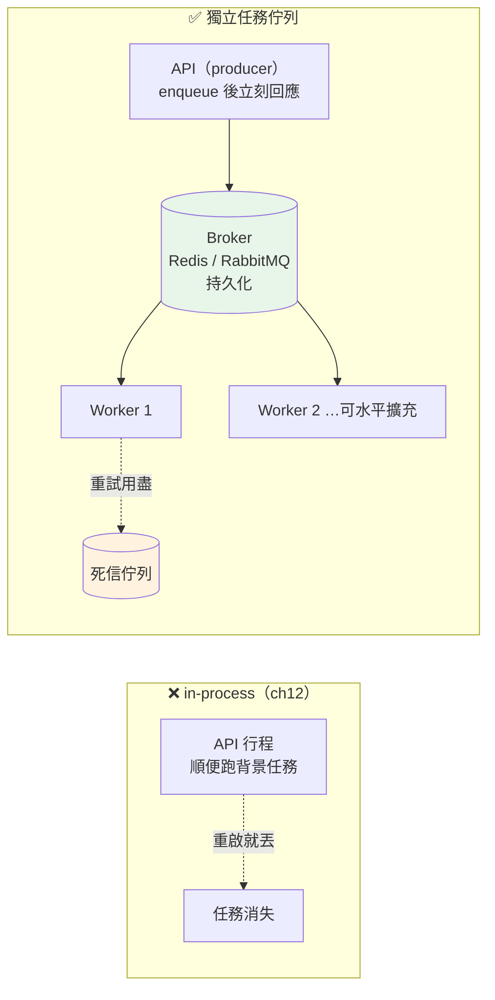

# 背景任務進階:為什麼需要獨立的任務佇列

> [ch12](12-async-web-background.md) 的 in-process 背景任務很方便,但它有一個致命弱點:任務跟你的 API 程式綁在同一個行程裡,行程一重啟,沒做完的任務就永遠消失了。這章講清楚這個坑,並帶出解法——獨立的任務佇列。

## 💡 白話導讀（建議先讀）

[ch12](12-async-web-background.md) 教過 FastAPI 的 `BackgroundTasks`:回應先回給使用者,
寄信、寫 log 這種慢工在背景做。看起來很棒——但它有個你**部署後才會痛**的問題。

先看它到底是怎麼運作的。`BackgroundTasks` 是 **in-process(行程內)** 的:那個「背景」
其實還是**在你 API 的同一個行程裡**跑。這帶來三個問題:

**問題一:重啟就丟。** 你部署新版本、或程式當掉重啟(還記得 [ch08 的 SIGTERM](../00-backend-foundations/08-signals-lifecycle.md)?),
所有「排在背景、還沒做完」的任務**跟著行程一起消失**——因為它們只活在記憶體裡,沒有任何地方記著。
使用者以為信寄出了,其實石沉大海。

**問題二:失敗就沒了。** 背景任務寄信時對方 SMTP 剛好掛了,拋個例外——然後呢?
沒有人重試,這封信就這樣沒了。in-process 背景任務**沒有內建重試機制**。

**問題三:搶你 API 的資源。** 背景任務跟 API 共用同一個行程的 CPU / 記憶體 / 連線。
一個很重的背景工作(產一份大報表)會**拖慢正在服務使用者的 API**。你也沒辦法「多加幾台專門做背景工作的機器」,
因為它們綁死在 API 行程裡。

解法是把「背景工作」**搬出 API 行程**,交給一個獨立的**任務佇列(task queue)**系統。核心三個角色:

- **生產者(producer)**:你的 API。它不自己做慢工,而是把「要做的事」寫成一則**任務訊息**,
  丟進一個**佇列(broker,如 Redis / RabbitMQ)**,然後立刻回應使用者。
- **佇列(broker)**:一個獨立的、會**把任務存起來**的中介。行程重啟?任務還在佇列裡,不會丟。
- **消費者(worker)**:一支或多支**獨立的行程 / 機器**,專門從佇列拿任務來執行。做失敗了會重試,
  重試用盡進「死信」等人處理。要處理量大?**多開幾個 worker** 就好,完全不影響 API。

用生活比喻:in-process 背景任務像**餐廳店員自己邊收銀邊洗碗**——一忙就顧此失彼,他下班(重啟)
沒洗的碗就擱著。任務佇列像**把髒碗放進一個傳送帶(佇列),後場有專門的洗碗工(worker)**——
收銀員(API)只管把碗放上帶子就回去服務客人,洗碗工可以加派人手,某個工人下班也有別人接手,
帶子上的碗不會不見。

這章的可執行範例,會用一個**迷你任務佇列**讓你看到 worker + 重試 + 死信這三件事;
下一章([ch22](22-celery.md))再進入業界標準工具 **Celery**。

## 🎯 什麼時候會用到

- **任何「不能因為重啟就丟」的背景工作**:寄信 / 簡訊、發推播、金流對帳、產報表、影音轉檔。
- **要能重試的外部呼叫**:呼叫第三方 API 可能暫時失敗,需要自動退避重試(而不是一次就放棄)。
- **重工作要跟 API 隔離**:CPU 密集或長時間的工作,搬到獨立 worker,不拖累線上請求。
- **要能水平擴充處理量**:雙十一訂單暴增,任務堆積——多開 worker 機器就能加速消化。
- **定時 / 排程任務**:每天凌晨結算、每小時同步——這是下一章 [ch23 排程](23-scheduling.md)的主題,底層也是任務佇列。

## Why（為什麼）

因為 **in-process 背景任務把「可靠性」這件事整個省略了**,而生產環境剛好最需要它。

- **持久性(durability)**:任務寫進獨立的 broker,行程重啟 / 崩潰**不丟任務**。這是 in-process 做不到的。
- **重試與死信**:暫時性失敗自動重排隊(配退避),永久失敗進死信佇列**留痕**,不無聲消失。
- **隔離與擴充**:worker 與 API 是不同行程 / 機器,重工作不搶 API 資源;要更快就多開 worker(水平擴充)。
- **關注點分離**:API 只負責「**接收並記下要做什麼**」,worker 負責「**實際做**」——各自能獨立部署、擴充、監控。

## Theory（理論：任務佇列的三個角色與投遞保證）

```text
   Producer（你的 API）              Broker（Redis/RabbitMQ）           Worker（獨立行程）
   ─────────────────                 ───────────────────                ──────────────
   收到請求
   enqueue("send_email", {...})  ─►  [ 任務被持久化存起來 ]        ◄─  拿一個任務來做
   立刻回應使用者                     （重啟也還在）                    成功 → ack（確認移除）
                                                                        失敗 → 重排隊 / 死信
```

**投遞保證(delivery guarantee)**:主流任務佇列給的是「**至少一次(at-least-once)**」——
worker 拿到任務、做完才 ack;若做到一半崩潰(沒 ack),佇列會把任務**再投一次**給別的 worker。
好處是不丟,代價是**同一個任務可能被執行超過一次**——所以 **任務必須設計成冪等(idempotent)**
(做兩次跟做一次結果相同)。這條原則貫穿 [Part 22 分散式系統](../22-distributed-systems/README.md),
下一章 [ch22](22-celery.md) 會示範 Celery 裡怎麼做。

**死信佇列(dead-letter queue,DLQ)**:重試用盡仍失敗的任務,移到一個獨立佇列,
讓你能查、能告警、能人工重放——**失敗要看得見**,而不是靜靜蒸發。

## Specification（規範：一個任務佇列該有的能力）

| 能力 | 意義 |
|------|------|
| 持久化 | 任務存在 broker,行程重啟不丟 |
| 重試 + 退避 | 暫時失敗自動重排隊,間隔逐次拉長(指數退避 + 抖動) |
| 死信佇列 | 重試用盡的任務留痕待處理 |
| 冪等要求 | 至少一次投遞 → 任務要能安全地被執行多次 |
| 水平擴充 | 多 worker 併行消費同一佇列 |
| 可觀測 | 佇列長度、處理速率、失敗數可監控 |

## Implementation（實作：一個迷你任務佇列)

真實世界用 Celery + Redis(下一章)。這裡用純標準庫的 `deque` 當 broker,做一個**能看懂原理**的
迷你版:它有 enqueue、worker 執行、重試、死信——把上面的理論變成可以跑、可以測的程式。

## Code Example（可執行的 Python 範例）

```python
# task_queue.py —— 迷你任務佇列：enqueue / worker / 重試 / 死信
from __future__ import annotations

from collections import deque
from collections.abc import Callable
from dataclasses import dataclass, field


@dataclass
class Task:
    name: str
    payload: dict[str, object]
    max_retries: int = 3
    attempts: int = 0


@dataclass
class Worker:
    handlers: dict[str, Callable[[dict[str, object]], None]]
    queue: deque[Task] = field(default_factory=deque)
    dead_letter: list[Task] = field(default_factory=list)
    processed: list[str] = field(default_factory=list)

    def enqueue(self, task: Task) -> None:
        self.queue.append(task)

    def run_once(self) -> None:
        """取一個任務執行；失敗則重排隊，用盡重試進死信。"""
        if not self.queue:
            return
        task = self.queue.popleft()
        task.attempts += 1
        try:
            self.handlers[task.name](task.payload)
            self.processed.append(task.name)
        except Exception:  # noqa: BLE001 — 任務佇列刻意攔所有例外做重試/死信
            if task.attempts < task.max_retries:
                self.queue.append(task)         # 暫時失敗 → 重新排隊
            else:
                self.dead_letter.append(task)     # 用盡重試 → 死信

    def drain(self) -> None:
        while self.queue:
            self.run_once()


if __name__ == "__main__":
    calls = {"n": 0}

    def flaky(payload: dict[str, object]) -> None:
        calls["n"] += 1
        if calls["n"] < 2:
            raise RuntimeError("暫時失敗（例如對方 API 超時）")

    def always_fail(payload: dict[str, object]) -> None:
        raise RuntimeError("永久失敗（例如資料本身壞掉）")

    worker = Worker(handlers={"send_email": flaky, "broken": always_fail})
    worker.enqueue(Task("send_email", {"to": "a@b.c"}))
    worker.enqueue(Task("broken", {}, max_retries=2))
    worker.drain()
    print("成功處理:", worker.processed)
    print("進死信:", [(t.name, t.attempts) for t in worker.dead_letter])
```

**預期輸出**：

```pycon
$ python task_queue.py
成功處理: ['send_email']
進死信: [('broken', 2)]
```

**逐段解說**:

- `send_email` 第一次拋「暫時失敗」→ 被**重新排隊**;第二次成功 → 進 `processed`。
  這就是重試:暫時性錯誤不該讓任務直接消失。
- `broken` 每次都失敗,重試到 `max_retries=2` 用盡 → 進 **死信**(`dead_letter`),`attempts=2`。
  它沒有無聲消失,你能事後查到「這個任務炸了兩次」。
- **對照 in-process 背景任務**:如果這是 `BackgroundTasks`,`send_email` 第一次失敗就沒了、
  程式重啟佇列裡的任務也全丟。這個迷你版把「不丟 + 重試 + 留痕」補了回來——這正是任務佇列的價值。
- 真實世界把 `deque` 換成 **Redis / RabbitMQ**(持久化、跨機器),把 `Worker` 換成 **Celery worker**
  (可多開、可監控)——原理一模一樣。

## Diagram（圖解：從 in-process 到獨立佇列）



## Best Practice（最佳實踐）

- **判斷用哪個**:任務**快、可丟、不重要**(記一筆分析 log)→ in-process `BackgroundTasks` 夠了;
  **慢、不可丟、要重試 / 隔離 / 擴充**(寄信、金流、轉檔)→ 用任務佇列。別一律無腦上 Celery。
- **任務設計成冪等**:至少一次投遞下,同一任務可能跑多次,用去重鍵 / upsert 保證重複執行安全。
- **任務參數只放「識別碼」,不放大物件**:傳 `user_id` 而非整個 user、傳檔案路徑而非檔案內容——
  佇列訊息要小,大資料放 DB / 物件儲存讓 worker 自己撈。
- **一定要有死信與告警**:失敗任務要能被看見、被重放,別讓它靜靜消失。
- **worker 要能優雅關閉**:收到 [SIGTERM](../00-backend-foundations/08-signals-lifecycle.md) 時做完手上任務再退出,別半途砍斷。

## Common Mistakes（常見誤解）

- **「`BackgroundTasks` 就等於任務佇列」**。不是。它是 in-process、不持久、不重試、不能獨立擴充。
  重要的背景工作用它會在重啟 / 失敗時默默丟任務。
- **「用了佇列就不會丟任務」**。要 broker **持久化**(Redis 要開 AOF/RDB、RabbitMQ 要 durable queue)、
  且 worker **做完才 ack**,才真的不丟。設定不對照樣丟。
- **「任務不用管冪等」**。至少一次投遞會重送,不冪等就會重複扣款 / 重複寄信。
- **「把大檔案塞進任務參數」**。訊息會爆、broker 會慢。傳識別碼,大資料另存。
- **「失敗就吞掉」**。要有死信 + 告警,否則你根本不知道有任務炸了。

## Interview Notes（面試重點）

- **「FastAPI 的 `BackgroundTasks` 和 Celery 差在哪?什麼時候該升級?」**
  面試官想聽:`BackgroundTasks` 是 **in-process**——跟 API 同行程,**重啟 / 崩潰會丟任務、沒有重試、
  不能獨立擴充**。任務**重要、要可靠、要重試 / 隔離 / 水平擴充**時,升級到獨立任務佇列(Celery + broker)。
  快又可丟的小事才留在 in-process。

- **「任務佇列怎麼保證任務不丟?」**
  broker **持久化**任務 + worker **做完才 ack**;沒 ack(崩潰)就**重新投遞**。這是「至少一次」保證。

- **「至少一次投遞有什麼副作用?怎麼處理?」**
  同一任務**可能執行多次**。解法是把任務設計成**冪等**(用去重鍵 / upsert),讓重複執行不造成重複效果。

- **「什麼是死信佇列(DLQ)?」**
  重試用盡仍失敗的任務會移到 DLQ,讓人能查、告警、人工重放——確保**失敗被看見**,不會靜靜消失。

---

➡️ 下一章：[Celery 實戰:broker、task、重試與冪等](22-celery.md)

[⬆️ 回 Part 14 索引](README.md)
