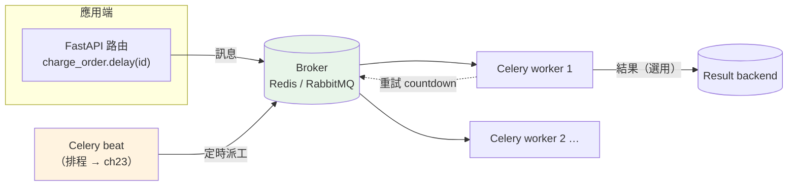

# Celery 實戰:broker、task、重試與冪等

> 上一章講清楚「為什麼需要任務佇列」,這章進入 Python 後端的業界標準工具——Celery。你會看到一個 task 怎麼定義、怎麼被送進 broker、worker 怎麼消費,以及生產環境最關鍵的兩件事:重試退避與冪等。

## 💡 白話導讀（建議先讀）

[上一章](21-task-queue-why.md)我們手做了一個迷你任務佇列,理解了 producer / broker / worker 三個角色。
這章換成真正在用的工具:**Celery**。

Celery 是 Python 世界最主流的**分散式任務佇列框架**。它幫你把上一章那些「自己刻很麻煩」的事
(持久化、重試、多 worker、監控)全包好。你只要學會它的幾個核心零件:

**零件一:broker(訊息中介)。** Celery 自己不存任務,它需要一個 **broker** 來存放與傳遞任務訊息——
最常用的是 **Redis** 或 **RabbitMQ**。你可以把 broker 想成上一章那條「傳送帶」的實體:
API 把任務放上去、worker 從上面拿。

**零件二:task(任務)。** 一個用 `@app.task` 裝飾的普通 Python 函式。裝飾之後,它多了一個超能力:
你可以呼叫 `寄信.delay(user_id)`,這行**不會當場執行寄信**,而是把「請執行寄信,參數 user_id」
這則訊息**丟進 broker**,然後立刻返回。真正的寄信由 worker 之後去做。

**零件三:worker(工人)。** 你在另一個終端 / 另一台機器跑 `celery -A app worker`,
它就變成一支專門盯著 broker、拿任務來執行的行程。要處理更快?多開幾支 worker。

**零件四:result backend(結果儲存,選用)。** 如果你想知道任務「做完了沒、結果是什麼」,
Celery 可以把結果存進一個 backend(也常用 Redis)供你查詢。很多背景任務(寄信)根本不需要結果,
這個就可以不開。

那生產環境最容易踩的坑是什麼?兩個字:**重試** 和 **冪等**。

- **重試要「退避 + 抖動」**:任務失敗要重試,但如果「立刻重試、失敗再立刻重試」,
  等於對已經很累的下游服務**連環轟炸**。正確做法是**指數退避**(第 1 次等 1 秒、第 2 次 2 秒、
  第 4 次 4 秒……越等越久)再加**抖動**(每個 client 等的秒數加一點隨機),避免大家「同時」重試把下游打爆。
- **冪等(idempotent)**:上一章說過,任務佇列是「至少一次」投遞——**同一個任務可能被執行兩次**。
  所以扣款、寄信這種有副作用的任務,必須設計成「**做兩次跟做一次結果一樣**」,通常靠一個
  **冪等鍵**(如訂單 id)去重:處理前先問「這個 id 處理過了嗎?」處理過就跳過。

這章的可執行範例,會把**退避**和**冪等**這兩個純邏輯、最容易考也最容易錯的概念抽出來讓你實測;
Celery 本身的程式碼(需要 broker 才能跑)則以真實寫法示意。

## 🎯 什麼時候會用到

- **需要可靠背景處理的 Python 專案**:Celery 幾乎是預設選擇——寄信、通知、金流、報表、轉檔、資料同步。
- **要定時任務**:Celery 內建 **beat**(排程器),cron 型任務直接用(下一章 [ch23](23-scheduling.md) 細講)。
- **要水平擴充處理量**:worker 可跨多台機器,佇列堆積時加機器就能加速。
- **要和 FastAPI / Django / Flask 整合**:Celery 與各大框架整合成熟,API 端 `.delay()` 派工、worker 端執行。

## Why（為什麼用 Celery 而不是自己刻）

上一章的迷你佇列能解釋原理,但生產環境自己刻要補的東西太多:持久化、序列化、多 worker 協調、
重試退避、排程、監控、優雅關閉……Celery 把這些都做好且久經考驗。

- **成熟生態**:與 Redis / RabbitMQ、FastAPI / Django、監控工具(Flower)整合完整。
- **內建重試、退避、限流、路由**:不用自己寫,設參數即可。
- **beat 排程器**:cron 型定時任務內建支援。
- **可觀測**:任務狀態、佇列長度、失敗數都能查與告警。

## Theory（理論：一個任務的生命週期）

```text
① 定義      @app.task(bind=True, max_retries=3)
            def send_email(self, user_id): ...

② 派工      send_email.delay(42)        ← API 端呼叫，訊息進 broker，立刻返回
                                          （不是當場寄信！）

③ 消費      celery -A app worker         ← worker 從 broker 取出訊息
            worker 執行 send_email(42)

④ 結果      成功 → ack，（選用）結果存 result backend
            失敗 → self.retry(countdown=退避秒數) 重排；用盡 → 標記失敗 / 死信
```

**`.delay()` vs 直接呼叫**:`send_email(42)` 是**當場同步執行**;`send_email.delay(42)` 是
**送進佇列非同步執行**。差這一個 `.delay()`,行為天差地別——這是新手最常搞混的點。

## Specification（規範：關鍵設定與 API）

| 元素 | 說明 |
|------|------|
| `Celery(broker=..., backend=...)` | 建立 app,指定 broker(必要)與 result backend(選用) |
| `@app.task` | 把函式變成任務;`bind=True` 讓函式拿到 `self`(可呼叫 `self.retry`) |
| `.delay(*args)` / `.apply_async(...)` | 派工;後者可設 `countdown`、`eta`、`queue`、`retry` 等 |
| `self.retry(exc=e, countdown=n, max_retries=m)` | 在任務內觸發重試 |
| `acks_late=True` | **做完才 ack**(崩潰會重投,保證至少一次;要求任務冪等) |
| `task_always_eager=True` | 測試用:任務同步就地執行,不需 broker |

## Implementation（實作：真實 Celery 寫法 + 可測核心）

下面第一段是**真實的 Celery 程式碼**(需要 broker 才能實際跑,此處作示意);第二段把其中最關鍵、
最常考的兩個純邏輯——**退避**與**冪等**——抽出來,做成可實際執行與測試的範例。

**真實 Celery 寫法**(示意):

```python
from celery import Celery

app = Celery("tasks", broker="redis://localhost:6379/0",
             backend="redis://localhost:6379/1")


@app.task(bind=True, max_retries=3, acks_late=True)
def charge_order(self, order_id: str) -> None:
    # 冪等：先問這筆訂單處理過了嗎（至少一次投遞 → 可能重送）
    if already_charged(order_id):
        return
    try:
        do_charge(order_id)
    except TemporaryError as exc:
        # 指數退避 + 抖動：2^重試次數 秒，避免重試風暴
        delay = 2**self.request.retries
        raise self.retry(exc=exc, countdown=delay) from exc


# API 端派工（例如 FastAPI 的路由裡）：
# charge_order.delay("order-123")   ← 立刻返回，worker 之後執行
```

啟動 worker:`celery -A tasks worker --loglevel=info`。

## Code Example（可執行的 Python 範例）

**可執行的核心概念**(退避 + 冪等):

```python
# celery_concepts.py —— 抽出 Celery 最關鍵的兩個可測概念
from __future__ import annotations

import random


def retry_backoff(
    attempt: int, base: float = 1.0, cap: float = 60.0, rng: random.Random | None = None
) -> float:
    """第 attempt 次重試該等幾秒：指數成長、封頂、加抖動（full jitter）。"""
    rng = rng or random.Random()
    ceiling = min(cap, base * (2**attempt))
    return rng.uniform(0, ceiling)


class IdempotentProcessor:
    """用冪等鍵去重：同一個 key 只真正生效一次。"""

    def __init__(self) -> None:
        self.seen: set[str] = set()
        self.effects: list[str] = []

    def process(self, key: str, effect: str) -> bool:
        """回傳 True=首次執行（產生效果），False=重複、已跳過。"""
        if key in self.seen:
            return False
        self.seen.add(key)
        self.effects.append(effect)
        return True


if __name__ == "__main__":
    rng = random.Random(42)
    delays = [round(retry_backoff(a, rng=rng), 2) for a in range(6)]
    print("重試退避秒數（attempt 0..5）:", delays)

    processor = IdempotentProcessor()
    print("首次扣款:", processor.process("order-1", "charge"))
    print("重複投遞:", processor.process("order-1", "charge"))
    print("實際效果:", processor.effects)
```

**預期輸出**（退避含隨機抖動，種子固定所以可重現）：

```pycon
$ python celery_concepts.py
重試退避秒數（attempt 0..5）: [0.64, 0.05, 1.1, 1.79, 11.78, 21.65]
首次扣款: True
重複投遞: False
實際效果: ['charge']
```

**逐段解說**:

- `retry_backoff` 的 `ceiling = min(cap, base * 2**attempt)`:退避間隔**指數成長**(1→2→4→8…)
  但被 `cap` 封頂(不會等到天荒地老)。`rng.uniform(0, ceiling)` 是 **full jitter**——
  在 0 到上限間取隨機,讓大量 client 的重試**散開**,不會同一秒一起打下游(重試風暴)。
- `IdempotentProcessor.process` 用 `seen` 集合去重:同一個 `order-1` 第二次來直接回 `False` 跳過,
  `effects` 裡「charge」只出現一次——**這就是冪等**。真實世界的 `seen` 換成 DB 的唯一鍵 / Redis SETNX。
- 這兩段對應上面 Celery 程式碼裡的 `countdown=2**retries`(退避)與 `already_charged(order_id)`(冪等)——
  框架換了,道理不變。

## Diagram（圖解：Celery 架構）



## Best Practice（最佳實踐）

- **任務冪等 + `acks_late=True`**:搭配才安全——做完才 ack 保證不丟,冪等保證重送不重複生效。
- **重試用指數退避 + 抖動**:別固定間隔猛重試;Celery 可用 `retry_backoff=True, retry_jitter=True`。
- **任務參數傳識別碼、不傳大物件**:傳 `order_id`,worker 自己撈;訊息小、序列化快。
- **分佇列與路由**:重任務、輕任務走不同佇列與不同 worker,別讓一份大報表塞住寄信佇列。
- **監控 + 死信**:上 Flower 看佇列與失敗;失敗任務要能查與重放。
- **worker 優雅關閉**:部署時 Celery 收 [SIGTERM](../00-backend-foundations/08-signals-lifecycle.md) 會做完手上任務再退,配置好寬限期。
- **別把 result backend 當必需**:不需要結果就別開,省一套儲存與清理負擔。

## Common Mistakes（常見誤解）

- **「呼叫任務函式就會進背景」**。錯。`send_email(id)` 是**當場同步執行**;要非同步得用
  `send_email.delay(id)` 或 `.apply_async(...)`。少一個 `.delay()` 就變同步阻塞。
- **「Celery 自己會存任務」**。不會,它**靠 broker**(Redis/RabbitMQ)。broker 沒持久化設定好一樣會丟。
- **「重試就是 while 迴圈立刻再試」**。會造成**重試風暴**打爆下游。要**退避 + 抖動**。
- **「任務不用冪等」**。至少一次投遞會重送,不冪等就重複扣款 / 重複寄信。
- **「result backend 一定要開」**。多數背景任務不需要結果,開了反而多一套要維護與清理的儲存。
- **「worker 跟 API 可以共用同一份阻塞資源不設限」**。重任務要隔離佇列 / worker,否則拖垮輕任務與 API。

## Interview Notes（面試重點）

- **「介紹一下 Celery 的架構。」**
  面試官想聽:**producer(app 用 `.delay()` 派工)→ broker(Redis/RabbitMQ 存傳任務)→
  worker(獨立行程消費執行)**,選用 **result backend** 存結果、**beat** 做排程。
  能點出「broker 是必要、backend 是選用」加分。

- **「`.delay()` 和直接呼叫差在哪?」**
  直接呼叫是**當場同步執行**;`.delay()` 把任務**送進 broker 非同步執行**,立刻返回。這是核心區別。

- **「Celery 任務怎麼設計重試?」**
  在任務內 `self.retry(exc=e, countdown=退避秒數)`,配 `max_retries`。退避要**指數成長 + 抖動**,
  避免重試風暴。永久性錯誤別重試(直接失敗 / 進死信)。

- **「為什麼 Celery 任務要冪等?怎麼做?」**
  因為投遞保證是**至少一次**,同一任務可能執行多次。用**冪等鍵**(訂單 id 等)去重:
  處理前查「做過沒」(DB 唯一鍵 / Redis SETNX),做過就跳過。配 `acks_late=True` 一起用。

- **「Celery beat 是什麼?」**
  Celery 內建的**排程器**,負責定時把任務派進佇列(cron 型),實際執行仍由 worker 做(見 [ch23](23-scheduling.md))。

---

➡️ 下一章：[排程:cron 型定時任務(Celery beat / APScheduler)](23-scheduling.md)

[⬆️ 回 Part 14 索引](README.md)
