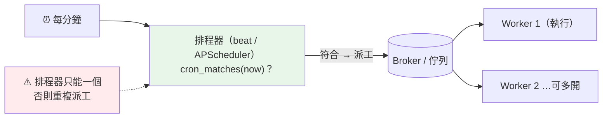

# 排程:cron 型定時任務(Celery beat / APScheduler)

> 有些工作不是「有人來請求才做」,而是「時間到了就要自己做」:每天凌晨結算、每小時同步庫存、每 5 分鐘健康檢查。這章講清楚定時任務怎麼運作,以及在 Python 後端你該用哪個工具、避開哪些坑。

## 💡 白話導讀（建議先讀）

前兩章的任務都是**被觸發**的:使用者下單 → 派一個寄信任務。但還有一類任務是**時間到了自己跑**,
沒有人來觸發——這叫**排程任務(scheduled task)** 或**定時任務**。例子到處都是:

- 每天凌晨 3 點,結算前一天的帳。
- 每小時,把庫存同步到搜尋引擎。
- 每 5 分鐘,檢查有沒有逾期未付款的訂單要取消。
- 每週一早上,寄週報。

要描述「什麼時間跑」,業界通用的語言是 **cron 運算式**。它是**五個欄位**,由左到右分別是
**分、時、日、月、星期**,每個欄位說「這個維度要滿足什麼條件」:

```text
┌───── 分（0-59）
│ ┌───── 時（0-23）
│ │ ┌───── 日（1-31）
│ │ │ ┌───── 月（1-12）
│ │ │ │ ┌───── 星期（0-6，0=週日）
│ │ │ │ │
0 3 * * *     ← 每天 03:00（分=0、時=3，其餘不限）
*/15 * * * *  ← 每 15 分鐘
0 9-17 * * 1-5 ← 週一到週五、9 到 17 點的整點
```

`*` 是「任何值都行」,具體數字是「必須等於」,`*/15` 是「每 15(能被 15 整除)」,
`9-17` 是範圍,`1,15` 是列舉。**看懂 cron 運算式,你就看懂全世界的排程設定**——
Linux 的 crontab、Kubernetes 的 CronJob、Celery beat、GitHub Actions 排程,用的都是這套語法。

那在 Python 後端**誰來負責「時間到了就派工」**?兩個主流選擇:

- **Celery beat**:如果你已經在用 [Celery](22-celery.md),它內建一個叫 **beat** 的排程器。
  beat 是一支專門盯著時鐘的行程,時間到了就**把任務丟進佇列**——實際執行還是交給 worker。
  排程與執行分離,和前兩章一脈相承。
- **APScheduler**:如果你**沒用 Celery**、只是想在自己的行程裡跑簡單排程,
  APScheduler(Advanced Python Scheduler)是輕量選擇,不需要 broker。

還有一個最容易被忽略、卻最會出事的坑:**排程器只能有一個在跑**。如果你的服務為了高可用開了
3 個實例,而每個實例都自己跑一份 beat / APScheduler,那「每天結算」就會被**執行 3 次**——
帳算三遍!所以排程器要嘛只跑單一實例,要嘛用鎖確保「同一時刻只有一個真的執行」(呼應
[Part 22 分散式鎖](../22-distributed-systems/README.md))。

這章的可執行範例,會帶你實作一個**迷你 cron 比對器**——排程器的心臟就是這個「現在符合這條規則嗎」的判斷。

## 🎯 什麼時候會用到

- **定期批次作業**:每日結算、每小時報表、每晚備份、定期清理過期資料。
- **定時同步 / 對帳**:把資料週期性推到別的系統、和第三方對帳。
- **超時掃描**:每幾分鐘掃「該取消的未付款訂單」「該重試的失敗任務」。
- **定時通知**:訂閱到期提醒、週報、生日祝福。
- **只要看到「每天 / 每小時 / 每 N 分鐘」的需求**,背後就是排程 + cron。

## Why（為什麼需要專門的排程機制）

你也許想「用 `while True: sleep(86400)` 不就好了?」——這在生產環境會出一堆問題:

- **`sleep` 迴圈不可靠**:行程重啟、當機,排程就斷了,而且時間會漂移(每次多花的執行時間累積)。
- **多實例重複執行**:高可用開多份,每份都 sleep 就會重複跑。
- **無法用 cron 語意**:「每週一 9 點」用 sleep 很難算,cron 一行搞定。
- **沒有補跑 / 對齊**:錯過的排程要不要補?專門的排程器有策略,土砲沒有。

專門的排程器(beat / APScheduler / 系統 cron)把「何時該跑」算對、和「誰來執行」解耦,並處理重啟、對齊等細節。

## Theory（理論：cron 語意與排程器角色）

**cron 欄位語意**:

| 寫法 | 意思 |
|------|------|
| `*` | 任何值 |
| `5` | 剛好等於 5 |
| `1,15,30` | 列舉:1 或 15 或 30 |
| `9-17` | 範圍:9 到 17(含) |
| `*/15` | 步進:每 15(0,15,30,45) |

**排程器的角色**(以 Celery beat 為例):

```text
Celery beat（單一排程器行程）
    每分鐘檢查：現在符合哪些排程？
        ↓ 符合
    把對應任務丟進 broker（派工，不自己執行）
        ↓
Celery worker（可多個）
    照常從 broker 取任務執行
```

**關鍵**:beat 只**派工**、worker 才**執行**。所以 worker 可以多開(執行可水平擴充),
但 **beat 只能有一個**(否則重複派工)。

## Specification（規範：工具與寫法對照）

| 工具 | 適用 | cron 寫法 |
|------|------|-----------|
| **系統 crontab** | 跑腳本、與應用無關的維運任務 | `0 3 * * * /path/script.sh` |
| **K8s CronJob** | 容器化、每次排程起一個新 Pod | manifest 裡 `schedule: "0 3 * * *"` |
| **Celery beat** | 已用 Celery,要和任務佇列整合 | `crontab(hour=3, minute=0)` |
| **APScheduler** | 沒用 Celery,行程內輕量排程 | `CronTrigger(hour=3, minute=0)` |

## Implementation（實作：排程器的心臟是 cron 比對)

不管哪個工具,核心都是同一個判斷:「**現在這個時間,符合這條 cron 規則嗎?**」符合就派工。
下面用純標準庫實作這個比對器,讓你看懂排程器內部;真實工具的 Celery beat / APScheduler 寫法在其後示意。

## Code Example（可執行的 Python 範例）

```python
# cron_schedule.py —— 迷你 cron 運算式比對器
from __future__ import annotations

from datetime import datetime


def _match_field(spec: str, value: int, low: int) -> bool:
    """單一 cron 欄位是否匹配 value。low 是該欄位最小值（用於 */n 對齊）。"""
    for part in spec.split(","):
        if part == "*":
            return True
        if part.startswith("*/"):
            step = int(part[2:])
            if step > 0 and (value - low) % step == 0:
                return True
        elif "-" in part:
            start, end = part.split("-")
            if int(start) <= value <= int(end):
                return True
        elif part.isdigit() and int(part) == value:
            return True
    return False


def cron_matches(
    minute: str, hour: str, dom: str, month: str, dow: str, dt: datetime
) -> bool:
    """五欄位 cron（分 時 日 月 週）是否匹配 dt。dow：0=週日…6=週六。

    注意標準 cron 的「日 / 星期」規則：兩者都有限制（非 *）時是 **OR**
    （任一符合就算命中）；只有一個受限時，就照那一個判斷。
    """
    time_ok = (
        _match_field(minute, dt.minute, 0)
        and _match_field(hour, dt.hour, 0)
        and _match_field(month, dt.month, 1)
    )
    dom_ok = _match_field(dom, dt.day, 1)
    dow_ok = _match_field(dow, dt.isoweekday() % 7, 0)
    both_restricted = dom != "*" and dow != "*"
    # 兩者都受限 → OR；至多一個受限 → 另一個是 *（恆真），等同只看受限那欄
    day_ok = (dom_ok or dow_ok) if both_restricted else (dom_ok and dow_ok)
    return time_ok and day_ok


if __name__ == "__main__":
    daily_3am = ("0", "3", "*", "*", "*")
    print("每天 03:00 —— 03:00 符合?",
          cron_matches(*daily_3am, dt=datetime(2026, 7, 14, 3, 0)))
    print("每天 03:00 —— 03:01 符合?",
          cron_matches(*daily_3am, dt=datetime(2026, 7, 14, 3, 1)))
    every_15 = ("*/15", "*", "*", "*", "*")
    print("每 15 分 —— 09:30 符合?",
          cron_matches(*every_15, dt=datetime(2026, 7, 14, 9, 30)))
    print("每 15 分 —— 09:31 符合?",
          cron_matches(*every_15, dt=datetime(2026, 7, 14, 9, 31)))
```

**預期輸出**：

```pycon
$ python cron_schedule.py
每天 03:00 —— 03:00 符合? True
每天 03:00 —— 03:01 符合? False
每 15 分 —— 09:30 符合? True
每 15 分 —— 09:31 符合? False
```

**逐段解說**:

- `_match_field` 處理一個欄位的四種語法:`*`(任意)、`*/n`(步進,用 `(value-low)%step==0` 判斷)、
  `a-b`(範圍)、具體數字。用逗號拆開支援列舉(`0,30`)。
- `cron_matches` 把時間三欄(分/時/月)AND 起來,再處理**日 / 星期**這個特例:
  兩者都受限時取 **OR**(標準 cron 的坑,見 Common Mistakes),否則照唯一受限的那欄。
  這正是排程器每分鐘做的事:對每條規則跑一次 `cron_matches(now)`,`True` 就派工。
- `dow` 用 `dt.isoweekday() % 7` 把「週一=1…週日=7」轉成 cron 慣例的「週日=0…週六=6」。
- 真實排程器多了「算下次執行時間、對齊、補跑、時區」等細節,但**心臟就是這個比對邏輯**。

**真實工具寫法**(示意,需對應套件環境):

```python
# Celery beat：在 Celery app 設定裡註冊排程
from celery import Celery
from celery.schedules import crontab

app = Celery("tasks", broker="redis://localhost:6379/0")
app.conf.beat_schedule = {
    "daily-settlement": {
        "task": "tasks.settle_accounts",
        "schedule": crontab(hour=3, minute=0),        # 每天 03:00
    },
    "sync-inventory": {
        "task": "tasks.sync_inventory",
        "schedule": crontab(minute="*/15"),           # 每 15 分
    },
}
# 啟動排程器：celery -A tasks beat


# APScheduler：不需 Celery，行程內排程
from apscheduler.schedulers.background import BackgroundScheduler
from apscheduler.triggers.cron import CronTrigger

scheduler = BackgroundScheduler()
scheduler.add_job(settle_accounts, CronTrigger(hour=3, minute=0))
scheduler.start()
```

## Diagram（圖解：排程 → 派工 → 執行）



## Best Practice（最佳實踐）

- **排程器只跑單一實例**,或用**分散式鎖**確保同一時刻只有一個真的執行(避免多實例重複跑)。
- **排程只負責派工,執行交給 worker**:和前兩章一致,別讓排程器自己做重活。
- **被排的任務仍要冪等**:排程可能因補跑 / 重啟而多觸發,冪等保證重複觸發安全。
- **設定明確時區**:cron 沒指定時區容易在 UTC / 本地時間之間搞錯,結算跑錯時間。明確設定並用 UTC 存。
- **給任務設逾時與告警**:定時任務沒人盯,卡住或失敗要能自動告警,別等使用者發現帳沒結。
- **容器化用 K8s CronJob 也是好選擇**:每次排程起新 Pod、天然隔離,適合獨立的批次腳本。

## Common Mistakes（常見誤解）

- **「多開幾個實例讓排程更可靠」**。相反——每個實例都跑排程器會**重複執行**。排程器要單例 / 加鎖。
- **「`while True: sleep(...)` 就能排程」**。不可靠:重啟就斷、時間會漂移、多實例重複、算不出 cron 語意。
- **「排程任務不用冪等」**。補跑、重啟、多觸發都可能讓它跑不只一次,要冪等。
- **「cron 的星期欄 0 是週一」**。是**週日**(0-6,0=Sun);還有 `日` 和 `星期` 同時給時是 **OR** 關係(標準 cron 的坑)。
- **「沒設時區沒差」**。差很多,伺服器用 UTC、你以為本地時間,結算會跑在錯的鐘點。
- **「beat 會自己執行任務」**。不會,beat 只**派工**進佇列,執行是 **worker** 的事。

## Interview Notes（面試重點）

- **「怎麼在 Python 後端做定時任務?」**
  面試官想聽:用 cron 語意描述時間,工具選 **Celery beat**(已用 Celery)或 **APScheduler**(輕量、無 broker),
  容器化可用 **K8s CronJob**。強調**排程只派工、worker 執行**,以及**排程器要單例**避免重複。

- **「cron 的五個欄位是什麼?`*/15 * * * *` 什麼意思?」**
  分、時、日、月、星期。`*/15 * * * *` = **每 15 分鐘**(分欄每 15,其餘不限)。能講出欄位順序就過關。

- **「排程任務在多實例部署下會有什麼問題?怎麼解?」**
  每個實例各跑一份排程器 → **重複執行**。解法:排程器**只跑一個實例**,或用**分散式鎖**
  (Redis SETNX / DB 唯一約束)確保同一觸發只有一個真的執行。加上任務**冪等**再保險。

- **「Celery beat 和 worker 的關係?」**
  beat 是**排程器**,時間到把任務**派進 broker**;worker 從 broker **取出執行**。兩者分離,
  worker 可多開,beat 要單例。

---

➡️ 下一章:[應用生命週期:lifespan 啟動與關閉](24-lifespan-startup.md)

[⬆️ 回 Part 14 索引](README.md)
