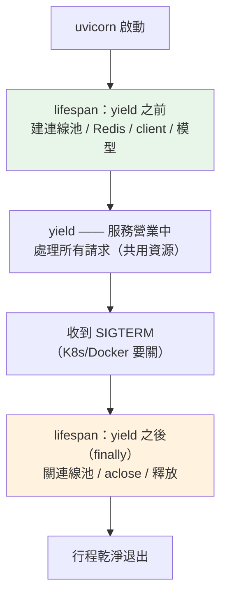

# 應用生命週期:lifespan 啟動與關閉

> 你的 DB 連線池、Redis、HTTP 客戶端、ML 模型——這些「一開機就要準備好、關機要收乾淨」的資源,該在哪裡初始化?答案是 FastAPI 的 lifespan。它是每個正式服務都會用、但教學常跳過的一塊。

## 💡 白話導讀（建議先讀）

前面幾章教你寫路由、驗證、依賴。但有個現實問題還沒回答:**那些「整個服務共用一份」的資源,什麼時候建立?**

想想一個真實的 FastAPI 服務要準備什麼:一個[資料庫連線池](../15-database/15-connection-pool.md)、
一個 Redis 連線、一個對外呼叫用的 [HTTP 客戶端](../21-microservices/09-reliable-http-client.md)、
也許還有一個載入很慢的機器學習模型。這些東西有兩個共同點:**建立很貴**(所以只想建一次、大家共用),
而且**用完要收乾淨**(連線要關、檔案要釋放)。

你**不能**在每個請求裡才建連線池——那等於每次請求都重連 DB,慢死也浪費。你需要一個地方:
**服務一啟動就把它們準備好、服務要關掉時再收乾淨。** 這個地方就是 **lifespan(生命週期)**。

用一個生活比喻:**開店與打烊。** 早上開店(startup)你要:開燈、開冷氣、把食材備好、收銀機開機。
晚上打烊(shutdown)你要:關火、清點、鎖門。你不會每來一個客人就重新開一次燈——那是**開店時做一次**的事。
lifespan 就是你的服務的「開店 SOP」和「打烊 SOP」。

FastAPI 的 lifespan 長這樣:一個特別的函式,**`yield` 之前**是「開店」(startup),
**`yield` 之後**是「打烊」(shutdown),中間 `yield` 的那一刻就是「營業中」(整個服務在跑)。

```text
lifespan：
   ┌─ startup：建連線池、連 Redis、載模型      （開店，只跑一次）
   │
  yield  ← 服務在這裡營業，處理成千上萬個請求
   │
   └─ shutdown：關連線池、斷 Redis            （打烊，只跑一次）
```

關鍵在那個 `yield`——它把「營業前」和「營業後」分在兩邊,而且**用 `try/finally` 保證:
不管服務怎麼結束(正常關、被 [SIGTERM](../00-backend-foundations/08-signals-lifecycle.md) 通知關、甚至出錯),
打烊 SOP 一定會跑到**,資源不會外洩。

這章的可執行範例,會把這個「取得→營業→保證釋放」的骨架抽出來讓你實測。

## 🎯 什麼時候會用到

- **初始化資料庫連線池**:服務啟動時建好一個池,所有請求共用(呼應 [Part 15 連線池](../15-database/15-connection-pool.md))。這是最常見的用途。
- **連 Redis / 訊息佇列 / 外部服務**:啟動時建立長連線,關機時斷開。
- **載入慢資源**:ML 模型、embedding 模型、大型設定檔——一次載入常駐記憶體,別每次請求重載。
- **建立共用的 HTTP 客戶端**:對外呼叫用的 `httpx.AsyncClient`(帶連線池),啟動時建、關機時 `aclose()`(呼應 [Part 21](../21-microservices/09-reliable-http-client.md))。
- **背景任務的啟停**:啟動一個背景輪詢 / 心跳,關機時優雅停止。

## 🔗 前端對照

FastAPI 的 lifespan 對應前端伺服器框架的**啟動 / 關閉鉤子**:

| | FastAPI | Node（Express / Nest） |
|---|---------|------------------------|
| 啟動時初始化 | `lifespan` 的 `yield` 前 | `app.listen` 前 / NestJS `onModuleInit` |
| 關閉時清理 | `lifespan` 的 `yield` 後 | `process.on("SIGTERM")` / `onModuleDestroy` |
| 共用資源放哪 | `app.state` | 模組單例 / DI 容器 |

一句話:概念一樣——**開機建一次、關機收一次、請求間共用**。FastAPI 用一個 `yield` 把兩段包在同一個函式裡,
比 Node 常見的「啟動寫一處、`SIGTERM` handler 寫另一處」更集中好維護。

## Why（為什麼）

因為**「每請求建立」和「全域只建一次」是兩種完全不同的資源**,混淆會出大問題。

- **連線池不能每請求建**:連線池的意義就是「復用連線」;每請求建一個池,等於每請求重連 DB,
  慢、耗資源、還可能把 DB 連線數打爆。它必須是**服務層級、啟動時建一次**。
- **資源要保證釋放**:連線不關會洩漏(呼應 [Part 0 fd](../00-backend-foundations/07-file-descriptor-io.md));
  關機沒收乾淨,重新部署時可能殘留連線、佔著 DB 名額。lifespan 的 `finally` 保證打烊 SOP 跑到。
- **啟動失敗要早點知道**:DB 連不上、模型載不了,應該在**啟動時就失敗**(服務起不來),
  而不是拖到第一個請求才炸——這樣部署當下就發現(呼應 [Part 0 fail fast](../00-backend-foundations/09-shell-env-diagnostics.md))。
- **和優雅關閉接上**:K8s / Docker 送 `SIGTERM` 要求關閉時,ASGI 伺服器(uvicorn)會觸發 lifespan 的
  shutdown 段——這正是[優雅關閉](../00-backend-foundations/08-signals-lifecycle.md)在應用層的落點。

## Theory（理論：lifespan 是一個 async context manager）

lifespan 的本質,就是 [Part 6 的 context manager](../06-error-handling/06-context-manager.md) 的非同步版:

```text
@asynccontextmanager
async def lifespan(app):
    # ── setup（yield 之前）＝ __aenter__ ──
    資源 = 建立資源()
    try:
        yield 給應用用的東西        # 服務營業中
    finally:
        # ── teardown（yield 之後）＝ __aexit__ ──
        資源.關閉()               # 保證釋放
```

- **`yield` 之前**只在**啟動時跑一次**;**`yield` 之後**只在**關閉時跑一次**;中間服務處理所有請求。
- 用 `try/finally` 包住 `yield`,**不管服務怎麼結束都會清理**——這是「保證釋放」的關鍵。
- 舊寫法是 `@app.on_event("startup")` / `@app.on_event("shutdown")` 兩個裝飾器,**已被棄用**;
  現在統一用 lifespan(setup 和 teardown 寫在同一個函式,共用區域變數,更清楚)。

### 資源放哪裡?`app.state`

啟動時建的資源要讓路由拿得到,慣例是掛在 `app.state` 上,再用 [Depends](11-fastapi-depends.md) 取出——
這樣路由函式只依賴「一個 getter」,測試時可覆寫(呼應 ch11 的可測性)。

## Specification（規範：FastAPI lifespan 介面）

```python
from contextlib import asynccontextmanager

from fastapi import FastAPI


@asynccontextmanager
async def lifespan(app: FastAPI):
    # startup
    ...
    yield              # 可 yield 一個 dict,內容會併進 request.state
    # shutdown
    ...


app = FastAPI(lifespan=lifespan)
```

| 元素 | 說明 |
|------|------|
| `@asynccontextmanager` | 把「yield 前 / 後」變成 setup / teardown |
| `lifespan(app)` | 收到 app;可把資源掛 `app.state` |
| `yield` | 之前=startup、之後=shutdown;可 `yield {...}` 注入 `request.state` |
| `FastAPI(lifespan=...)` | 註冊;uvicorn 啟停時觸發 |

## Implementation（實作：核心是「取得 → yield → 保證釋放」)

真實 FastAPI 需要伺服器環境才能跑,下面先示範真實寫法(示意),再把**可執行、可測**的核心骨架抽出來。

**真實 FastAPI 寫法**(示意):

```python
from contextlib import asynccontextmanager

import httpx
from fastapi import FastAPI, Request


@asynccontextmanager
async def lifespan(app: FastAPI):
    # startup:建立共用資源(只跑一次)
    app.state.http = httpx.AsyncClient(timeout=5.0)
    # app.state.pool = await create_db_pool(...)
    yield
    # shutdown:保證釋放
    await app.state.http.aclose()
    # await app.state.pool.close()


app = FastAPI(lifespan=lifespan)


@app.get("/proxy")
async def proxy(request: Request) -> dict[str, int]:
    client: httpx.AsyncClient = request.app.state.http   # 共用那一個 client
    resp = await client.get("https://example.com")
    return {"status": resp.status_code}
```

## Code Example（可執行的 Python 範例）

```python
# app_lifespan.py —— lifespan 的核心:取得 → yield → 保證釋放
from __future__ import annotations

from collections.abc import AsyncIterator
from contextlib import asynccontextmanager
from dataclasses import dataclass


@dataclass
class FakePool:
    """模擬一個要「開機取得、關機釋放」的資源(如 DB 連線池)。"""

    opened: bool = False
    closed: bool = False

    def open(self) -> None:
        self.opened = True

    def close(self) -> None:
        self.closed = True


@dataclass
class AppState:
    """放跨請求共用的資源(對應 FastAPI 的 app.state)。"""

    pool: FakePool | None = None


@asynccontextmanager
async def lifespan(state: AppState) -> AsyncIterator[None]:
    """開機取得資源、關機保證釋放——即使服務期間拋例外也會清理。"""
    pool = FakePool()
    pool.open()  # startup:初始化連線池 / Redis / HTTP client / 模型
    state.pool = pool
    try:
        yield  # 應用在此服務請求
    finally:
        pool.close()  # shutdown:釋放資源(finally 保證一定跑到)


async def demo() -> None:
    state = AppState()
    async with lifespan(state):
        assert state.pool is not None
        print("服務中: opened =", state.pool.opened, "closed =", state.pool.closed)
    print("關機後: closed =", state.pool.closed)


if __name__ == "__main__":
    import asyncio

    asyncio.run(demo())
```

**預期輸出**：

```pycon
$ python app_lifespan.py
服務中: opened = True closed = False
關機後: closed = True
```

**逐段解說**:

- `lifespan` 是個 `@asynccontextmanager`——`async with lifespan(state):` 進入時跑 `yield` 前(開店)、
  離開時跑 `yield` 後(打烊)。這跟 FastAPI 註冊 `lifespan` 後的行為一模一樣,只是這裡用 `async with` 自己驅動。
- **服務中 `opened=True, closed=False`**:資源已備好、還開著;**關機後 `closed=True`**:被釋放。
- `try/finally` 是靈魂:把 `pool.close()` 放 `finally`,**服務期間就算拋例外,清理照樣跑**——
  範例的測試會驗證這點(模擬請求處理炸掉,pool 仍被關)。
- 真實世界把 `FakePool` 換成 `httpx.AsyncClient` / DB 連線池 / 模型,把 `state` 換成 `app.state`,骨架不變。

## Diagram（圖解：一次服務的生命週期）



## Best Practice（最佳實踐）

- **昂貴 / 共用資源一律放 lifespan**:連線池、Redis、HTTP client、模型——啟動建一次、掛 `app.state`,別在請求裡建。
- **清理放 `finally`(或 lifespan 的 yield 之後)**,保證關機釋放;連線用完歸還、client 要 `aclose()`。
- **啟動失敗就讓服務起不來**:DB 連不上、模型載不了直接拋例外,fail fast,別帶病上線。
- **配合 readiness 探針**:資源就緒後才回報 ready(呼應 [Part 21 健康檢查](../21-microservices/06-health-checks.md)),讓 K8s 別太早導流量進來。
- **shutdown 要夠快**:在 K8s 的寬限期內完成清理(呼應 [Part 0 ch08](../00-backend-foundations/08-signals-lifecycle.md));別在 shutdown 做很久的事。
- **用 lifespan,別用棄用的 `on_event`**:新專案一律 lifespan;`@app.on_event` 已標記棄用。

## Common Mistakes（常見誤解）

- **「在請求裡建連線池 / client」**。每請求重建 = 每請求重連,慢又浪費、還可能打爆 DB 連線數。要放 lifespan、全域共用。
- **「用全域變數在模組載入時就建連線」**。模組載入時 event loop 可能還沒起來、也難以在關機時清理;放 lifespan 才正確。
- **「清理沒放 finally」**。若把 `close()` 放在 `yield` 後但沒包 `finally`,服務期間拋錯就跳過清理,資源洩漏。
- **「startup 失敗還讓服務跑起來」**。帶著半套資源上線,第一個請求就炸;應該啟動即失敗。
- **「還在用 `@app.on_event('startup')`」**。已棄用;改用 lifespan(setup/teardown 同一函式,更清楚)。
- **「shutdown 做很久的事」**。超過寬限期會被 `SIGKILL` 硬砍,清理沒做完;shutdown 要快。

## Interview Notes（面試重點）

- **「FastAPI 的資料庫連線池應該在哪裡建立?為什麼?」**
  在 **lifespan 的 startup 段**(`yield` 之前)建一次、掛 `app.state`,所有請求共用;shutdown 段關閉。
  因為連線池的意義是**復用連線**,每請求建等於失去連線池的好處,還會耗盡 DB 連線。

- **「lifespan 的本質是什麼?和 `on_event` 差在哪?」**
  它是一個 **async context manager**:`yield` 前是 startup、後是 shutdown,用 `try/finally` 保證清理。
  `@app.on_event("startup"/"shutdown")` 是舊的、已棄用的兩段式寫法;lifespan 把兩段合在一個函式、共用變數、更清楚。

- **「服務關閉時怎麼確保資源被清乾淨?」**
  lifespan 的 shutdown 段(`finally`)會在 uvicorn 收到 `SIGTERM` 時執行,關連線池、`aclose()` client。
  這串起 [Part 0 的 SIGTERM 優雅關閉](../00-backend-foundations/08-signals-lifecycle.md):OS 送訊號 → uvicorn → lifespan shutdown。

- **「啟動時 DB 連不上,你希望發生什麼?」**
  **服務起不來(fail fast)**——在 lifespan startup 拋例外,讓部署當下就失敗,而不是帶病上線、等第一個請求才炸。

---

➡️ 下一章：[串流回應與 Server-Sent Events](25-streaming-sse.md)

[⬆️ 回 Part 14 索引](README.md)
