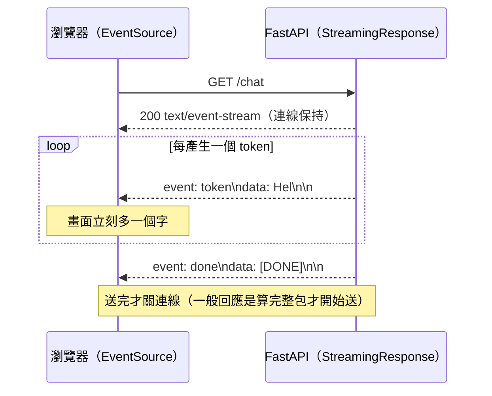

# 串流回應與 Server-Sent Events（SSE）

> 不是每個回應都能「一次算完再送」。下載 1GB 檔案、把 LLM 的字逐個吐給前端、即時推播進度——這些都需要「邊產生邊送」。這章講 StreamingResponse 與 SSE:伺服器把資料一塊一塊串流出去的兩種方式。

## 💡 白話導讀（建議先讀）

到目前為止,你的每個路由都是**「算完整包,一次回」**:組好一個 dict、`return`,FastAPI 把它變成一個完整的 HTTP 回應送出去。
但有些情況,這樣行不通。

**情況一:回應太大,塞不進記憶體。** 使用者要下載一個 1GB 的匯出檔。如果你先把整個檔讀進記憶體再送,
一個請求就吃掉 1GB RAM——同時來幾個,伺服器就垮了。正解是**邊讀邊送**:讀一塊(如 64KB)、送一塊、
再讀下一塊,記憶體用量固定。

**情況二:結果是「陸續產生」的,等不及全部。** 最典型的就是 **LLM 逐字輸出**——你問 ChatGPT 一個問題,
它是一個字一個字冒出來的,而不是等整段想完才一次顯示。如果後端等模型把整段生成完再回,使用者要**乾等好幾秒**;
邊生成邊送,使用者**立刻看到字在動**。進度條、即時通知也是同理。

這兩種情況的共同解法叫**串流(streaming)**:HTTP 回應不必一次送完,可以**分成很多塊(chunk)陸續送**。
FastAPI 用 **`StreamingResponse`** 做這件事——你給它一個**產生器**(generator,一塊一塊 `yield` 資料),
它就一塊一塊送出去。

而「情況二」那種**伺服器主動、持續推資料給瀏覽器**的需求,有個專門的標準格式叫
**SSE(Server-Sent Events,伺服器發送事件)**。你可以把它想成 [WebSocket](13-websocket.md) 的**輕量單向版**:

- **WebSocket**:雙向(client ⇄ server 都能主動送),像打電話。適合聊天、遊戲。
- **SSE**:單向(只有 server → client 一直推),像**訂閱通知**——你訂了,對方有新消息就推給你,你不用一直問。
  而且它就是**普通 HTTP**,瀏覽器內建 `EventSource` 就能收,不像 WebSocket 要另一套協定。

SSE 的資料長什麼樣?一個簡單的文字格式:每筆事件用 `data:` 開頭,**用一個空行分隔**:

```text
event: token
data: Hel

event: token
data: lo

event: done
data: [DONE]

```

LLM 聊天介面「逐字冒出來」的效果,底層八成就是 SSE。這章的可執行範例,會帶你組出這個 SSE 格式,
並寫一個逐字 `yield` 的串流產生器。

## 🎯 什麼時候會用到

- **大檔下載 / 匯出**:CSV、報表、備份——用 `StreamingResponse` 邊讀邊送,記憶體不爆(呼應 [Part 0 fd](../00-backend-foundations/07-file-descriptor-io.md))。
- **LLM 逐字輸出**:聊天機器人、AI 助理把 token 即時串給前端,體感快很多(呼應 [Part 28 串流](../28-llm-genai/05-streaming-async.md)、[Part 30 服務化](../30-production-ai/02-serving-llm-apps.md))。
- **即時進度 / 通知**:長任務的進度百分比、系統通知、股價更新——server 有新資料就推。
- **要 server 主動推、但不需要 client 回傳**:用 SSE 比 WebSocket 簡單(純 HTTP、瀏覽器內建、自動重連)。要雙向才用 WebSocket。

## 🔗 前端對照

SSE 是**前後端共通的 Web 標準**,前端用 `EventSource` 接:

| | 後端（FastAPI） | 前端（瀏覽器） |
|---|-----------------|----------------|
| 送 | `StreamingResponse(gen, media_type="text/event-stream")` | — |
| 收 | — | `new EventSource("/stream")` |
| 收每筆 | `yield "data: ...\n\n"` | `es.onmessage = e => e.data` |
| 具名事件 | `event: token` | `es.addEventListener("token", ...)` |
| 斷線重連 | 自動（送 `id:` 可續傳） | `EventSource` 內建自動重連 |

一句話:SSE 是**標準**,兩邊都內建支援——後端 `yield` 出 `data: ...\n\n`、前端 `EventSource` 收,還自動重連。
比起 WebSocket（要自己管連線、心跳、重連),單向推播用 SSE 省事得多。

## Why（為什麼）

- **記憶體(大回應)**:一次組完整包會把大回應整個載進記憶體,並發幾個就 OOM。串流讓記憶體用量**與回應大小無關**(固定一塊的大小)。
- **延遲體感(逐步結果)**:等全部算完才回,使用者感受到的是「總時間」;邊產生邊送,使用者**立刻看到第一塊**(TTFB / 首字時間大幅下降)——LLM 應用尤其有感。
- **單向推播的正確工具**:server 要持續推、client 不需回傳時,SSE 比 WebSocket 輕(純 HTTP、內建重連、走一般 HTTP 基建與 proxy)。用 WebSocket 反而是殺雞用牛刀。

## Theory（理論：串流與 SSE 格式）

### 串流回應的本質

一般回應 vs 串流回應:

```text
一般：  算好整包 → Content-Length: 1000000 → 一次送完
串流：  Transfer-Encoding: chunked → 一塊一塊送 → 送完才結束連線
```

FastAPI 的 `StreamingResponse` 吃一個**(async)產生器**,每 `yield` 一塊(str 或 bytes)就送一塊。
產生器可以是同步或非同步;I/O 密集(等模型、等檔案)用 `async def` 產生器,才不會擋住 event loop
(呼應 [Part 9](../09-concurrency/11-blocking-in-async.md))。

### SSE 線路格式

SSE 是純文字,`Content-Type: text/event-stream`。每筆事件由幾個欄位組成,**以空行結束**:

| 欄位 | 意義 |
|------|------|
| `data:` | 事件內容(必要;多行就多個 `data:`) |
| `event:` | 事件類型(選填;前端可依類型分派) |
| `id:` | 事件 id(選填;斷線重連時瀏覽器會帶 `Last-Event-ID` 續傳) |
| `retry:` | 重連間隔毫秒(選填) |
| 空行 | **一筆事件結束的分隔** |

## Specification（規範：StreamingResponse 與 SSE）

| 元素 | 說明 |
|------|------|
| `StreamingResponse(content, media_type=...)` | `content` 是(async)產生器,逐 `yield` 一塊(str/bytes)送一塊 |
| `media_type="text/event-stream"` | SSE 用;大檔用對應型別(如 `text/csv`、`application/octet-stream`) |
| 傳輸編碼 | 自動用 `Transfer-Encoding: chunked`(不需 `Content-Length`) |
| SSE 事件分隔 | 每筆以**空行 `\n\n`** 結束;多行 `data:` 各佔一行 |
| SSE 欄位 | `data:`(必要)、`event:`(類型)、`id:`(續傳)、`retry:`(重連毫秒) |
| 前端接收 | `new EventSource(url)`;`onmessage` 或 `addEventListener(event, ...)` |
| 關閉緩衝 | proxy(nginx)可能緩衝,需 `X-Accel-Buffering: no` 或設定關閉 |

> 產生器用 `async def`(內含 `await`)時,串流期間會在 `await` 點讓出 event loop,一個 worker 能同時服務多條串流。

## Implementation（實作：產生器 + StreamingResponse)

真實 FastAPI 需要伺服器環境,下面先示範真實寫法(示意),再抽出**可執行、可測**的核心(SSE 格式化 + 串流產生器)。

**真實 FastAPI 寫法**(示意):

```python
from collections.abc import AsyncIterator

from fastapi import FastAPI
from fastapi.responses import StreamingResponse

app = FastAPI()


async def large_file() -> AsyncIterator[bytes]:
    with open("big.csv", "rb") as f:            # 邊讀邊送,記憶體不爆
        while chunk := f.read(64 * 1024):
            yield chunk


@app.get("/download")
async def download() -> StreamingResponse:
    return StreamingResponse(large_file(), media_type="text/csv")


@app.get("/chat")
async def chat() -> StreamingResponse:
    async def event_stream() -> AsyncIterator[str]:
        async for token in call_llm_streaming("你好"):   # 假設回傳逐個 token
            yield sse_format(token, event="token")
        yield sse_format("[DONE]", event="done")
    return StreamingResponse(event_stream(), media_type="text/event-stream")
```

## Code Example（可執行的 Python 範例）

```python
# streaming_sse.py —— SSE 格式化 + 逐字串流產生器
from __future__ import annotations

import asyncio
from collections.abc import AsyncIterator


def sse_format(data: str, event: str | None = None, id: str | None = None) -> str:
    """組一筆 SSE 事件:選填 event/id,data 逐行加前綴,整筆以空行結尾。"""
    lines: list[str] = []
    if event is not None:
        lines.append(f"event: {event}")
    if id is not None:
        lines.append(f"id: {id}")
    for part in data.split("\n"):  # 多行 data 每行都要 data: 前綴
        lines.append(f"data: {part}")
    return "\n".join(lines) + "\n\n"  # 空行(\n\n)代表一筆事件結束


async def token_stream(tokens: list[str]) -> AsyncIterator[str]:
    """模擬 LLM 逐字輸出:一個一個 yield SSE 事件,最後送 done。"""
    for i, tok in enumerate(tokens):
        yield sse_format(tok, event="token", id=str(i))
        await asyncio.sleep(0)  # 讓出控制權(真實情境是等模型產下一個 token)
    yield sse_format("[DONE]", event="done")


async def _collect(gen: AsyncIterator[str]) -> list[str]:
    return [chunk async for chunk in gen]


if __name__ == "__main__":
    print(repr(sse_format("hello")))
    print(repr(sse_format("hi", event="token", id="1")))
    chunks = asyncio.run(_collect(token_stream(["Hel", "lo"])))
    print("串流事件數:", len(chunks))
```

**預期輸出**：

```pycon
$ python streaming_sse.py
'data: hello\n\n'
'event: token\nid: 1\ndata: hi\n\n'
串流事件數: 3
```

**逐段解說**:

- `sse_format` 組出合規的 SSE 一筆事件:`event:`/`id:` 選填、`data:` 每行一個、**結尾一定是空行 `\n\n`**——
  空行就是「這筆事件到此為止」的分隔,漏了它前端會一直等、收不到。
- **多行 data 要每行都加 `data:`**(`sse_format("a\nb")` → `data: a\ndata: b\n\n`),這是規範要求,範例測試有驗。
- `token_stream` 是個 **async 產生器**:逐個 `yield` 事件,最後補一筆 `event: done` 告訴前端結束了。
  這正是 LLM 聊天「逐字冒出來」的後端骨架——把 `tokens` 換成真的模型串流輸出即可。
- `await asyncio.sleep(0)` 在真實情境會是「等模型算下一個 token」的 await 點;它讓出 event loop,
  所以**一個 worker 能同時串流服務很多個聊天**(呼應 [Part 9 asyncio](../09-concurrency/07-asyncio-basics.md))。
- 接到 FastAPI:`StreamingResponse(token_stream(...), media_type="text/event-stream")`,產生器不變。

## Diagram（圖解：串流 vs 一次回）



## Best Practice（最佳實踐）

- **大回應一律串流**:檔案下載、大匯出用 `StreamingResponse` 邊讀邊送,別 `read()` 整包進記憶體。
- **I/O 密集用 async 產生器**:等模型 / 等檔案時用 `async def` + `await`,別在串流裡做阻塞 I/O 卡住 event loop。
- **SSE 每筆一定收尾空行**、多行 data 每行加 `data:`;送 `id:` 讓斷線能續傳、最後送一筆 `done` 讓前端知道結束。
- **單向推播用 SSE、雙向才用 WebSocket**:別為了「server 推」就上 WebSocket——SSE 更輕、內建重連、走一般 HTTP。
- **注意 proxy 緩衝**:nginx 等可能緩衝回應導致「串流變一次到」;串流端點要關掉緩衝(如 `X-Accel-Buffering: no`)。
- **處理客戶端斷線**:使用者關頁面時要能停止產生(別讓 LLM 繼續燒錢),偵測斷線就中止產生器。

## Common Mistakes（常見誤解）

- **「大檔先 `read()` 再回」**。整包進記憶體,並發幾個就 OOM。要用產生器邊讀邊送。
- **「SSE 忘了結尾空行」**。少了 `\n\n`,前端收不到那筆事件、一直卡著等。每筆必須空行收尾。
- **「多行 data 只寫一個 `data:`」**。不符規範;每一行內容都要 `data:` 前綴。
- **「串流裡做阻塞 I/O」**。`time.sleep` / 同步 `requests` / 同步檔案讀會卡住整個 event loop,其他請求全被拖住。
- **「用 WebSocket 做單向推播」**。殺雞用牛刀——SSE 更簡單、瀏覽器內建、自動重連。只有真的要雙向才用 WebSocket。
- **「不管客戶端斷線」**。使用者離開了產生器還在跑,浪費資源(LLM 還在燒 token 錢)。要偵測斷線並中止。

## Interview Notes（面試重點）

- **「怎麼讓 FastAPI 逐字串流 LLM 的輸出?」**
  用 **`StreamingResponse`** 包一個 **async 產生器**,`media_type="text/event-stream"`(SSE);
  產生器 `async for token in 模型串流:` 逐個 `yield sse_format(token)`,前端用 `EventSource` 收。
  好處:使用者**立刻看到字**(首字時間低),而非乾等整段生成。

- **「SSE 和 WebSocket 差在哪?怎麼選?」**
  **SSE 單向**(server→client)、就是**普通 HTTP**、瀏覽器 `EventSource` 內建、**自動重連**;
  **WebSocket 雙向**、獨立協定、要自己管連線 / 心跳 / 重連。**單向推播(通知、LLM 串流、進度)用 SSE;
  需要雙向(聊天、協作、遊戲)才用 WebSocket。**

- **「下載大檔怎麼不吃爆記憶體?」**
  `StreamingResponse` + 產生器**邊讀邊送**(每次 `read(64KB)` 一塊 `yield` 一塊),
  記憶體用量固定、與檔案大小無關;而不是 `read()` 整個檔進記憶體。

- **「串流回應為什麼能『一個 worker 服務很多人』?」**
  串流通常是 I/O 密集(等模型 / 等檔案),用 async 產生器在 `await` 點讓出 event loop,
  一個執行緒就能交錯服務大量串流連線(呼應 asyncio 的單執行緒高並發)。

---

➡️ 下一章：[Part 14 統整:Web 開發全貌](26-summary.md)

[⬆️ 回 Part 14 索引](README.md)
