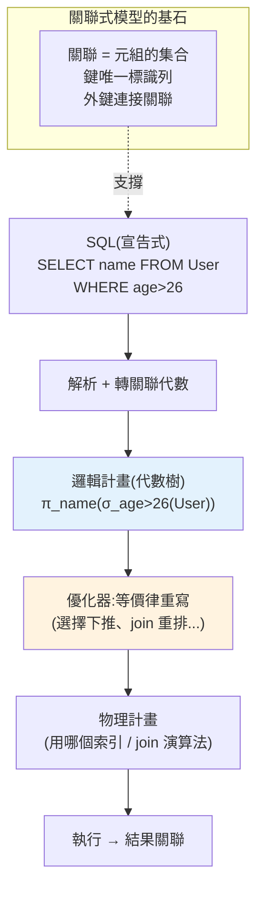

# 關聯式模型與關聯代數

> 在學任何一種資料庫「怎麼用」之前,先搞懂資料庫「為什麼長這樣」。**關聯式模型(relational model)** 是 1970 年 E.F. Codd 提出的理論,它用**數學上的關聯(relation)** 來表示資料——這正是為什麼今天所有 SQL 資料庫都以「表(table)」為核心。這章從理論根基講起:什麼是關聯、鍵(key)如何唯一標識一列、**關聯代數(relational algebra)** 這套運算如何成為 SQL 的數學骨架。理解這一層,你之後看 SQL 的 `SELECT`/`JOIN`、看查詢優化器,都會知道它們在做「哪一種集合運算」。

## Why(為什麼)

多數人學資料庫是從「`CREATE TABLE`、`SELECT * FROM`」開始的——會用,但不知道**為什麼是表、為什麼能這樣查**。這造成幾個問題:

- **不懂設計原則,表就會亂建**:不理解「關聯」的數學性質(無序、無重複列、每格是單一值),就會做出有重複、有多值欄位、難以查詢的爛 schema。關聯式模型給了**判斷「好 schema」的理論標準**([正規化 ch03](03-normalization.md) 就建在這之上)。
- **不懂關聯代數,就看不懂查詢在做什麼**:SQL 是**宣告式**的(你說「要什麼」),但底層執行是**關聯代數運算**(selection、projection、join…的組合)。優化器做的事,就是把你的 SQL 轉成等價但更快的關聯代數運算樹([查詢優化 ch06](06-query-processing.md))。不懂代數,優化器對你就是黑箱。
- **理解「為什麼關聯式贏了」**:1970 年代之前的資料庫是**階層式/網狀**(用指標串連結),查詢要寫「怎麼走訪指標」的程序。關聯式模型的革命在於:**用集合論把資料與「怎麼存取」解耦**——你只描述「要什麼」,系統決定「怎麼取」。這個「宣告式 + 資料獨立性」的思想,是關聯式資料庫統治半世紀的根本原因。
- **它是後面所有章的地基**:SQL、正規化、索引、交易、優化器——全都是為了在真實硬體上**高效、正確地實現這個數學模型**。先懂模型,才懂那些機制在解決什麼。

一句話:**關聯式模型是「資料庫是什麼」的答案**,這章給你看資料庫的第一性原理。

## Theory(理論:關聯、屬性、鍵)

**關聯(relation)** 在數學上是一個集合,但為了直覺,我們用「表」來想。一個關聯由這些元素構成:

```text
         ┌─────── 屬性 attribute(欄 column)+ 定義域 domain ───────┐
關聯 R:  │ id: int │ name: text │ age: int │            ← schema(綱要/表頭)
         ├─────────┼────────────┼──────────┤
         │   1     │  Alice     │   30     │  ← 元組 tuple(列 row)
         │   2     │  Bob       │   25     │  ← 元組 tuple
         └─────────┴────────────┴──────────┘
              主體:tuple 的「集合」
```

**關聯式模型的關鍵性質**(這些不是隨意規定,而是「集合」的數學後果):

- **列是無序的(set semantics)**:關聯是「元組的集合」,集合沒有順序。所以 SQL 沒有 `ORDER BY` 時,列的順序是**不保證**的。
- **列不重複**:集合的元素唯一——理論上關聯沒有重複列(SQL 實務允許重複,是對純模型的妥協,見 Specification)。
- **每格是單一不可分的值(atomic / 第一正規化)**:一格不能塞「一個陣列」或「多個值」——這是 [1NF](03-normalization.md) 的要求。
- **屬性有名字與定義域(domain)**:每欄有名稱和允許的值型別(int、text…)。

**鍵(key)——如何唯一標識一列**:

- **超鍵(superkey)**:能唯一決定一個元組的屬性集合。
- **候選鍵(candidate key)**:最小的超鍵(拿掉任一屬性就不再唯一)。
- **主鍵(primary key)**:被選來當主要識別的候選鍵(不可 NULL、唯一)。
- **外鍵(foreign key)**:一個關聯的屬性,參照另一個關聯的主鍵——**這是「關聯」之間建立關係的機制**,也是[參照完整性](03-normalization.md)的基礎。

## Specification(規範:關聯代數的運算)

**關聯代數** 是一組作用在關聯上、結果仍是關聯(封閉性)的運算。它是 SQL 的數學基礎。核心運算:

| 運算 | 符號 | 意義 | 對應 SQL |
|------|------|------|----------|
| **選擇 Selection** | σ (sigma) | 選出**符合條件的列** | `WHERE` |
| **投影 Projection** | π (pi) | 選出**指定的欄**(並去重) | `SELECT 欄位` |
| **聯集 Union** | ∪ | 兩關聯的列合併(去重) | `UNION` |
| **差集 Difference** | − | 在 A 不在 B 的列 | `EXCEPT` |
| **交集 Intersection** | ∩ | 同時在 A、B 的列 | `INTERSECT` |
| **笛卡兒積 Cartesian** | × | 每列兩兩配對 | `CROSS JOIN` |
| **join** | ⋈ | 積 + 選擇(依條件配對) | `JOIN ... ON` |
| **更名 Rename** | ρ (rho) | 改關聯/屬性名稱 | `AS` |

**兩個直覺範例**:

```text
σ_{age > 26}(User)          → 選出年齡 > 26 的列        (SQL: WHERE age > 26)
π_{name}(User)              → 只保留 name 欄、去重       (SQL: SELECT DISTINCT name)
π_{name}(σ_{age>26}(User))  → 先選列再投影              (SQL: SELECT DISTINCT name WHERE age>26)
```

**理論(集合語意)vs SQL(多重集 / bag 語意)的差異**——這是重要的實務區別:

- 純關聯代數用**集合**:自動去重、無序。
- SQL 用**多重集(multiset / bag)**:`SELECT name FROM t` **會保留重複**(除非 `DISTINCT`);這是為了效能(去重要排序或雜湊,昂貴)。所以 SQL 是關聯模型的「務實方言」,不是純數學模型。理解這點能解釋「為什麼 SQL 查詢會有重複列」。

## Implementation(底層:宣告式如何變成執行)

**關聯代數是「可執行的」——這是它比 SQL 更接近底層的原因**。SQL 是宣告式(說要什麼),但資料庫內部把它**轉成關聯代數運算樹**再執行:

```text
SQL:  SELECT name FROM User WHERE age > 26

轉成關聯代數樹(邏輯計畫):
        π_name          ← 投影(最後做)
          │
        σ_age>26        ← 選擇(過濾)
          │
        User            ← 掃描來源關聯
```

**優化器的核心工作,就是「重寫這棵代數樹成等價但更快的形式」**。經典例子——**選擇下推(predicate pushdown)**:

```text
π_name( σ_age>26( User ⋈ Order ) )     ← 先 join 再過濾:join 了一大堆再丟掉,慢
        ↓ 等價重寫(把 σ 推到 join 之前)
π_name( σ_age>26(User) ⋈ Order )        ← 先過濾再 join:join 的輸入小很多,快
```

兩棵樹**結果完全相同**(關聯代數的等價律保證),但右邊先縮小資料再 join,運算量小得多。**這就是「宣告式」的威力**——因為你只說了「要什麼」而沒說「怎麼做」,優化器才有自由把它換成更快的等價運算([ch06 詳談](06-query-processing.md))。

**資料獨立性(data independence)**:因為存取路徑(用不用索引、怎麼 join)不寫在查詢裡,DBA 可以**加索引、改儲存結構而不用改查詢**——查詢仍給出相同結果,只是變快。這是關聯式模型相對於舊的階層/網狀模型的決定性優勢。下面用 Python 把關聯代數實作出來,讓你看見這些運算的本質。

## Code Example(可執行的 Python 範例)

```python
# relational_algebra.py — 用純 Python 實作關聯代數(把「表」當 tuple 的集合)
from __future__ import annotations

from collections.abc import Callable

# 一個「關聯」= 具名欄位的列所組成的集合。用 frozenset of tuples 體現集合語意。
Row = tuple[tuple[str, object], ...]  # 例:(("id",1),("name","Alice"))


def relation(rows: list[dict[str, object]]) -> set[Row]:
    """把 dict 列表轉成關聯(集合語意:自動去重、無序)。"""
    return {tuple(sorted(r.items())) for r in rows}


def as_dicts(rel: set[Row]) -> list[dict[str, object]]:
    return sorted((dict(r) for r in rel), key=lambda d: sorted(d.items()))


def select(rel: set[Row], pred: Callable[[dict[str, object]], bool]) -> set[Row]:
    """σ 選擇:留下符合條件的列。"""
    return {r for r in rel if pred(dict(r))}


def project(rel: set[Row], cols: list[str]) -> set[Row]:
    """π 投影:只留指定欄,並去重(集合語意)。"""
    return {tuple(sorted((c, dict(r)[c]) for c in cols)) for r in rel}


def cartesian(a: set[Row], b: set[Row]) -> set[Row]:
    """× 笛卡兒積:每列兩兩配對(欄名加前綴避免衝突)。"""
    out: set[Row] = set()
    for ra in a:
        for rb in b:
            merged = {f"L.{k}": v for k, v in ra}
            merged.update({f"R.{k}": v for k, v in rb})
            out.add(tuple(sorted(merged.items())))
    return out


def join(a: set[Row], b: set[Row], left_key: str, right_key: str) -> set[Row]:
    """⋈ join = 積 + 選擇(等值配對)。"""
    prod = cartesian(a, b)
    return select(prod, lambda d: d[f"L.{left_key}"] == d[f"R.{right_key}"])


def main() -> None:
    users = relation([
        {"id": 1, "name": "Alice", "age": 30},
        {"id": 2, "name": "Bob", "age": 25},
        {"id": 3, "name": "Cara", "age": 30},
    ])
    orders = relation([
        {"oid": 100, "uid": 1, "amt": 50},
        {"oid": 101, "uid": 1, "amt": 20},
        {"oid": 102, "uid": 2, "amt": 99},
    ])

    # σ_age>26(User)
    print("σ age>26:", [d["name"] for d in as_dicts(select(users, lambda d: d["age"] > 26))])
    # π_age(User):投影 age 並去重 → {30, 25}
    print("π age (去重):", sorted(d["age"] for d in as_dicts(project(users, ["age"]))))
    # π_name(σ_age>26(User)):組合運算
    combo = project(select(users, lambda d: d["age"] > 26), ["name"])
    print("π name(σ age>26):", sorted(d["name"] for d in as_dicts(combo)))
    # User ⋈ Order (User.id = Order.uid)
    joined = join(users, orders, "id", "uid")
    pairs = [(d["L.name"], d["R.amt"]) for d in as_dicts(joined)]
    print("User ⋈ Order:", sorted(pairs))


if __name__ == "__main__":
    main()
```

**預期輸出**:

```pycon
$ python relational_algebra.py
σ age>26: ['Alice', 'Cara']
π age (去重): [25, 30]
π name(σ age>26): ['Alice', 'Cara']
User ⋈ Order: [('Alice', 20), ('Alice', 50), ('Bob', 99)]
```

逐段解說:

- **關聯 = 集合**:`relation()` 用 `set` of tuples 承載,直接體現「無序、去重」的集合語意。`project(users, ["age"])` 投影出 age 後,兩個 30 歲的人**自動合併成一個 30**(去重)——這正是純關聯代數與 SQL(會保留重複)的差別。
- **σ 選擇 `select`**:過濾列,結果仍是關聯(封閉性)——所以能繼續套下一個運算。
- **π 投影 `project`**:選欄 + 去重。`π_name(σ_age>26)` 展示**運算可組合**:選擇的輸出直接餵給投影,對應 SQL `SELECT DISTINCT name WHERE age>26`。
- **⋈ join = 積 + 選擇**:`join` 先做笛卡兒積(3×3=9 列)再用 `select` 篩出 `id==uid` 的配對。這揭示 join 的**本質**——它不是魔法,就是「配對 + 過濾」。也解釋了為什麼**沒有 join 條件的 join(笛卡兒積)會爆炸**(N×M 列)。
- **對應優化**:真實 DB 不會真的先做 9 列的積再過濾(那樣 O(N×M)),而是用 [hash join / index](06-query-processing.md) 直接配對——但**邏輯語意等價於「積 + 選擇」**,這就是為什麼理解代數能理解優化器。
- **要點**:關聯是元組的集合(無序、去重、每格單值);關聯代數(σπ⋈∪−×)是封閉、可組合的運算,構成 SQL 的數學骨架;宣告式查詢被轉成代數樹,優化器靠等價律重寫它。

## Diagram(圖解:從 SQL 到代數樹到執行)



## Best Practice(最佳實踐)

- **設計時想「這是什麼關聯、鍵是什麼」**:先確立主鍵(唯一標識一列),再談其他欄。
- **用外鍵表達關係並開啟參照完整性**:讓 DB 幫你擋掉「訂單指向不存在的使用者」。
- **每格放單一值(遵守 1NF)**:別在一格塞逗號分隔的多值或 JSON 陣列當關聯用;那會讓查詢與 [正規化](03-normalization.md) 崩壞。
- **靠宣告式、別靠順序**:列無序,要排序就明確 `ORDER BY`;別假設「插入順序 = 查詢順序」。
- **理解 SQL 的 bag 語意**:需要去重才加 `DISTINCT`,但知道它有成本。
- **用代數思維讀查詢**:把複雜 SQL 拆成「選擇→投影→join」的組合,更容易推理與優化。
- **善用資料獨立性**:查詢只描述邏輯,存取優化(索引)交給 DB;別在查詢裡硬編存取路徑。

## Common Mistakes(常見誤解)

- **以為表的列有固定順序**:關聯是集合,無 `ORDER BY` 順序不保證;跨 DB/版本可能不同。
- **在一格塞多值(逗號字串 / 陣列)**:違反 1NF,查詢、索引、join 全部變難;該拆成獨立列或表。
- **混淆集合與 bag**:以為 `SELECT col` 會自動去重(不會,SQL 保留重複);去重要 `DISTINCT`。
- **不設主鍵**:無法唯一標識列,更新/刪除會誤傷、複製難、ORM 也需要它。
- **把 join 當黑魔法**:它就是「積 + 選擇」;沒條件的 join 會產生笛卡兒積爆炸。
- **忽略外鍵/參照完整性**:資料出現「孤兒」(指向不存在的父列)而不自知。
- **以為關聯式模型 = SQL 語法**:模型是數學基礎,SQL 是它的務實實現(且有偏離,如 bag 語意)。

## Interview Notes(面試重點)

- **能定義關聯與其性質**:元組的集合、無序、去重、每格單值(atomic)、屬性有 domain。
- **能講鍵的層次**:superkey ⊇ candidate key ⊇ primary key;外鍵表達關聯間關係與參照完整性。
- **能列關聯代數運算並對應 SQL**:σ(WHERE)、π(SELECT)、⋈(JOIN)、∪∩−、×。
- **能講 join = 積 + 選擇**:並說明沒條件會笛卡兒積爆炸、優化器用 hash/index 避免真的做積。
- **能講宣告式 + 資料獨立性為何是革命**:查詢與存取路徑解耦,優化器可重寫代數樹、DBA 可加索引而不改查詢。
- **能講集合 vs bag(多重集)語意**:SQL 保留重複是對純模型的效能妥協。
- **能連到後續**:正規化建在關聯理論上、優化器操作代數樹、外鍵是參照完整性基礎。

---

➡️ 下一章:[SQL 語言深入](02-sql-language.md)

[⬆️ 回 Part 15 索引](README.md)
