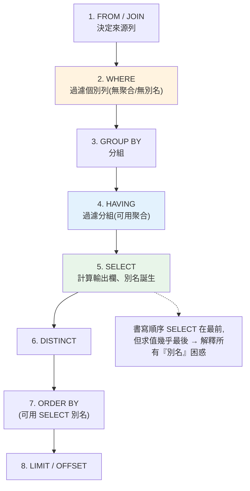

# SQL 語言深入

> [ch01](01-relational-model.md) 講了關聯代數的數學骨架,這章講它的實際語言——**SQL(Structured Query Language)**。很多人「會寫 SQL」但只停在 `SELECT * FROM t WHERE ...`,一遇到多表、`NULL`、子查詢、`GROUP BY` 的細節就出錯。這章把 SQL **當成一門語言完整地講**:它的三個子語言(DDL/DML/DCL)、**JOIN 的五種語意**、最容易踩雷的 **`NULL` 三值邏輯**、子查詢與集合運算,以及**邏輯查詢處理順序**(為什麼 `WHERE` 不能用 `SELECT` 的別名)。這是「懂資料庫」與「會打 SQL」的分水嶺。

> 📌 定位:這章講 SQL 的**語言核心與語意**(所有 SQL DB 通用)。分析場景的進階應用(window functions、CTE 樞紐、複雜聚合)在 [Part 23 分析用 SQL](../23-data-analysis/README.md) 展開;這章打的是**語意地基**。

## 💡 白話導讀(建議先讀)

SQL 長得像英文,好上手——但正是這份親切感埋了三個地雷。先拆掉:

**地雷一:NULL 不是 0,是「不知道」。**
問「NULL 等於 NULL 嗎?」——答案是「**不知道**」(兩個未知數怎麼判斷相等?)。
所以 `WHERE x = NULL` 永遠查不到東西(要用 `IS NULL`);更陰的是 `NOT IN` 清單裡混進一個 NULL,整個查詢默默回空——不報錯,最難抓。
記住:NULL 參與的比較,答案都是第三種真值「UNKNOWN」,而 WHERE 只留 TRUE。

**地雷二:你寫的順序,不是它執行的順序。**
菜單上甜點印在最前面,不代表先上甜點。SQL 書寫是 SELECT→FROM→WHERE...,**實際執行**是:

```text
FROM → WHERE → GROUP BY → HAVING → SELECT → ORDER BY
```

這立刻解釋兩個經典困惑:WHERE 不能用 SELECT 取的別名(別名那時還沒誕生);過濾聚合結果要用 HAVING(WHERE 跑在分組之前)。

**地雷三:JOIN 的型別會默默吃掉資料。**
INNER 只留兩邊都配到的;LEFT 保左表全部——但**在 WHERE 裡過濾右表欄位,LEFT 會被降級回 INNER**(右表的 NULL 被濾掉)——報表數字對不上的常見兇手。

帶著三顆排掉的雷,往下讀就安全了。

## Why(為什麼)

SQL 看起來像英文,直覺、好上手——但正是這份「像自然語言」的錯覺讓人踩坑:

- **`NULL` 是頭號陷阱**:`WHERE age = NULL` 永遠查不到任何列,`NOT IN (含 NULL 的子查詢)` 會神秘地回傳空——這些不是 bug,是 SQL 的**三值邏輯(true/false/unknown)**。不懂它,你會寫出「看似對、結果錯」的查詢,而且**不會報錯**,最難抓。
- **JOIN 用錯型別 = 資料悄悄少了或多了**:`INNER JOIN` 會默默丟掉沒配對的列、忘了 join 條件會**笛卡兒積爆炸**、`LEFT JOIN` 後在 `WHERE` 過濾右表會把它變回 `INNER`。這些是資料正確性問題,錯了往往是「報表數字對不上」才發現。
- **邏輯處理順序反直覺**:SQL **寫的順序**(SELECT→FROM→WHERE…)和**執行的順序**(FROM→WHERE→GROUP BY→HAVING→SELECT→ORDER BY)不同。不懂這個,就無法解釋「為什麼 `WHERE` 不能用 `SELECT` 定義的別名」「為什麼過濾聚合要用 `HAVING` 不是 `WHERE`」。
- **SQL 是宣告式的,你要學會「用集合思考」**:很多人帶著寫迴圈的慣性寫 SQL(想「逐列處理」),結果寫出低效或錯誤的查詢。SQL 要你**描述整個集合的變換**——這是思維方式的轉換。

**把 SQL 當一門有嚴謹語意的語言來學**,你才能寫出正確、可讀、可優化的查詢,並在數字對不上時知道去哪找問題。

## Theory(理論:SQL 的三個子語言 + 邏輯處理順序)

**SQL 由三個子語言組成**:

```text
DDL(Data Definition)   定義結構      CREATE / ALTER / DROP / TRUNCATE
DML(Data Manipulation) 操作資料      SELECT / INSERT / UPDATE / DELETE
DCL(Data Control)      控制權限      GRANT / REVOKE
                       (交易控制 TCL:COMMIT / ROLLBACK,見 ch07)
```

**邏輯查詢處理順序(logical processing order)——SQL 最重要的心智模型**。你**書寫**的順序是:

```sql
SELECT ... FROM ... WHERE ... GROUP BY ... HAVING ... ORDER BY ... LIMIT
```

但資料庫**邏輯上求值**的順序完全不同:

```text
1. FROM / JOIN   ← 先決定「從哪些表、怎麼組合」,產生列的來源
2. WHERE         ← 過濾個別列(此時還沒有聚合、沒有 SELECT 的別名)
3. GROUP BY      ← 把列分組
4. HAVING        ← 過濾「分組後」的結果(可用聚合函式)
5. SELECT        ← 計算輸出欄位、別名在此才誕生
6. DISTINCT      ← 去重
7. ORDER BY      ← 排序(可用 SELECT 的別名)
8. LIMIT/OFFSET  ← 取前 N 列
```

這個順序解釋了三個經典困惑:

- **為什麼 `WHERE` 不能用 `SELECT` 的別名?** 因為 `WHERE`(第 2 步)在 `SELECT`(第 5 步)之前執行,別名還不存在。
- **為什麼過濾聚合結果要用 `HAVING` 不是 `WHERE`?** `WHERE` 在 `GROUP BY` 之前、還沒有聚合值;`HAVING` 在分組後,才能寫 `COUNT(*) > 5`。
- **為什麼 `ORDER BY` 可以用別名?** 因為它(第 7 步)在 `SELECT` 之後。

## Specification(規範:JOIN 型別與 NULL 邏輯)

**五種 JOIN 的語意**(假設 L 左表、R 右表):

| JOIN | 保留 | 用途 |
|------|------|------|
| `INNER JOIN` | 只保留**兩邊都配對到**的列 | 最常用;要「兩邊都有」 |
| `LEFT [OUTER] JOIN` | 保留**左表全部**,右表沒配到補 `NULL` | 「主表全留,附帶右表資料」 |
| `RIGHT [OUTER] JOIN` | 保留**右表全部**,左表補 `NULL` | 少用(通常改寫成 LEFT) |
| `FULL [OUTER] JOIN` | 兩表全部,沒配到的補 `NULL` | 「兩邊都要留」對帳 |
| `CROSS JOIN` | 笛卡兒積(每列兩兩配) | 產生組合;**無 ON 條件** |

**NULL 三值邏輯(three-valued logic)——SQL 語意的核心陷阱**。`NULL` 意思是「未知(unknown)」,不是 0、不是空字串。任何與 `NULL` 的比較結果是 **UNKNOWN**,而 `WHERE` 只保留結果為 **TRUE** 的列:

```sql
NULL = NULL      → UNKNOWN   (不是 TRUE!所以 WHERE x = NULL 永遠沒結果)
NULL = 5         → UNKNOWN
NULL <> 5        → UNKNOWN
5 > NULL         → UNKNOWN
NULL AND TRUE    → UNKNOWN
NULL OR TRUE     → TRUE      (只要有一個 TRUE,OR 就 TRUE)
NULL AND FALSE   → FALSE     (只要有一個 FALSE,AND 就 FALSE)
```

**正確測 NULL 要用 `IS NULL` / `IS NOT NULL`**(不是 `= NULL`)。

三值邏輯的真值表(AND / OR):

| AND | T | F | U |   | OR | T | F | U |
|-----|---|---|---|---|----|---|---|---|
| **T** | T | F | U |   | **T** | T | T | T |
| **F** | F | F | F |   | **F** | T | F | U |
| **U** | U | F | U |   | **U** | T | U | U |

**子查詢(subquery)** 分兩種:

- **非相關(non-correlated)**:子查詢獨立可算,如 `WHERE age > (SELECT AVG(age) FROM t)`。
- **相關(correlated)**:子查詢引用外層的列,對每個外層列各算一次(如 `WHERE EXISTS (SELECT 1 FROM o WHERE o.uid = u.id)`)——可能較慢。

**集合運算**:`UNION`(去重)/ `UNION ALL`(不去重、快)/ `INTERSECT` / `EXCEPT`。

## Implementation(底層:引擎如何處理 NULL 與 JOIN 陷阱)

**`NOT IN` + `NULL` 的經典陷阱**(面試常考,實務常爆):

```sql
-- 若子查詢結果含 NULL,這個查詢會回傳「空集合」,即使有不符的列!
SELECT * FROM users WHERE id NOT IN (SELECT manager_id FROM emp);
```

原因:`id NOT IN (1, 2, NULL)` 展開成 `id<>1 AND id<>2 AND id<>NULL`。最後一項 `id<>NULL` 永遠是 **UNKNOWN**,而 `任何 AND UNKNOWN` 不可能是 TRUE → 每一列都被過濾掉。**解法**:用 `NOT EXISTS`(對 NULL 安全)或在子查詢加 `WHERE manager_id IS NOT NULL`。這是三值邏輯在真實查詢裡的致命體現。

**`LEFT JOIN` 被 `WHERE` 悄悄「降級」成 `INNER JOIN`**:

```sql
-- 想找「使用者 + 他們的訂單(沒訂單也要列出)」
SELECT u.name, o.amt FROM users u
LEFT JOIN orders o ON o.uid = u.id
WHERE o.amt > 100;          -- ⚠️ 這行把沒訂單的人(o.amt 為 NULL)過濾掉了!
```

沒訂單的使用者其 `o.amt` 是 `NULL`,`NULL > 100` 是 UNKNOWN → 被 `WHERE` 濾掉,`LEFT JOIN` 白做了。**解法**:把對右表的條件放進 `ON`(`LEFT JOIN orders o ON o.uid=u.id AND o.amt>100`),而非 `WHERE`。理解**邏輯處理順序**(JOIN 產生 NULL → WHERE 才過濾)就懂為什麼。

**聚合忽略 NULL**:`COUNT(col)` 不算 NULL、`AVG(col)` 分母不含 NULL 列——但 `COUNT(*)` 算所有列。這常導致「平均值和你預期不同」。下面用 Python 實作一個迷你 SQL 引擎,把邏輯處理順序與三值邏輯變成可執行、可觀察的程式。

## Code Example(可執行的 Python 範例)

```python
# sql_semantics.py — 迷你查詢引擎:展示邏輯處理順序與 NULL 三值邏輯(純標準庫)
from __future__ import annotations

from collections.abc import Callable, Iterable
from typing import Any

Row = dict[str, Any]

# --- 三值邏輯:比較涉及 None(NULL)時回傳 None(= UNKNOWN)---
def sql_eq(a: Any, b: Any) -> bool | None:
    if a is None or b is None:
        return None  # UNKNOWN
    return a == b


def sql_gt(a: Any, b: Any) -> bool | None:
    if a is None or b is None:
        return None
    return a > b


def where_keep(pred_result: bool | None) -> bool:
    """WHERE 只保留結果為 TRUE 的列;UNKNOWN 與 FALSE 都丟掉。"""
    return pred_result is True


def query(rows: Iterable[Row], *,
          where: Callable[[Row], bool | None] | None = None,
          group_by: str | None = None,
          having: Callable[[list[Row]], bool] | None = None,
          select: Callable[[Row], Row] | None = None,
          order_by: str | None = None) -> list[Row]:
    """依 SQL 邏輯處理順序求值:FROM→WHERE→GROUP BY→HAVING→SELECT→ORDER BY。"""
    data = list(rows)                                    # 1. FROM
    if where:                                            # 2. WHERE
        data = [r for r in data if where_keep(where(r))]
    if group_by:                                         # 3. GROUP BY
        groups: dict[Any, list[Row]] = {}
        for r in data:
            groups.setdefault(r[group_by], []).append(r)
        grouped = list(groups.values())
        if having:                                       # 4. HAVING
            grouped = [g for g in grouped if having(g)]
        # 聚合:每組輸出一列(組鍵 + 筆數)
        data = [{group_by: g[0][group_by], "count": len(g)} for g in grouped]
    if select:                                           # 5. SELECT
        data = [select(r) for r in data]
    if order_by:                                         # 7. ORDER BY(None 排最後)
        data.sort(key=lambda r: (r[order_by] is None, r[order_by]))
    return data


def main() -> None:
    users = [
        {"id": 1, "name": "Alice", "age": 30, "city": "TP"},
        {"id": 2, "name": "Bob", "age": None, "city": "TP"},    # age 未知
        {"id": 3, "name": "Cara", "age": 25, "city": "KH"},
        {"id": 4, "name": "Dan", "age": 40, "city": "KH"},
    ]

    # WHERE age > 26:Bob(age=None)結果 UNKNOWN → 被排除(不是報錯!)
    r1 = query(users, where=lambda r: sql_gt(r["age"], 26),
               select=lambda r: {"name": r["name"]})
    print("WHERE age>26:", [r["name"] for r in r1])

    # WHERE age = None ← 錯誤寫法:永遠 UNKNOWN,查無結果
    r2 = query(users, where=lambda r: sql_eq(r["age"], None))
    print("WHERE age=NULL(錯誤寫法):", [r["name"] for r in r2])

    # 正確測 NULL:age IS NULL
    r3 = query(users, where=lambda r: r["age"] is None)
    print("WHERE age IS NULL:", [r["name"] for r in r3])

    # GROUP BY city HAVING count>=2
    r4 = query(users, group_by="city",
               having=lambda g: len(g) >= 2, order_by="city")
    print("GROUP BY city HAVING count>=2:", r4)


if __name__ == "__main__":
    main()
```

**預期輸出**:

```pycon
$ python sql_semantics.py
WHERE age>26: ['Alice', 'Dan']
WHERE age=NULL(錯誤寫法): []
WHERE age IS NULL: ['Bob']
GROUP BY city HAVING count>=2: [{'city': 'KH', 'count': 2}, {'city': 'TP', 'count': 2}]
```

逐段解說:

- **`sql_gt` / `sql_eq` 回傳 `None` = UNKNOWN**:任何和 `None`(NULL)比較都回 `None`,而 `where_keep` 只保留 `is True` 的列。這**精確重現 SQL 的三值邏輯**——`where_keep(None)` 是 `False`(丟掉),不是報錯。
- **`WHERE age>26` 排除了 Bob**:Bob 的 age 是 `None`,`sql_gt(None, 26)` → UNKNOWN → 被排除。注意 **Bob 沒被「當成不符」也沒報錯,而是「未知所以不留」**——這是 NULL 的關鍵語意。
- **`WHERE age=NULL` 查無結果**:`sql_eq(x, None)` 恆為 `None`(UNKNOWN),所以**一列都留不下**。這重現了「`= NULL` 永遠查不到」的經典錯誤;正確要用 `IS NULL`(`r["age"] is None`),如 `r3` 抓到 Bob。
- **`query` 的參數求值順序 = SQL 邏輯處理順序**:程式碼裡 `where`→`group_by`→`having`→`select`→`order_by` 的執行次序,正是 SQL 的邏輯順序。這讓「為什麼 WHERE 不能用 SELECT 別名」變得顯而易見——`where` 在 `select` 之前跑,別名(select 產生)當然還不存在。
- **`ORDER BY` 把 NULL 排最後**:`(r[order_by] is None, ...)` 讓 NULL 排在有值之後——對應多數 DB 的 `NULLS LAST` 慣例(各 DB 預設不同,PostgreSQL 預設 NULL 最大)。
- **要點**:SQL 有嚴謹的邏輯處理順序(FROM→WHERE→GROUP BY→HAVING→SELECT→ORDER BY);NULL 是「未知」走三值邏輯,`=NULL` 恆 UNKNOWN、要用 `IS NULL`;`NOT IN`/`LEFT JOIN+WHERE` 的坑都源自此。

## Diagram(圖解:邏輯查詢處理順序)



## Best Practice(最佳實踐)

- **測 NULL 一律 `IS NULL` / `IS NOT NULL`**,絕不用 `= NULL` / `<> NULL`。
- **`NOT IN` 子查詢先排除 NULL**,或改用 `NOT EXISTS`(對 NULL 安全)。
- **對右表的條件放 `ON`,不要放 `WHERE`**(否則 `LEFT JOIN` 被降級成 `INNER`)。
- **JOIN 一定寫明 `ON` 條件**,避免意外笛卡兒積;明確選對 JOIN 型別。
- **記住邏輯處理順序**:過濾個別列用 `WHERE`、過濾聚合用 `HAVING`;別名只能在 `ORDER BY` 用。
- **`UNION ALL` 優先於 `UNION`**(不需去重時,省一次排序/雜湊)。
- **用集合思考,別用迴圈思考**:描述整體變換,交給引擎優化,而非模擬逐列處理。
- **明確 `ORDER BY` 才有順序**,並注意各 DB 的 `NULLS FIRST/LAST` 預設不同。
- **避免 `SELECT *`**:欄位不明確、破壞覆蓋索引、schema 變動易壞。

## Common Mistakes(常見誤解)

- **`WHERE col = NULL` 查無結果還以為沒資料**:恆 UNKNOWN;要 `IS NULL`。
- **`NOT IN (含 NULL)` 回傳空集合**:三值邏輯所致;用 `NOT EXISTS` 或濾掉 NULL。
- **`LEFT JOIN` 後在 `WHERE` 過濾右表**:悄悄變成 `INNER JOIN`,主表列消失;條件放 `ON`。
- **在 `WHERE` 用 `SELECT` 的別名**:別名此時不存在(處理順序在後),會報錯。
- **用 `WHERE` 過濾聚合結果**:聚合值此時還沒算;要用 `HAVING`。
- **忘了 join 條件 → 笛卡兒積**:列數暴增、結果錯;永遠寫 `ON`。
- **以為 `COUNT(col)` 算所有列**:它忽略 NULL;要全部用 `COUNT(*)`。
- **把 NULL 當 0 或空字串**:它是「未知」,參與運算會傳染 UNKNOWN。
- **假設查詢有固定順序**:沒 `ORDER BY` 就無序([ch01](01-relational-model.md) 集合語意)。

## Interview Notes(面試重點)

- **能講 SQL 邏輯處理順序**:FROM→WHERE→GROUP BY→HAVING→SELECT→DISTINCT→ORDER BY→LIMIT,並用它解釋別名/HAVING 的困惑。
- **(必考)能講 NULL 三值邏輯**:NULL=未知,任何比較回 UNKNOWN;`WHERE` 只留 TRUE;要用 `IS NULL`。
- **能講 `NOT IN` + NULL 的陷阱與解法**:回空集合,改 `NOT EXISTS`。
- **能講五種 JOIN 語意**與 `LEFT JOIN` 被 `WHERE` 降級的問題(條件放 `ON`)。
- **能分相關 vs 非相關子查詢**、集合運算 `UNION` vs `UNION ALL`(去重成本)。
- **能講 DDL/DML/DCL** 的分工。
- **能講「用集合思考」**:SQL 宣告式、描述整體變換,對應 [ch01 關聯代數](01-relational-model.md)。

---

➡️ 下一章:[正規化與資料建模](03-normalization.md)

[⬆️ 回 Part 15 索引](README.md)
