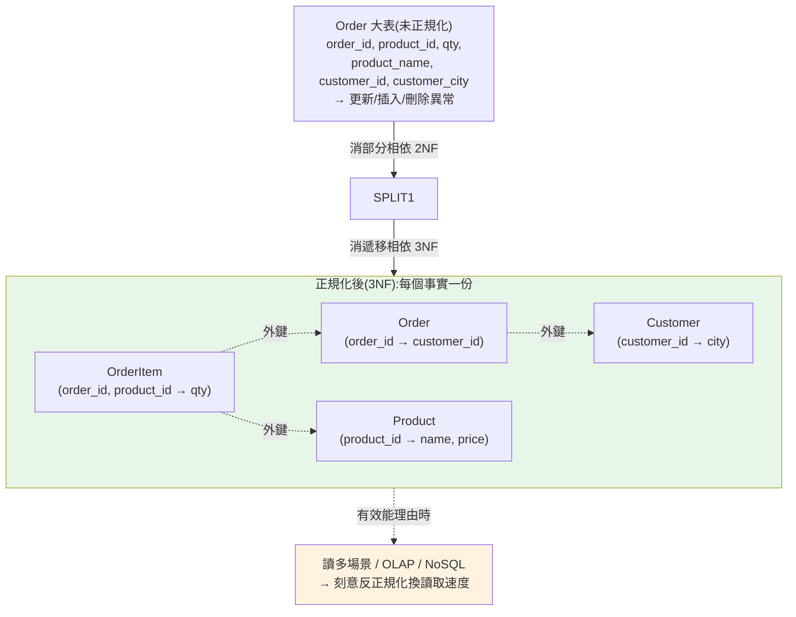

# 正規化與資料建模

> 有了 [關聯模型](01-relational-model.md) 和 [SQL](02-sql-language.md),下一個問題是:**一份資料該切成哪些表、每張表放哪些欄?** 這就是**資料建模(data modeling)**,而 **正規化(normalization)** 是它的理論指南。正規化用「函數相依(functional dependency)」這把尺,一步步(1NF→2NF→3NF→BCNF)消除**資料冗餘**與**更新異常**。這章講清楚為什麼冗餘是萬惡之源、各正規化形式在解決什麼、以及何時該**刻意反正規化(denormalization)** 換效能。學完你能看著一張爛表說出「它違反第幾正規化、會出什麼問題、該怎麼拆」。

## Why(為什麼)

假設你把訂單資料全塞進**一張大表**(顧客名、顧客電話、商品名、單價、數量都在同一列):

```text
order_id | customer | phone      | product | price | qty
---------+----------+------------+---------+-------+----
1        | Alice    | 0912-xxx   | Apple   | 30    | 2
2        | Alice    | 0912-xxx   | Banana  | 10    | 5
3        | Alice    | 0999-NEW   | Apple   | 30    | 1   ← Alice 電話改了,但只改了這列!
```

這張「大寬表」會產生三種**異常(anomaly)**——正規化就是為了消除它們:

- **更新異常(update anomaly)**:Alice 的電話存了很多份(每張訂單一份)。她換電話,你得更新**所有**含 Alice 的列;漏改一列(如上面 order 3),資料就**自相矛盾**(同一人兩個電話,到底哪個對?)。
- **插入異常(insert anomaly)**:想新增一個「還沒下單的商品」——但這張表以訂單為主鍵,**沒有訂單就無處可放商品**。你被迫塞假資料或留一堆 NULL。
- **刪除異常(delete anomaly)**:刪掉某人唯一的訂單,連帶把「這個人存在」「這個商品的單價」等資訊**一起弄丟**。

這些異常的**根源都是同一個:冗餘(redundancy)——同一個事實被存了多份**。正規化的核心思想就一句話:**「每個事實只存一次,存在它該在的地方。」** 把顧客資訊放顧客表、商品放商品表、訂單只存「誰買了什麼」的參照。理解正規化,你才能設計出**不會自相矛盾、好維護、好查詢**的 schema。

## Theory(理論:函數相依與正規化階梯)

**函數相依(functional dependency, FD)** 是正規化的數學工具,寫作 `X → Y`,意思是「**知道 X 就能唯一決定 Y**」:

```text
customer_id → customer_name, phone   （知道顧客 id,就能決定他的名字和電話)
product_id  → product_name, price     （知道商品 id,就能決定名稱和單價)
order_id    → customer_id, product_id, qty
```

正規化就是**依 FD 把表拆開,讓「非鍵欄位」只相依於「整個主鍵」,而不相依於其他非鍵欄位**。正規化形式是一個逐步嚴格的階梯:

| 形式 | 要求(白話) | 消除的問題 |
|------|-------------|-----------|
| **1NF** | 每格是單一值、無重複群組 | 多值欄位([ch01](01-relational-model.md) atomic) |
| **2NF** | 1NF + 非鍵欄位相依於**完整主鍵**(消除部分相依) | 複合鍵下的部分相依 |
| **3NF** | 2NF + 非鍵欄位**不相依於其他非鍵欄位**(消除遞移相依) | 遞移相依 |
| **BCNF** | 3NF 加強版:每個決定因素都是候選鍵 | 3NF 少數殘留異常 |

口訣(針對 3NF)——非鍵欄位必須相依於:**「鍵、整個鍵、且只有鍵(the key, the whole key, and nothing but the key)」**:

- **the key**(相依於鍵)= 1NF/有主鍵
- **the whole key**(相依於**整個**鍵,非部分)= 2NF
- **nothing but the key**(只相依於鍵,不相依於別的非鍵欄)= 3NF

## Specification(規範:各正規化形式詳解)

**1NF**:每個欄位是**單一不可分的值**,沒有「重複群組」或「多值欄位」。

```text
違反 1NF:  phones = "0912, 0999"        （一格塞多值)
符合 1NF:  拆成多列,或獨立的 phone 表
```

**2NF**(只在**複合主鍵**時才有意義):非鍵欄位不能只相依於**主鍵的一部分**。

```text
表 OrderItem(order_id, product_id, qty, product_name)  主鍵=(order_id, product_id)
違反 2NF:  product_name 只相依於 product_id(部分鍵),與 order_id 無關
修正:     product_name 移到 Product 表(product_id → product_name)
```

**3NF**:非鍵欄位不能相依於**另一個非鍵欄位**(遞移相依 `key → A → B`)。

```text
表 Order(order_id, customer_id, customer_city)
遞移相依:  order_id → customer_id → customer_city
           (customer_city 相依於非鍵的 customer_id,而非直接相依於 order_id)
修正:     customer_city 移到 Customer 表(customer_id → customer_city)
```

**BCNF**:更嚴格——**每一個函數相依的左邊(決定因素)都必須是候選鍵**。3NF 允許「非鍵欄位決定鍵的一部分」的罕見情況,BCNF 不允許。多數實務做到 3NF/BCNF 即可。

**參照完整性(referential integrity)**:拆表後用**外鍵**連回去,DB 保證「訂單的 customer_id 一定存在於 Customer 表」——防止孤兒資料。這是正規化拆表後保持一致性的機制(見 [ch01 外鍵](01-relational-model.md))。

## Implementation(底層:正規化的取捨與反正規化)

**正規化的代價:查詢要 JOIN**。把一張大表拆成顧客表、商品表、訂單表後,「列出訂單含顧客名與商品名」就得 `JOIN` 三張表。正規化**優化了寫入與一致性**(每個事實一份、改一處),但**讀取要付 JOIN 成本**。這是核心取捨:

```text
正規化(3NF+)              反正規化(denormalization)
├─ 寫入:改一處,無異常     ├─ 寫入:同一事實多份,需同步(有異常風險)
├─ 儲存:無冗餘、省空間     ├─ 儲存:冗餘、佔空間
├─ 讀取:多表 JOIN(較慢)  ├─ 讀取:少 JOIN、快(資料already 在一起)
└─ 一致性:DB 保證         └─ 一致性:靠應用維護
```

**何時該反正規化**(刻意違反正規化換讀取效能):

- **讀遠多於寫**、且 JOIN 成本是瓶頸(如報表、動態牆、快取層)。
- **分析型 / OLAP**:資料倉儲常用**星狀模型(star schema)**——刻意把維度資料冗餘進事實表,換取查詢簡單快速([ch04 columnar](04-storage-engine.md)、[Part 23](../23-data-analysis/README.md))。
- **NoSQL 文件庫**:文件模型鼓勵把相關資料**內嵌(embed)** 在一份文件裡(反正規化),換取單次讀取拿到全部([ch10](10-nosql-selection.md))。

**關鍵原則:先正規化,有明確效能理由再反正規化**。過早反正規化 = 自找更新異常的麻煩。反正規化時,要有機制(觸發器、應用邏輯、物化視圖)維持冗餘資料的一致性。下面用 Python 實作一個 FD 檢查器,自動偵測 schema 違反哪個正規化形式。

## Code Example(可執行的 Python 範例)

```python
# normalization.py — 用函數相依偵測正規化違規(純標準庫)
from __future__ import annotations

from dataclasses import dataclass
from itertools import combinations


@dataclass(frozen=True)
class FD:
    """函數相依 X → Y,以欄位名的 frozenset 表示。"""
    lhs: frozenset[str]
    rhs: frozenset[str]


@dataclass
class Table:
    columns: frozenset[str]
    primary_key: frozenset[str]      # 可能是複合鍵
    fds: list[FD]

    @property
    def non_key(self) -> frozenset[str]:
        return self.columns - self.primary_key


def violates_2nf(t: Table) -> list[str]:
    """部分相依:非鍵欄位相依於『主鍵的真子集』。僅複合鍵可能違反。"""
    problems: list[str] = []
    if len(t.primary_key) < 2:
        return problems  # 單一欄主鍵不可能有部分相依
    for r in range(1, len(t.primary_key)):
        for sub in combinations(t.primary_key, r):  # 主鍵的真子集
            subset = frozenset(sub)
            for fd in t.fds:
                if fd.lhs == subset and (fd.rhs & t.non_key):
                    dep = fd.rhs & t.non_key
                    problems.append(f"2NF: {set(dep)} 只相依於部分鍵 {set(subset)}")
    return problems


def violates_3nf(t: Table) -> list[str]:
    """遞移相依:非鍵欄位相依於『另一個非鍵欄位』。"""
    problems: list[str] = []
    for fd in t.fds:
        # 決定因素不含鍵、且推導出非鍵欄位 → 遞移相依
        if not (fd.lhs & t.primary_key) and (fd.rhs & t.non_key) and fd.lhs <= t.columns:
            if fd.lhs & t.non_key:  # 左邊是非鍵欄位
                dep = fd.rhs & t.non_key
                problems.append(f"3NF: {set(dep)} 遞移相依於非鍵 {set(fd.lhs)}")
    return problems


def main() -> None:
    # 爛設計:一張訂單大表
    bad = Table(
        columns=frozenset({"order_id", "product_id", "qty",
                           "product_name", "customer_id", "customer_city"}),
        primary_key=frozenset({"order_id", "product_id"}),
        fds=[
            FD(frozenset({"order_id", "product_id"}), frozenset({"qty"})),
            FD(frozenset({"product_id"}), frozenset({"product_name"})),   # 部分相依
            FD(frozenset({"order_id"}), frozenset({"customer_id"})),      # 部分相依
            FD(frozenset({"customer_id"}), frozenset({"customer_city"})), # 遞移相依
        ],
    )
    print("檢查爛設計 Order 大表:")
    for p in violates_2nf(bad) + violates_3nf(bad):
        print(f"  ✗ {p}")

    # 正規化後:乾淨的 OrderItem(只留 qty)
    good = Table(
        columns=frozenset({"order_id", "product_id", "qty"}),
        primary_key=frozenset({"order_id", "product_id"}),
        fds=[FD(frozenset({"order_id", "product_id"}), frozenset({"qty"}))],
    )
    print("\n檢查正規化後 OrderItem 表:")
    issues = violates_2nf(good) + violates_3nf(good)
    print("  ✓ 符合 2NF/3NF" if not issues else issues)


if __name__ == "__main__":
    main()
```

**預期輸出**:

```pycon
$ python normalization.py
檢查爛設計 Order 大表:
  ✗ 2NF: {'product_name'} 只相依於部分鍵 {'product_id'}
  ✗ 2NF: {'customer_id'} 只相依於部分鍵 {'order_id'}
  ✗ 3NF: {'customer_city'} 遞移相依於非鍵 {'customer_id'}

檢查正規化後 OrderItem 表:
  ✓ 符合 2NF/3NF
```

逐段解說:

- **FD 是判斷正規化的依據**:`Table` 帶著它的欄位、主鍵、與一組函數相依。所有正規化違規判斷都是「檢查 FD 的形狀」。
- **`violates_2nf` 找部分相依**:只有**複合主鍵**才可能違反(所以先 `if len(primary_key) < 2: return`)。它列舉主鍵的真子集,看有沒有非鍵欄位只相依於「一部分鍵」——`product_name` 只需 `product_id`(主鍵的一半)就能決定 → 違反 2NF,該移到 Product 表。
- **`violates_3nf` 找遞移相依**:決定因素是**非鍵欄位**卻能決定另一個非鍵欄位——`customer_id → customer_city`,兩者都非鍵,是 `order → customer_id → customer_city` 的遞移 → 違反 3NF,`customer_city` 該移到 Customer 表。
- **正規化後全過**:`OrderItem` 只留 `(order_id, product_id) → qty`——`qty` 相依於**完整主鍵**、沒有遞移相依,乾淨。顧客、商品資訊各自回到自己的表,靠外鍵連回。
- **實務對應**:這個檢查器把「這張表違反第幾正規化」自動化。真實建模時你會據此把大表拆成 Customer / Product / Order / OrderItem 四張表,**每個事實只存一次**。
- **要點**:正規化用 FD 消除冗餘與更新/插入/刪除異常;2NF 消部分相依、3NF 消遞移相依(口訣:the key, the whole key, nothing but the key);代價是讀取要 JOIN,讀多場景可刻意反正規化換效能。

## Diagram(圖解:大表拆解與正規化階梯)



## Best Practice(最佳實踐)

- **預設正規化到 3NF/BCNF**:消除冗餘與更新異常,是 OLTP 設計的基準。
- **用 FD 思考**:問「這個欄位相依於什麼?」——只相依於整個主鍵才留下,否則拆出去。
- **拆表後用外鍵維持參照完整性**:讓 DB 擋掉孤兒資料。
- **有明確效能理由再反正規化**:讀多、JOIN 是瓶頸時,並建立一致性維護機制(觸發器/物化視圖/應用邏輯)。
- **OLAP/資料倉儲用星狀模型**:刻意反正規化維度,換分析查詢的簡單與速度([Part 23](../23-data-analysis/README.md))。
- **NoSQL 依存取模式建模**:文件庫傾向內嵌(反正規化)以單次讀取取得全部([ch10](10-nosql-selection.md))。
- **一個事實一個地方**:這是正規化的靈魂,牢記它勝過死背形式編號。

## Common Mistakes(常見誤解)

- **把所有資料塞一張大寬表**:更新/插入/刪除異常、資料自相矛盾;該正規化拆表。
- **一格塞多值(逗號字串/陣列)**:違反 1NF,查詢與 join 崩壞。
- **過早反正規化**:圖 JOIN 少而冗餘,換來一堆更新異常;先正規化。
- **反正規化卻不維護一致性**:冗餘副本各說各話;要有同步機制。
- **以為正規化越高越好**:過度拆表使簡單查詢也要一堆 JOIN;3NF/BCNF 通常剛好。
- **忘記外鍵**:拆了表卻不設參照完整性,出現孤兒資料。
- **死背 NF 編號卻不懂 FD**:記口訣「the key, whole key, nothing but the key」比背定義有用。
- **OLTP 與 OLAP 用同一種建模**:交易型要正規化、分析型常反正規化(星狀),混用兩頭不討好。

## Interview Notes(面試重點)

- **能講三種異常**:更新/插入/刪除異常,根源都是冗餘(同一事實多份)。
- **能講函數相依 FD**:`X→Y`「知道 X 決定 Y」,是正規化的判斷工具。
- **能講正規化階梯**:1NF(atomic)→2NF(消部分相依)→3NF(消遞移相依)→BCNF;口訣 the key, the whole key, nothing but the key。
- **能舉例判斷違反第幾 NF 並說明怎麼拆**(如訂單大表拆成四張表)。
- **能講正規化 vs 反正規化的取捨**:正規化優化寫入/一致性、讀取要 JOIN;反正規化換讀取速度、需維護一致性。
- **能講何時反正規化**:讀多、OLAP 星狀模型、NoSQL 內嵌。
- **能連到外鍵/參照完整性**:拆表後保持一致的機制([ch01](01-relational-model.md))。

---

➡️ 下一章:[儲存引擎與磁碟結構](04-storage-engine.md)

[⬆️ 回 Part 15 索引](README.md)
