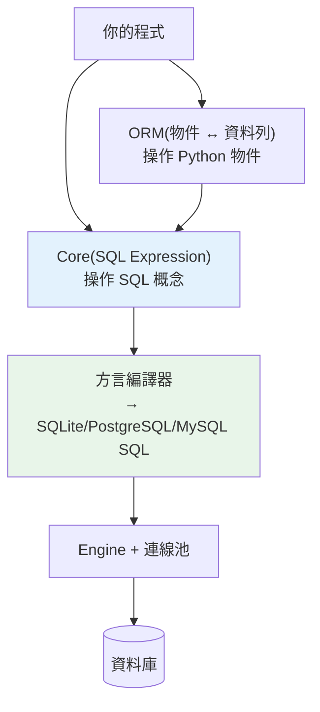

# SQLAlchemy Core

> 直接寫 SQL 字串容易出錯、綁死特定資料庫；ORM 又有時太重、藏太多魔法。SQLAlchemy Core 是中間層——用 Python 表達式建構 SQL，型別安全、跨資料庫、但仍貼近 SQL，讓你完全掌控查詢。

## Why（為什麼）

用原生 DB-API 寫 SQL 字串有兩個痛點：**易錯**（拼字、引號、方言差異）、**綁死資料庫**（PostgreSQL 和 MySQL 的 SQL 有差異）。全上 ORM（見 [SQLAlchemy ORM](04-sqlalchemy-orm.md)）又可能太重、藏太多細節、效能難掌控。**SQLAlchemy Core** 是理想的中間層：用 **Python 物件與表達式** 建構 SQL（`select(users).where(users.c.age > 18)`），編譯成對應資料庫的方言。你得到型別檢查、跨資料庫可攜、自動參數化（防注入），又保留對 SQL 的完整控制。對「重查詢、要效能、不想要 ORM 開銷」的場景（資料分析、報表、ETL），Core 常是最佳選擇。理解 Core 也讓你懂 ORM 底層——ORM 就是建在 Core 之上。

## Theory（理論：Expression Language）

SQLAlchemy 分兩層：

- **Core（本章）**：**SQL Expression Language**——用 Python 建構 SQL 語句。你操作的是「表、欄、查詢」等 SQL 概念，但用 Python 物件表達。貼近 SQL、明確、可控。
- **ORM（下章）**：建在 Core 之上，把「資料列」映射成「Python 物件」。你操作的是「物件」，ORM 幫你生成 SQL。抽象更高、更方便，但藏更多。

Core 的核心概念：

- **Engine**：連線工廠與連線池的入口（見 [連線池](05-connection-pool.md)），代表「如何連到某資料庫」。
- **MetaData / Table**：描述資料庫 schema（表、欄、約束）的 Python 物件。
- **Expression**：`select()`、`insert()`、`update()`、`delete()` 等，用 Python 建構、編譯成 SQL。
- **Connection**：實際執行語句、管理交易。

為什麼用表達式而非字串？因為表達式**可組合、型別安全、自動參數化、跨方言**——把 SQL 當「資料結構」操作，比拼字串健壯得多。

## Specification（規範：Core 基本用法）

```python
from sqlalchemy import (
    create_engine, MetaData, Table, Column,
    Integer, String, select, insert, update, delete,
)

# 1. Engine（連線入口 + 連線池）
engine = create_engine("sqlite:///app.db")          # 或 postgresql+psycopg://...
# echo=True 可印出實際 SQL（除錯用）

# 2. 定義 schema
metadata = MetaData()
users = Table(
    "users", metadata,
    Column("id", Integer, primary_key=True),
    Column("name", String, nullable=False),
    Column("age", Integer),
)
metadata.create_all(engine)                          # 建表

# 3. 執行語句（用 connection，自動交易）
with engine.connect() as conn:
    conn.execute(insert(users), [{"name": "Alice", "age": 30}])
    conn.commit()

    stmt = select(users).where(users.c.age > 18).order_by(users.c.name)
    for row in conn.execute(stmt):
        print(row.name, row.age)
```

## Implementation（select/insert/update、參數化、JOIN、方言）

### 建構查詢：select

`select()` 用 Python 建構 SQL——`where`、`order_by`、`limit` 等鏈式組合：

```python
from sqlalchemy import select, and_, or_

# SELECT name, age FROM users WHERE age > 18 AND name LIKE 'A%' ORDER BY age LIMIT 10
stmt = (
    select(users.c.name, users.c.age)
    .where(and_(users.c.age > 18, users.c.name.like("A%")))
    .order_by(users.c.age)
    .limit(10)
)

with engine.connect() as conn:
    result = conn.execute(stmt)
    for row in result:
        print(row.name, row.age)   # row 可用欄名（Row 物件）
```

`users.c.age > 18` 不是「立刻比較」——它建構一個**SQL 表達式物件**，最後編譯成 `age > :age_1`（自動參數化！）。這就是為什麼 Core 天然防 SQL injection：值永遠是綁定參數。

### insert / update / delete

```python
from sqlalchemy import insert, update, delete

with engine.connect() as conn:
    # INSERT（單筆或批次）
    conn.execute(insert(users), {"name": "Bob", "age": 25})
    conn.execute(insert(users), [                       # 批次
        {"name": "Cara", "age": 35},
        {"name": "Dave", "age": 40},
    ])

    # UPDATE ... WHERE
    conn.execute(update(users).where(users.c.name == "Bob").values(age=26))

    # DELETE ... WHERE
    conn.execute(delete(users).where(users.c.age < 18))

    conn.commit()   # 別忘了提交
```

### JOIN

Core 直接表達 JOIN：

```python
# SELECT u.name, o.amount FROM users u JOIN orders o ON o.user_id = u.id
stmt = (
    select(users.c.name, orders.c.amount)
    .select_from(users.join(orders, orders.c.user_id == users.c.id))
    .where(orders.c.amount > 100)
)
```

### 自動參數化與跨方言

Core 的兩大好處：

1. **自動參數化**：所有值變成綁定參數（`:param`），驅動負責跳脫——**天然防 SQL injection**（見 [SQL injection](../20-security-system-design/06-sql-injection.md)），你不用手動處理。
2. **跨方言**：同一段 `select()` 在 SQLite、PostgreSQL、MySQL 編譯成各自正確的 SQL（`LIMIT` 語法、跳脫、型別差異都由方言處理）。換資料庫時查詢碼不用改。

```python
# 看實際生成的 SQL（除錯）
print(stmt.compile(engine))         # 印出編譯後的 SQL + 參數
# 或建 engine 時 echo=True，執行時印出所有 SQL
```

### text()：需要原生 SQL 時

有時你需要寫原生 SQL（複雜查詢、資料庫特有語法）——用 `text()`，**仍要參數化**：

```python
from sqlalchemy import text

with engine.connect() as conn:
    # 用 :name 綁定參數（別字串拼接！）
    result = conn.execute(
        text("SELECT * FROM users WHERE age > :min_age"),
        {"min_age": 18},
    )
```

## Code Example（可執行的 Python 範例）

```python
# sqlalchemy_core_demo.py — 展示 SQLAlchemy Core（可獨立執行，需 sqlalchemy）
from __future__ import annotations

from sqlalchemy import (
    Column,
    Integer,
    MetaData,
    String,
    Table,
    create_engine,
    delete,
    func,
    insert,
    select,
    update,
)


def demo() -> None:
    # 記憶體 SQLite（示範用）
    engine = create_engine("sqlite:///:memory:")

    metadata = MetaData()
    users = Table(
        "users",
        metadata,
        Column("id", Integer, primary_key=True),
        Column("name", String, nullable=False),
        Column("age", Integer),
    )
    metadata.create_all(engine)

    with engine.connect() as conn:
        # 批次插入
        conn.execute(
            insert(users),
            [
                {"name": "Alice", "age": 30},
                {"name": "Bob", "age": 25},
                {"name": "Cara", "age": 35},
                {"name": "Dave", "age": 17},
            ],
        )
        conn.commit()

        # SELECT ... WHERE ... ORDER BY（表達式建構）
        stmt = select(users.c.name, users.c.age).where(users.c.age >= 18).order_by(users.c.age)
        print("成年使用者（表達式查詢）：")
        for row in conn.execute(stmt):
            print(f"  {row.name}: {row.age}")

        # 看實際編譯出的 SQL（自動參數化）
        print(f"\n編譯後 SQL: {stmt}")

        # 聚合
        total = conn.execute(select(func.count()).select_from(users)).scalar()
        avg_age = conn.execute(select(func.avg(users.c.age))).scalar()
        print(f"\n總人數: {total}, 平均年齡: {avg_age:.1f}")

        # UPDATE / DELETE
        conn.execute(update(users).where(users.c.name == "Bob").values(age=26))
        conn.execute(delete(users).where(users.c.age < 18))
        conn.commit()
        remaining = conn.execute(select(func.count()).select_from(users)).scalar()
        print(f"刪除未成年後剩 {remaining} 人")

    print("\n重點：Core 用 Python 表達式建 SQL、自動參數化、跨方言")


if __name__ == "__main__":
    demo()
```

**預期輸出**：

```pycon
$ python sqlalchemy_core_demo.py
成年使用者（表達式查詢）：
  Bob: 25
  Alice: 30
  Cara: 35

編譯後 SQL: SELECT users.name, users.age
FROM users
WHERE users.age >= :age_1 ORDER BY users.age

總人數: 4, 平均年齡: 26.8

刪除未成年後剩 3 人

重點：Core 用 Python 表達式建 SQL、自動參數化、跨方言
```

## Diagram（圖解：SQLAlchemy 兩層）



## Best Practice（最佳實踐）

- **重查詢、要效能、報表/ETL 用 Core**：貼近 SQL、可控、無 ORM 開銷。
- **用表達式建構查詢**（`select().where()`）：型別安全、可組合、**自動參數化**、跨方言。
- **需要原生 SQL 用 `text()` 且仍參數化**（`:name`）：別字串拼接。
- **一個 Engine 全應用共用**（管連線池，見 [連線池](05-connection-pool.md)）：別到處 `create_engine`。
- **用 `with engine.connect()` 管理連線與交易**，記得 `commit()`（或用 `engine.begin()` 自動提交）。
- **除錯用 `echo=True` 或 `stmt.compile(engine)`** 看實際 SQL。
- **schema 用 `MetaData`/`Table` 描述**：可 `create_all` 建表、被 ORM 與 migration 共用（見 [migration](07-migration.md)）。
- **知道 Core 是 ORM 的基礎**：ORM 底層就是 Core。

## Common Mistakes（常見誤解）

- **在 `text()` 裡字串拼接值**：失去參數化、SQL injection；用 `:name` 綁定。
- **忘記 `commit()`**：寫入沒生效（`engine.connect()` 不自動提交；`engine.begin()` 才自動）。
- **到處 `create_engine`**：每個 engine 有自己的連線池，浪費資源；全應用共用一個。
- **以為 `users.c.age > 18` 會立刻運算**：它建構 SQL 表達式（延遲到執行才編譯）。
- **把 Core 和 ORM 混為一談**：Core 操作 SQL 概念、ORM 操作物件；Core 沒有 session/身分映射。
- **忽略方言差異卻手寫方言 SQL**：能用表達式就用，跨資料庫可攜。

## Interview Notes（面試重點）

- **能定位 SQLAlchemy 兩層：Core（SQL Expression Language，操作 SQL 概念）vs ORM（物件映射，建在 Core 上）**，並說出何時用 Core（重查詢/效能/報表）。
- **知道 Core 用 Python 表達式建構 SQL、自動參數化（防注入）、跨方言編譯**——換資料庫查詢碼不用改。
- 知道 Engine（連線池入口）、MetaData/Table（描述 schema）、`select/insert/update/delete`、`text()`（原生 SQL 仍要參數化）。
- 知道 `engine.connect()`（要手動 commit）vs `engine.begin()`（自動交易）。
- 能說出「Core 是 ORM 的基礎、理解 Core 幫你掌控 ORM 生成的 SQL」。

---

➡️ 下一章：[SQLAlchemy ORM](04-sqlalchemy-orm.md)

[⬆️ 回 Part 15 索引](README.md)
