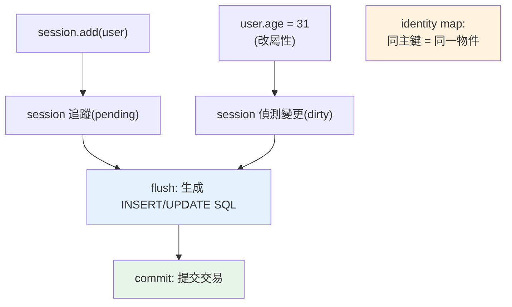

# SQLAlchemy ORM

> ORM 把「資料列」變成「Python 物件」，讓你用物件導向的方式操作資料庫——不用手寫 SQL。但它藏了很多魔法（session、identity map、flush、lazy loading），不懂這些就會踩坑。這章帶你看懂 ORM 的運作。

## Why（為什麼）

用 Core（見 [SQLAlchemy Core](03-sqlalchemy-core.md)）或原生 SQL，你操作的是「表、欄、列」。但你的程式其實想操作「使用者物件、訂單物件」——每次查詢都手動把列轉成物件、把物件存回列，很煩。**ORM（Object-Relational Mapping，物件關聯映射）** 自動做這件事：**定義類別對應資料表，操作物件（`user.name = "Bob"`）ORM 自動生成 SQL**。它讓資料庫存取融入物件導向的程式碼，是多數 Web 應用（Django ORM、SQLAlchemy ORM）的標配。但 ORM 藏了很多機制——**session、identity map、unit of work、flush、lazy loading**——不理解就會遇到「為什麼沒存進去」「為什麼查了 100 次」（N+1，見 [N+1](10-n-plus-1.md)）等坑。這章講清楚 ORM 怎麼運作。

## Theory（理論：session、identity map、unit of work）

SQLAlchemy ORM 的核心是 **Session**，它實作三個關鍵模式：

- **Identity Map（身分映射）**：同一 session 內，同一主鍵的資料列**只對應一個 Python 物件**。查兩次同一個 user，拿到的是同一個物件（`is` 相同）——避免重複、保證一致。
- **Unit of Work（工作單元）**：session 追蹤你對物件的所有更動（新增、修改、刪除），到 **flush/commit 時一次把變更寫進資料庫**。你不用手動 `insert`/`update`——改物件屬性，session 自動偵測並生成 SQL。
- **Identity/狀態管理**：物件在 session 中有狀態（transient 未追蹤 / pending 待寫入 / persistent 已在 DB / detached 脫離 session）。

換句話說：**session 是一個「暫存區 + 變更追蹤器 + 物件快取」**。你操作物件，session 記錄變更，`commit()` 時翻譯成 SQL 執行。理解「session 追蹤變更、flush 才寫入」是用好 ORM 的關鍵。

## Specification（規範：ORM 基本用法）

```python
from sqlalchemy import create_engine, String, ForeignKey
from sqlalchemy.orm import DeclarativeBase, Mapped, mapped_column, relationship, Session

# 1. 定義模型（映射類別 → 資料表）
class Base(DeclarativeBase):
    pass

class User(Base):
    __tablename__ = "users"
    id: Mapped[int] = mapped_column(primary_key=True)
    name: Mapped[str] = mapped_column(String(50))
    age: Mapped[int]
    orders: Mapped[list["Order"]] = relationship(back_populates="user")

class Order(Base):
    __tablename__ = "orders"
    id: Mapped[int] = mapped_column(primary_key=True)
    amount: Mapped[int]
    user_id: Mapped[int] = mapped_column(ForeignKey("users.id"))
    user: Mapped["User"] = relationship(back_populates="orders")

# 2. 建立引擎與資料表
engine = create_engine("sqlite:///app.db")
Base.metadata.create_all(engine)

# 3. 用 Session 操作物件
with Session(engine) as session:
    user = User(name="Alice", age=30)     # 建立物件
    session.add(user)                      # 加入 session（pending）
    session.commit()                       # 寫入 DB

    # 查詢
    from sqlalchemy import select
    u = session.scalars(select(User).where(User.name == "Alice")).first()
    u.age = 31                             # 改屬性 → session 追蹤
    session.commit()                       # 自動 UPDATE
```

## Implementation（模型、session 生命週期、關聯、查詢）

### 定義模型（現代 2.0 風格）

現代 SQLAlchemy 2.0 用 `Mapped` 型別註解 + `mapped_column`，型別安全、與 mypy 相容（見 [型別系統](../05-typing/README.md)）：

```python
from sqlalchemy.orm import DeclarativeBase, Mapped, mapped_column

class Base(DeclarativeBase):
    pass

class User(Base):
    __tablename__ = "users"
    id: Mapped[int] = mapped_column(primary_key=True)
    name: Mapped[str]                              # 非 Optional → NOT NULL
    email: Mapped[str | None]                      # Optional → 可為 NULL
    age: Mapped[int] = mapped_column(default=0)
```

`Mapped[str]` vs `Mapped[str | None]` 直接對應 `NOT NULL` vs 可空——型別註解就是 schema。

### session 生命週期與變更追蹤

```python
from sqlalchemy.orm import Session

with Session(engine) as session:       # session 綁定一個交易
    # 新增
    user = User(name="Bob", age=25)
    session.add(user)                   # pending（尚未寫入）
    # 此時 user.id 還是 None

    session.flush()                     # 送 SQL 到 DB（但交易未 commit）
    print(user.id)                      # 現在有 id 了（DB 生成）

    # 修改（不用呼叫 update！session 追蹤變更）
    user.age = 26

    session.commit()                    # 提交交易（flush + commit）
    # 區塊結束 with → session.close()
```

關鍵：**你不呼叫 `update()`——改物件屬性，session 在 flush/commit 時自動生成 `UPDATE`**（unit of work）。`flush` 是「送 SQL」、`commit` 是「提交交易」（flush 隱含在 commit 裡）。

### 關聯（relationship）：物件導向的 JOIN

`relationship` 讓你用屬性存取關聯物件（不用手寫 JOIN）：

```python
class User(Base):
    __tablename__ = "users"
    id: Mapped[int] = mapped_column(primary_key=True)
    name: Mapped[str]
    orders: Mapped[list["Order"]] = relationship(back_populates="user")

class Order(Base):
    __tablename__ = "orders"
    id: Mapped[int] = mapped_column(primary_key=True)
    user_id: Mapped[int] = mapped_column(ForeignKey("users.id"))
    user: Mapped["User"] = relationship(back_populates="orders")

# 使用：像操作物件
user = session.get(User, 1)
for order in user.orders:          # 自動查關聯（預設 lazy loading）
    print(order.amount)

new_order = Order(amount=100)
user.orders.append(new_order)      # 加關聯 → session 自動設 user_id
session.commit()
```

**⚠️ 陷阱**：`user.orders` 預設是 **lazy loading**（存取時才查 DB）——在迴圈裡對多個 user 存取 `.orders` 會產生 **N+1 查詢**（見 [N+1](10-n-plus-1.md)）。要注意載入策略。

### 查詢（2.0 風格）

```python
from sqlalchemy import select

# 查一個
user = session.get(User, 1)                                  # 依主鍵（走 identity map）
user = session.scalars(select(User).where(User.name == "Bob")).first()

# 查多個
users = session.scalars(select(User).where(User.age >= 18).order_by(User.name)).all()

# JOIN 查詢
from sqlalchemy import func
stmt = (
    select(User.name, func.count(Order.id))
    .join(Order)
    .group_by(User.id)
)
for name, count in session.execute(stmt):
    print(name, count)
```

`session.get(id)` 會先查 identity map（若物件已在 session，不打 DB）——這是身分映射的好處。

### session 該多大？每請求一個

**session 不是全域單例，也不是每查詢一個**——標準做法是**每個工作單元（Web 每請求）一個 session**（見 [Depends](../14-web/11-fastapi-depends.md) 的 yield 依賴）：

```python
# FastAPI：每請求一個 session（yield 依賴）
def get_session():
    with Session(engine) as session:
        yield session      # 請求用它、結束自動關閉

@app.get("/users/{id}")
def read_user(id: int, session: Session = Depends(get_session)):
    return session.get(User, id)
```

## Code Example（可執行的 Python 範例）

```python
# sqlalchemy_orm_demo.py — 展示 ORM 核心（可獨立執行，需 sqlalchemy）
from __future__ import annotations

from sqlalchemy import ForeignKey, create_engine, func, select
from sqlalchemy.orm import (
    DeclarativeBase,
    Mapped,
    Session,
    mapped_column,
    relationship,
)


class Base(DeclarativeBase):
    pass


class User(Base):
    __tablename__ = "users"
    id: Mapped[int] = mapped_column(primary_key=True)
    name: Mapped[str]
    age: Mapped[int]
    orders: Mapped[list["Order"]] = relationship(back_populates="user")


class Order(Base):
    __tablename__ = "orders"
    id: Mapped[int] = mapped_column(primary_key=True)
    amount: Mapped[int]
    user_id: Mapped[int] = mapped_column(ForeignKey("users.id"))
    user: Mapped["User"] = relationship(back_populates="orders")


def demo() -> None:
    engine = create_engine("sqlite:///:memory:")
    Base.metadata.create_all(engine)

    with Session(engine) as session:
        # 新增物件（不寫 SQL）
        alice = User(name="Alice", age=30)
        alice.orders = [Order(amount=100), Order(amount=250)]  # 關聯物件
        session.add(alice)
        session.commit()
        print(f"新增 Alice，DB 生成 id = {alice.id}")

        # identity map：get 同一個 → 同一物件
        u1 = session.get(User, alice.id)
        u2 = session.get(User, alice.id)
        print(f"identity map: u1 is u2 = {u1 is u2}")

        # 改屬性 → session 自動 UPDATE（unit of work）
        u1.age = 31
        session.commit()
        print(f"改年齡後（自動 UPDATE）: {session.get(User, alice.id).age}")

        # 用關聯存取（物件導向）
        print(f"Alice 的訂單: {[o.amount for o in alice.orders]}")

        # JOIN 聚合查詢
        stmt = select(User.name, func.sum(Order.amount)).join(Order).group_by(User.id)
        for name, total in session.execute(stmt):
            print(f"{name} 訂單總額: {total}")

    print("\n重點：ORM 用物件操作、session 追蹤變更(unit of work)、identity map、關聯")


if __name__ == "__main__":
    demo()
```

**預期輸出**：

```pycon
$ python sqlalchemy_orm_demo.py
新增 Alice，DB 生成 id = 1
identity map: u1 is u2 = True
改年齡後（自動 UPDATE）: 31
Alice 的訂單: [100, 250]
Alice 訂單總額: 350

重點：ORM 用物件操作、session 追蹤變更(unit of work)、identity map、關聯
```

## Diagram（圖解：session 的 unit of work）



## Best Practice（最佳實踐）

- **用現代 2.0 風格**（`Mapped[...]` + `mapped_column`）：型別安全、與 mypy 相容。
- **每工作單元（Web 每請求）一個 session**（見 [Depends](../14-web/11-fastapi-depends.md) yield 依賴）：不全域、不每查詢，用完關閉。
- **理解 unit of work**：改物件屬性即被追蹤、flush/commit 自動生成 SQL——別手動 `update`。
- **關聯用 `relationship` + `back_populates`**：雙向關聯、物件導向存取。
- **小心 lazy loading 造成 N+1**：迴圈存取關聯時用 eager loading（`selectinload`/`joinedload`，見 [N+1](10-n-plus-1.md)）。
- **`session.get(id)` 走 identity map**：已載入的物件不重打 DB。
- **交易用 `with Session()` 或 `session.begin()`**：明確邊界（見 [transaction](06-transactions.md)）。
- **需要極致效能/複雜查詢時退回 Core 或原生 SQL**：ORM 不是萬能。

## Common Mistakes（常見誤解）

- **忘記 `commit()`**：變更只在 session 記憶體，沒寫進 DB。
- **在迴圈裡觸發 lazy loading → N+1 查詢**：效能災難；用 eager loading（見 [N+1](10-n-plus-1.md)）。
- **session 當全域單例跨執行緒/請求共用**：session 非執行緒安全、狀態污染；每請求一個。
- **手動寫 `update`/`insert`**：ORM 追蹤變更自動生成；改屬性即可。
- **commit 後存取 detached 物件的屬性**：預設 `expire_on_commit=True`，commit 後屬性過期、再存取會重查（或報錯若 session 關了）。
- **在 `async def` 用同步 Session**：阻塞 event loop；async 用 `AsyncSession`（見 [async DB](09-async-database.md)）。
- **以為 ORM 免懂 SQL**：ORM 生成 SQL，不懂 SQL 就無法優化、看不懂 N+1。

## Interview Notes（面試重點）

- **能解釋 ORM 三大機制：identity map（同主鍵同物件）、unit of work（追蹤變更、flush 才寫入）、session（暫存+變更追蹤+快取）**。
- **知道「改物件屬性，session 自動生成 UPDATE」**（不用手動 update）、`flush`（送 SQL）vs `commit`（提交交易）的差別。
- **知道 lazy loading 造成 N+1 問題**，能說出用 eager loading 解決（連結 [N+1](10-n-plus-1.md)）。
- 知道 **每請求一個 session** 的生命週期、identity map 讓 `get` 不重打 DB。
- 能對比 ORM（方便、物件導向、藏 SQL）vs Core（可控、貼近 SQL）並說出取捨；知道 async 要用 `AsyncSession`。

---

➡️ 下一章：[連線池](05-connection-pool.md)

[⬆️ 回 Part 15 索引](README.md)
