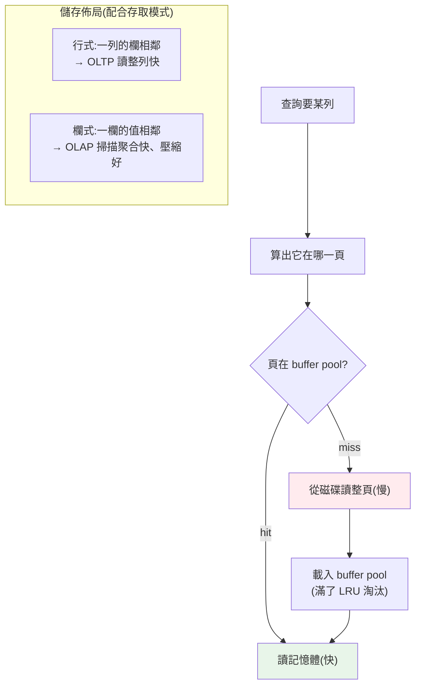

# 儲存引擎與磁碟結構

> 前三章是「資料的邏輯樣貌」(關聯、SQL、正規化)。這章潛到**物理層**:資料在磁碟上到底**怎麼擺**?一張表不是「一個 Excel」,而是一堆固定大小的**頁(page)**;讀寫不是逐列,而是**以頁為單位**在磁碟與記憶體(**buffer pool**)之間搬運。理解這層,你才懂為什麼「隨機讀很貴」「順序掃描有時比索引快」「OLTP 用行式、OLAP 用欄式」「B-tree 與 LSM-tree 是兩種截然不同的取捨」。這是把「資料庫慢在哪」從玄學變成物理的關鍵一章。

## 💡 白話導讀(建議先讀)

資料庫的效能問題,九成能追到一個物理事實:**磁碟比記憶體慢幾個數量級**。這章看資料在磁碟上「實際怎麼擺」。

三個核心畫面:

**1. 資料是一箱一箱搬的,不是一件一件。**
表在磁碟上切成固定大小的「**頁**」(如 8KB)——讀寫都以整頁為單位。
你只要一列?抱歉,**它所在的整頁都會被搬進來**——所以「相鄰的資料」會順便進記憶體(這性質後面很多優化在利用)。

**2. buffer pool = 櫃檯旁的常用書車。**
每次都跑書庫(磁碟)太慢,資料庫在記憶體養一台書車,放最近用過的頁。
命中書車=奈秒級;沒中=跑書庫。**命中率是資料庫效能的命脈**——這也是「資料庫吃記憶體」的原因。

**3. 按列擺 vs 按欄擺,決定兩種資料庫。**
- **行式**:一列的欄位放一起——查「某使用者的全部資料」快 → 交易型(OLTP,PostgreSQL/MySQL)。
- **欄式**:同一欄的值放一起——「算一億筆的平均」只讀那一欄 → 分析型(OLAP,ClickHouse/BigQuery)。

最後預告一組引擎哲學之爭:**B-tree**(就地更新、讀快)vs **LSM-tree**(只追加、寫快)——為什麼寫入密集的系統選 Cassandra,答案在這。

## Why(為什麼)

不懂儲存層,很多資料庫行為就只能死背、無法推理:

- **「磁碟 I/O 是資料庫的頭號成本」不是口號**:記憶體存取是奈秒級,SSD 是微秒級,傳統硬碟隨機尋道是毫秒級——**差好幾個數量級**。資料庫的一切設計(頁、索引、buffer pool、WAL)幾乎都是為了**減少磁碟 I/O、把隨機 I/O 變順序 I/O**。不懂這個成本結構,就無法理解為什麼要有這些機制。
- **為什麼「以頁為單位」而非「以列為單位」**:磁碟一次讀寫有最小單位,逐列讀會產生大量小 I/O。資料庫把資料打包成**固定大小的頁**(常見 4KB/8KB/16KB),一次搬一頁——這決定了「讀 1 列其實讀了整頁」「相鄰的列一起被讀進來」等行為。
- **行式 vs 欄式決定 OLTP 與 OLAP 的分野**:同一張邏輯表,**按列存(row-oriented)** 適合「讀整列」的交易(查一個使用者的所有欄位),**按欄存(columnar)** 適合「掃一欄做聚合」的分析(算一億筆的平均值)。這是為什麼交易用 PostgreSQL/MySQL、分析用 ClickHouse/BigQuery——**底層儲存佈局不同**。
- **B-tree vs LSM-tree 是兩種資料庫哲學**:傳統關聯式(PostgreSQL/MySQL)用 **B-tree**(讀快、就地更新);許多寫入密集的 NoSQL(Cassandra/RocksDB)用 **LSM-tree**(寫快、後台合併)。理解兩者取捨,你才知道為什麼不同 DB 的寫入/讀取特性差這麼多。

**這章把資料庫從「邏輯模型」拉到「真實硬體」**——之後的索引、交易、恢復,全都建在這層物理現實上。

## Theory(理論:頁、buffer pool、儲存佈局)

**頁(page / block)——儲存的基本單位**:

```text
一張表在磁碟上 = 一堆固定大小的頁(如 8KB)
┌─────── page 0 ───────┐┌─────── page 1 ───────┐┌─── page 2 ───┐
│ header │ row │ row │ ││ header │ row │ row  │ │ ...          │
└──────────────────────┘└──────────────────────┘└──────────────┘
        ↑ 讀寫以「整頁」為單位,不是單列
```

**buffer pool(緩衝池)——記憶體裡的頁快取**:磁碟慢,所以資料庫在記憶體開一大塊 **buffer pool** 快取最近用到的頁:

```text
查詢要某列 → 算出它在哪一頁 → 
  頁已在 buffer pool?→ 直接讀記憶體(快,cache hit)
  不在?→ 從磁碟讀整頁進 buffer pool(慢,cache miss),再讀
寫入 → 改記憶體裡的頁(標記 dirty)→ 之後才批次刷回磁碟(配合 WAL,見 ch08)
```

**buffer pool 命中率(hit ratio)是資料庫效能的關鍵指標**——命中率高 = 大多從記憶體服務、少碰磁碟。這也是「資料庫吃記憶體」的原因:buffer pool 越大,能快取越多頁。

**行式 vs 欄式儲存佈局**:

```text
邏輯表:  id  name   age            行式(row-oriented,OLTP)
         1   Alice  30             page: [1,Alice,30][2,Bob,25][3,Cara,40]
         2   Bob    25             → 一列的欄位擺在一起,讀整列快
         3   Cara   40
                                    欄式(columnar,OLAP)
                                    page_id:  [1,2,3]
                                    page_name:[Alice,Bob,Cara]
                                    page_age: [30,25,40]
                                    → 同一欄的值擺在一起,掃一欄做聚合快、壓縮率高
```

## Specification(規範:堆積、聚簇、行式/欄式、B-tree/LSM)

**表的物理組織方式**:

| 組織 | 說明 | 代表 |
|------|------|------|
| **堆積表(heap)** | 列無序堆放,靠索引或全表掃描找 | PostgreSQL 預設 |
| **聚簇索引表(clustered / index-organized)** | 列**依主鍵順序**實體存放(表本身就是一棵 B-tree) | MySQL InnoDB、SQLite |

**行式 vs 欄式**:

| 面向 | 行式(row store) | 欄式(column store) |
|------|-----------------|---------------------|
| 佈局 | 一列的欄位相鄰 | 一欄的值相鄰 |
| 適合 | OLTP:讀寫整列、點查詢 | OLAP:掃少數欄做聚合 |
| 壓縮 | 較差(同列型別雜) | **極佳**(同欄同型別,相鄰值相似) |
| 代表 | PostgreSQL、MySQL、SQLite | ClickHouse、DuckDB、BigQuery、Parquet |

**B-tree vs LSM-tree——兩種索引/儲存引擎哲學**:

| 面向 | B-tree(B+tree) | LSM-tree(Log-Structured Merge) |
|------|-----------------|-------------------------------|
| 寫入 | **就地更新**(找到頁改它),隨機 I/O | **只追加**(寫記憶體 memtable → 順序刷成 SSTable),順序 I/O |
| 讀取 | **快**(直接定位) | 較慢(要查多層 SSTable,靠 bloom filter 加速) |
| 寫放大 | 較高(改一列可能寫整頁 + WAL) | 寫入快,但**後台 compaction** 有額外 I/O |
| 適合 | 讀多、點查詢、範圍查詢 | **寫入密集**、時序/日誌 |
| 代表 | PostgreSQL、MySQL、SQLite | RocksDB、Cassandra、LevelDB、部分 NewSQL |

## Implementation(底層:為什麼隨機 I/O 貴、頁的代價)

**隨機 I/O vs 順序 I/O——資料庫設計的核心約束**:傳統硬碟讀資料要**機械尋道**(磁頭移動 + 碟片旋轉),隨機讀一個位置要幾毫秒;但**順序讀**相鄰資料快得多(不用重新尋道)。SSD 沒有機械尋道,但**順序仍優於隨機**(頁對齊、預取、寫入放大)。所以資料庫拼命做的事:

- **把隨機寫變順序寫**:WAL([ch08](08-wal-recovery.md))就是把「隨機更新各處的頁」先變成「順序追加一條 log」;LSM-tree 更是全靠順序追加。
- **一次讀一整頁 + 預取(prefetch)**:反正尋道了,就多讀相鄰資料進 buffer pool,賭你等下會用到(順序掃描因此快)。
- **索引把「掃全表」變成「幾次定點跳」**:但每次跳是隨機 I/O——所以**索引不是永遠贏**,當要讀的列佔比很高時,優化器可能選**全表順序掃描**反而更快([ch06](06-query-processing.md))。

**「讀 1 列 = 讀整頁」的後果**:因為 I/O 以頁為單位,查一列其實把它所在的**整頁**(含相鄰的列)load 進 buffer pool。這解釋了:

- **聚簇索引為何對範圍查詢快**:主鍵相鄰的列實體相鄰、在同幾頁裡,範圍掃描少讀幾頁。
- **欄式為何壓縮好**:同欄值相鄰且型別相同(如一整頁都是 int age),壓縮演算法效率極高,一頁能裝更多值 → 掃描讀更少頁。
- **窄表(欄少)比寬表省 I/O**:一頁能塞更多列。

下面用 Python 模擬「頁 + buffer pool」與「行式 vs 欄式」的 I/O 差異,把這些抽象變成可測的數字。

## Code Example(可執行的 Python 範例)

```python
# storage_engine.py — 模擬頁/buffer pool 與 行式 vs 欄式的 I/O 成本(純標準庫)
from __future__ import annotations

from collections import OrderedDict
from dataclasses import dataclass, field


@dataclass
class BufferPool:
    """LRU 緩衝池:快取頁,統計 磁碟讀取(miss)次數。"""
    capacity: int
    cache: OrderedDict[int, bool] = field(default_factory=OrderedDict)
    disk_reads: int = 0
    hits: int = 0

    def read_page(self, page_id: int) -> None:
        if page_id in self.cache:
            self.cache.move_to_end(page_id)  # LRU:標記最近使用
            self.hits += 1
            return
        self.disk_reads += 1                 # cache miss → 讀磁碟
        self.cache[page_id] = True
        if len(self.cache) > self.capacity:
            self.cache.popitem(last=False)   # 淘汰最久未用

    @property
    def hit_ratio(self) -> float:
        total = self.hits + self.disk_reads
        return round(self.hits / total, 3) if total else 0.0


def scan_pages_for_column(n_rows: int, cols_per_row: int, col_bytes: int,
                          page_size: int, columnar: bool) -> int:
    """估『掃描某一欄』要讀多少頁。行式要讀含該欄的所有頁;欄式只讀該欄的頁。"""
    row_bytes = cols_per_row * col_bytes
    if columnar:
        # 欄式:只需該欄的資料 = n_rows * col_bytes
        col_data = n_rows * col_bytes
    else:
        # 行式:掃該欄也得把整列讀進來 = n_rows * row_bytes
        col_data = n_rows * row_bytes
    return -(-col_data // page_size)  # ceil div


def main() -> None:
    # 1) buffer pool:重複存取熱頁 → 命中率高
    pool = BufferPool(capacity=3)
    access_pattern = [1, 2, 3, 1, 2, 3, 1, 4, 1, 2]  # 頁 1,2,3 反覆用
    for pid in access_pattern:
        pool.read_page(pid)
    print(f"buffer pool: 磁碟讀取 {pool.disk_reads} 次, 命中 {pool.hits} 次, "
          f"命中率 {pool.hit_ratio}")

    # 2) 行式 vs 欄式:掃描 1 欄做聚合(如 AVG(age))
    n, cols, cbytes, page = 1_000_000, 10, 8, 8192
    row_pages = scan_pages_for_column(n, cols, cbytes, page, columnar=False)
    col_pages = scan_pages_for_column(n, cols, cbytes, page, columnar=True)
    print(f"\n掃描 1 欄(100 萬列, 每列 10 欄):")
    print(f"  行式需讀 {row_pages:,} 頁(整列都被讀進來)")
    print(f"  欄式需讀 {col_pages:,} 頁(只讀該欄)")
    print(f"  欄式 I/O 是行式的 1/{row_pages // col_pages}")


if __name__ == "__main__":
    main()
```

**預期輸出**:

```pycon
$ python storage_engine.py
buffer pool: 磁碟讀取 5 次, 命中 5 次, 命中率 0.5

掃描 1 欄(100 萬列, 每列 10 欄):
  行式需讀 9,766 頁(整列都被讀進來)
  欄式需讀 977 頁(只讀該欄)
  欄式 I/O 是行式的 1/9
```

逐段解說:

- **`BufferPool` 用 LRU 快取頁**:存取模式 `[1,2,3,1,2,3,1,4,1,2]`、容量 3。頁 1/2/3 首次讀各是 miss(讀磁碟),接著反覆命中記憶體。關鍵在**頁 4 進來時容量已滿,LRU 淘汰了最久未用的頁 2**;於是最後一次存取頁 2 變成 **miss(要重新讀磁碟)**。最終 **5 次磁碟讀、5 次命中,命中率 0.5**。真實 DB 追求高命中率(常 >0.99),因為每次 miss 是昂貴的磁碟 I/O——這個小例子示範了**buffer pool 太小(容量不足以放下工作集)會導致熱頁被淘汰、反覆重讀磁碟**。
- **「讀 1 列 = 讀整頁」**:buffer pool 以頁為單位,這模擬了為什麼相鄰資料會一起被快取、為什麼順序存取命中率高。
- **行式 vs 欄式的 I/O 差距**:掃描「一欄做聚合」(如 `AVG(age)`),**行式**得把每列的**全部 10 欄**都讀進來(才能拿到那一欄)→ 9,766 頁;**欄式**只需讀**那一欄**的資料 → 977 頁。**欄式 I/O 只有行式的 1/9**——這就是 OLAP 用欄式的根本原因:分析查詢通常只碰少數欄,欄式避免讀無關欄位。
- **反過來**:若查詢要「某使用者的所有欄位」(OLTP 點查詢),**行式**一次讀整列就好,**欄式**反而要去 10 個不同欄的位置拼湊——所以 OLTP 用行式。**佈局要配合存取模式**。
- **要點**:資料以固定大小的頁存放、經 buffer pool 在記憶體/磁碟間搬運;磁碟 I/O 是頭號成本,設計都在減少它、把隨機變順序;行式適合 OLTP 點查、欄式適合 OLAP 掃描聚合;B-tree(讀快、就地更新)vs LSM-tree(寫快、順序追加)是兩種引擎哲學。

## Diagram(圖解:頁、buffer pool 與儲存佈局)



## Best Practice(最佳實踐)

- **給 buffer pool 足夠記憶體**:命中率是效能關鍵;工作集能放進記憶體最理想。
- **依存取模式選佈局**:OLTP(點查、讀整列)用行式;OLAP(掃欄聚合)用欄式(ClickHouse/DuckDB/Parquet)。
- **表設計得窄**:少而精的欄位讓一頁裝更多列、減少 I/O;大 blob 放外部([Part 31 物件儲存](../31-cloud-platform-deployment/06-managed-db-storage.md))。
- **理解隨機 vs 順序 I/O**:設計上盡量把隨機變順序(WAL、批次、聚簇)。
- **範圍查詢善用聚簇/主鍵順序**:相鄰主鍵的列實體相鄰,少讀幾頁。
- **寫入密集考慮 LSM 引擎**:時序/日誌/高寫入用 Cassandra/RocksDB 類;讀多用 B-tree 類。
- **監控命中率與 I/O**:buffer pool hit ratio、慢查詢的頁讀取數,是調校依據。

## Common Mistakes(常見誤解)

- **以為讀 1 列只讀 1 列**:I/O 以頁為單位,讀 1 列 = 讀整頁(含相鄰列)。
- **忽略 buffer pool 記憶體不足**:命中率低、狂讀磁碟,效能崩;要給夠記憶體。
- **OLAP 硬用行式**:掃一欄卻讀進所有欄,I/O 爆炸;分析用欄式。
- **OLTP 硬用欄式**:點查一列卻要拼湊多欄,反而慢;交易用行式。
- **把大 blob 塞進資料列**:撐爆頁、拖垮掃描;大檔外置。
- **不分隨機/順序 I/O**:以為磁碟存取都一樣貴;順序快得多,設計要利用。
- **以為索引永遠比全表掃描快**:讀取比例高時,順序全掃可能更快([ch06](06-query-processing.md))。
- **不知 B-tree 與 LSM 的取捨**:選錯引擎導致寫入或讀取瓶頸。

## Interview Notes(面試重點)

- **能講頁與 buffer pool**:資料以固定大小頁存放、I/O 以頁為單位、buffer pool 快取頁、命中率是關鍵。
- **能講磁碟 I/O 是頭號成本 + 隨機 vs 順序**:設計都在減少 I/O、把隨機變順序(WAL、LSM、聚簇、預取)。
- **能講行式 vs 欄式**:佈局差異、OLTP 用行式、OLAP 用欄式(壓縮好、只讀需要的欄),並解釋原因。
- **能講堆積表 vs 聚簇索引表**:PostgreSQL heap vs InnoDB 聚簇。
- **(高頻)能對比 B-tree vs LSM-tree**:就地更新/讀快 vs 順序追加/寫快 + compaction;各自代表 DB。
- **能講「讀 1 列 = 讀整頁」的後果**:相鄰資料一起被快取、窄表省 I/O、聚簇利於範圍查詢。
- **能連到後續**:索引([ch05](05-index-internals.md))、WAL([ch08](08-wal-recovery.md))、優化器選掃描方式([ch06](06-query-processing.md))都建在這層。

---

➡️ 下一章:[索引內部原理](05-index-internals.md)

[⬆️ 回 Part 15 索引](README.md)
