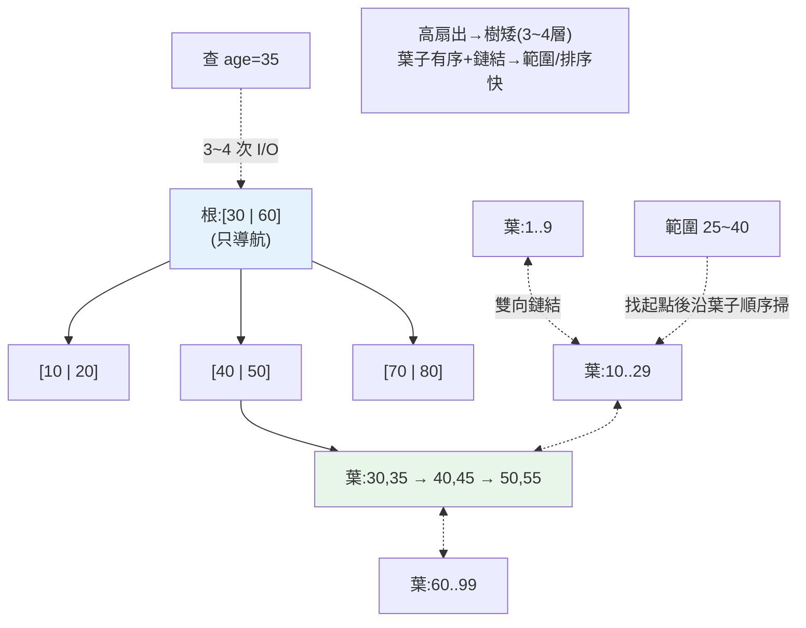

# 索引內部原理

> 「查詢慢就加索引」大家都聽過,但**索引為什麼快?它到底是什麼結構?** 本書的 [ch21 索引與查詢優化基礎](21-indexing.md) 從「使用者視角」教你何時建、怎麼用 `EXPLAIN`;這一章從**引擎視角**拆開索引的內部:主流索引是一棵 **B+tree**,理解它的結構才懂「為什麼是 O(log n)」「為什麼複合索引的欄位順序決定成敗」「什麼是覆蓋索引(covering index)」「為什麼 `LIKE '%x'` 用不到索引」。學完你不再是「憑感覺加索引」,而是能推理「這個查詢會不會用到這個索引、為什麼」。

> 📌 與 [ch21](21-indexing.md) 分工:ch21 = 實用(何時建、EXPLAIN 入門、避免踩雷);**本章 = 引擎原理**(B+tree 結構、複合索引順序的數學、覆蓋/聚簇、雜湊索引)。兩章互補。

## 💡 白話導讀(建議先讀)

沒有索引,查資料=從第一頁翻到最後一頁。索引讓它變成「查字典」——但為什麼字典能快?

因為**內容是排好序的**。這一句就是整章的鑰匙。

資料庫的索引是一棵 **B+tree**,特徵是「**淺而寬**」:每個節點塞幾百個鍵(正好一頁),所以百萬筆資料只要 3~4 層——**查一筆=3~4 次磁碟讀取**,不是一百萬次。
而且葉子層**排好序、還互相牽手**(鏈結)——範圍查詢(BETWEEN)、排序(ORDER BY)沿著走就好。

「排好序」這個本質,直接解釋三個高頻困惑:

1. **為什麼 `LIKE 'john%'` 用得到索引、`LIKE '%son'` 用不到?**
   ——字典能查「j 開頭的」,查不了「son 結尾的」(不知從哪翻起)。
2. **為什麼對欄位套函式(`WHERE UPPER(name)=...`)索引就失效?**
   ——字典按原文排序,你要查「大寫後的樣子」,順序全對不上,只能整本翻。
3. **複合索引 INDEX(a,b,c) 為什麼 `WHERE b=?` 用不到?**
   ——電話簿按「姓→名」排:查「姓王的」快,查「所有叫小明的」沒轍。這叫**最左前綴**,複合索引的靈魂。

再加一個賺錢技巧:**覆蓋索引**——查詢要的欄位全在索引裡,連翻回原書(回表)都省了。

## Why(為什麼)

沒有索引,資料庫只能**全表掃描(full table scan)**——把每一頁都讀進來逐列比對([ch04](04-storage-engine.md))。100 萬列就掃 100 萬列。索引把這件事變成「幾次定點跳躍」。但如果你不懂它的結構:

- **會亂加索引**:不知道「索引也有成本」(佔空間、拖慢寫入、每次 INSERT/UPDATE 都要維護),於是每欄都加,結果寫入變慢、空間爆炸,查詢還不一定用到。
- **不懂為什麼「有索引卻沒用到」**:`WHERE UPPER(name) = 'ALICE'`、`WHERE age + 1 = 30`、`LIKE '%son'`——這些**用不到索引**,但如果你不懂 B+tree 是「依值排序」的結構,就不知道為什麼,只能瞎試。
- **不懂複合索引的順序**:`INDEX(a, b, c)` 能加速 `WHERE a=? AND b=?`,但**加速不了 `WHERE b=?`**(缺了最左的 a)。這個「最左前綴(leftmost prefix)」規則,不懂 B+tree 排序就無法理解——而它是複合索引設計的核心。
- **不懂覆蓋索引為何是「免回表」的神技**:當索引本身就包含查詢要的所有欄,DB 根本不用回去讀資料列(回表)——查詢快數倍。這個優化在高效能系統無處不在,但要懂索引結構才知道怎麼設計它。

**索引是資料庫效能最大的槓桿**,而 B+tree 是理解它的鑰匙。這章讓你從「加索引碰運氣」升級到「能預測索引行為」。

## Theory(理論:為什麼是 B+tree)

先問:為什麼不用**二元搜尋樹**或**雜湊表**當磁碟索引?

- **二元搜尋樹**:每個節點只有 2 個分支,樹會很**高**(深)。而磁碟索引**每往下一層 = 一次磁碟 I/O**([ch04](04-storage-engine.md))。100 萬筆的二元樹高約 20 層 = 20 次 I/O,太慢。
- **雜湊表**:等值查詢 O(1) 很快,但**不支援範圍查詢與排序**(雜湊打散了順序)。`WHERE age BETWEEN 20 AND 30`、`ORDER BY age` 都用不上。

**B+tree 的設計專為磁碟優化**——它是一棵**多路(high fan-out)平衡樹**:

```text
                 [ 30 | 60 ]              ← 根(root):一個節點含很多鍵
                /    |     \
        [10|20]  [40|50]  [70|80]         ← 內部節點(internal):只導航,不存資料
        /  |  \   ...
   葉子層(leaf,雙向鏈結,存實際資料/指標):
   [1..9]→[10..19]→[20..29]→[30..39]→ ... → [80..99]
   ↑ 所有資料都在葉子、且「依鍵排序」、葉子間有指標串起來
```

**B+tree 的關鍵性質**(每一個都對應一個查詢行為):

- **高扇出(high fan-out)**:一個節點(= 一頁)塞**幾百個鍵**,所以樹很**矮**(百萬筆通常只 3~4 層)→ **查一筆只要 3~4 次 I/O**,這就是 O(log n) 且 log 的底數很大。
- **平衡**:所有葉子在同一深度 → 每次查詢 I/O 次數一致、可預測。
- **資料都在葉子、依鍵排序**:內部節點只當「路標」。→ **範圍查詢快**(找到起點,沿葉子鏈結順序掃)。
- **葉子雙向鏈結**:`ORDER BY`、`BETWEEN`、`>` 都能沿鏈結順序讀,不用回樹頂。

## Specification(規範:索引種類與規則)

**索引類型**:

| 類型 | 結構 | 支援 | 用途 |
|------|------|------|------|
| **B+tree**(預設) | 多路平衡樹 | 等值、範圍、排序、前綴 | 通用,絕大多數索引 |
| **Hash** | 雜湊表 | **只等值**(不支援範圍/排序) | 純等值查詢(記憶體引擎/PostgreSQL hash) |
| **覆蓋索引(covering)** | B+tree,含查詢所需全部欄 | 免回表 | 高頻查詢的極致優化 |
| **部分索引(partial)** | 只索引符合條件的列 | 節省空間 | 如只索引 `status='active'` |
| **GIN/GiST/BRIN** | 特殊結構 | 全文、地理、範圍 | PostgreSQL 進階場景 |

**聚簇 vs 非聚簇索引**(承 [ch04](04-storage-engine.md)):

- **聚簇索引(clustered)**:葉子節點**就是資料列本身**(表依主鍵物理排序)。一張表只能有一個(MySQL InnoDB 主鍵)。範圍查詢極快(資料實體相鄰)。
- **非聚簇 / 次要索引(secondary)**:葉子存的是**指向資料列的指標**(或主鍵值)。查到後要**回表(去讀實際資料列)** 拿其他欄位——除非是覆蓋索引。

**複合索引的最左前綴規則(leftmost prefix)——複合索引的靈魂**:`INDEX(a, b, c)` 依 `(a, b, c)` 的**字典序**排列。所以它能加速:

```text
✓ WHERE a=?                    (用到 a)
✓ WHERE a=? AND b=?            (用到 a,b)
✓ WHERE a=? AND b=? AND c=?    (全用到)
✓ WHERE a=? AND b>?            (a 等值 + b 範圍)
✗ WHERE b=?                    (缺最左的 a,用不到!)
✗ WHERE b=? AND c=?            (缺 a,用不到)
△ WHERE a=? AND c=?            (只用到 a,c 用不到,因為中間 b 斷了)
```

## Implementation(底層:排序結構如何決定查詢行為)

**為什麼 `LIKE '%son'` 用不到索引,`LIKE 'john%'` 可以?** B+tree 依**鍵的值從左到右排序**。`'john%'`(前綴確定)能在樹裡定位到 `john` 開頭的範圍;但 `'%son'`(前綴不定)——你不知道從樹的哪裡開始找,**只能全掃**。這是「索引是有序結構」的直接後果。

**為什麼 `WHERE age + 1 = 30` 或 `WHERE UPPER(name)='ALICE'` 用不到索引?** 索引存的是 `age` 的值、`name` 的值(原值排序)。一旦你對欄位**做運算或套函式**,索引裡的「原值順序」就對不上了——DB 只能逐列算 `age+1` 再比,退化成全表掃描。**解法**:改寫成 `WHERE age = 29`(把運算移到常數側),或建**函式索引/表達式索引**(`CREATE INDEX ON t (UPPER(name))`)。

**最左前綴為什麼是這樣?** 因為 `INDEX(a,b,c)` 排序像電話簿按「姓→名→中間名」排。你能快速找「姓 Wang」(a),也能找「姓 Wang 名 Ming」(a,b);但要找「所有名叫 Ming 的人」(只給 b),電話簿幫不上忙——因為它先按姓排,同名的人散落各處。**索引順序 = 排序優先級**,這就是最左前綴的本質。

**覆蓋索引(covering index)為何免回表**:一般次要索引查到後要**回表**讀完整列(第二次 I/O)。但若索引 `INDEX(a, b)` 已包含查詢要的所有欄(`SELECT b WHERE a=?`),**索引本身就有 b 的值**——DB 直接從索引回傳,**不用回表**,省一半 I/O。這是把「常用查詢的所有欄位都放進索引」的高效技巧。下面用 Python 實作 B+tree 的查找/範圍掃描與最左前綴,把這些行為變成可觀察的。

## Code Example(可執行的 Python 範例)

```python
# index_internals.py — 模擬 B+tree 查找/範圍掃描 + 最左前綴規則(純標準庫)
from __future__ import annotations

import bisect
from dataclasses import dataclass, field


@dataclass
class SortedIndex:
    """用『依鍵排序的陣列』模擬 B+tree 葉子層:等值/範圍都靠二分搜尋。"""
    keys: list[tuple] = field(default_factory=list)  # 排序的鍵
    probes: int = 0                                  # 統計比較/定位次數

    def build(self, rows: list[tuple]) -> None:
        self.keys = sorted(rows)  # B+tree 維持鍵有序

    def point_lookup(self, key: tuple) -> bool:
        """等值查找:O(log n) 二分定位(模擬走樹高)。"""
        self.probes += 1
        i = bisect.bisect_left(self.keys, key)
        return i < len(self.keys) and self.keys[i] == key

    def range_scan(self, low: tuple, high: tuple) -> list[tuple]:
        """範圍查詢:二分找起點,再沿『葉子鏈結』順序讀。"""
        self.probes += 1
        i = bisect.bisect_left(self.keys, low)
        out = []
        while i < len(self.keys) and self.keys[i] <= high:
            out.append(self.keys[i])
            i += 1
        return out


def can_use_composite_index(index_cols: list[str],
                            equality_cols: set[str]) -> tuple[bool, list[str]]:
    """最左前綴:從索引第一欄起,連續被等值條件覆蓋的欄才用得到。"""
    used: list[str] = []
    for col in index_cols:
        if col in equality_cols:
            used.append(col)
        else:
            break  # 一旦斷掉,後面的欄都用不到
    return (len(used) > 0), used


def main() -> None:
    idx = SortedIndex()
    idx.build([(age,) for age in [30, 25, 40, 22, 35, 28, 50, 18]])

    print("等值查找 age=35:", idx.point_lookup((35,)))
    print("等值查找 age=99:", idx.point_lookup((99,)))
    print("範圍查找 25<=age<=40:", sorted(a[0] for a in idx.range_scan((25,), (40,))))
    print(f"(共 {idx.probes} 次索引定位,對比全表掃描 8 列)")

    print("\n複合索引 INDEX(a, b, c) 的最左前綴:")
    tests = [
        ({"a", "b"}, "WHERE a=? AND b=?"),
        ({"b"}, "WHERE b=?"),
        ({"a", "c"}, "WHERE a=? AND c=?"),
        ({"a", "b", "c"}, "WHERE a=? AND b=? AND c=?"),
    ]
    for eq, desc in tests:
        usable, used = can_use_composite_index(["a", "b", "c"], eq)
        verdict = f"用到 {used}" if usable else "用不到索引"
        print(f"  {desc:32} -> {verdict}")


if __name__ == "__main__":
    main()
```

**預期輸出**:

```pycon
$ python index_internals.py
等值查找 age=35: True
等值查找 age=99: False
範圍查找 25<=age<=40: [25, 28, 30, 35, 40]
(共 3 次索引定位,對比全表掃描 8 列)
複合索引 INDEX(a, b, c) 的最左前綴:
  WHERE a=? AND b=?                 -> 用到 ['a', 'b']
  WHERE b=?                         -> 用不到索引
  WHERE a=? AND c=?                 -> 用到 ['a']
  WHERE a=? AND b=? AND c=?         -> 用到 ['a', 'b', 'c']
```

逐段解說:

- **`SortedIndex` 用「排序陣列 + 二分搜尋」模擬 B+tree 葉子層**:B+tree 的本質就是「維持鍵有序,靠有序性做二分定位」。`point_lookup` 用 `bisect`(O(log n))定位,對應 B+tree 從根往葉子走幾層——**不用掃全部 8 列**。
- **`range_scan` 展示範圍查詢為何快**:二分找到起點後,**沿有序序列往後讀**直到超出上界——對應 B+tree 葉子的雙向鏈結順序掃描。這就是為什麼 B+tree(而非雜湊)能支援 `BETWEEN`/`ORDER BY`:**它保持了順序**。
- **等值查找 age=99 回 False**:二分定位到插入點,發現不等 → 不存在。索引也能快速回答「不存在」。
- **`can_use_composite_index` 實作最左前綴規則**:從索引第一欄開始,**連續**被等值條件覆蓋的欄才算數,一旦斷掉就停。所以 `WHERE b=?` **用不到** `INDEX(a,b,c)`(缺最左的 a);`WHERE a=? AND c=?` **只用到 a**(中間 b 斷了,c 接不上)。這精確重現了真實 DB 的索引選用邏輯——**複合索引欄位順序至關重要**。
- **設計啟示**:把**選擇性高、最常用等值**的欄放索引最左;範圍條件的欄放最後(範圍會「終止」後續欄的使用)。
- **要點**:B+tree 是高扇出、平衡、鍵有序、葉子鏈結的磁碟優化樹 → 等值/範圍/排序都快且 I/O 少;索引是有序結構,故對欄位做運算/函式、`LIKE '%x'` 用不到;複合索引遵守最左前綴;覆蓋索引免回表。

## Diagram(圖解:B+tree 結構與查詢路徑)



## Best Practice(最佳實踐)

- **為高頻查詢的 `WHERE`/`JOIN`/`ORDER BY` 欄建索引**,但別每欄都建(索引有寫入與空間成本)。
- **複合索引把「等值、高選擇性」欄放左,範圍欄放右**:遵守最左前綴、讓更多條件用得上。
- **善用覆蓋索引**:把高頻查詢要的欄一起放進索引,免回表(可用 `INCLUDE` 欄)。
- **別對索引欄做運算/套函式**:改寫成 `col = 常數運算` 或建函式索引;`LIKE` 前綴查詢才走索引。
- **選擇性低的欄(如性別)單獨建索引意義不大**:過濾不掉多少列,優化器可能不用。
- **等值且不需範圍/排序 → 可考慮 hash 索引**(特定引擎);通用仍 B+tree。
- **監控未使用的索引並移除**:它們只增加寫入負擔。
- **理解聚簇索引**:主鍵選遞增值(避免頁分裂),範圍查詢受惠於實體排序。

## Common Mistakes(常見誤解)

- **以為加了索引就一定會用到**:對欄運算/函式、`LIKE '%x'`、選擇性太低都可能不用。
- **複合索引欄位順序亂放**:`WHERE b=?` 用不到 `INDEX(a,b,c)`;順序 = 最左前綴。
- **每個欄都建索引**:寫入變慢、空間爆炸、優化器挑花眼;只建有用的。
- **不知道回表成本**:次要索引查到還要回表讀列;高頻查詢用覆蓋索引省一半 I/O。
- **對索引欄 `WHERE func(col)=...`**:破壞有序性,退化全表掃描;移運算到常數側或建函式索引。
- **以為索引只加速 `WHERE`**:`ORDER BY`、`JOIN`、`GROUP BY`、`MIN/MAX` 都可能受惠。
- **用雜湊索引期待範圍查詢**:雜湊不保序,只支援等值。
- **忽略索引維護成本**:每次寫入都要更新索引;寫多讀少要衡量。

## Interview Notes(面試重點)

- **(必考)能講為什麼是 B+tree**:高扇出→樹矮→I/O 少(O(log n) 大底數)、平衡、葉子有序+鏈結→支援範圍/排序;對比二元樹(太高)、雜湊(不支援範圍)。
- **能講最左前綴規則**:`INDEX(a,b,c)` 依字典序排,`WHERE b=?` 用不到;範圍欄會終止後續欄使用。
- **能講覆蓋索引免回表**:索引含查詢所需全部欄,不用回表讀列,省 I/O。
- **能講聚簇 vs 非聚簇**:聚簇葉子=資料列(範圍快)、次要索引葉子=指標(要回表)。
- **能講為什麼「有索引卻沒用到」**:對欄運算/函式、`LIKE '%x'`、低選擇性——都源於「索引是有序結構」。
- **能講索引的成本**:佔空間、拖慢寫入、需維護;不是越多越好。
- **能連到 ch21/ch06**:實用建索引與 `EXPLAIN`([ch21](21-indexing.md))、優化器如何決定用不用索引([ch06](06-query-processing.md))。

---

➡️ 下一章:[查詢處理與優化器](06-query-processing.md)

[⬆️ 回 Part 15 索引](README.md)
