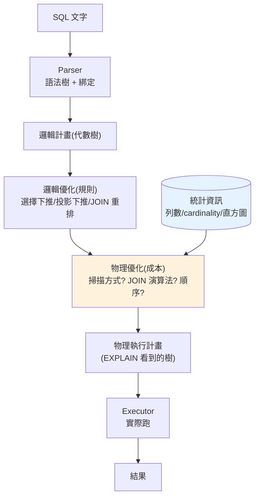

# 查詢處理與優化器

> 你寫一句 SQL,資料庫**怎麼把它變成實際的磁碟操作**?中間有一個常被當成黑箱、卻決定查詢快慢的關鍵角色——**查詢優化器(query optimizer)**。它把你的宣告式 SQL 轉成 [關聯代數樹](01-relational-model.md),用**成本模型**評估各種執行方式(用哪個索引?哪種 JOIN 演算法?誰先 JOIN?),挑一條**估計最便宜**的執行計畫。這章拆開這條管線(parser→optimizer→executor)、講三種 JOIN 演算法、講**為什麼有時「全表掃描比用索引快」**、以及怎麼讀 `EXPLAIN` 執行計畫。懂優化器,你才能真正診斷「這查詢為什麼慢」。

## Why(為什麼)

同一句 SQL,可以有**成千上萬種**執行方式,快慢差好幾個數量級。決定用哪種的就是優化器:

- **它讓「宣告式」有意義**:你只說「要什麼」不說「怎麼做」([ch01](01-relational-model.md)),正是因為有優化器**自動決定「怎麼做」**——用不用索引、三張表誰先 JOIN、用哪種 JOIN 演算法。不懂它,你就無法解釋「為什麼加了索引卻沒變快」「為什麼調整 JOIN 順序差這麼多」。
- **「慢查詢」的診斷全靠讀執行計畫**:當一個查詢慢,你不能靠猜。`EXPLAIN` 讓優化器把它的**執行計畫**攤開給你看——用了哪個索引、掃了幾列、哪種 JOIN、估計成本。看懂它,才能對症下藥(加索引?改寫查詢?更新統計?)。這是後端/資料工程師的核心技能。
- **理解「為什麼優化器有時選錯」**:優化器靠**統計資訊估算成本**,估算可能失準(統計過期、資料分布詭異、相關欄位)。知道它的運作原理,你才知道何時該 `ANALYZE` 更新統計、何時該給 hint、何時該改寫查詢幫它。
- **JOIN 是最貴也最容易出事的操作**:三種 JOIN 演算法(nested loop / hash / merge)各有適用場景,選錯就是災難。理解它們,你才懂「小表 JOIN 大表要怎麼寫」「為什麼缺索引的 JOIN 會 O(N×M) 爆炸」。

**優化器是資料庫最精巧的部分**,也是「會用 SQL」和「懂資料庫」最大的分野。這章把黑箱打開。

## Theory(理論:查詢處理管線)

一句 SQL 從文字到結果,走過這條**管線**:

```text
SQL 文字
   │  1. Parser(解析)
   ▼     檢查語法、轉成語法樹;檢查表/欄是否存在(綁定)
語法樹 / 邏輯計畫(= 關聯代數樹,見 ch01)
   │  2. Optimizer(優化器)★ 本章核心
   ▼     (a) 邏輯優化:等價重寫(選擇下推、join 重排、子查詢展開)
   │      (b) 物理優化:為每個運算選具體演算法 + 估成本 + 挑最便宜
物理執行計畫(physical plan)
   │  3. Executor(執行器)
   ▼     依計畫實際存取頁、跑 JOIN 演算法、回傳結果
結果集
```

**優化器的兩層工作**:

- **邏輯優化(rule-based)**:用關聯代數的**等價律**重寫查詢樹,不改結果只改形狀。經典:**選擇下推**(把 `WHERE` 過濾儘早做,縮小後續資料)、**投影下推**(儘早只留需要的欄)、**JOIN 重排**、**子查詢展平**。
- **物理優化(cost-based)**:同一個邏輯運算有多種**物理實作**(掃描:全表 vs 索引;JOIN:nested loop vs hash vs merge)。優化器用**成本模型**(基於統計資訊估 I/O + CPU)算每種的估計成本,挑最便宜的組合。

**成本從哪來**:優化器維護**統計資訊(statistics)**——每張表的列數、每欄的相異值數(cardinality)、值分布(histogram)、NULL 比例。它用這些估算「這個 `WHERE` 會過濾剩多少列」(selectivity,選擇性),進而估 I/O 與 CPU 成本。**統計準,估算才準**——這是 `ANALYZE`/`ANALYZE TABLE` 的意義。

## Specification(規範:三種 JOIN 演算法)

JOIN 是最貴的運算,三種主流演算法各有適用場景:

| 演算法 | 做法 | 成本 | 適用 |
|--------|------|------|------|
| **Nested Loop Join** | 對外表每列,掃內表找配對 | O(N×M);內表有索引則 O(N×log M) | **小表**驅動 + 內表有索引 |
| **Hash Join** | 對小表建雜湊表,大表逐列探測 | O(N+M) | **大表等值 JOIN**、無合適索引 |
| **Merge Join** | 兩表各自排序後像拉鍊般合併 | O(N log N + M log M);已排序則 O(N+M) | 兩表**已依 JOIN 鍵排序**(如都有索引) |

**選擇邏輯**:

- 一小一大 + 內表(大表)有索引 → **nested loop**(小表每列去索引點查大表)。
- 兩張大表、等值 JOIN、沒合適索引 → **hash join**(建一次雜湊,線性掃)。
- 兩表已排序(如各有 B+tree 索引且沿鍵掃)→ **merge join**(免排序,線性合併)。

**為什麼優化器可能選「全表掃描」而非索引**——選擇性(selectivity)決定:

```text
WHERE status = 'active'   若 90% 的列都是 active
→ 用索引:要對 90% 的列逐一「索引定位 + 回表」= 90 萬次隨機 I/O
→ 全表掃描:順序讀完 100 萬列 = 順序 I/O,反而快!
```

**經驗法則**:當查詢**要讀的列佔比高**(低選擇性),**順序全表掃描**常勝過「大量隨機索引回表」。索引適合**撈出一小撮**(高選擇性)的場景。這就是為什麼「加了索引優化器卻不用」——它算過,全掃更快。

## Implementation(底層:成本估算與 EXPLAIN)

**選擇下推為什麼有效**(承 [ch01](01-relational-model.md) 的代數重寫):

```text
原始:  σ_{age>60}( User ⋈ Order )        先 JOIN 一百萬列再過濾剩幾千
重寫:  σ_{age>60}(User) ⋈ Order          先過濾剩幾千再 JOIN
```

兩者結果相同(等價律保證),但重寫後 **JOIN 的輸入小了幾百倍**,總成本大降。優化器自動做這件事——這是「宣告式」的紅利:你不用手動優化查詢結構,它幫你重排。

**成本估算的核心:選擇性(selectivity)**。優化器要估「`WHERE age > 60` 會剩下多少列」。它查 `age` 欄的**統計/直方圖**:若 age 均勻分布在 0~100,`age>60` 的選擇性約 40% → 估 40 萬列。這個估計層層傳遞,決定 JOIN 順序與演算法選擇。**估錯的後果**:統計過期(如剛灌入大量新資料沒 `ANALYZE`)→ 選擇性估錯 → 選了爛計畫(如對其實很大的中間結果用 nested loop)→ 查詢慢十倍。**解法**:`ANALYZE` 更新統計。

**讀 `EXPLAIN`——診斷慢查詢的核心技能**。`EXPLAIN`(或 `EXPLAIN ANALYZE` 實際執行)輸出執行計畫樹,你要看:

- **掃描方式**:`Seq Scan`(全表掃描)vs `Index Scan`/`Index Only Scan`(用索引/覆蓋索引)——大表出現 `Seq Scan` + 高過濾常是警訊。
- **JOIN 演算法**:`Nested Loop` / `Hash Join` / `Merge Join`——大表 nested loop 無索引是災難。
- **估計 vs 實際列數**:`EXPLAIN ANALYZE` 裡估計列數與實際差很多 → 統計過期,該 `ANALYZE`。
- **成本數字**:相對比較哪一步最貴。

下面用 Python 模擬優化器:比較三種 JOIN 演算法的成本,並示範選擇性如何決定「用索引 vs 全表掃描」。

## Code Example(可執行的 Python 範例)

```python
# query_optimizer.py — 模擬 JOIN 演算法成本 + 索引 vs 全表掃描的成本決策(純標準庫)
from __future__ import annotations

import math
from dataclasses import dataclass


def nested_loop_cost(outer_rows: int, inner_rows: int,
                     inner_indexed: bool) -> int:
    """巢狀迴圈:外表每列探測內表。內表有索引則 log,否則整掃。"""
    per_probe = math.ceil(math.log2(inner_rows)) if inner_indexed else inner_rows
    return outer_rows * per_probe


def hash_join_cost(rows_a: int, rows_b: int) -> int:
    """雜湊 JOIN:建小表雜湊 + 掃大表探測 ≈ 線性 O(N+M)。"""
    return rows_a + rows_b


def merge_join_cost(rows_a: int, rows_b: int, presorted: bool) -> int:
    """合併 JOIN:需排序則 N log N,已排序則線性。"""
    if presorted:
        return rows_a + rows_b
    return rows_a * math.ceil(math.log2(rows_a)) + rows_b * math.ceil(math.log2(rows_b))


@dataclass
class ScanDecision:
    table_rows: int
    selectivity: float   # WHERE 過濾後剩下的比例(0~1)
    random_io_penalty: int = 4  # 隨機 I/O 相對順序的懲罰倍數

    def index_scan_cost(self) -> int:
        """索引:對『命中的列』各做一次隨機回表 I/O。"""
        matched = self.table_rows * self.selectivity
        return math.ceil(matched * self.random_io_penalty)

    def seq_scan_cost(self) -> int:
        """全表掃描:順序讀整張表(不管選擇性)。"""
        return self.table_rows

    def choose(self) -> str:
        idx, seq = self.index_scan_cost(), self.seq_scan_cost()
        return "Index Scan" if idx < seq else "Seq Scan"


def main() -> None:
    print("JOIN 演算法成本(外/A=1000, 內/B=100000):")
    print(f"  Nested Loop(內表無索引): {nested_loop_cost(1000, 100000, False):>12,}")
    print(f"  Nested Loop(內表有索引): {nested_loop_cost(1000, 100000, True):>12,}")
    print(f"  Hash Join:               {hash_join_cost(1000, 100000):>12,}")
    print(f"  Merge Join(未排序):      {merge_join_cost(1000, 100000, False):>12,}")

    print("\n索引 vs 全表掃描(表 1,000,000 列):")
    for sel, label in [(0.001, "高選擇性 0.1%"), (0.05, "中 5%"), (0.5, "低 50%")]:
        d = ScanDecision(table_rows=1_000_000, selectivity=sel)
        print(f"  {label:14} idx成本={d.index_scan_cost():>10,} "
              f"seq成本={d.seq_scan_cost():>10,} -> 優化器選 [{d.choose()}]")


if __name__ == "__main__":
    main()
```

**預期輸出**:

```pycon
$ python query_optimizer.py
JOIN 演算法成本(外/A=1000, 內/B=100000):
  Nested Loop(內表無索引):  100,000,000
  Nested Loop(內表有索引):       17,000
  Hash Join:                    101,000
  Merge Join(未排序):         1,710,000

索引 vs 全表掃描(表 1,000,000 列):
  高選擇性 0.1%      idx成本=     4,000 seq成本= 1,000,000 -> 優化器選 [Index Scan]
  中 5%           idx成本=   200,000 seq成本= 1,000,000 -> 優化器選 [Index Scan]
  低 50%          idx成本= 2,000,000 seq成本= 1,000,000 -> 優化器選 [Seq Scan]
```

逐段解說:

- **三種 JOIN 成本天差地別**:同樣 JOIN A(1000)× B(100000)——**無索引 nested loop 要 1 億次**(O(N×M),災難);**有索引 nested loop 只要 1.7 萬次**(小表每列去大表索引點查);**hash join 約 10 萬次**(線性,建雜湊掃一遍)。這說明**為什麼「小表驅動 + 內表有索引」或 hash join 是大 JOIN 的正解**,而缺索引的 nested loop 是效能殺手。
- **未排序的 merge join 貴**(要先排序兩表);但若兩表已依 JOIN 鍵排序(各有索引),merge 會退化成線性,反而優——這就是優化器要「看情況選」的原因。
- **選擇性決定 index vs seq scan**(下半段):
  - **高選擇性(0.1%,只撈 1000 列)**:索引成本 4000 << 全表 100 萬 → 用 **Index Scan**。
  - **低選擇性(50%,要撈 50 萬列)**:索引成本 200 萬(每列隨機回表)> 全表順序 100 萬 → 優化器選 **Seq Scan**!
  - 這**精確重現「加了索引優化器卻不用」**——不是它笨,是它算過:撈一大半資料時,順序全掃比大量隨機回表便宜。
- **`random_io_penalty`** 體現 [ch04](04-storage-engine.md) 的「隨機 I/O 比順序貴」——索引回表是隨機 I/O,所以命中列一多就輸給順序掃描。
- **要點**:優化器 = parser→(邏輯重寫 + cost-based 物理選擇)→executor;JOIN 有三演算法各適其場;選擇性(靠統計估)決定用索引或全表掃描;讀 `EXPLAIN` 看掃描方式/JOIN/估計列數來診斷慢查詢。

## Diagram(圖解:查詢處理管線)



## Best Practice(最佳實踐)

- **用 `EXPLAIN [ANALYZE]` 診斷慢查詢**:看掃描方式、JOIN 演算法、估計 vs 實際列數。
- **保持統計新鮮**:大量寫入後 `ANALYZE`,讓優化器估準選擇性、選對計畫。
- **大 JOIN 確保 JOIN 鍵有索引**:避免無索引 nested loop 的 O(N×M) 爆炸。
- **理解索引不是萬能**:低選擇性查詢優化器會(且應該)選全表掃描,別硬逼它用索引。
- **讓優化器做重寫,寫清楚的 SQL**:選擇下推等它會做;但過度巢狀/相關子查詢可能難優化,必要時改寫成 JOIN。
- **估計與實際列數差很多 = 統計問題**:`ANALYZE`,或對相關欄位建擴充統計。
- **小表驅動大表**(nested loop 時):外表小、內表有索引最省。
- **謹慎用 optimizer hint**:先靠統計與索引;hint 是最後手段,會綁死計畫。

## Common Mistakes(常見誤解)

- **以為加索引優化器就一定用**:低選擇性時全表掃描更快,它會不用——這是對的。
- **不會讀 `EXPLAIN` 就瞎調**:診斷慢查詢的第一步永遠是看執行計畫。
- **統計過期還怪優化器選錯**:估算依賴統計;大量寫入後要 `ANALYZE`。
- **大表無索引 JOIN**:退化成 O(N×M) nested loop,慢到爆;JOIN 鍵要有索引。
- **以為優化器全知全能**:它靠估計,相關欄位/偏斜分布會估錯;需要人幫忙(改寫/統計/hint)。
- **把選擇性低的欄硬建索引還期待用到**:過濾不掉多少列,徒增寫入成本。
- **忽略 JOIN 演算法差異**:大 JOIN 用錯演算法差好幾個數量級。
- **相信「查詢寫法順序 = 執行順序」**:優化器會重排 JOIN、下推過濾;邏輯順序見 [ch02](02-sql-language.md)。

## Interview Notes(面試重點)

- **能講查詢處理管線**:parser→optimizer(邏輯重寫 + cost-based 物理選擇)→executor。
- **能講優化器兩層**:規則式邏輯優化(選擇/投影下推、JOIN 重排)+ 成本式物理優化(靠統計估選擇性挑計畫)。
- **(高頻)能講三種 JOIN 演算法**:nested loop(小表+內表索引)、hash(大表等值無索引)、merge(已排序);各自成本與適用。
- **(必考)能講為什麼優化器選全表掃描而非索引**:低選擇性時大量隨機回表比順序全掃貴——索引適合撈一小撮。
- **能講選擇性與統計**:優化器靠統計估選擇性;統計過期會選爛計畫,要 `ANALYZE`。
- **能講怎麼讀 `EXPLAIN`**:掃描方式、JOIN 演算法、估計 vs 實際列數、成本。
- **能連到前後章**:代數重寫([ch01](01-relational-model.md))、索引結構([ch05](05-index-internals.md))、I/O 成本([ch04](04-storage-engine.md))。

---

➡️ 下一章:[交易與並發控制](07-transactions-concurrency.md)

[⬆️ 回 Part 15 索引](README.md)
