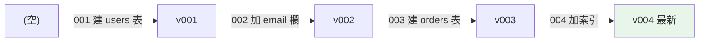
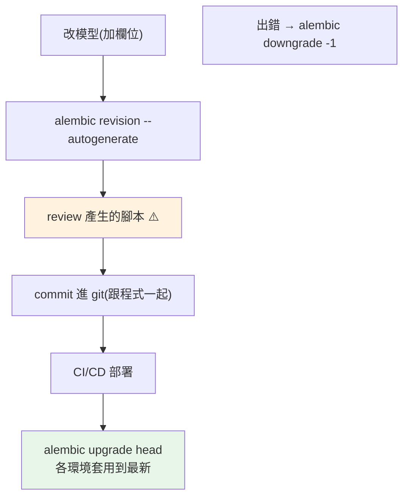

# migration 與 Alembic

> 程式碼有 git 版本控制，資料庫的 schema 呢？migration 就是「schema 的版本控制」——每次改表結構都留下可追蹤、可重播、可回滾的紀錄。Alembic 是 SQLAlchemy 生態的標準工具。

## Why（為什麼）

程式改了，你 `git commit`；但資料庫的 **schema**（表結構、欄位、索引）改了怎麼辦？手動在每個環境（本地、測試、正式）敲 `ALTER TABLE`？——不同環境 schema 會不一致、忘了在正式跑、無法回滾、團隊成員資料庫結構各異。**migration（資料庫遷移）** 是解法：**把每次 schema 變更寫成一個有版本、可執行、可回滾的腳本**，像 git commit 一樣串成歷史。任何環境只要「跑到最新版本」就得到一致的 schema。**Alembic** 是 SQLAlchemy 官方的 migration 工具（Django 有內建 migrations，概念相同）。這是團隊協作與正式部署的必備——沒有 migration 的資料庫管理是災難。

## Theory（理論：schema 版本控制）

migration 的核心思想：**把 schema 的演變表示成一串有序的變更（version chain）**。

- 每個 migration 是一個腳本，有唯一版本 id，記錄「從上一版到這一版要做什麼」。
- 每個腳本有 **`upgrade()`（往前：套用變更）** 和 **`downgrade()`（往後：撤銷變更）**。
- 資料庫裡有一張表（Alembic 用 `alembic_version`）記錄「目前在哪個版本」。
- 部署時執行「升級到最新」——Alembic 比對目前版本與最新，依序跑中間所有 `upgrade()`。

這就像 git：migration 歷史是一條（或有分支的）鏈，每個環境的資料庫「checkout 到某個版本」。好處：**任何環境可重現一致 schema、變更可追蹤（誰在何時加了什麼欄位）、可回滾、可 code review**。



## Specification（規範：Alembic 常用指令與腳本）

```bash
# 初始化（產生 alembic/ 目錄與設定）
alembic init alembic

# 自動產生 migration（比對模型與 DB 差異）
alembic revision --autogenerate -m "新增 users 表"

# 手動產生空白 migration（自己寫）
alembic revision -m "手動調整"

# 升級到最新
alembic upgrade head

# 升級/降級到特定版本或相對
alembic upgrade +1          # 前進一版
alembic downgrade -1        # 回退一版
alembic downgrade base      # 全部回退

# 查看目前版本與歷史
alembic current
alembic history
```

migration 腳本結構：

```python
"""新增 users 表

Revision ID: a1b2c3
Revises: (上一版 id)
"""
import sqlalchemy as sa
from alembic import op

revision = "a1b2c3"
down_revision = None        # 上一個 migration 的 id（串成鏈）

def upgrade() -> None:
    op.create_table(
        "users",
        sa.Column("id", sa.Integer, primary_key=True),
        sa.Column("name", sa.String(50), nullable=False),
        sa.Column("email", sa.String(120)),
    )

def downgrade() -> None:
    op.drop_table("users")   # 撤銷 upgrade 的操作
```

## Implementation（autogenerate、資料遷移、回滾、正式部署）

### autogenerate：自動偵測差異

Alembic 能**比對你的 SQLAlchemy 模型（見 [ORM](04-sqlalchemy-orm.md)）與資料庫現況**，自動產生 migration 腳本：

```bash
# 你在模型加了一個欄位 age，然後：
alembic revision --autogenerate -m "users 加 age 欄位"
```

Alembic 偵測到模型有 `age` 但 DB 沒有，生成 `op.add_column("users", sa.Column("age", sa.Integer))`。**極方便，但務必檢查產生的腳本**——autogenerate 不是萬能：

- 偵測得到：新增/刪除表、欄位、索引、約束。
- **偵測不到或不準**：欄位改名（會看成刪一個加一個，資料遺失！）、型別細節變更、`CHECK` 約束、資料遷移。

**永遠 review autogenerate 的結果**，尤其改名要手動改成 `op.alter_column`。

### 資料遷移（data migration）

migration 不只改結構，有時要**搬移/轉換既有資料**（如把 `full_name` 拆成 `first_name`/`last_name`）。這要手寫：

```python
def upgrade() -> None:
    # 1. 加新欄位
    op.add_column("users", sa.Column("first_name", sa.String(50)))
    # 2. 遷移資料（用 op.execute 或 connection）
    conn = op.get_bind()
    conn.execute(sa.text(
        "UPDATE users SET first_name = substr(full_name, 1, instr(full_name, ' ') - 1)"
    ))
    # 3. （之後的 migration 才 drop 舊欄位，分階段更安全）
```

**結構變更與資料變更分開、分階段**（加欄位→遷移資料→切換讀寫→刪舊欄位）能做到「零停機遷移」。

### 回滾（downgrade）

每個 migration 都要寫 `downgrade()`——出問題時能退回：

```python
def upgrade() -> None:
    op.add_column("users", sa.Column("age", sa.Integer))

def downgrade() -> None:
    op.drop_column("users", "age")   # 撤銷 upgrade
```

```bash
alembic downgrade -1     # 部署出錯，退回上一版
```

**注意**：有些操作的 downgrade 會遺失資料（drop 欄位就沒了）。生產環境回滾要謹慎，`downgrade` 主要用於開發期與緊急退版。

### 正式部署的實踐

- **migration 進版本控制**（跟程式一起 commit、一起 code review）：schema 變更可追蹤。
- **部署流程包含 `alembic upgrade head`**（CI/CD，見 [CI/CD](../19-cloud-native/05-ci-cd.md)）：部署時自動套用 migration。
- **向後相容的變更**（加欄位、加表）安全；**破壞性變更**（刪欄位、改型別）要分階段，配合程式的新舊版本並存期。
- **大表的 migration 小心鎖表**：`ALTER TABLE` 在大表上可能長時間鎖住（阻塞服務）——用線上 DDL 工具或分批。
- **絕不手動改正式 DB schema**：一律透過 migration，保持各環境一致與可追蹤。

## Code Example（可執行的 Python 範例）

```python
# migration_demo.py — 模擬 migration 版本鏈與升降級（可獨立測試）
from __future__ import annotations

from collections.abc import Callable
from dataclasses import dataclass, field


@dataclass
class Migration:
    """一個 migration：版本 id、上一版、升級/降級操作。"""

    revision: str
    down_revision: str | None
    upgrade: Callable[[set[str]], None]  # 對 schema（表集合）做變更
    downgrade: Callable[[set[str]], None]


@dataclass
class MigrationRunner:
    """模擬 Alembic：管理版本鏈與目前版本。"""

    migrations: list[Migration]
    schema: set[str] = field(default_factory=set)  # 目前的表集合
    current: str | None = None

    def upgrade_to_head(self) -> None:
        """依序套用所有還沒跑的 migration。"""
        applied = self._chain_up_to(self.current)
        for m in self.migrations:
            if m.revision not in applied:
                m.upgrade(self.schema)
                self.current = m.revision
                print(f"  upgrade → {m.revision}，schema = {sorted(self.schema)}")

    def downgrade_one(self) -> None:
        """回退一版。"""
        m = next(m for m in self.migrations if m.revision == self.current)
        m.downgrade(self.schema)
        self.current = m.down_revision
        print(f"  downgrade → {self.current}，schema = {sorted(self.schema)}")

    def _chain_up_to(self, rev: str | None) -> set[str]:
        result: set[str] = set()
        while rev is not None:
            result.add(rev)
            rev = next(m.down_revision for m in self.migrations if m.revision == rev)
        return result


def demo() -> None:
    migrations = [
        Migration("001", None, lambda s: s.add("users"), lambda s: s.discard("users")),
        Migration("002", "001", lambda s: s.add("orders"), lambda s: s.discard("orders")),
        Migration("003", "002", lambda s: s.add("payments"), lambda s: s.discard("payments")),
    ]
    runner = MigrationRunner(migrations)

    print("升級到最新（head）：")
    runner.upgrade_to_head()
    print(f"目前版本: {runner.current}")

    print("\n部署出錯，回退一版：")
    runner.downgrade_one()
    print(f"目前版本: {runner.current}")

    print("\n重點：migration 是 schema 版本控制—有序、可升降級、各環境一致")


if __name__ == "__main__":
    demo()
```

**預期輸出**：

```pycon
$ python migration_demo.py
升級到最新（head）：
  upgrade → 001，schema = ['users']
  upgrade → 002，schema = ['orders', 'users']
  upgrade → 003，schema = ['orders', 'payments', 'users']
目前版本: 003

部署出錯，回退一版：
  downgrade → 002，schema = ['orders', 'users']
目前版本: 002

重點：migration 是 schema 版本控制—有序、可升降級、各環境一致
```

## Diagram（圖解：migration 部署流程）



## Best Practice（最佳實踐）

- **所有 schema 變更都透過 migration**，絕不手動改正式 DB：保各環境一致、可追蹤。
- **migration 進版本控制、跟程式一起 code review**：schema 變更可見、可審。
- **用 `--autogenerate` 但務必 review 產生的腳本**：改名會被看成刪+加（資料遺失）、資料遷移要手寫。
- **每個 migration 寫 `downgrade()`**：能回滾。
- **部署流程含 `alembic upgrade head`**（CI/CD）：自動套用。
- **破壞性變更分階段**（加→遷移→切換→刪），配合新舊程式並存：零停機。
- **大表 migration 注意鎖表**：`ALTER` 可能長時間鎖住、阻塞服務。
- **一個 migration 一件事、訊息清楚**（`-m "..."`）：像好的 commit。

## Common Mistakes（常見誤解）

- **手動改正式 DB schema**：環境不一致、無紀錄、無法回滾——災難。
- **不 review autogenerate**：欄位改名被當刪+加、遺失資料；型別/約束變更漏掉。
- **不寫 `downgrade`**：出問題無法回退。
- **破壞性變更一次到位**：刪欄位/改型別直接上，舊版程式立刻壞；要分階段。
- **大表直接 `ALTER`**：鎖表阻塞服務。
- **migration 沒進 git**：團隊 schema 不同步。
- **在 migration 裡 import 應用模型**：模型會變，舊 migration 該用當時的 schema（用 `op`/`sa.text` 而非 import 模型）。

## Interview Notes（面試重點）

- **能說出 migration 是「schema 的版本控制」**：每次變更寫成有版本、可 upgrade/downgrade 的腳本，任何環境跑到最新得一致 schema。
- **知道 Alembic 的 `upgrade`/`downgrade`、版本鏈（down_revision）、`alembic_version` 表記錄目前版本**。
- **知道 `--autogenerate` 比對模型與 DB 差異，但要 review**（改名、資料遷移偵測不到/不準）。
- **知道破壞性變更要分階段（加→遷移→切換→刪）做零停機、大表 ALTER 會鎖表**。
- 知道 migration 進 git、部署含 `alembic upgrade head`、絕不手動改正式 schema；Django 有等價的內建 migrations。

---

➡️ 下一章：[Redis 與快取](08-redis.md)

[⬆️ 回 Part 15 索引](README.md)
