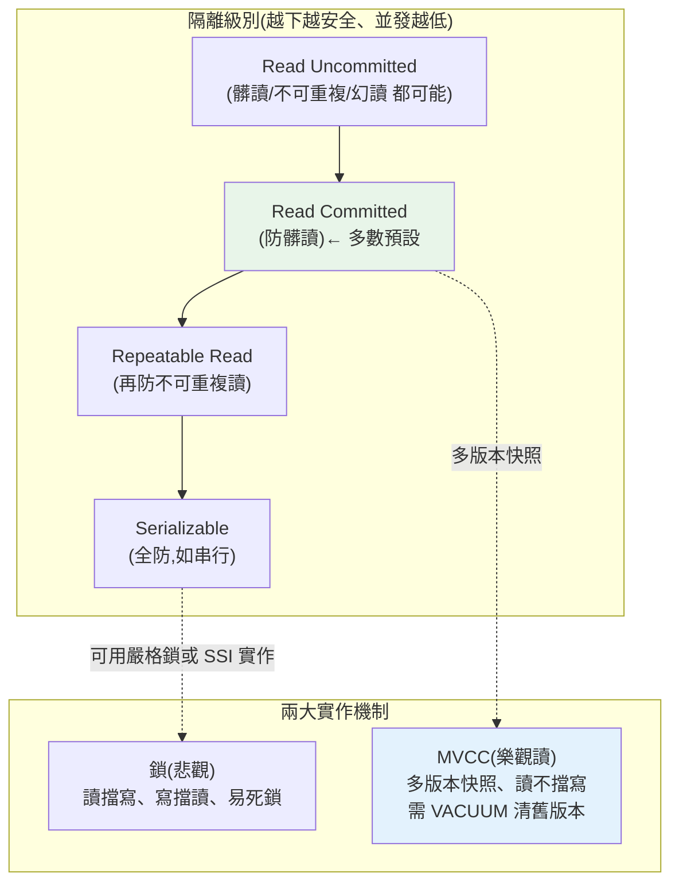

# 交易與並發控制

> [ch16 交易](16-transactions.md) 從實用角度教你 `BEGIN`/`COMMIT`/`ROLLBACK` 怎麼用。這一章從**引擎角度**深入:資料庫**同時**服務成千上萬個交易,它如何保證它們互不干擾、又不會慢到只能一個一個來?這牽涉 **ACID 的真正含義**、**隔離級別(isolation level)** 與它們各自允許的**並發異常**(髒讀、不可重複讀、幻讀)、以及兩大實作機制——**鎖(locking)** 與 **MVCC(多版本並發控制)**。這是資料庫最燒腦、也是面試最愛考的一塊。學完你能解釋「為什麼我讀到一半資料變了」「為什麼會死鎖」「PostgreSQL 為什麼讀不擋寫」。

## 💡 白話導讀(建議先讀)

資料庫同時服務上千筆交易,怎麼不互相踩踏?先看踩踏長什麼樣:

- 你在對帳,對到一半有人改了數字——前後對不上(**不可重複讀**)。
- 你讀到別人「還沒確認就反悔」的資料(**髒讀**)。
- 同條件查兩次,多出幾筆(**幻讀**)。

**隔離級別**就是「防到多嚴」的四段開關——越嚴越安全、併發越差。多數資料庫預設在中間(Read Committed)。

真正精彩的是實作,兩派哲學:

**鎖(悲觀派)**:我在動,你就等。安全但大家排隊,還會**死鎖**(兩人各持一鎖互等對方——資料庫的解法:抓出來犧牲一個)。

**MVCC(樂觀讀派)——主流**:想像圖書館只有一本熱門書。
鎖派:排隊輪流看。
MVCC 派:**給每個人影印一份「他來時的版本」**——你讀你的影本,別人改原本,**讀寫互不擋**。

這就是為什麼 PostgreSQL 裡跑一小時的報表**不會擋住**別人寫入——它讀的是自己開始那一刻的快照。
代價:舊影本要留著給人讀,累積了要清(PostgreSQL 的 VACUUM 幹的就是這活)。

面試必問的表格(哪個級別防哪種異常)、鎖 vs MVCC 的機制細節,章內展開。

## Why(為什麼)

如果資料庫一次只能跑一個交易,那簡單又安全——但**慢到不能用**。真實系統要**高並發**(同時很多交易),於是問題來了:

- **並發交易會互相踩踏,造成資料錯誤**:兩個人同時買最後一件商品、轉帳時餘額被另一筆交易改掉、報表讀到一半資料變了——這些是**並發異常**,會造成超賣、錢憑空消失、數字對不上。並發控制就是**在「高並發」與「正確性」之間取得平衡**的機制。
- **隔離級別是「正確性 vs 效能」的旋鈕**:完全隔離(像沒有並發)最安全但最慢;完全不隔離最快但會出錯。SQL 定義了**四個隔離級別**,讓你依場景選——但**每個級別允許哪些異常**,不搞清楚就會在該用高隔離的地方用了低的,埋下難以重現的資料 bug。
- **鎖與 MVCC 是兩種世界觀**:傳統鎖是「**你動我就等**」(悲觀);MVCC 是「**每個交易看自己的資料快照,讀不擋寫**」(樂觀讀)。PostgreSQL、MySQL InnoDB、Oracle 都用 MVCC——不懂它,你無法解釋「為什麼我的長查詢不會擋住別人寫入」「為什麼會有 vacuum/膨脹問題」。
- **死鎖(deadlock)是並發系統的必然**:兩個交易互相等對方放鎖,永遠僵住。理解它怎麼發生、DB 怎麼偵測與解、你怎麼預防(固定加鎖順序),是寫並發正確程式的基本功。

**並發控制是資料庫「多人同時用還不出錯」的魔法**,也是分散式系統一致性的單機基礎。這章把魔法拆開。

## Theory(理論:ACID 與隔離的意義)

**ACID 的引擎級含義**(不只是背四個字):

- **A 原子性(Atomicity)**:交易「要嘛全做、要嘛全不做」。靠 **undo log / WAL 回滾**實作([ch08](08-wal-recovery.md))——失敗時把已做的撤銷。
- **C 一致性(Consistency)**:交易把資料庫從一個**合法狀態**帶到另一個合法狀態(約束、外鍵、觸發器都滿足)。這是 A、I、D 加上約束共同保證的**結果**。
- **I 隔離性(Isolation)**:並發交易的效果,如同它們**依某種順序一個一個跑**(serializable 是理想)。這章的主角——由並發控制實作。
- **D 持久性(Durability)**:一旦 commit,即使斷電也不丟。靠 **WAL 先落盤**實作([ch08](08-wal-recovery.md))。

**隔離性的核心矛盾**:理想是**可序列化(serializable)**——並發執行的結果等同於某個串行順序。但完全序列化要大量加鎖、並發低。所以實務放寬成不同**隔離級別**,各自**容忍一些異常**換效能。

**三種經典並發讀異常**(隔離級別就是用「允許哪些」來定義):

```text
髒讀 Dirty Read:      讀到另一交易『還沒 commit』的修改(它可能 rollback!)
不可重複讀 Non-repeatable Read: 同一交易內讀『同一列』兩次,值不同(別人改了並 commit)
幻讀 Phantom Read:    同一交易內用『同一條件』查兩次,列數不同(別人插入/刪除了符合的列)
```

## Specification(規範:四個隔離級別)

SQL 標準定義四級,由「允許哪些異常」界定——級別越高越安全、並發越低:

| 隔離級別 | 髒讀 | 不可重複讀 | 幻讀 | 說明 |
|----------|------|-----------|------|------|
| **Read Uncommitted** | ✗ 可能 | ✗ 可能 | ✗ 可能 | 最弱,幾乎不用 |
| **Read Committed** | ✓ 防止 | ✗ 可能 | ✗ 可能 | **多數 DB 預設**(PostgreSQL/Oracle) |
| **Repeatable Read** | ✓ | ✓ 防止 | ✗ 可能*| MySQL InnoDB 預設 |
| **Serializable** | ✓ | ✓ | ✓ 防止 | 最強,完全隔離,並發最低 |

> \* 標準允許 RR 有幻讀,但實作各異:MySQL InnoDB 用 next-key lock 在 RR 就大致防了幻讀;PostgreSQL 的 RR(其實是 snapshot isolation)也防了多數幻讀但有 write skew 問題,要 Serializable 才完全解。

**兩大實作機制**:

- **鎖(locking / 悲觀)**:交易在讀/寫前**加鎖**(共享鎖 S、排他鎖 X),別人要動就等。**兩階段鎖(2PL, Two-Phase Locking)**:交易分「只加鎖」與「只放鎖」兩階段,保證可序列化。缺點:**讀會擋寫、寫會擋讀**,並發低、易死鎖。
- **MVCC(多版本並發控制 / 樂觀讀)**:每次寫**產生新版本**(不覆蓋舊版),每個交易看一個**一致的快照(snapshot)**。**讀不加鎖、讀不擋寫、寫不擋讀**——大幅提升並發。代價:要存多版本(**空間膨脹**)、要定期清理(PostgreSQL 的 **VACUUM**)。現代主流 DB(PostgreSQL/InnoDB/Oracle)都用 MVCC(讀走快照,寫仍用行鎖)。

## Implementation(底層:MVCC 快照與死鎖)

**MVCC 怎麼做到「讀不擋寫」**:每一列存**多個版本**,每個版本標記「由哪個交易建立(xmin)、被哪個交易刪除(xmax)」。交易開始時取一個**快照**(記錄「此刻哪些交易已 commit」)。讀取時,MVCC 只讓你看到**在你快照裡已 commit 的版本**:

```text
帳戶 balance 的版本鏈:
  v1: balance=100 (由 T1 建立,已 commit)
  v2: balance=50  (由 T5 建立,尚未 commit)

交易 T3(快照在 T5 之前)讀 balance → 看到 v1=100(看不到 T5 未 commit 的 v2)
→ 即使 T5 正在改這列,T3 讀取『不必等待』,直接讀舊版本快照
```

這就是為什麼在 PostgreSQL 裡**一個跑很久的報表查詢不會擋住別人更新資料**——它讀的是自己開始那刻的快照。代價:v2 舊版本要留著給 T3 看,直到沒有交易需要它;累積的舊版本靠 **VACUUM** 回收(否則**表膨脹**)。

**死鎖(deadlock)怎麼發生與解決**:

```text
T1: 鎖住 A ... 想鎖 B（等 T2 放 B）
T2: 鎖住 B ... 想鎖 A（等 T1 放 A）
→ 互相等待,永遠僵住 = 死鎖
```

DB 的處理:**死鎖偵測**——維護「等待圖(wait-for graph)」,若出現**環**就是死鎖,DB **選一個交易當犧牲者 rollback**(通常選代價小的),讓另一個繼續。**預防**:讓所有交易**以固定順序加鎖**(如永遠先鎖 id 小的),就不會形成環。下面用 Python 實作 MVCC 快照可見性與死鎖偵測。

## Code Example(可執行的 Python 範例)

```python
# concurrency.py — MVCC 快照可見性 + 等待圖死鎖偵測(純標準庫)
from __future__ import annotations

from dataclasses import dataclass, field


# ---------- MVCC:多版本 + 快照可見性 ----------
@dataclass
class Version:
    value: int
    xmin: int            # 建立此版本的交易 id
    committed: bool       # 該交易是否已 commit


@dataclass
class MVCCRow:
    versions: list[Version] = field(default_factory=list)

    def write(self, value: int, txid: int) -> None:
        self.versions.append(Version(value, txid, committed=False))

    def commit(self, txid: int) -> None:
        for v in self.versions:
            if v.xmin == txid:
                v.committed = True

    def read(self, snapshot_max_committed_tx: int) -> int | None:
        """回傳『快照可見』的最新版本:已 commit 且 xmin <= 快照界線。"""
        visible = [v for v in self.versions
                   if v.committed and v.xmin <= snapshot_max_committed_tx]
        return visible[-1].value if visible else None


# ---------- 死鎖偵測:等待圖找環 ----------
def has_deadlock(wait_for: dict[int, int]) -> list[int] | None:
    """wait_for[t] = t 正在等待的交易。找環 = 死鎖。回傳環上的交易或 None。"""
    for start in wait_for:
        seen: list[int] = []
        cur: int | None = start
        while cur is not None and cur in wait_for:
            if cur in seen:  # 回到走過的節點 → 有環
                return seen[seen.index(cur):]
            seen.append(cur)
            cur = wait_for.get(cur)
    return None


def main() -> None:
    # MVCC:T5 改了 balance 但沒 commit;舊快照的交易讀到舊值
    row = MVCCRow()
    row.write(100, txid=1); row.commit(1)          # v1=100 已 commit
    row.write(50, txid=5)                           # v2=50 由 T5 寫,未 commit

    print("MVCC 快照可見性:")
    print("  舊快照交易(界線=1)讀:", row.read(snapshot_max_committed_tx=1), "(看不到未commit的50)")
    row.commit(5)                                   # T5 commit
    print("  T5 commit 後新快照(界線=5)讀:", row.read(snapshot_max_committed_tx=5))

    # 死鎖:T1 等 T2、T2 等 T1
    print("\n死鎖偵測:")
    no_cycle = {1: 2, 2: 3}          # 1→2→3,無環
    cycle = {1: 2, 2: 1}             # 1→2→1,有環
    print("  {1→2, 2→3}:", has_deadlock(no_cycle) or "無死鎖")
    print("  {1→2, 2→1}:", "死鎖!環=" + str(has_deadlock(cycle)))


if __name__ == "__main__":
    main()
```

**預期輸出**:

```pycon
$ python concurrency.py
MVCC 快照可見性:
  舊快照交易(界線=1)讀: 100 (看不到未commit的50)
  T5 commit 後新快照(界線=5)讀: 50

死鎖偵測:
  {1→2, 2→3}: 無死鎖
  {1→2, 2→1}: 死鎖!環=[1, 2]
```

逐段解說:

- **MVCC 的核心:多版本 + 快照可見性**。`MVCCRow` 存多個 `Version`,每個標記 `xmin`(誰建的)與 `committed`。`read(snapshot)` 只回傳**已 commit 且在快照界線內**的最新版本。
- **「讀不擋寫」的體現**:T5 寫了 v2=50 但**還沒 commit**。此時舊快照的交易(界線=1)`read` 到的是 **v1=100**——它**直接讀舊版本,完全不必等 T5**。這就是 MVCC 為何讀不擋寫、長查詢不阻塞更新。等 T5 commit 後,新快照(界線=5)才看得到 50。
- **對比鎖機制**:若是純鎖,T5 的排他鎖會**擋住**讀取者直到它 commit/rollback——並發低。MVCC 用「讀舊版本快照」繞開等待。
- **死鎖偵測 = 等待圖找環**:`wait_for` 記錄「誰在等誰」。`{1→2, 2→3}` 是一條鏈、無環 → 無死鎖(T3 終會做完釋放)。`{1→2, 2→1}` 形成環(1 等 2、2 等 1)→ **死鎖**,DB 會挑一個 rollback 打破環。`has_deadlock` 就是在做 DB 內部的環偵測。
- **實務啟示**:預防死鎖用「固定加鎖順序」(永遠先鎖 id 小的),就不會形成環——這對映真實程式碼裡「多筆更新要按固定順序」的守則。
- **要點**:ACID 的 I 由並發控制實作;隔離級別用「允許哪些異常(髒讀/不可重複讀/幻讀)」界定;鎖(悲觀,讀擋寫)vs MVCC(樂觀讀,多版本快照,讀不擋寫但要清理舊版本);死鎖是等待成環,靠偵測 + rollback 解、靠固定加鎖順序防。

## Diagram(圖解:隔離級別與 MVCC/鎖)



## Best Practice(最佳實踐)

- **依場景選隔離級別**:多數用預設 Read Committed;需要「讀到一致快照」用 Repeatable Read;金融級不變式用 Serializable。
- **交易要短**:長交易持鎖久、MVCC 舊版本累積多(表膨脹)、更易死鎖;儘快 commit。
- **固定加鎖順序防死鎖**:多筆更新永遠按同一順序(如 id 由小到大)。
- **善用 MVCC 的「讀不擋寫」**:長報表查詢在 MVCC 下不阻塞寫入;但別開著交易不 commit。
- **PostgreSQL 注意 VACUUM/autovacuum**:清理舊版本、防表膨脹與 XID wraparound。
- **需要防丟失更新用 `SELECT ... FOR UPDATE`**(顯式行鎖)或樂觀鎖(版本欄)。
- **理解你的 DB 的實際語意**:MySQL RR 與 PostgreSQL RR 行為有別(幻讀/write skew);別假設「隔離級別名稱一樣行為就一樣」。
- **並發 bug 難重現,靠正確隔離級別預防**,而非事後 debug。

## Common Mistakes(常見誤解)

- **以為預設隔離級別就夠安全**:Read Committed 仍有不可重複讀與幻讀;需要一致讀要提高級別。
- **在應用層「讀了再寫」卻不防丟失更新**:兩交易同時讀 100、各加 10、都寫 110 → 少了一次;用 `FOR UPDATE` 或樂觀鎖。
- **開著長交易不 commit**:持鎖、擋 VACUUM、舊版本膨脹;交易要短。
- **多筆更新順序不一致 → 死鎖**:固定加鎖順序即可避免。
- **以為 MVCC 沒有鎖**:MVCC 讀不加鎖,但**寫仍用行鎖**;寫寫衝突照樣等/衝突。
- **把不同 DB 的隔離級別當相同**:名稱同、實作異(RR 的幻讀處理各異)。
- **忽略 write skew**:snapshot isolation 下兩交易各自讀一致快照卻違反跨列不變式;要 Serializable。
- **以為髒讀「只是讀到舊資料」**:是讀到**可能被 rollback**的資料,即根本不曾存在的值。

## Interview Notes(面試重點)

- **能講 ACID 的引擎含義**:A/D 靠 WAL/undo([ch08](08-wal-recovery.md))、I 靠並發控制、C 是結果。
- **(必考)能講三種讀異常 + 四個隔離級別的對應表**:髒讀/不可重複讀/幻讀,各級別防哪些。
- **(高頻)能對比鎖 vs MVCC**:悲觀(讀擋寫、2PL、易死鎖)vs 樂觀讀(多版本快照、讀不擋寫、需清舊版本)。
- **能講 MVCC 如何「讀不擋寫」**:每寫產生新版本、交易讀一致快照、只見已 commit 版本。
- **能講死鎖**:互相等待成環;偵測(等待圖找環)+ rollback 犧牲者;預防用固定加鎖順序。
- **能講丟失更新與解法**:`SELECT FOR UPDATE`(悲觀)或版本欄(樂觀)。
- **能連到分散式**:單機隔離/一致性是 [Part 22 分散式一致性](../22-distributed-systems/02-consistency-models.md) 的基礎;跨服務交易見 [Saga](../22-distributed-systems/07-saga.md)。

---

➡️ 下一章:[WAL 與故障恢復](08-wal-recovery.md)

[⬆️ 回 Part 15 索引](README.md)
