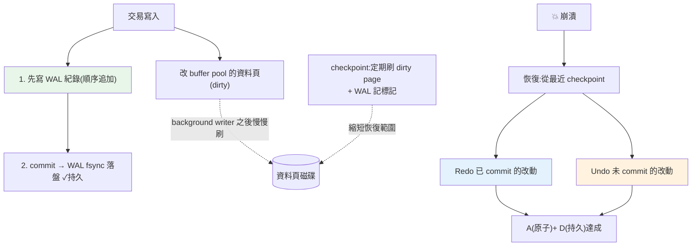

# WAL 與故障恢復

> [ch07](07-transactions-concurrency.md) 講了 ACID 的 **I(隔離)**,這章講 **A(原子性)** 和 **D(持久性)** 到底**怎麼實作**。核心是一個看似簡單卻無比重要的機制:**WAL(Write-Ahead Log,預寫式日誌)**——「**改資料之前,先把要做的改動寫進 log**」。這一條規則,同時解決了「commit 後斷電資料不能丟(持久性)」和「交易中途失敗要能還原(原子性)」兩個難題,還順便把慢的隨機寫變成快的順序寫。這章講清楚 WAL 為什麼是幾乎所有資料庫的核心、崩潰後怎麼用它 redo/undo 恢復、checkpoint 在做什麼。

## 💡 白話導讀(建議先讀)

一個要命的問題:交易 commit 的瞬間斷電——資料還在嗎?

天真做法:commit 時把所有改動寫回磁碟才回覆「成功」。安全,但慢死——改動散在磁碟各處,每次 commit 都是一堆隨機寫。

資料庫的答案聰明得多——**先記流水帳(WAL)**:

> 改帳本(資料頁)之前,先把「我要改什麼」**順序追加**到一本流水帳,並確保流水帳落盤。
> **commit 的定義=流水帳寫到磁碟了**——帳本本身可以之後慢慢整理!

為什麼這樣又快又安全?

- **快**:流水帳是**順序寫**(磁碟最擅長的動作),一次 fsync 搞定;帳本的隨機寫延後、批次處理。
- **安全**:斷電後帳本亂了沒關係——**流水帳還在**:
  - 已 commit 的 → 照流水帳**重做**(redo),一筆不丟(持久性)。
  - 沒 commit 的 → **撤銷**(undo),不留半筆(原子性)。

ACID 裡的 A 和 D,就是這本流水帳一次實現的。

剩下的配套:**checkpoint**(定期把帳本整理到某一頁,流水帳不用從創世紀重播)、**group commit**(多筆 commit 攢一次 fsync)。
順帶一提:主從複製就是「把流水帳寄給另一台照抄」——下一章的地基。

## Why(為什麼)

想像一個轉帳交易:「A 扣 100、B 加 100」。做到一半——A 扣了、B 還沒加——**斷電了**。重開機後,錢憑空消失。或者:你 commit 了一筆訂單,系統回「成功」,但資料還在記憶體的 buffer pool([ch04](04-storage-engine.md))沒刷到磁碟,**斷電後訂單不見了**。這些是資料庫最不能容忍的災難,WAL 就是為此而生:

- **持久性(D)的難題**:資料改動先發生在**記憶體的 buffer pool**(改磁碟太慢,不可能每次寫都直接落盤)。但記憶體斷電就沒了——那 commit 過的資料怎麼保證不丟?**不可能等所有 dirty page 都刷回磁碟才回 commit**(那樣每次 commit 都要大量隨機磁碟寫,慢到不能用)。
- **原子性(A)的難題**:交易做到一半失敗(錯誤、斷電、rollback),已經改的部分要**撤銷**,回到交易開始前。怎麼知道「改了什麼、怎麼撤」?
- **效能的難題**:資料頁散落磁碟各處,一個交易改好幾頁 = **好幾次隨機寫**(慢,[ch04](04-storage-engine.md))。有沒有辦法讓 commit 快?

**WAL 用「一份順序寫的 log」一次解決這三個問題**:改動先順序追加進 WAL(快),commit 只要確保 **WAL 落盤**(而非所有資料頁落盤),資料頁可以之後慢慢刷。崩潰後用 WAL **redo**(重做已 commit 但沒刷盤的)和 **undo**(撤銷未 commit 的)。WAL 是資料庫「又快又不丟資料」的祕密,也是理解 commit、恢復、複製([ch09](09-replication-sharding.md))的鑰匙。

## Theory(理論:WAL 的黃金規則)

**WAL 的核心規則(Write-Ahead Logging)**:

```text
在把「修改後的資料頁」寫回磁碟之前,
必須先把「描述這個修改的 log 紀錄」寫進 WAL 並落盤。
                    ↑ log 先行(write-ahead)
```

配合這條規則,commit 的定義變成:

```text
交易 commit = 它的所有 WAL 紀錄已『落盤』(fsync 到磁碟)
             ← 不需要等資料頁刷回磁碟!
資料頁(buffer pool 裡的 dirty page)可以之後再慢慢刷(background writer)
```

**為什麼這樣就安全**:

- **持久性**:commit 時 WAL 已落盤。即使資料頁還在記憶體、斷電丟了——重開機後 WAL 還在,可以**redo**(照 WAL 把已 commit 的改動重做一遍到資料頁)。commit 過的資料一定救得回來。
- **原子性**:未 commit 的交易若已改了某些頁,崩潰後用 WAL 的 undo 資訊(或 MVCC 的舊版本)**撤銷**它們。做到「全有或全無」。
- **效能**:WAL 是**順序追加**(append-only)——順序寫比隨機寫快好幾倍([ch04](04-storage-engine.md))。commit 只要一次順序 fsync,不用好幾次隨機資料頁寫。這是 WAL **既安全又快**的關鍵。

**WAL 紀錄長什麼樣**(概念):每條記錄「哪個交易、改了哪一頁的哪個位置、舊值→新值」——舊值供 undo、新值供 redo。

## Specification(規範:恢復流程與 checkpoint)

**崩潰恢復(crash recovery)的三階段**(經典的 ARIES 演算法思路):

```text
1. Analysis(分析):掃 WAL,找出崩潰時「哪些交易已 commit、哪些還在進行」。
2. Redo(重做):從某個點起,把 WAL 裡『所有』改動重做一遍
   → 讓資料頁回到「崩潰前一刻」的狀態(包含未 commit 的)。
3. Undo(撤銷):把「崩潰時還沒 commit」的交易的改動撤銷
   → 達成原子性,只留下已 commit 的效果。
```

**checkpoint(檢查點)——控制恢復要重做多少**:如果 WAL 從資料庫誕生累積至今,崩潰後要 redo 全部,太慢。**checkpoint** 定期把「目前所有 dirty page 刷回磁碟」並在 WAL 記一個標記:

```text
... WAL ...[checkpoint]... 更多 WAL ... [崩潰]
                    ↑ 恢復只需從最近的 checkpoint 開始 redo
                      (checkpoint 之前的改動已確定在資料頁裡)
```

checkpoint 讓恢復時間有上界(只重做最近 checkpoint 之後的 WAL),代價是 checkpoint 當下要刷一批 dirty page(I/O 尖峰,要調頻率平衡)。

**各 DB 的 WAL**:PostgreSQL 叫 **WAL**、MySQL InnoDB 叫 **redo log**(另有 undo log)、SQLite 有 **WAL 模式**。**WAL 也是複製的基礎**——把 WAL 串流給備援節點重放,就能做出一模一樣的複本([ch09](09-replication-sharding.md))。

## Implementation(底層:group commit 與 fsync)

**`fsync` 的代價與 group commit**:commit 要保證 WAL 真的**落到磁碟**(不是停在 OS 快取),這需要 `fsync`——而 `fsync` 很慢(等磁碟確認)。若每個 commit 各自 `fsync`,高並發下磁碟被 fsync 淹沒。**group commit** 的優化:把**多個並發交易的 commit 攢在一起,一次 `fsync` 全部落盤**——用一次磁碟同步的成本服務多個 commit,大幅提升吞吐。這是高並發資料庫的關鍵優化。

**WAL 為什麼把隨機寫變順序寫**(承 [ch04](04-storage-engine.md)):

```text
沒有 WAL:交易改 3 頁 → 3 次隨機磁碟寫(慢),還要都成功才算 commit(原子性難保證)
有 WAL:  交易改 3 頁 → 1 次順序 WAL 追加 + fsync(快)→ commit
         那 3 個 dirty page 之後由 background writer 慢慢隨機刷(不擋 commit)
```

**持久性的層級(fsync 是關鍵)**:資料要真正持久,必須確保 WAL 從「應用 → OS 頁快取 → 磁碟」全程落地。`fsync` 強制 OS 把快取刷到磁碟。**關掉 fsync(如 `synchronous_commit=off`)會快很多,但斷電可能丟最近幾筆 commit**——這是「效能 vs 持久性」的取捨旋鈕,金融場景絕不能關。下面用 Python 實作一個 WAL + redo/undo 恢復的迷你資料庫,展示崩潰後如何恢復。

## Code Example(可執行的 Python 範例)

```python
# wal_recovery.py — 迷你 WAL + 崩潰恢復(redo/undo)(純標準庫)
from __future__ import annotations

from dataclasses import dataclass, field


@dataclass
class LogRecord:
    txid: int
    key: str
    old: int | None   # undo 用
    new: int | None   # redo 用
    kind: str          # "write" | "commit"


@dataclass
class MiniDB:
    """data = 已落盤的資料頁;wal = 已落盤的日誌。模擬崩潰:記憶體狀態丟失。"""
    data: dict[str, int] = field(default_factory=dict)     # 「磁碟上」的資料頁
    wal: list[LogRecord] = field(default_factory=list)     # 「磁碟上」的 WAL
    buffer: dict[str, int] = field(default_factory=dict)   # 記憶體 buffer(崩潰會丟)

    def write(self, txid: int, key: str, value: int) -> None:
        old = self.buffer.get(key, self.data.get(key))
        # WAL 黃金規則:先寫 log(落盤),才改(記憶體)資料頁
        self.wal.append(LogRecord(txid, key, old, value, "write"))
        self.buffer[key] = value   # 只改記憶體,尚未刷回 self.data

    def commit(self, txid: int) -> None:
        self.wal.append(LogRecord(txid, key="", old=None, new=None, kind="commit"))
        # 注意:commit 只保證 WAL 落盤,不強制把 buffer 刷回 data!

    def crash(self) -> None:
        """模擬斷電:記憶體 buffer 全部丟失(尚未刷回磁碟的都沒了)。"""
        self.buffer.clear()

    def recover(self) -> None:
        """崩潰恢復:掃 WAL → redo 已 commit → 未 commit 不套用(undo)。"""
        committed = {r.txid for r in self.wal if r.kind == "commit"}
        # Redo:把『已 commit 交易』的 write 重做到資料頁
        for r in self.wal:
            if r.kind == "write" and r.txid in committed and r.new is not None:
                self.data[r.key] = r.new
        # 未 commit 的 write 自然不被套用(等同 undo,因為只 redo committed)


def main() -> None:
    db = MiniDB()
    # T1:轉帳 A->B,並 commit
    db.write(1, "A", 100); db.write(1, "B", 0)
    db.write(1, "A", 0); db.write(1, "B", 100)
    db.commit(1)
    # T2:改了 A 但『還沒 commit』就斷電
    db.write(2, "A", 999)

    print("崩潰前 buffer(記憶體):", db.buffer)
    print("崩潰前 data(磁碟,還沒刷):", db.data)

    db.crash()  # 斷電!buffer 全丟
    print("\n斷電後 data(記憶體丟失):", db.data, "→ 好像什麼都沒了?")

    db.recover()  # 用 WAL 恢復
    print("恢復後 data:", db.data)
    print("→ T1(已commit)被 redo 救回;T2(未commit)不套用(undo)")


if __name__ == "__main__":
    main()
```

**預期輸出**:

```pycon
$ python wal_recovery.py
崩潰前 buffer(記憶體): {'A': 999, 'B': 100}
崩潰前 data(磁碟,還沒刷): {}
崩潰後 data(記憶體丟失): {} → 好像什麼都沒了?
恢復後 data: {'A': 0, 'B': 100}
→ T1(已commit)被 redo 救回;T2(未commit)不套用(undo)
```

逐段解說:

- **WAL 黃金規則的體現**:`write` **先 append 到 `wal`(代表落盤的 log),再改 `buffer`(記憶體資料頁)**。log 永遠先行。`commit` 只在 WAL 記一條 commit 標記——**不強制把 buffer 刷回 data**(這正是 WAL 的效能關鍵:commit 不等資料頁落盤)。
- **崩潰的殘酷**:`crash()` 清空 `buffer`(記憶體斷電丟失)。此時 `data`(已落盤資料頁)還是空的——因為 T1 雖然 commit 了,它改的頁還在 buffer 沒刷回。**看起來資料全沒了**。
- **WAL 恢復救回一切**:`recover()` 掃 WAL——找出已 commit 的交易(T1),把它的 write **redo**(重做)到 `data`,得到 `{'A':0,'B':100}`(轉帳完成)。而 T2 改的 `A=999` **沒有 commit 標記**,所以不被套用(等同 **undo**)——保證原子性:未完成的交易不留痕跡。
- **這就是「commit 過的不丟(D)、未 commit 的不留(A)」**:兩者都靠 WAL。commit 的定義是「WAL 落盤」而非「資料頁落盤」,所以 commit 快;資料頁丟了也能從 WAL 重建。
- **對映真實 DB**:PostgreSQL 崩潰重啟時就是掃 WAL 做 redo/undo(從最近 checkpoint 開始);MySQL InnoDB 用 redo log 做一樣的事。真實系統還有 checkpoint、group commit、fsync 保證。
- **要點**:WAL = 改資料頁前先把改動順序寫進 log 並落盤;commit=WAL 落盤(不等資料頁)→ 快且持久;崩潰後 redo 已 commit + undo 未 commit → 原子性 + 持久性;checkpoint 限制 redo 範圍、group commit 攤平 fsync 成本。

## Diagram(圖解:WAL 與崩潰恢復)



## Best Practice(最佳實踐)

- **絕不關 fsync/同步提交於重要資料**:`synchronous_commit=off` 快但斷電丟最近 commit;金融/訂單不可關。
- **調 checkpoint 頻率平衡**:太頻繁 = I/O 尖峰;太稀疏 = 恢復久;依負載調。
- **WAL 放獨立、快速的磁碟**:順序寫密集,與資料檔分開可提升吞吐。
- **善用 group commit**:高並發下攤平 fsync 成本(多數 DB 自動);別把交易切太碎。
- **監控 WAL 大小與歸檔**:WAL 也用於複製與 PITR([ch17 migration](17-migration.md)、[Part 31 備份](../31-cloud-platform-deployment/06-managed-db-storage.md));歸檔失敗會塞爆磁碟。
- **交易短、批次適中**:超大交易產生巨量 WAL、恢復久;過碎交易 fsync 頻繁。
- **理解 commit 的真正保證**:commit 成功 = WAL 落盤,而非資料頁落盤;據此理解崩潰行為。

## Common Mistakes(常見誤解)

- **以為 commit = 資料頁已寫回磁碟**:其實只保證 WAL 落盤,資料頁可能還在 buffer;但一樣安全(可 redo)。
- **關掉 fsync 圖快**:斷電丟最近 commit,違反持久性;重要資料絕不可。
- **以為 WAL 是「額外的慢」**:相反——它把隨機寫變順序寫,反而讓 commit 更快。
- **不理解 redo 與 undo 的分工**:redo 救已 commit、undo 撤未 commit;兩者都靠 WAL。
- **checkpoint 設太稀疏**:崩潰恢復要重做海量 WAL,啟動極慢。
- **超大單一交易**:巨量 WAL、長時間持鎖、恢復久;適度分批。
- **忽略 WAL 磁碟寫入瓶頸**:WAL 是寫入熱點,放慢磁碟會拖累整體。
- **以為 WAL 只跟恢復有關**:它也是複製([ch09](09-replication-sharding.md))與時間點還原(PITR)的基礎。

## Interview Notes(面試重點)

- **(必考)能講 WAL 的黃金規則**:改資料頁前先把 log 寫入並落盤;commit = WAL 落盤(不等資料頁)。
- **能講 WAL 如何同時保證 A 與 D**:D 靠 redo 已 commit、A 靠 undo 未 commit。
- **能講為什麼 WAL 又快又安全**:順序寫(快)取代多次隨機資料頁寫;commit 只一次順序 fsync。
- **能講崩潰恢復三階段**:analysis → redo → undo(ARIES 思路)。
- **能講 checkpoint 的作用**:定期刷 dirty page + 標記,限制恢復要重做的 WAL 範圍。
- **能講 group commit 與 fsync**:攢多個 commit 一次 fsync,提升吞吐;fsync 是持久性關鍵。
- **能連到並發與複製**:A/D 配合 [ch07](07-transactions-concurrency.md) 的 I 組成 ACID;WAL 串流是 [複製](09-replication-sharding.md) 與 PITR 的基礎。

---

➡️ 下一章:[複製、分割與擴展](09-replication-sharding.md)

[⬆️ 回 Part 15 索引](README.md)
